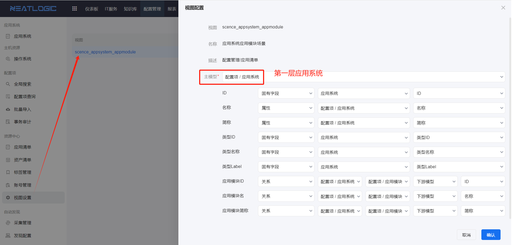
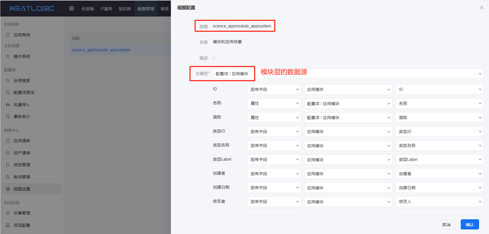
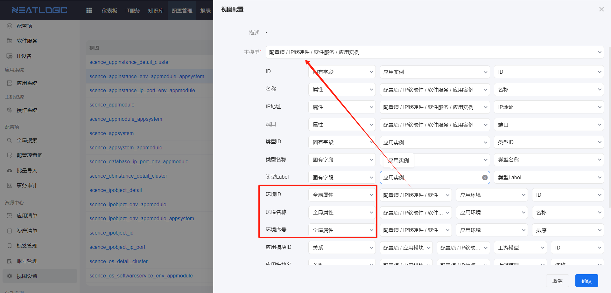
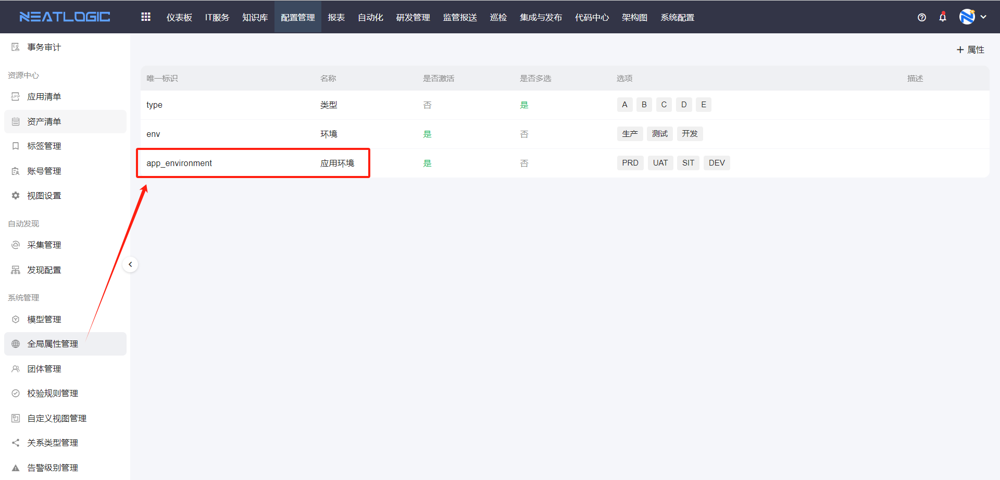
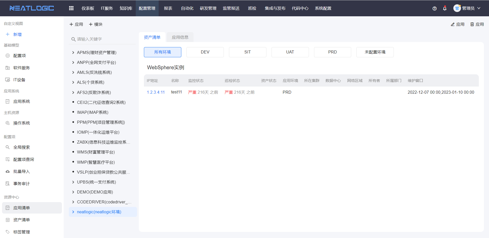

# 应用清单
应用清单是按应用模块汇总资产，并回显资产巡检结果。
 
访问权限：用户最少需要拥有四个基础权限（自动化基础权限、发布基础权限、巡检基础权限、灾备切换基础权限）的任意一个。

## 应用清单数据源配置
1. 应用清单左边树结构的第一层是应用系统，由视图设置中 scence_appsystem_appmodule 视图的主模型控制的，数据来源也是scence_appsystem_appmodule 视图。
   
   第二层是应用模块，由视图设置中 scence_appmodule_appsystem 视图的主模型控制的，数据来源也是scence_appmodule_appsystem视图。
   
   第一层和第二层对应的主模型之间需要有关系联系。

2. 应用清单中的环境列表，数据来源是全局属性的应用环境（这个全局属性是出厂自带的），所有涉及的视图中的环境id、环境名称、环境序号都映射全局属性。应用模块涉及环境配置的视图有scence_appinstance_detail_cluster 、 scence_appinstance_detail_cluster 、 scence_appinstance_detail_cluster 、scence_database_ip_port_env_appmodule 、  scence_dbinstance_detail_cluster 、 scence_ipobject_env_appmodule 、 scence_ipobject_env_appmodule_appsystem 、 
scence_os_softwareservice_env_appmodule 、 
scence_os_softwareservice_env_appmodule_appsystem
   
   全局属性的应用环境属性
   

3. 应用清单中环境列表下方的表格数据说明：
    表格数据只会展示以下7种模型的后代模型数据（这个是产品需求定下来的）：
   - APPIns（应用实例）、
   - APPInsCluster（应用实例集群）、
   - DBIns（DB实例）、
   - DBCluster（DB集群）、
   - AccessEndPoint（访问入口）、
   - Database（DB库）、
   - OS（操作系统）。
  
    下面是7种模型表格对应的数据来源：
    - APPIns数据来源于 scence_appinstance_detail_cluster 视图，所以该视图主模型应该设置为APPIns。
    - APPInsCluster数据来源于 scence_ipobject_detail 视图，所以该视图主模型应该设置为APPInsCluster的祖先模型。
    - DBIns数据来源于 scence_dbinstance_detail_cluster 视图，所以该视图主模型应该设置为DBIns。
    - DBCluster数据来源于 scence_ipobject_detail 视图，所以该视图主模型应该设置为DBCluster的祖先模型。
    - AccessEndPoint数据来源于 scence_ipobject_detail 视图，所以该视图主模型应该设置为AccessEndPoint的祖先模型。
    - Database数据来源于 scence_ipobject_detail 视图，所以该视图主模型应该设置为Database的祖先模型。
    - OS数据来源于 scence_os_detail_cluster 视图，所以该视图主模型应该设置为OS。

    APPInsCluster、DBCluster、AccessEndPoint、Database这个4种模型数据来源都是 scence_ipobject_detail 视图，而APPIns、DBIns、OS数据来源于各自不同的视图，是因为这3个模型有各自的集群模型，且需要展示各自的集群。

## 资产清单
资产清单列表中回显当前选中的应用或模块包含的资产对象及其巡检结果。

点击资产的IP地址，可查看资产详细信息

## 应用模块
资产清单页面支持添加、编辑和删除应用或模块信息。

新增、编辑和删除应用或模块的操作如图

查看应用或模块信息

