# 应用清单
应用清单按应用模块汇总IP资产，并回显资产巡检结果。

**访问权限**：资源中心管理权限或资源中心-应用清单查看权限

## 应用清单数据源配置

### 应用、模块列表
应用清单左侧树结构的第一层是应用系统，由视图设置中 scence_appsystem_appmodule 视图的主模型控制，数据来源也是 scence_appsystem_appmodule 视图。

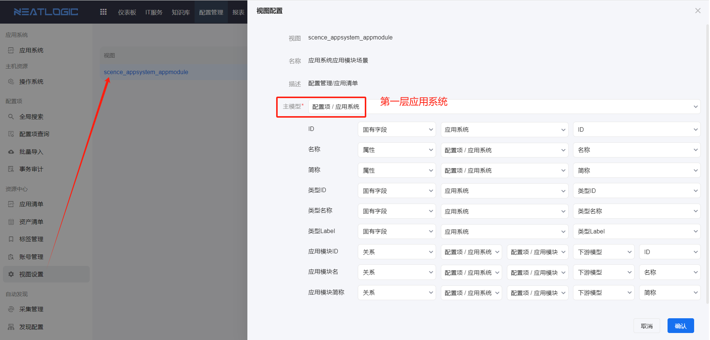

第二层是应用模块，由视图设置中 scence_appmodule_appsystem 视图的主模型控制，数据来源也是 scence_appmodule_appsystem 视图。

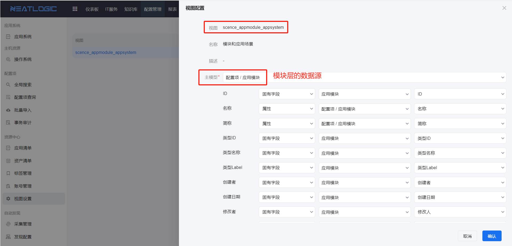

第一层和第二层对应的主模型之间需要有关系联系。

### 资产清单数据
初始时，资产清单为空，需要用户通过设置添加资产清单。

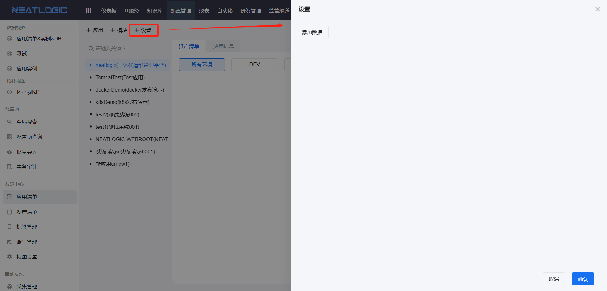

资产清单的关联对象来自[视图设置](视图设置.md)的自定义视图，每个视图只能引用一次。

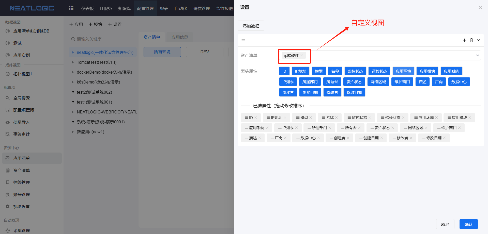

### 环境
资产清单中的环境数据来源是全局属性的应用环境（此全局属性为系统内置）。

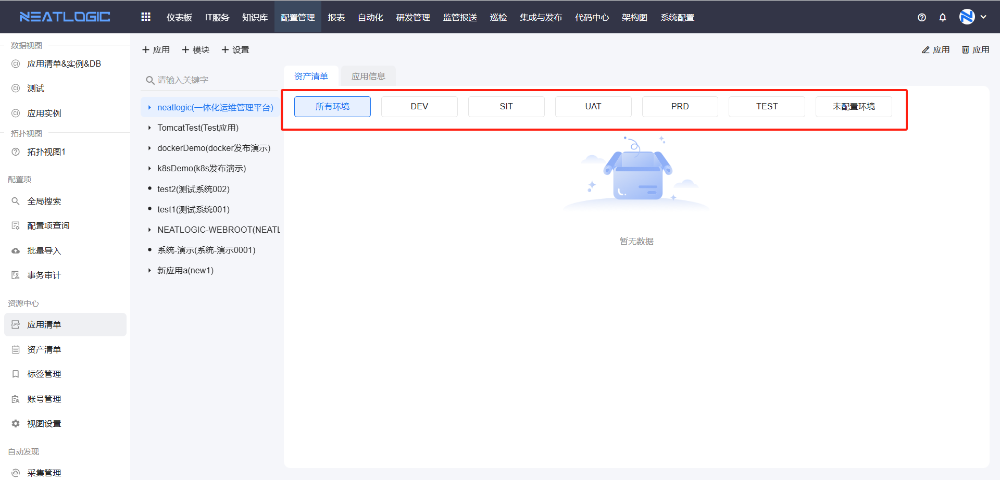

所有涉及的视图中的环境ID、环境名称、环境序号都映射全局属性，示例如下图：

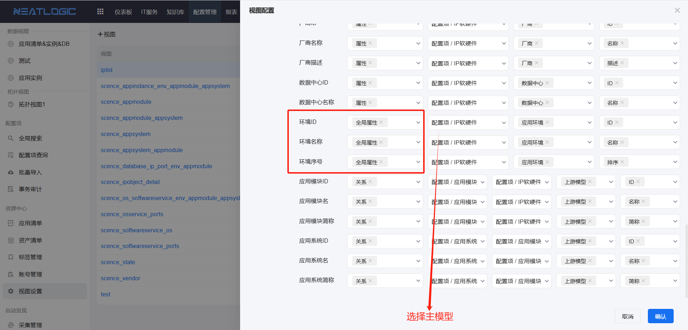

全局属性的应用环境属性：

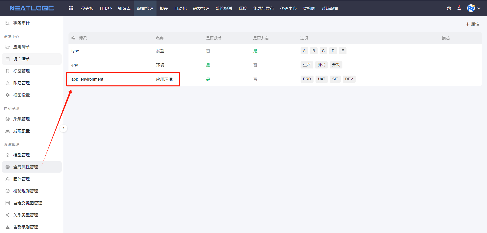

## 资产清单
资产清单列表中回显当前选中的应用或模块包含的资产对象及其巡检结果，根据所属环境对IP资产分类，环境为空的归到未分配环境中。

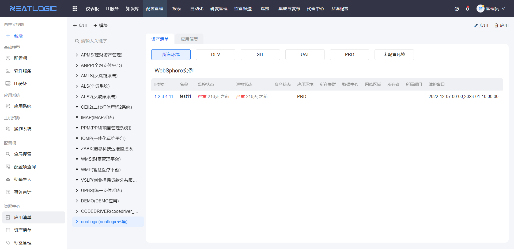

点击资产的IP地址，可查看资产详细信息：

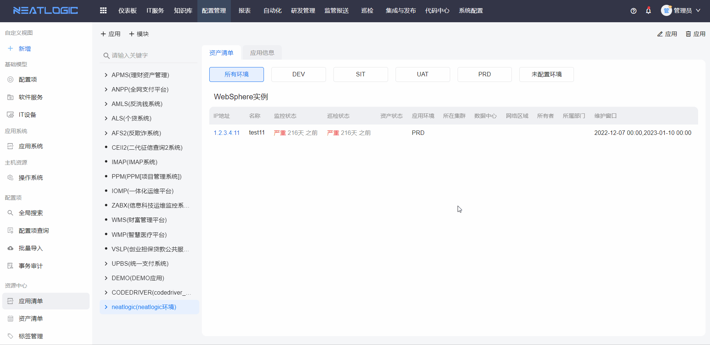

## 应用模块
资产清单页面支持添加、编辑和删除应用或模块信息。

新增、编辑和删除应用或模块的操作如图：

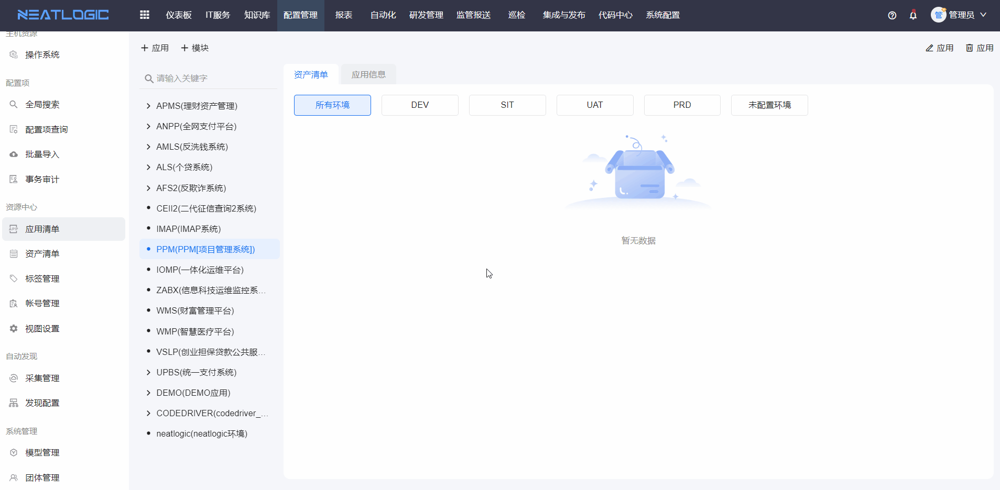

查看应用或模块信息：

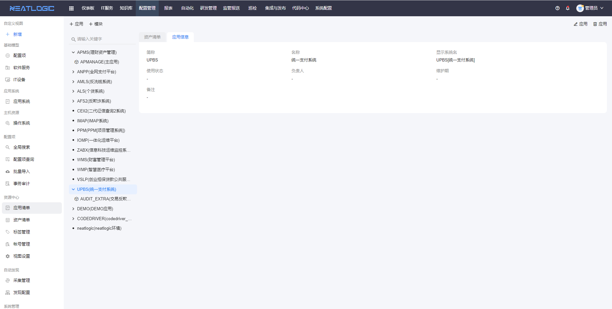
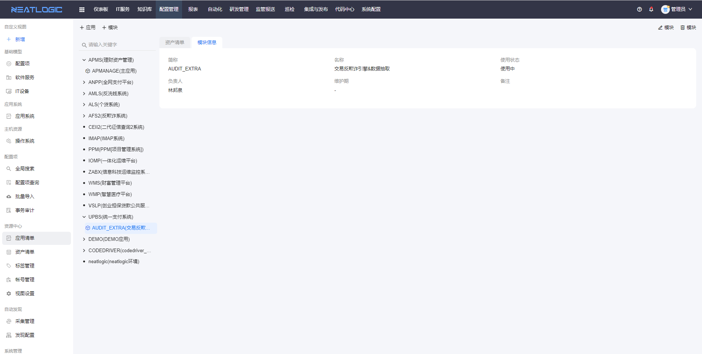
