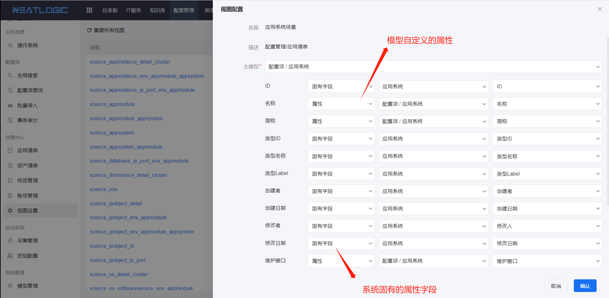

# 视图设置
视图设置页面主要是定义配置模块的视图与配置模型的映射关系配置，映射关系更新后可通过重建视图来更新视图数据。

### 视图配置
下图以应用清单中应用系统数据的视图为例，应用清单的应用系统属性与应用系统模型的自定义属性或者模型的固有属性建立映射关系。

### 重建所有视图
重建所有视图操作是基于当前视图配置更新所有视图的数据。重建成功的视图状态为就绪，重建失败的视图可以通过光标聚焦到失败状态查看失败原因。

重建视图的操作在系统配置-[重建数据库视图](../../100.系统配置/基础服务.md/#2-重建数据库视图)页面。
