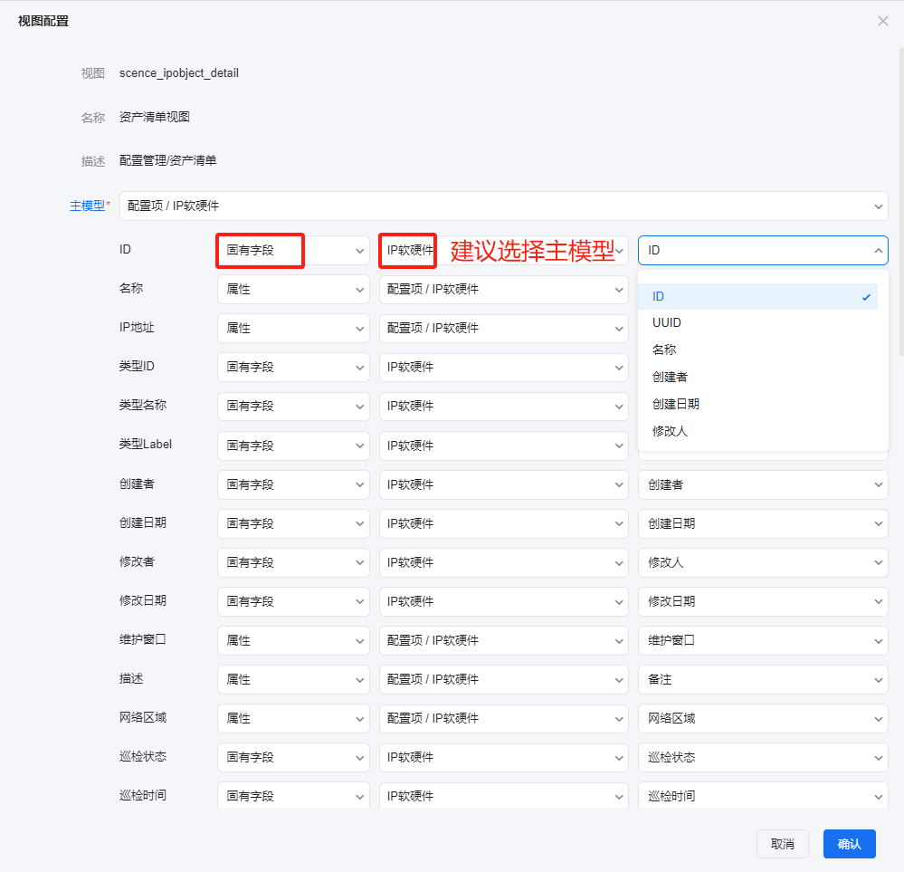
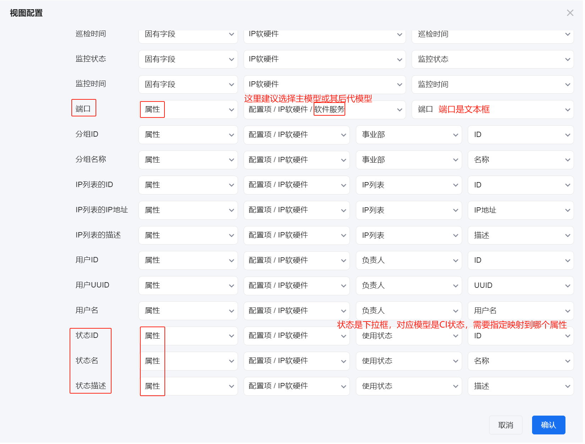
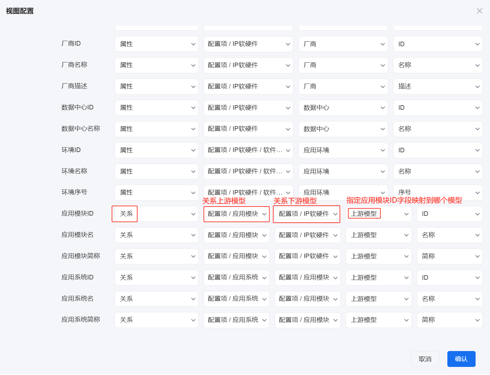

# 视图设置
视图设置页面主要是定义配置模块的视图与配置模型的映射关系配置，映射关系更新后可通过重建视图来更新视图数据。

## 视图配置
下图以应用清单中应用系统数据的视图为例，应用清单的应用系统属性与应用系统模型的自定义属性或者模型的固有属性建立映射关系。

1. 先设置主模型，更改主模型后，下面的字段设置会全部自动清空，需要重新设置。视图展示主模型及其后代模型的配置项数据。
2. 主模型下的字段列表是写死在代码里面的。
3. 字段映射模式有三种：固有字段、属性、关系。
4. 固有字段是每个模型都有的隐藏属性，分别是ID、UUID、名称、创建者、创建日期、修改者、修改日期、巡检状态、巡检时间、监控状态、监控时间、类型ID、类型名称、类型Label。
   
   

5. 属性映射模式是指该字段要映射到某个模型（该模型是主模型或其后代模型）的某个属性，如果属性是下拉框类型属性，还要进一步指定映射该属性模型的哪个属性上。
   
   

6. 关系映射模式是指该字段要映射到某个模型（该模型是主模型或其后代模型有某种关系联系）的某个属性。
   
   比如应用模块与IP软硬件的后代模型应用实例有关系联系，可以做映射；应用系统与应用模块有关系联系，可以做映射；但是应用系统与IP软硬件没有直接关系联系，不能做映射；需要IP软硬件先与应用模块做映射后，应用系统再与应用模块做映射。
   
## 重建所有视图
重建所有视图操作是基于当前视图配置更新所有视图的数据。重建成功的视图状态为就绪，重建失败的视图可以通过光标聚焦到失败状态查看失败原因。

重建视图的操作在系统配置-[重建数据库视图](../../100.系统配置/基础服务.md)页面。
