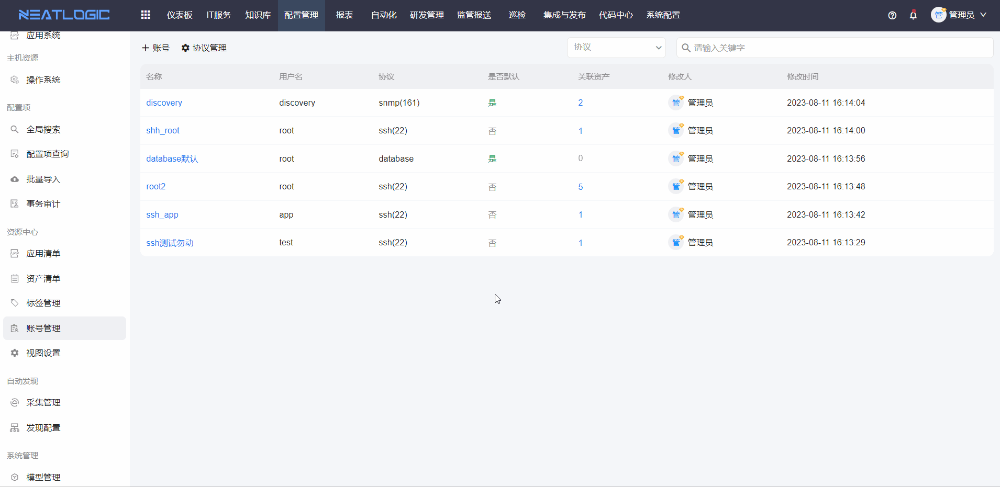
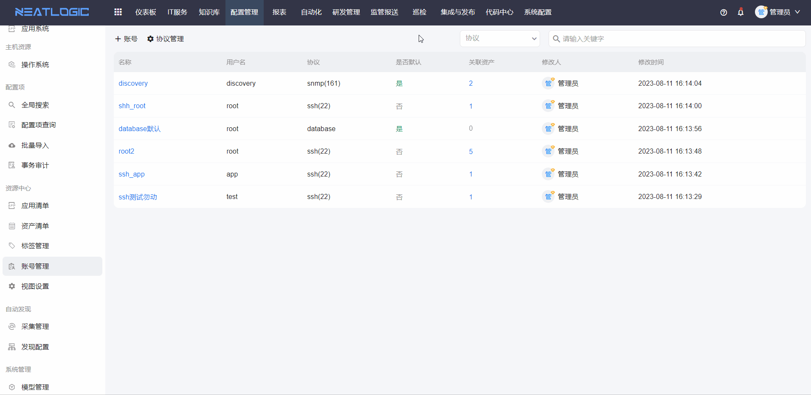
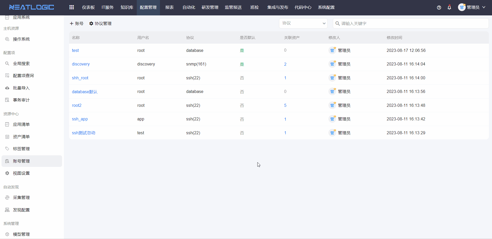

# 账号管理
账号管理页面用于配置连接协议和账号，先添加连接协议，才能添加账号，账号需要关联协议。

## 协议管理
协议管理用于管理协议列表，协议需填写的信息有协议名和默认端口号，支持添加、编辑、删除协议。

## 账号
账号应用于资产配置，支持连接远程工具使用，因此添加账号时，连接协议、账号名、密码必须填写。

**添加账号**

账号名校验重复。

**默认账号规则**

默认账号要满足"协议+用户"唯一，若新增账号启用为默认账号，但不满足默认账号的唯一规则，新增的账号保存为默认账号，原默认账号自动取消默认。

**编辑**

**删除**

**查看关联资产**

