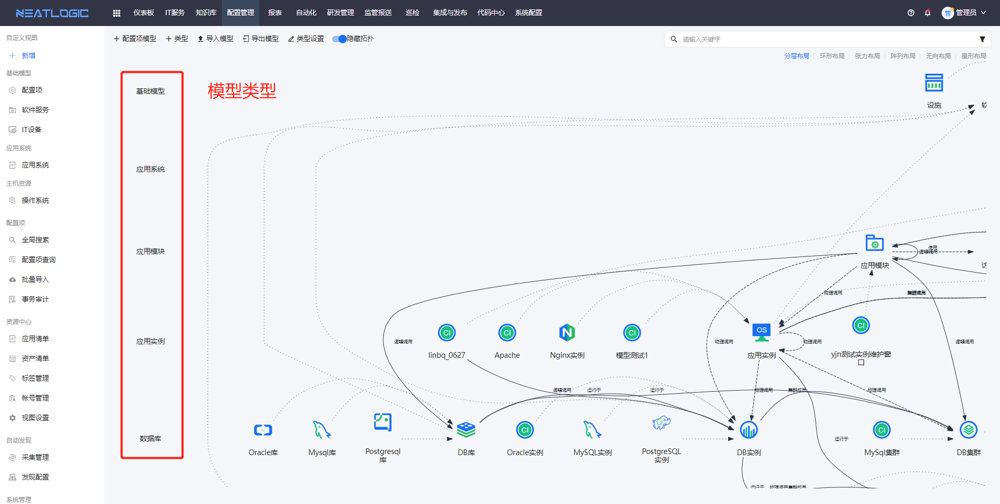
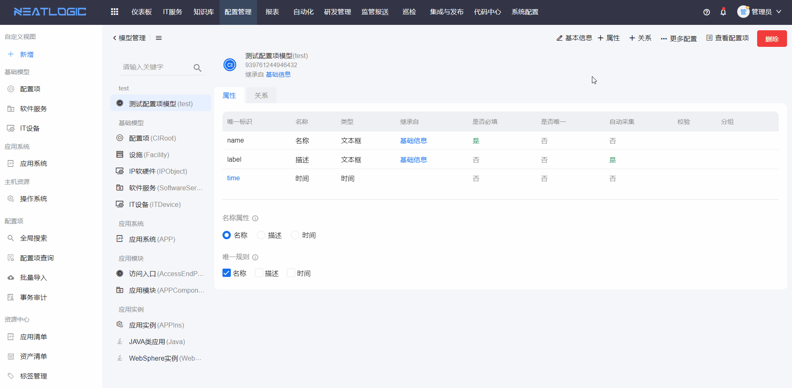
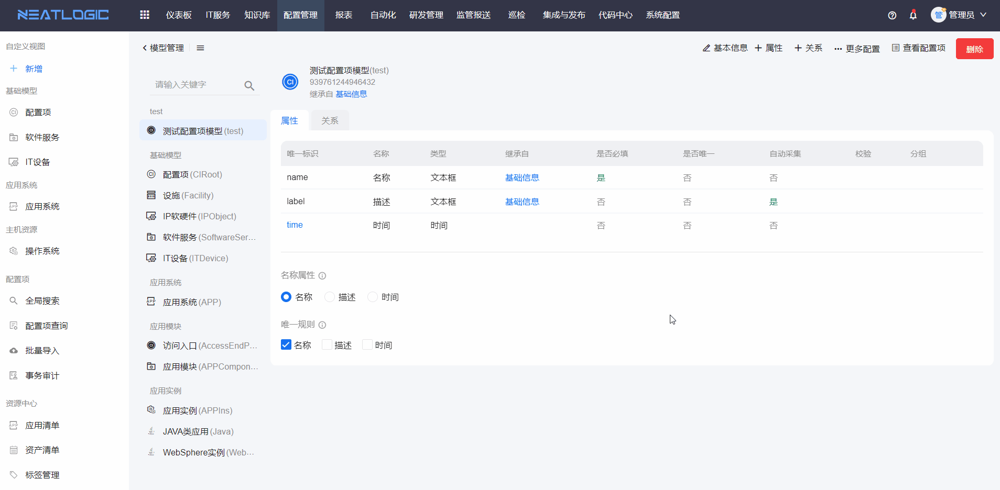

# 模型管理
## 名词解释
* 模型类型：配置项模型所属的分类，由用户自定义。
* 配置项模型：配置项模型是一种描述系统中可配置元素及其关系的模型，包括名称、唯一标识、描述、属性和值，以及它们之间的关联关系。
## 模型类型
访问位置：配置管理>系统管理>模型管理
 
模型类型相关功能包括添加、类型设置和删除。引用模型类型的配置项模型为0时，模型类型隐藏。
 

### 添加类型

### 类型设置
设置类型名称、排序、关键类型、在拓扑中显示和删除类型。关联模型数量为零的类型才允许删除，且在模型列表中隐藏。

关键类型：重点显示在左侧导航目录中的类型，方便用户快速找到类型及其下的关键模型。当关键类型下无关键模型时，导航列表隐藏关键类型。

在拓扑中显示：显示拓扑图时，显示类型中所有的配置项模型。

## 配置项模型
配置项模型可手动添加，或通过导入添加。
添加配置项模型主要包括两个步骤，首先是填写模型基础信息，然后是根据需求添加模型的属性和关系。

### 模型基础信息

### 模型属性

### 模型关系

### 显示设置
控制模型的属性和关系数据在配置项列表和配置项详情页面的显示情况。

* 不显示：同时不在配置项列表和配置项详情中显示属性或关系的数据
* 全展示：同时在配置项列表和配置项详情中显示属性或关系的数据
* 仅列表：只在配置项列表展示属性或关系的数据
* 仅明细：只在配置项详情页面显示属性或关系的数据

### 授权
管理配置项和事务的增删改查等功能，模型的管理权限优先级最高。模型的权限是白名单机制，仅授权的普通用户能执行该权限控制的操作。

### 模型导出

### 模型导入
