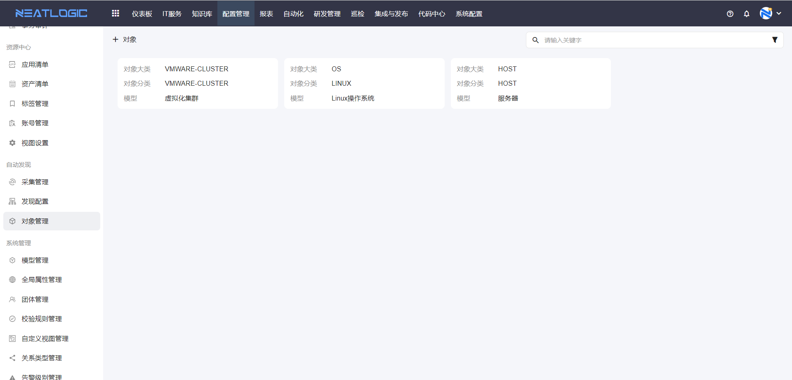
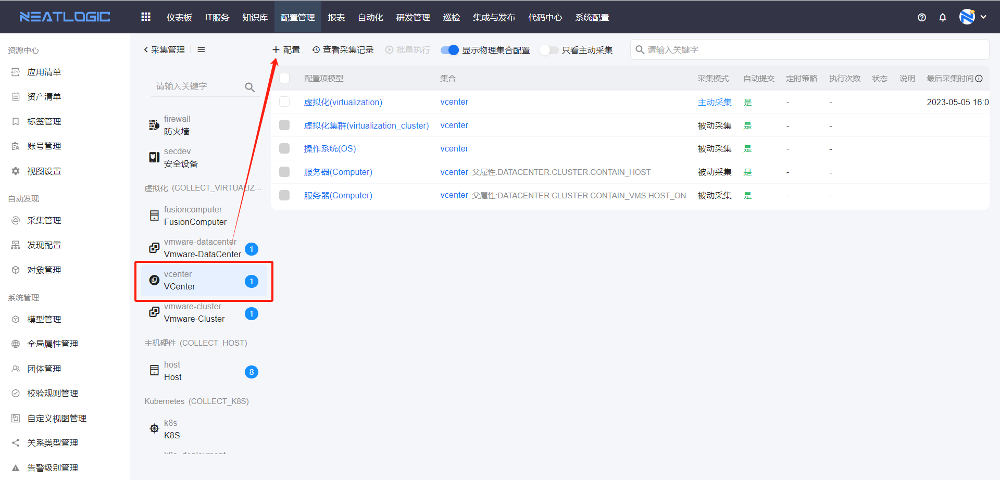
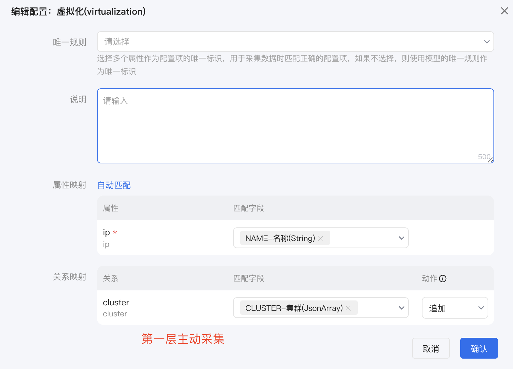
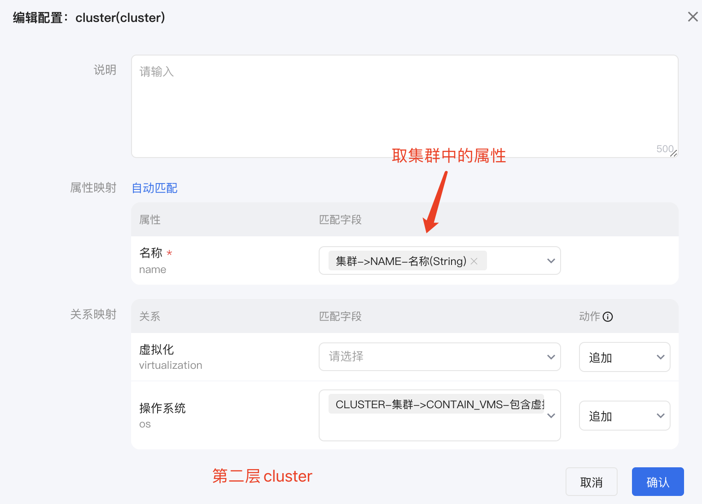
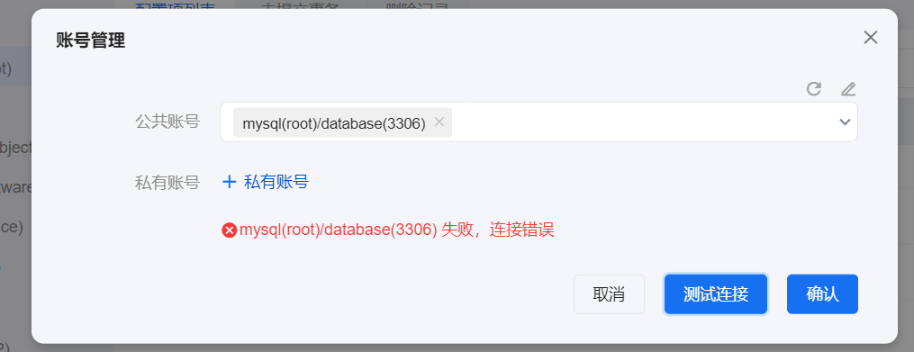
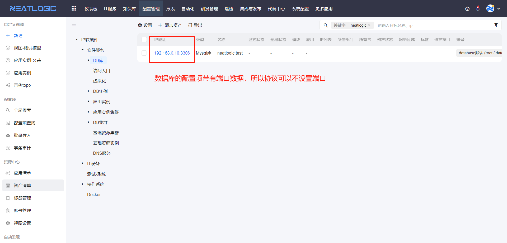
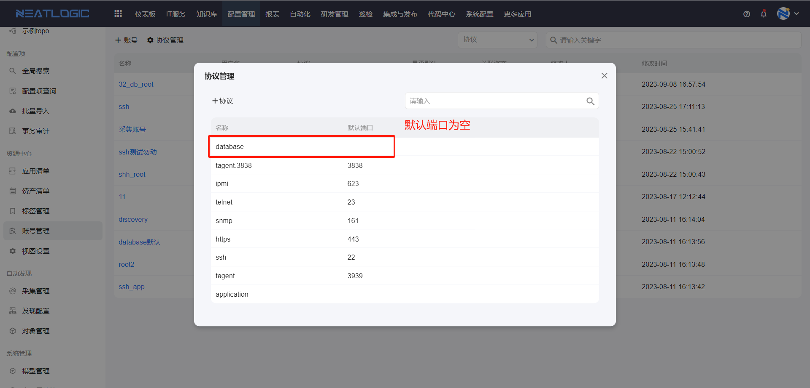
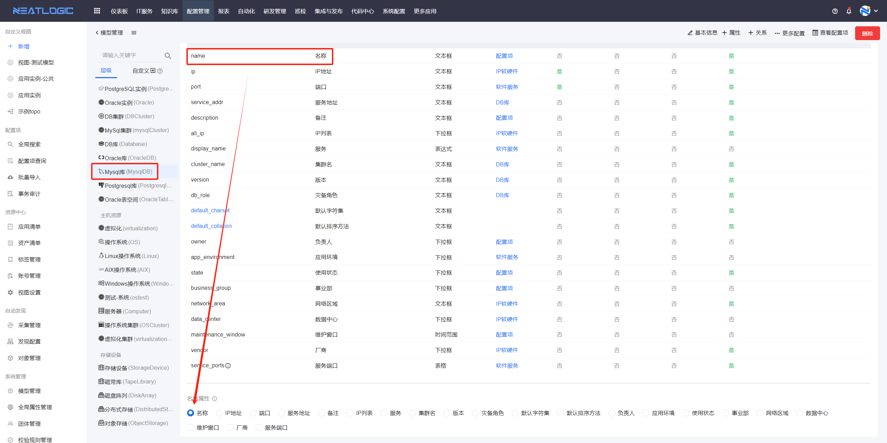
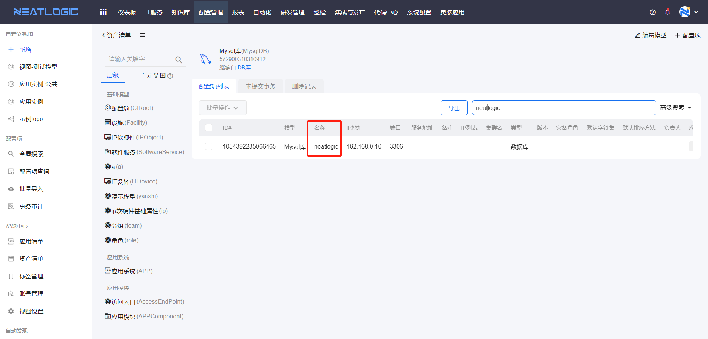

## 1、CMDB如何清空模型，重新构建资产清单和应用清单
重建模型 -> 重新配置资产清单和应用清单视图 -> 重建视图
1. 清空cmdb相关模型数据
   * truncate租户数据库(neatlogic_xxx)中cmdb开头的表
   * 以及删除租户data库(neatlogic_xxx_data)中cmdb开头的表和scence开头的视图

2. 重建模型
   
   先设计好[**模型**](模型管理/模型管理.md)，包括模型的继承关系、模型属性、关联关系等内容。在系统中配置完模型后，再往模型中添加[**配置项**](配置项查询/配置项查询.md)数据，支持[**批量导入**](批量导入/批量导入.md)数据。
   > 至少遵循以下原则：所有ip的模型都继承一个父模型。将来配置资产清单就可以用这个父模型做根节点。
3. 重新配置资产清单和应用清单的视图(如果不使用自动化、巡检、发布、采集，请忽略跳过)
   
   资产清单<br>
   打开配置管理-资源中心-视图设置，搜索“资产清单”
   
   在资产清单视图中完成映射配置，关键是“主模型”，所以在设计模型时，所有资产所属的模型应该是主模型或者主模型的子模型。详情参考[**资产清单**](资源中心/资产清单.md)-资产清单数据源配置。

   应用清单<br>
   打开配置管理-资源中心-视图设置，搜索“应用清单”
   
   应用清单视图配置请参考[**应用清单**](资源中心/应用清单.md)-应用清单数据源配置。
   
   >注意：
   >
   >1.应用清单左边树结构的第一层是应用系统，由视图设置中 scence_appsystem_appmodule 视图的主模型控制的，
   >数据来源也是scence_appsystem_appmodule 视图。
   >第二层是应用模块，由视图设置中 scence_appmodule_appsystem 视图的主模型控制的，
   >数据来源也是scence_appmodule_appsystem视图。
   >第一层和第二层对应的主模型之间需要有关系联系。
   >
   >2.应用清单中的环境列表，数据来源是视图设置中 scence_env 视图。（后面需要改成全局属性中的环境）
   >
   >3.目前应用清单的功能并不完善，目前模型名字必须声明如下：
   >APPIns（应用实例）、
   >APPInsCluster（应用实例集群）、
   >DBIns（DB实例）、
   >DBCluster（DB集群）、
   >AccessEndPoint（访问入口）、
   >Database（DB库）、
   >OS（操作系统）。
   >以上其中展示七种模型的英文唯一标识是固定的，写死在代码中。（后续再优化）
   >
   >APPIns、APPInsCluster、DBIns、DBCluster、AccessEndPoint、Database这6个模型都是软件服务的后代模型，都有环境属性，
   >还有它们又跟APPComponent（应用模块）有关系联系，所以它们可以根据应用模块和环境做过滤。
   >只有OS模型是个例外，OS模型与APPIns（应用实例）、DBIns（DB实例）有关系联系。通过关系把应用实例与DB实例表格数据对应的OS模型数 
   >据查出来展示。
   >
   >下面是7种模型表格对应的数据来源：
   >APPIns数据来源于 scence_appinstance_detail_cluster 视图，所以该视图主模型应该设置为APPIns。
   >APPInsCluster数据来源于 scence_ipobject_detail 视图，所以该视图主模型应该设置为APPInsCluster的祖先模型。
   >DBIns数据来源于 scence_dbinstance_detail_cluster 视图，所以该视图主模型应该设置为DBIns。
   >DBCluster数据来源于 scence_ipobject_detail 视图，所以该视图主模型应该设置为DBCluster的祖先模型。
   >AccessEndPoint数据来源于 scence_ipobject_detail 视图，所以该视图主模型应该设置为AccessEndPoint的祖先模型。
   >Database数据来源于 scence_ipobject_detail 视图，所以该视图主模型应该设置为Database的祖先模型。
   >OS数据来源于 scence_os_detail_cluster 视图，所以该视图主模型应该设置为OS。
   >
   >APPInsCluster、DBCluster、AccessEndPoint、Database这个4种模型数据来源都是 scence_ipobject_detail 视图，
   而APPIns、DBIns、OS数据来源于各自不同的视图，是因为这3个模型有各自的集群模型，且需要展示各自的集群。

1. 其他视图按理也需要配置，否则会导致部分自动化等功能不可用(如果不使用自动化、巡检、发布、采集，请忽略跳过)

2. 重建视图(如果不使用自动化、巡检、发布、采集，请忽略跳过)
   
   打开系统配置-基础服务-重建数据库视图，点击“重建所有视图”即可。

## 2、怎么添加配置项数据，例如添加一个linux操作系统数据
普通模型才能添加配置项，抽象模型只能用于继承，关于各类型模型的概念，请参考[**模型管理**](模型管理/模型管理.md)。

添加配置项的操作步骤：
1. 打开 **配置项查询** 页面，搜索需要添加配置项的配置模型（普通模型）。
   
2. 点击配置模型卡片，跳转到配置模型的配置项列表
   
3. 点击添加配置项按钮，打开添加配置项页面，填写配置项数据，点击保存为事务并提交即可。
   

以上是基于用户已经有模型的新增配置项权限。如果模型类型是普通模型，但是配置项列表没有添加配置项按钮，需要通过配置项模型管理员（有配置项模型管理权限的用户）授权新增配置项权限。


## 3、怎么实现自动采集资产
参考文档 [**数据采集和巡检**](数据采集/1.数据采集和巡检.md)。

## 4、怎么检查数据是否采集成功
1. 打开采集作业，查看作业执行结果，检查在执行采集的节点的输出参数。如图，下面就是中心节点采集到的linux节点的数据。
   
2. 根据采集的数据，在采集管理中找到对应的数据集合，检查配置模型的属性与数据集合的字段是否配了映射，详情参考[采集管理](../3.配置管理/数据采集/8.同步数据配置.md)。
3. 最后，查看采集记录，过滤目标数据集合的采集记录，查看更新配置项的数据。
   

## 5、自动采集到数据，但是数据没有同步到配置模型中
检查对象管理配置--检查采集管理的集合映射配置
1. 先确认采集的数据一共有几层，然后根据采集对象的关系在对象管理中添加对象配置。第一层是主动采集可以不配置，往下的所有层级时被动采集，都要配置正确的对象管理，不配会自动跳过。

   打开采集作业，找到采集脚本的返回值
   
   找到每个层级_obj_category和_obj_type的值，分别对应对象配置的“对象大类”和“对象分类”，与模型关联，如图所示。
   

2. 找到采集的对象的集合分类，比如“VCenter”，然后打开集合的配置，添加配置，每个集合只有一个主动采集的模型，但可以有多个被动采集的关联模型。
   
   每一个模型的映射对象要选对才能映射成功，映射对象选择的逻辑和采集数据的层级有关。<br>
   例如，采集对象的层级关系是：vmware-center->cluster->包含虚拟机->所在物理机<br>
   第一层模型的属性直接选择无前缀的字段，然后对关系模型做映射，关系映射对象直接选择下一层集合的数组，如图。
   
   第二层模型的属性选择带当前层级前缀的属性，如果有下一层关系模型，同样需要配置关系映射。
   

   <b>说明:</b> 更正采集配置后，要重新保存一下主动采集，刷新最后执行时间，不然最后执行时间前的数据就不再跑了。


## 6、资产清单无法正常加载
配置管理 -> 资源中心 -> 点击查看视图，看映射配置是否完整，默认出厂是有对应的配置，倘若配置模型存在模型删除、字段删除会导致[视图](../3.配置管理/资源中心/视图设置.md)需要重新配置和映射。

## 7、如何批量导入数据
配置管理 -> 批量导入 -> 下载模版，选择对应需要导入的管理模型Execl模版文件。按模版字段填写数据，再上传Execl文件，发起新增/修改导入。
<br>
<b>说明:</b> 参考批量导入文档。

## 8、如何获取CMDB配置项的数据变化
外围系统可基于ActiveMq实现消息订阅。<br>
<b>前提：</b>
* 系统管理 -> 消息队列管理 -> 主题管理，激活配置新增、修改、删除消息主题。
* 有启动ActiveMQ消息队列服务。
* 应用的配置文件有指向对应的MQ服务地址。

## 9、取数需求同时涉及多个配置管理模型数据联合查询，数据如何获取
基于配置视图，多个模型关联查询，输出数据。

## 10、配置管理是否提供接口
系统管理 -> 接口管理 -> 配置管理 ，所有API接口都存在，按需获取。

## 11、全局属性是用在什么地方
全局属性用于全局性过滤，而且过滤会沿着关系传播出去。

可以用在环境，受益人等场景。例如展开某个应用的topo图时，就可以这个全局属性过滤某个环境的节点。

这个全局属性有个特性，如果为空，就不受过滤条件约束。例如以环境为例子，像机房的配置项是没有环境的，所以搜索时无论怎么选择，都会把机房带出来。

## 12、这个Agent能从平台直接下发到目标服务器并安装么？只能挨个登录服务器去手动安装？
可以通过脚本批量推安装。Agent批量推送，也是一种自动化场景，批量推送需要目标机器登录账号、密码。如果能继承堡垒机，获取目标机器的账号的密码，即可实现批量推送和安装。另外一种做法是做虚拟机模版，虚拟机模版内打进去agent，os启动后，agent自动安装。

## 13、关于资产清单数据过滤
资产清单数据是否能够过滤？怎么过滤？下面将从四个相关的点来讲解。
1. 检查资产清单支持数据过滤配置是否启用
   
   系统配置-[配置信息管理](../100.系统配置/5.基础服务/基础服务.md) 页面有变量"is.resourcecenter.auth"，可以控制资产清单是否受模型权限和团体权限控制。

   
   变量 is.resourcecenter.auth 为0时，表示不启用；<br>
   变更的值为1时，表示启用。

2. 检查用户所属角色是否生效
   
   如果授权对象是角色，然后用户通过角色来继承权限，先检查角色是否有配置规则表达式，如图所示。表达式中所用的参数env是已经在nginx配置了相关的header参数。
   
   
   若规则表达式为空，角色默认生效。<br>
   若写了表达式，用户登录时，就会校验当前环境的参数值是否满足规则，满足则角色生效，否则角色不生效。另外，表达式书写错误也会导致角色不生效。

3. 检查用户是否有模型管理权限或配置项管理权限
   
   用户有配置项模型管理权限或者配置项管理权限，所有模型的所有配置项数据是对用户开放的，资产清单数据是从模型来的，所以用户能查看到所有资产。

4. 检查用户是否有模型权限
   
   在模型层面可以做数据过滤，用户有模型的任意一项权限，就可以查看到该模型下所有的配置项，详情参考 [模型管理](../3.配置管理/模型管理/模型管理.md) 的授权功能。

5. 检查团体授权
   
   在模型内过滤配置项，通过团体管理来实现，做了过滤的团体详情参考[团体管理](../3.配置管理/系统管理/团体管理.md)。<br>

总结：1 的配置启用后，才能做资产清单数据过滤配置。资产清单数据是取 3、4、5 这三个维度权限过滤后的并集。如果上面的权限是授权给角色，然后传递给用户，需要按照 2 检查角色生效情况。

## 14、数据库帐号测试异常
帐号连接异常效果如下图所示

需要连接的资产对象是数据库时，如果多个数据库服务的端口不一样，资产帐号配置的连接协议可以不设端口号，因为数据库资产有端口数据。


但是这里要注意一点，配置项所在模型的显示名必须是名称属性，并且名称属性是用来记录数据库名。<br>
举个例子，连接的数据库是MySQL类型，配置模型名称是“MySQL库”，数据库IP端口“192.168.0.10:3306”，数据库名“neatlogic”。



另外，可以通过下方的命令在runner服务器上直接测试连接数据库。

```
# 连接测试

在runner服务器上执行下方命令：

/app/autoexec/bin/nodeconntest --node '{"host":"192.168.106.96","nodeName":"neatlogic","nodeType":"MysqlDB","password":"","port":3306,"protocol":"database","username":"root"}'
```
参数说明：
| 参数名 | 说明 |
| --- | --- |
| host | 数据库本地ip |
| nodename | 数据库名 |
| nodeType | 模型的唯一标识 |
| username | 连接数据库的用户名 |
| password | 连接数据库的用户密码 |
| port | 数据库端口号 |
| protocol | 协议类型 |
