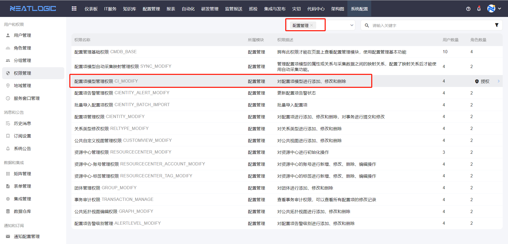
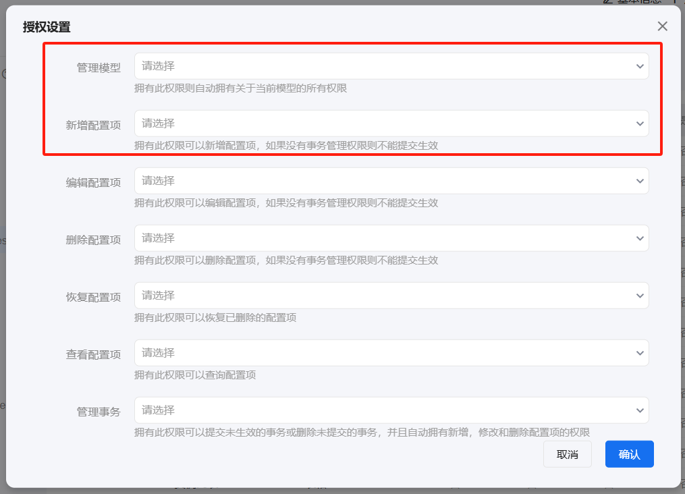
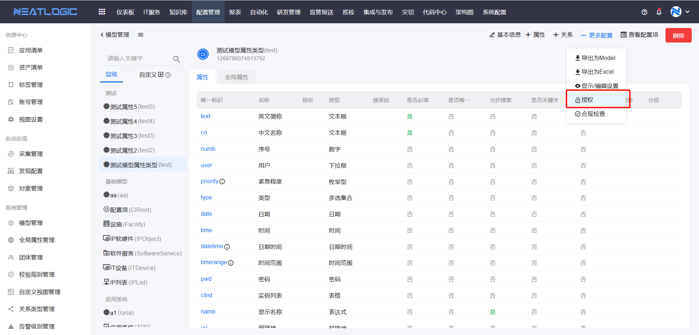
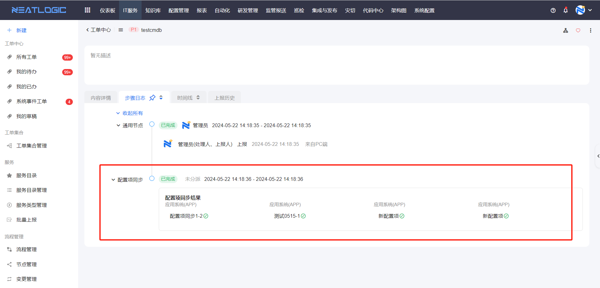
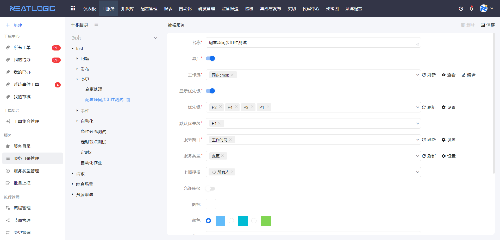
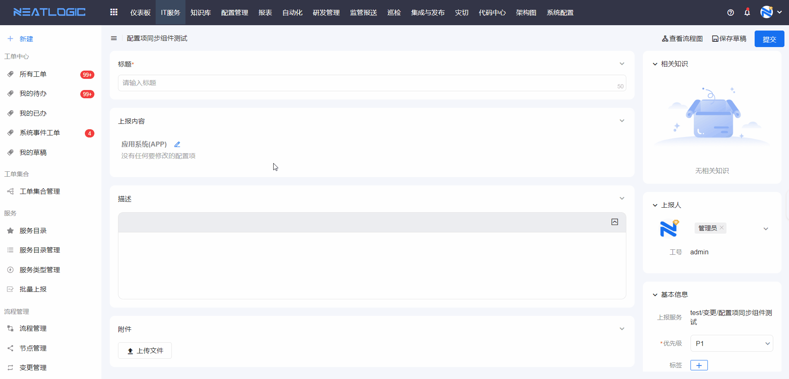
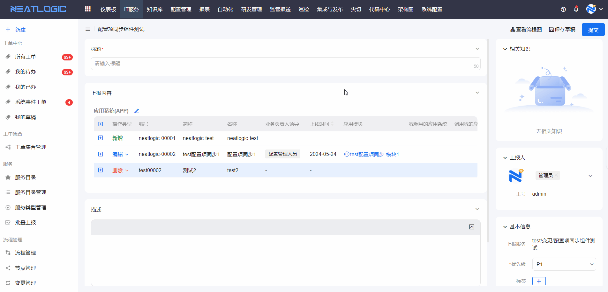

# 添加配置项的流程
1. 添加配置项模型
2. 模型授权
3. 添加配置项

## 权限
添加配置项模型功能，需要当前用户拥有以下权限。

- 配置项模型管理权限，授权此权限才能添加模型。
  

- 模型的 **模型管理权限** 或 **添加配置项权限**，有其中一个模型，才能在模型中添加配置项数据。
  
    
## 添加模型
步骤：添加模型-配置属性和关系
详情参考[模型管理](系统管理/模型管理.md)文档。

### 模型授权
在模型编辑页面，展开更多配置，选择授权配置，操作详情参考[模型管理](系统管理/模型管理.md)文档。

## 添加配置项
从配置项查询页面，找到配置模型，然后点击跳转到配置项列表，完成添加配置项操作即可，详情参考[配置项查询](配置项/配置项查询.md)文档。

# 配置管理与IT服务的关联场景

## 配置项同步
通过工单将配置项变更数据同步到配置管理，同步效果如图所示。
   
  1. 设计包含配置项修改组件的表单。
  2. 设计包含配置项同步节点的流程。
  3. 配置发起配置项变更的服务。
  4. 发起工单，并同步配置项数据。

### 表单配置
打开表单管理，设计配置项同步的表单，在表单中添加**配置项修改**组件，详情参考[表单管理](../100.系统配置/3.数据和集成/表单管理.md)-表单配置-表单组件-组件配置-配置项修改。

### 流程配置
打开流程管理，设计配置项修改并同步的流程，流程中要用到配置项同步节点，详情参考 [流程管理](../2.IT服务/流程管理/流程管理.md)-流程节点-配置项同步节点。

### 创建服务
在服务目录管理页面，添加一个服务，服务工作流引用上述的配置项同步流程，详情参考 [服务目录管理](../2.IT服务/服务/服务目录管理.md) 文档。

### 上报和处理
上报工单，在配置项修改组件中添加新增、编辑或删除配置项的操作。

完成变更后提交工单，流转到配置项同步节点，自动将数据同步到配置管理中，可在步骤日志查看同步结果。

更多详情参考文档：[工单上报](../2.IT服务/服务/工单上报.md)，[工单处理](../2.IT服务/工单处理/工单处理.md)。