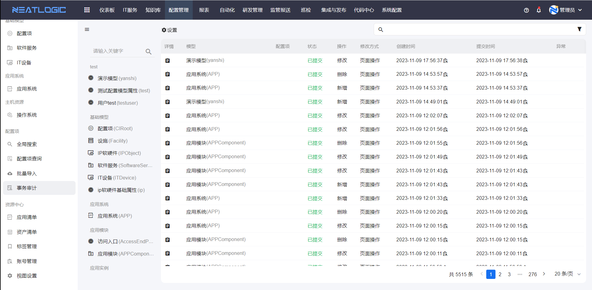
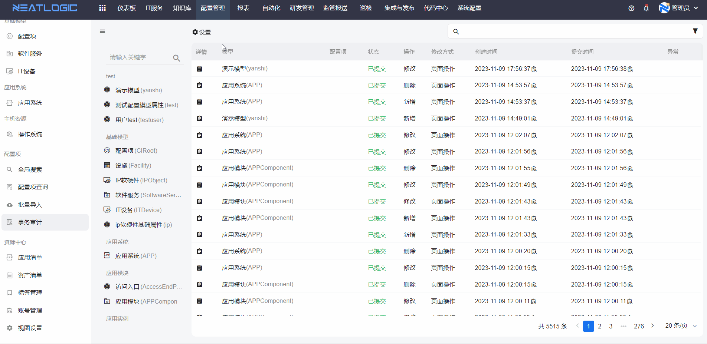
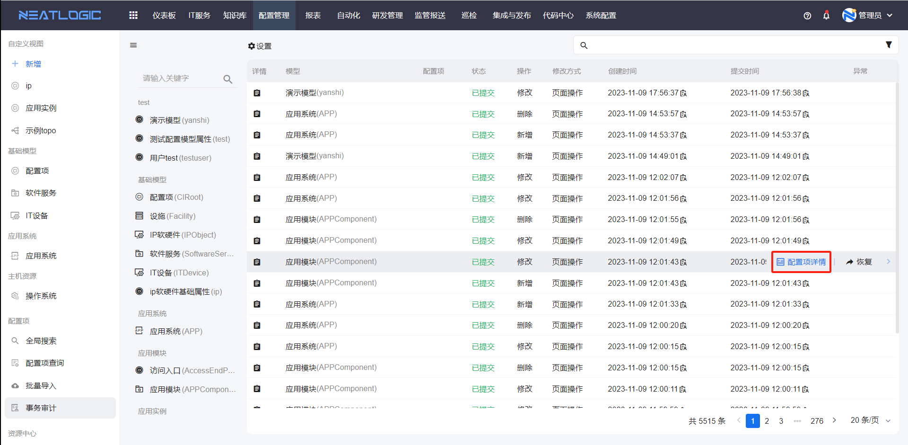
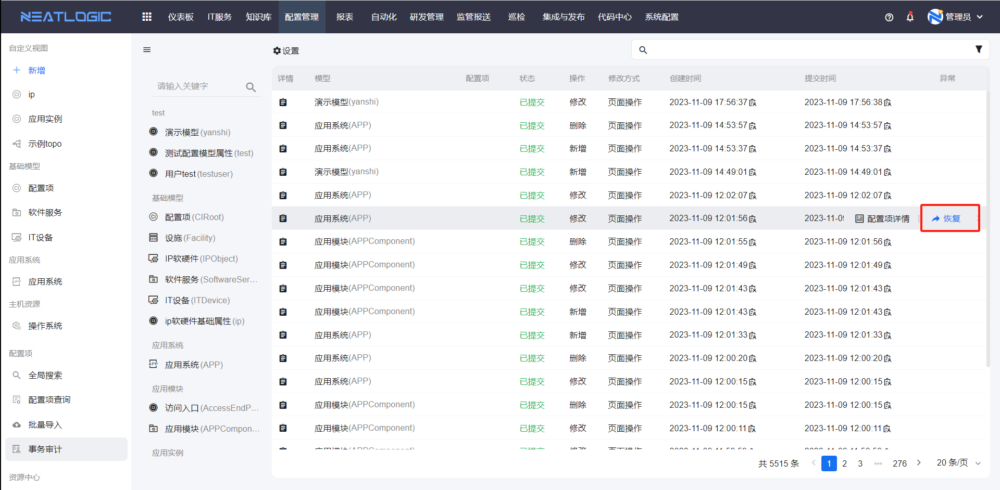
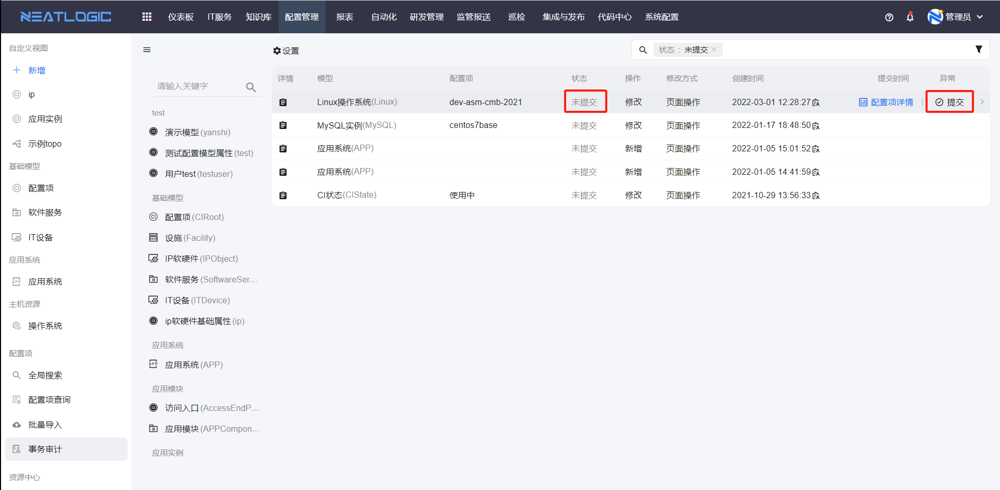
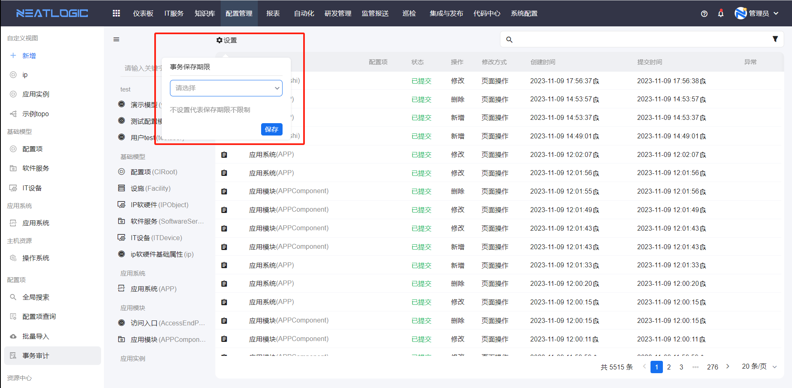

# 事务审计
事务是指配置项增删改操作所产生的操作事务。

事务审计模块汇总了所有模型的配置项操作事务，包含事务所属模型、操作类型、状态、创建时间、提交时间和异常信息等详细信息。

事务审计页面支持按模型、状态、操作类型和时间范围过滤事务，同时提供查看事务所属配置项详情、提交事务和恢复事务等功能。由于事务审计数据会不断累积，用户可通过设置事务保存期限，实现仅保留特定时间段内的事务。

## 核心功能
- **事务过滤**：支持多维度筛选事务数据
  
- **查看配置项详情**：可查看事务关联的配置项详细信息（操作类型为删除且已提交的事务不支持此操作）
  
- **事务恢复**：将配置项数据恢复到操作前的状态
  
- **事务提交**：对状态为未提交的事务执行提交操作，提交完成后配置项会根据事务操作进行更新
  
- **事务保存期限设置**：以事务创建时间为标准，仅保留创建时间在保存期限内的事务，超出期限的事务将被系统自动删除；若事务保存期限为空，则保留所有事务
  