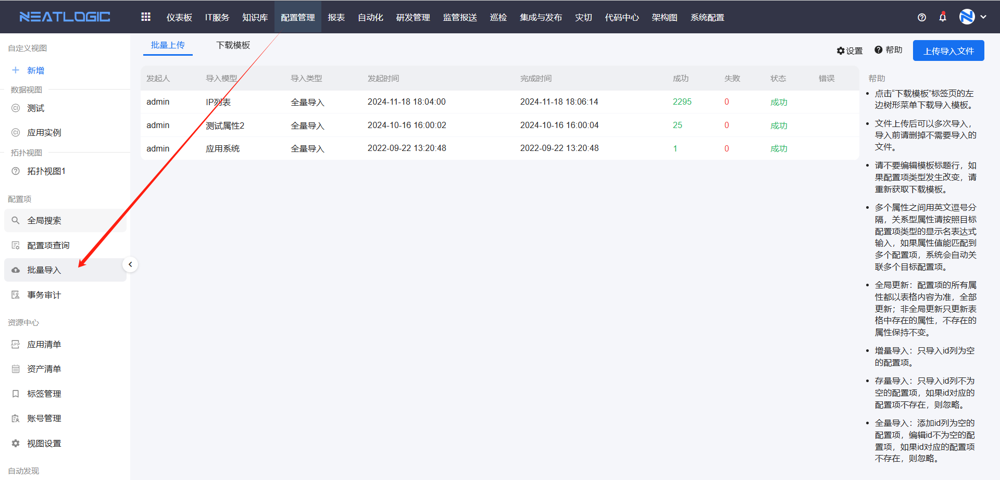
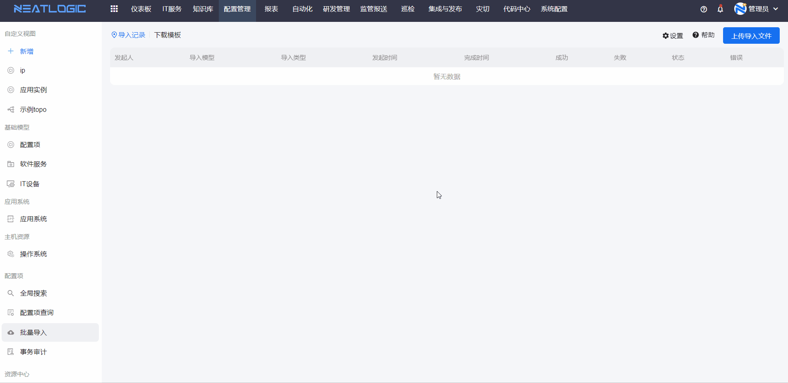
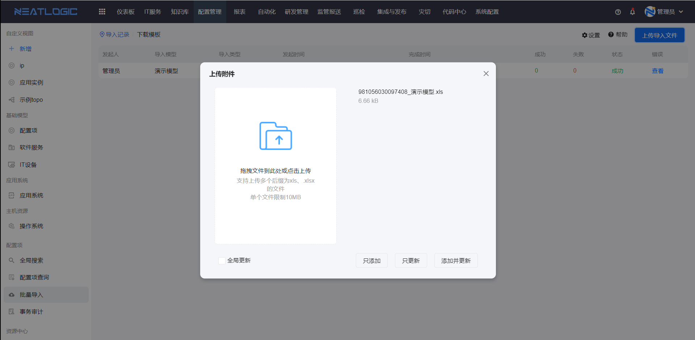
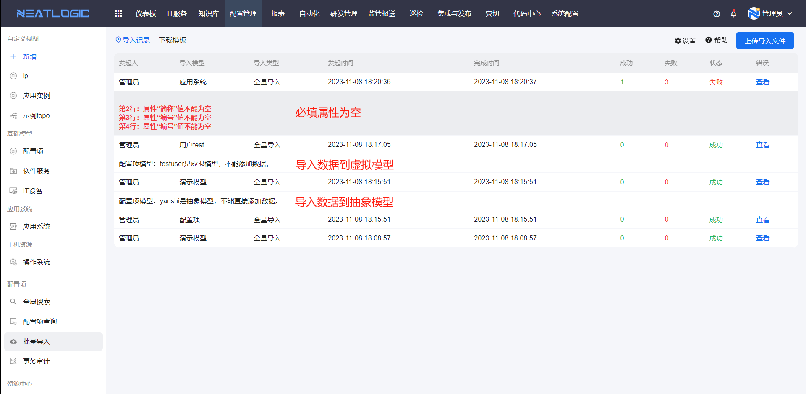

# 批量导入
批量导入功能用于满足将配置项数据批量导入到同一模型的需求。支持三种添加方式：只添加、只更新和添加并更新；同时提供两种属性数据更新方式：全局更新和非全局更新。

点击帮助图标可查看导入的详细说明：

批量导入的完整流程为：下载模板 → 填写模板数据 → 导入模板并添加数据

## 下载模板
在批量导入页面，切换至下载模板窗口，选择需要导入数据的模型并勾选相关属性，然后点击下载模板。导出的模板将包含所选属性以及配置项ID和UUID。

## 导入数据
在配置模型模板中填写数据并保存文件后，上传到系统并执行添加操作。需要注意的是，配置项ID为空的数据仅支持增量导入。

### 添加数据方式说明
- **只添加**（增量导入）：仅导入ID列为空的配置项
- **只更新**（存量导入）：仅导入ID列不为空的配置项，若ID对应的配置项不存在则忽略
- **添加并更新**（全量导入）：添加ID列为空的配置项，同时编辑ID不为空的配置项，若ID对应的配置项不存在则忽略

### 属性数据更新方式说明
- **全局更新**：配置项的所有属性均以表格内容为准，进行完整更新
- **非全局更新**：仅更新表格中存在的属性，表格中不存在的属性保持不变

### 无法导入数据的场景
- 导入数据的模型为虚拟模型
- 导入数据的模型为抽象模型
- 导入的数据中，必填属性或关系为空（对应数据导入失败）
