# 配置项查询
配置项查询模块支持对模型的配置项进行添加、编辑、删除、搜索和导出等操作。

## 名词解释
- **配置项**：CI（Configuration Item），指代表一个资源或物件的实体，例如应用、集群、中间件实例、主机等。每个配置项都具有配置模型定义的属性和关系。
- **事务**：CI Transaction（Configuration Item Transaction），配置项的增删改操作会生成操作事务，其目的是确保配置项数据的有效性和准确性。例如，在变更过程中，若变更成功则提交事务并显示变更后的结构；若变更失败则保持变更前的数据状态，从而保证数据的有效性。

## 权限说明
配置项查询相关的权限可从两个维度进行说明：页面入口权限和数据权限。

### 页面入口权限
在 [权限管理](../../100.系统配置/1.用户和权限/用户和权限.md)-配置管理模块中，存在三个关联权限：配置管理基础权限、配置模型管理权限和配置项管理权限。用户只需拥有其中任意一个权限，即可显示配置项查询菜单。

### 配置项数据权限
配置项模型的数据展示涉及三个维度的权限，最终取这三个权限的并集：
1. **系统管理授权**：若用户同时拥有模型管理和配置项管理权限，则可管理所有模型的配置项数据，包括查看、搜索、添加、编辑和删除等操作。
   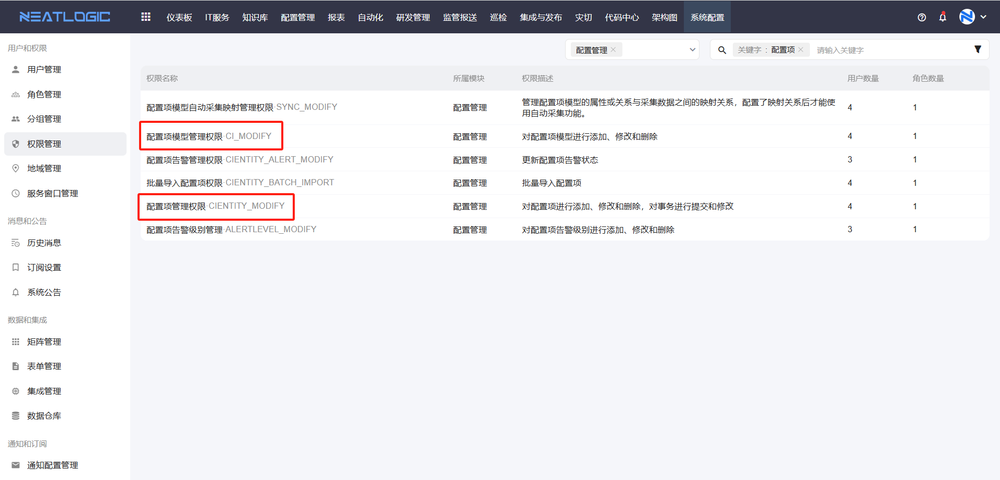
2. **模型权限配置**：若用户拥有模型层的任意权限，则可查看该模型的所有配置项数据，具体操作权限取决于权限类型。例如，若用户拥有"IP软硬件"模型的管理权限，则可查看并管理该模型的配置项数据。更多详情请参考[模型管理](../系统管理/模型管理.md)-授权部分。
   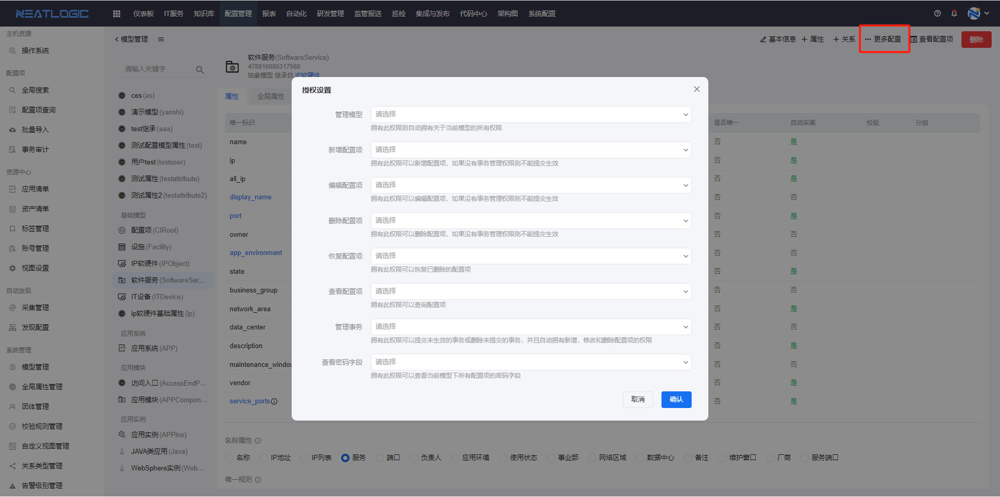
3. **团体权限**：团体的数据权限粒度精确到配置项层面，可在团体管理中将满足特定过滤条件的配置项授权给指定对象。详情请参考[团体管理](../系统管理/团体管理.md)。

   **注意**：仅当用户不具备前两层权限时，团体对配置项数据的过滤效果才会生效。
   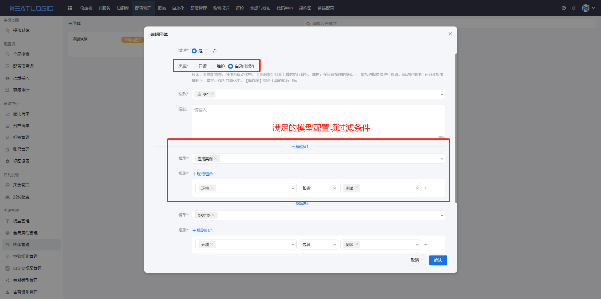

## 管理页面
配置项管理页面支持按条件搜索目标模型，还可切换至拓扑图查看模型关系。页面入口如图所示：
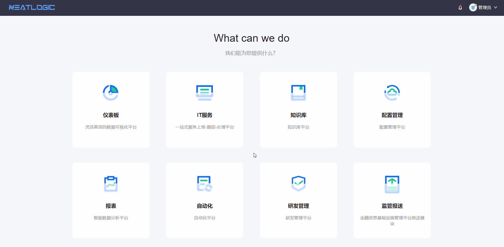
在管理页面中，查询到目标模型后，点击模型卡片，页面将跳转至配置项列表页面：
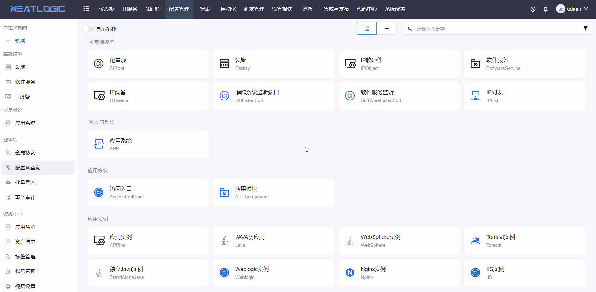

## 配置项列表
配置项列表的主要功能包括配置项和事务的新增、删除、编辑和查询。需要注意的是，仅普通模型（模型名称下方未标记为抽象模型或虚拟模型的模型）支持配置项的增删改操作。
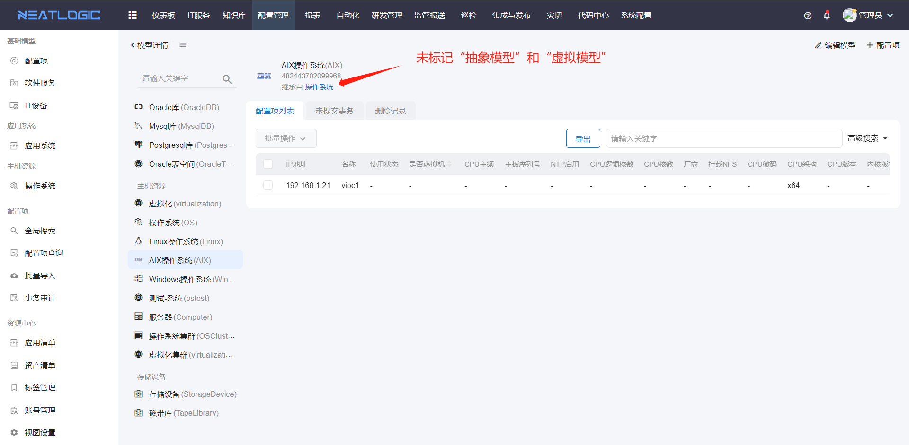
以新增配置项为例，需添加配置项信息，保存并提交事务，方可完成新增操作。编辑和删除配置项的操作流程同理。
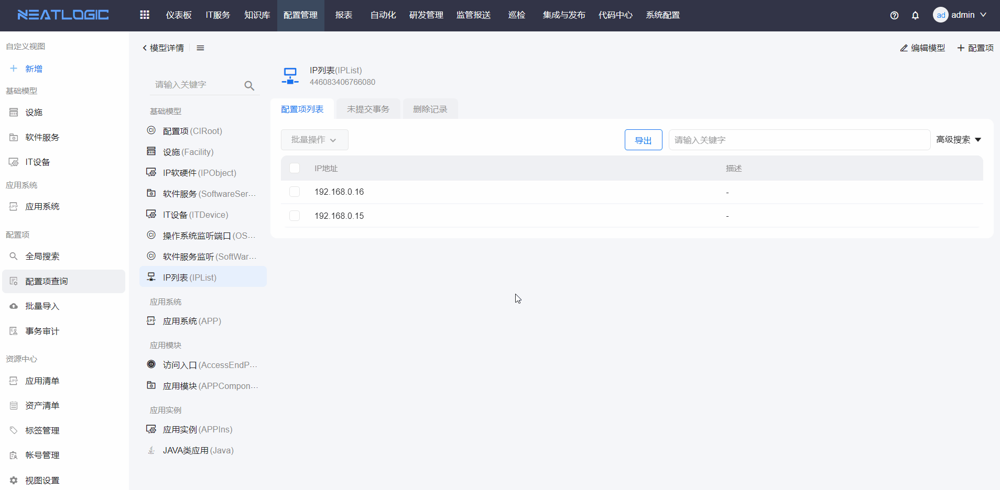
用户可在未提交事务中完成事务的提交和删除操作：
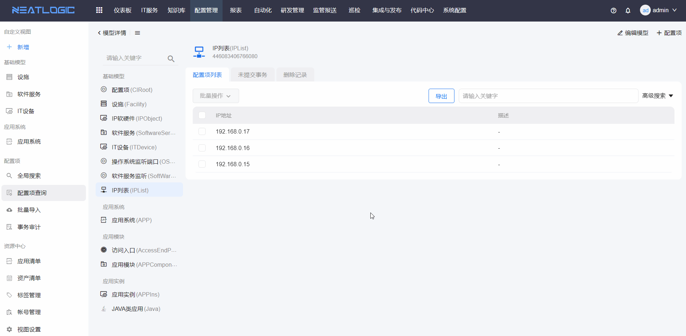
此外，在删除记录中支持还原已删除的配置项数据：
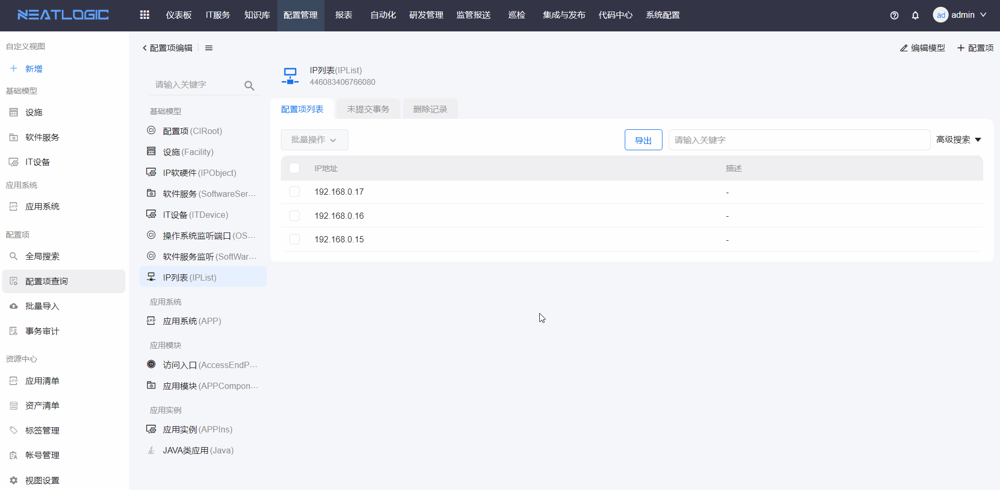

## 配置项详情
点击配置项上的详情按钮，可跳转至配置项详情页面。
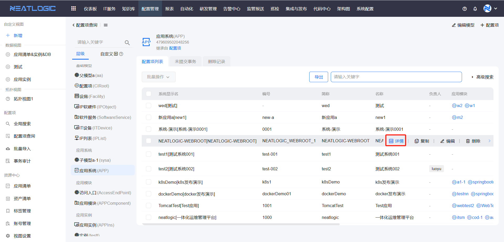
在详情页面中，用户可：
- 查看配置项的属性数据
- 查看配置项的关联关系数据
- 查看配置项的变更记录及变更详情
- 切换至拓扑图模式，查看配置项的上下游关联关系
  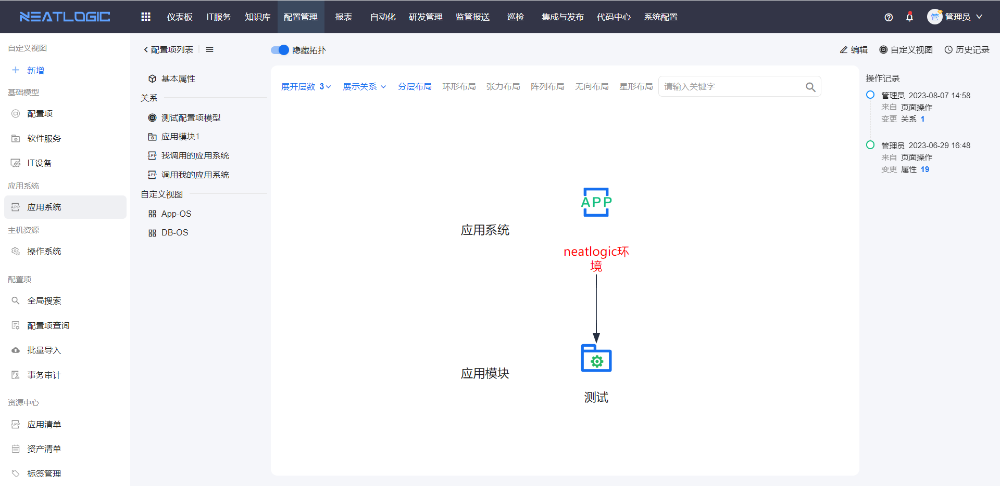
- 按属性分组查看配置属性数据
  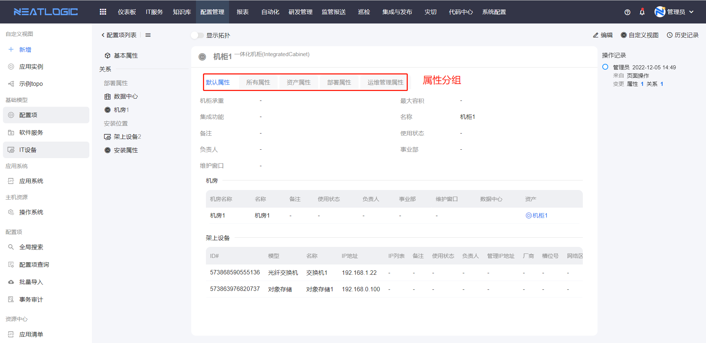