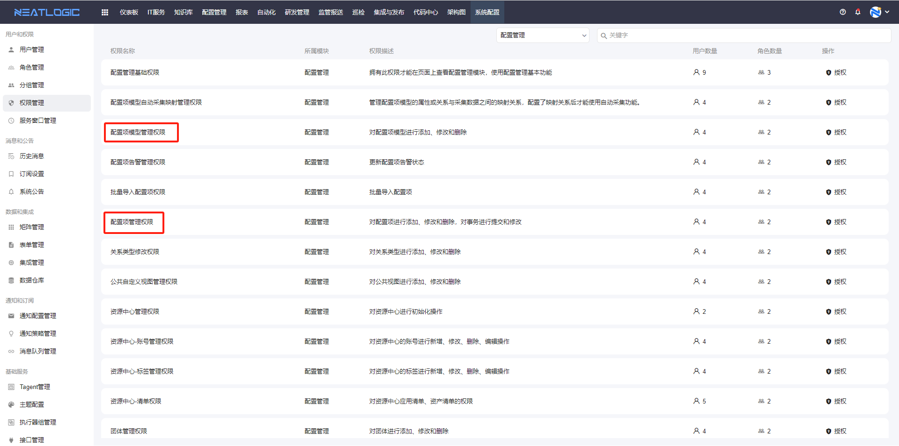
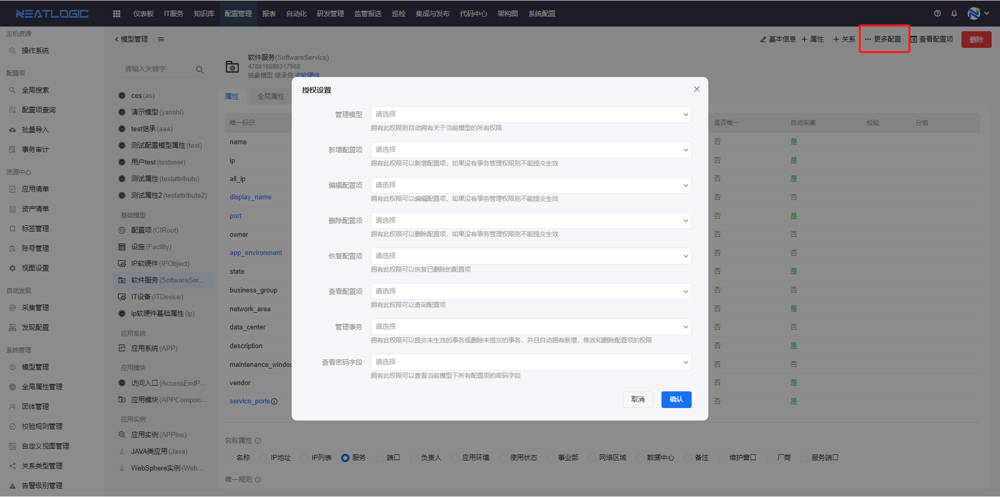
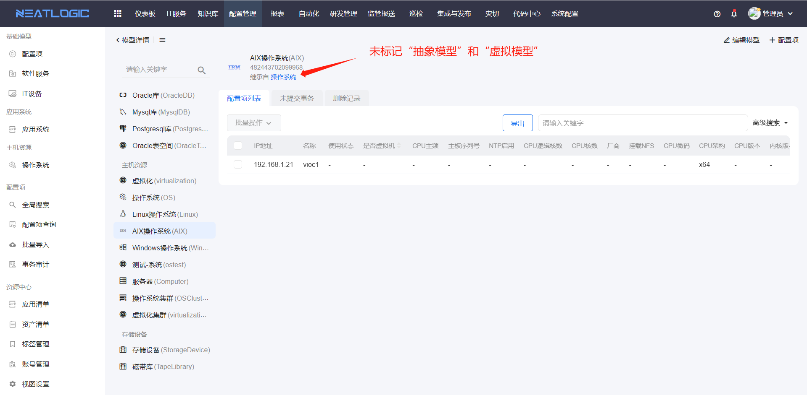
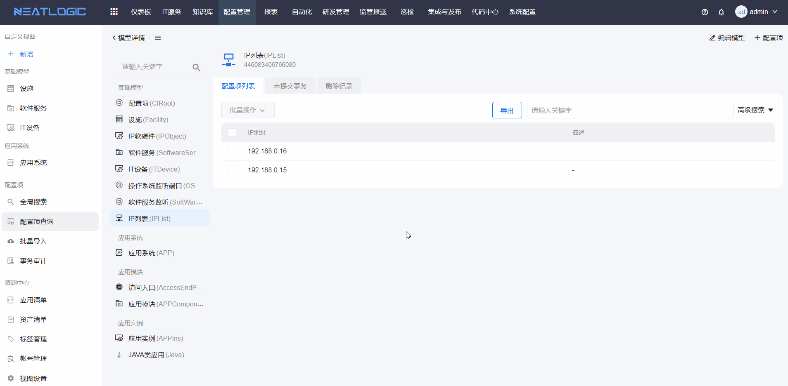
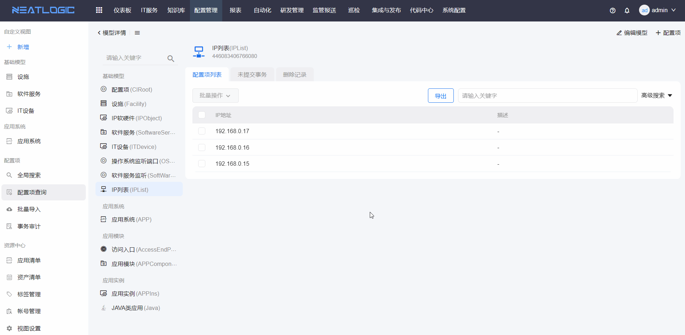
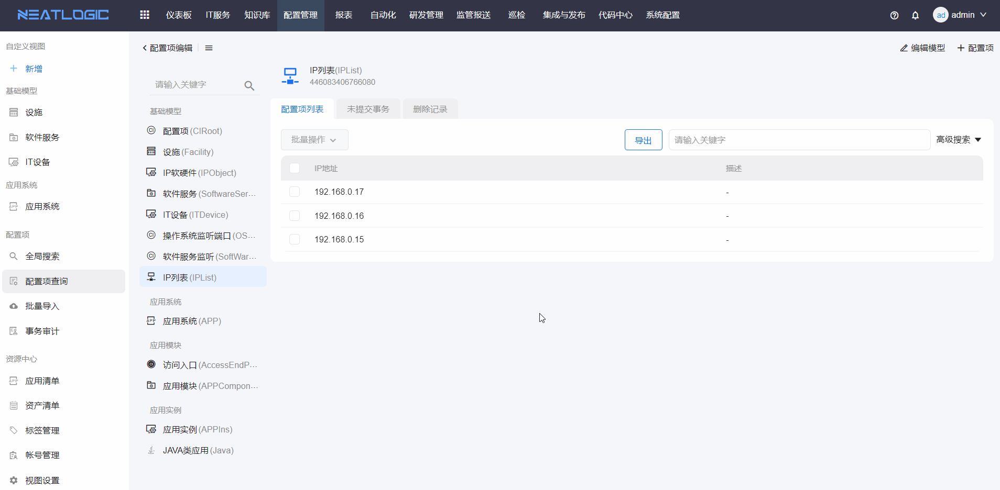
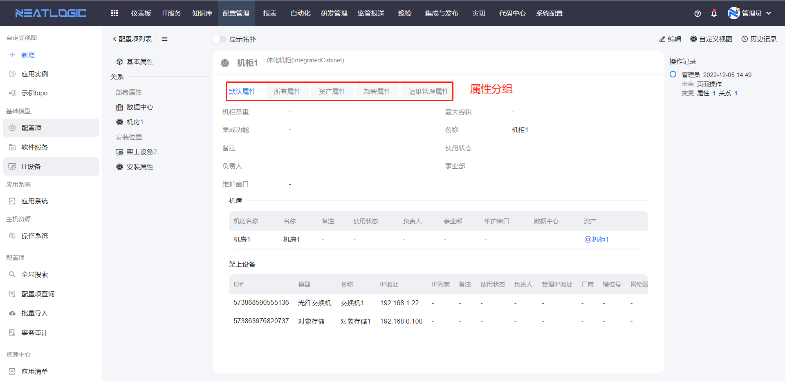

# 配置项查询

## 名称解释
* 配置项：CI（Configuration Item），一个配置项代表一个资源或一个物件。例如：一个应用、一个集群、一个中间件实例、一个主机。一个配置项具有配置模型定义的属性和关系。
* 事务：CI Transaction（Configuration Item Transaction），配置项增删改操作都可以产生操作事务，其目的是保证配置项的数据有效、准确性。例如：变更中存在变更成功和变更失败，变更成功提交事务，显示变更以后的结构，当变更失败以变更之前的数据展示，从而保证数据的有效性。

## 管理页
配置项管理页支持按条件搜索目标模型，还可切换到拓扑图查看模型关系。页面入口如图所示。

在管理页，查询目标模型，点击模型卡片，页面跳转到配置项列表页面；

## 权限说明
配置项列表数据涉及三个级别的权限
1. 第一层是系统管理里的授权，如果用户有模型管理和配置项管理这两个权限，用户就能管理所有模型的配置项数据。
   
2. 第二层是各个模型的权限配置，例如用户有“IP软硬件”模型的管理权限，用户能管理该模型的配置项数据，更多详情参考模型管理-[授权](../模型管理/模型管理.md/#授权)。
   
3. 第三层是团体，团体颗粒度到配置项层面，团体管理中可以将满足一定过滤条件的配置项授权给指定的对象，详情参考[团体管理](../系统管理/团体管理.md)。
   

## 配置项列表
配置项列表的功能主要包括配置项和事务的新增、删除、编辑和查询，只有普通模型可进行配置项增删改的操作（模型名称下方未标记抽象模型或者虚拟模型的模型就是普通模型）。

以新增配置项为例，添加配置项，保存并提交事务，才完成新增配置项操作，编辑和删除配置项同理。

可在未提交事务中完成事务的提交和删除。

在删除记录中支持还原已删除配置项的数据

## 配置项详情
点击配置项上的详情按钮，跳转到配置项详情页面。

* 查看配置项属性数据
* 查看配置项关联关系数据
* 查看配置项变更记录及变更详情
* 切换到拓扑图模式，查看配置项的上下游关联关系

* 按属性分组查看配置属性数据
  s