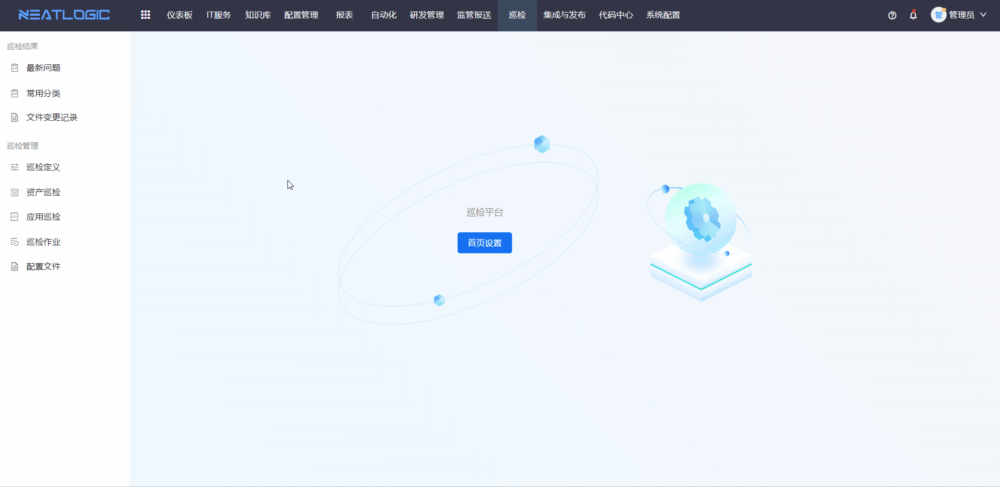
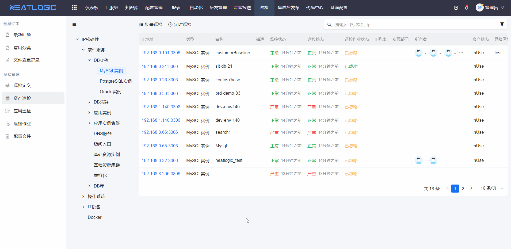

# 发起巡检
巡检的方式包括人工巡检和定时巡检，可在[巡检作业](巡检作业.md)页面查看所有作业详情，在[最新问题](最新问题.md)查看资产巡检问题汇总。本文以Mysql实例巡检为例。

## 人工巡检
步骤：
1. 已添加了mysql实例，在“mysql实例”配置模型添加配置项，详情参考配置项管理-[配置项列表](../3.配置管理/配置项查询/配置项查询.md)的添加配置项功能。
2. 在[巡检定义](巡检定义.md)页面，设置“mysql实例”配置模型关联的巡检[组合工具](../5.自动化/组合工具/组合工具.md)。
3. 在[资产巡检](资产巡检.md)页面，对mysql实例资产发起巡检作业。 
单个资产的人工巡检

批量巡检

## 定时巡检
对Mysql实例下的所有资产进行定时巡检。

步骤：
1. 已添加了mysql实例，在“mysql实例”配置模型添加配置项，详情参考配置项管理-配置项列表的添加配置项功能。
2. 在巡检定义页面，设置“mysql实例”配置模型关联的巡检组合工具。
3. 在资产巡检页面，配置“mysql实例”配置模型的定时巡检设置。

## 相关权限说明
相关权限有巡检管理员权限、巡检单个执行或批量执行权限和巡检定时执行权限。

- 巡检管理员权限：预设模型对应得巡检工具
- 巡检单个执行或批量执行权限：发起批量巡检作业和单个巡检作业
- 巡检定时执行权限：发起定时巡检作业
