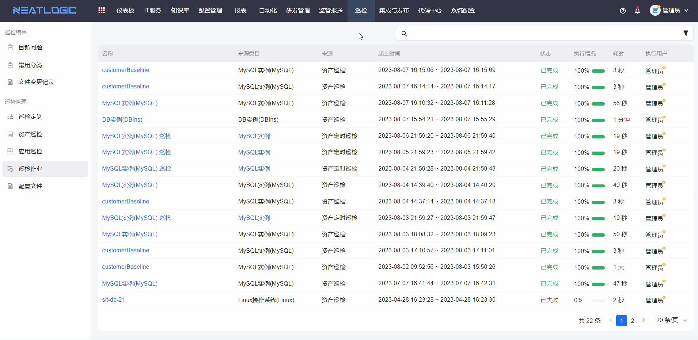
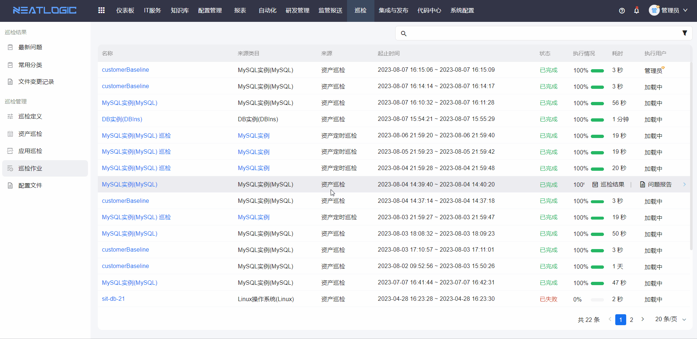

# 巡检作业
巡检作业页面展示所有巡检作业记录，包括资产巡检、应用巡检和定时巡检作业。相关权限为巡检管理员权限。

## 查看巡检作业详情
点击巡检作业标题，可跳转至巡检作业详情页面查看完整信息。

## 查看巡检结果
查看当前巡检作业中所有资产的巡检结果，巡检结果展示资产指标的综合判断状态。

## 查看巡检报告
查看当前巡检作业中所有资产的巡检报告，报告中详细展示资产所有指标的判断结果。

