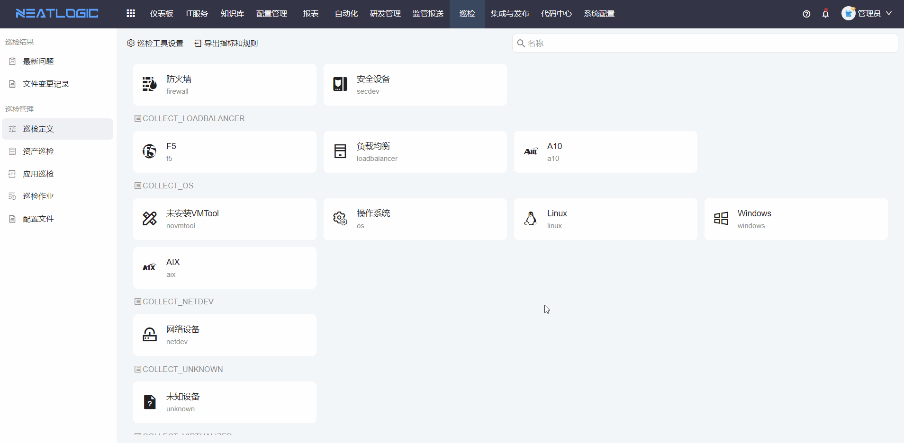
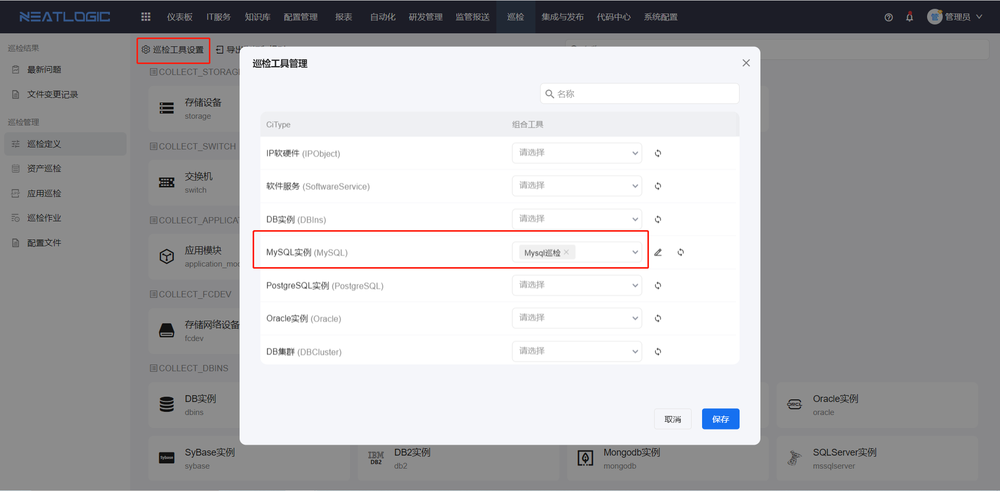

# 巡检定义
巡检定义的主要是对数据集合定义巡检指标，并设置资产模型关联的巡检工具，数据集合的巡检指标在巡检报告的结果中会作为重要判断指标。

## 指标规则
巡检时，每个数据集合会有各自采集回的指标数据，例如采集回linux的数据集合中有cpu、内存、磁盘空间等指标，可设置cpu的指标规则，作为告警判断指标。

## 定义模型巡检工具
本系统的巡检是通过自动化脚本实现的，需要在巡检工具设置中定义模型需要执行的脚本工具（组合工具），发起巡检作业时，模型的资产就会作为巡检作业的执行目标。

## 相关权限
相关权限有巡检管理员权限，授该权限才能设置阈值规则和模型关联得巡检工具。