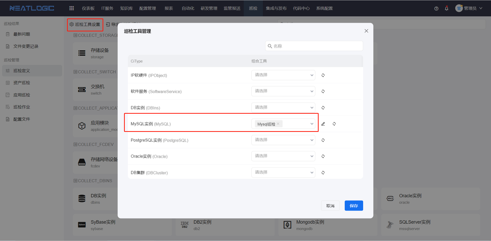

# 巡检定义
巡检定义主要用于为数据集合定义巡检指标规则，并设置资产模型关联的巡检工具。数据集合的巡检指标将作为巡检报告结果的重要判断依据。

## 指标规则
巡检时，每个数据集合会采集各自的指标数据。例如，Linux数据集合中包含CPU、内存、磁盘空间等指标，可设置CPU的指标规则作为告警判断指标。

## 定义模型巡检工具
本系统的巡检功能通过自动化脚本实现。需要在巡检工具设置中定义模型需要执行的脚本工具（组合工具），发起巡检作业时，模型下的资产将作为巡检作业的执行目标。

## 权限说明
相关权限为巡检管理员权限，拥有该权限才能设置阈值规则和模型关联的巡检工具。
