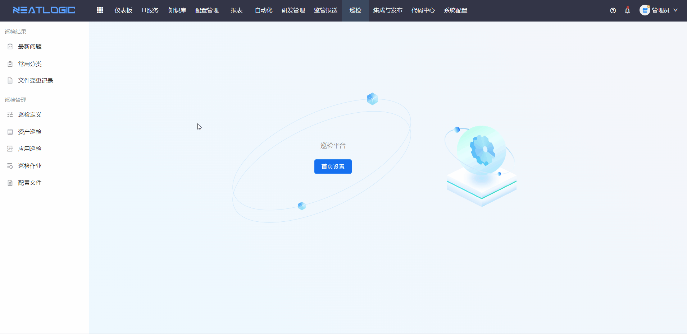

# 发起巡检

发起巡检用于说明人工巡检和定时巡检的基本操作流程。

巡检执行前，需要先准备资产配置项，并在[巡检定义](巡检定义.md)中为资产所属模型关联巡检组合工具。巡检执行后，可在[巡检作业](巡检作业.md)页面查看作业详情，也可在[最新问题](../巡检结果/最新问题.md)页面查看资产巡检问题汇总。

本文以 MySQL 实例巡检为例进行说明。

## 阅读路径

可根据当前要解决的问题选择阅读入口。

- 如果需要立即检查单个或多个资产，阅读“人工巡检”。
- 如果需要周期性检查某类资产，阅读“定时巡检”。
- 如果巡检执行后需要查看结果，阅读“巡检作业”和“最新问题”的相关说明。
- 如果需要确认可执行的操作范围，阅读“权限”。

## 权限

**操作权限**
- 配置：系统配置-[用户管理](../../100.系统配置/1.用户和权限/用户管理.md)-授权-巡检管理员权限、巡检单个执行或批量执行权限、巡检定时执行权限
- 包含操作：为模型关联巡检工具、发起单个巡检作业、发起批量巡检作业和发起定时巡检作业
- 配置人员：系统超级管理员或巡检管理员

## 人工巡检

人工巡检用于临时检查指定资产，适合在变更后验证、故障排查或日常抽检时使用。

**操作步骤**

1. 确保已添加 MySQL 实例配置项。在“mysql实例”配置模型中添加配置项，详情可参考配置项管理-[配置项列表](../../3.配置管理/配置项/配置项查询.md)的添加配置项功能。
2. 在[巡检定义](巡检定义.md)页面，为“mysql实例”配置模型关联巡检[组合工具](../../5.自动化/工具/组合工具.md)。
3. 在[资产巡检](资产巡检.md)页面，对 MySQL 实例资产发起巡检作业。

**单个资产人工巡检**

单个资产人工巡检适合检查某一个明确的目标资产。确认执行后，系统会为该资产生成巡检作业。

**批量巡检**

批量巡检适合对同一模型或同一筛选范围内的多台资产集中发起巡检。执行前建议先确认目标资产都已关联可用的巡检工具。

## 定时巡检

定时巡检用于按计划周期性检查资产。本文示例为对 MySQL 实例下的所有资产进行定时巡检。

**操作步骤**

1. 确保已添加 MySQL 实例配置项。在“mysql实例”配置模型中添加配置项，详情可参考配置项管理-[配置项列表](../../3.配置管理/配置项/配置项查询.md)的添加配置项功能。
2. 在[巡检定义](巡检定义.md)页面，为“mysql实例”配置模型关联巡检[组合工具](../../5.自动化/工具/组合工具.md)。
3. 在[资产巡检](资产巡检.md)页面，配置“mysql实例”配置模型的定时巡检设置。

定时巡检配置完成后，系统会按计划生成巡检作业。巡检结果可在资产巡检、巡检作业和最新问题中查看。

