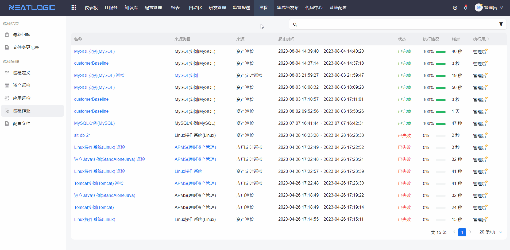

# 巡检作业

巡检作业用于查看系统中已生成的巡检作业记录，包括资产巡检、应用巡检和定时巡检作业。

在巡检作业页面，可以查看作业详情、巡检结果和巡检报告。该页面适合用于追踪巡检执行过程、确认作业是否完成，以及分析巡检指标的判断结果。

## 阅读路径

可根据当前要解决的问题选择阅读入口。

- 如果需要查看巡检任务的完整执行信息，阅读“查看巡检作业详情”。
- 如果需要确认本次作业中资产的综合巡检状态，阅读“查看巡检结果”。
- 如果需要分析具体指标的判断结果，阅读“查看巡检报告”。
- 如果需要确认可访问的操作范围，阅读“权限”。

## 权限

**操作权限**
- 配置：系统配置-[用户管理](../../100.系统配置/1.用户和权限/用户管理.md)-授权-巡检管理权限、巡检单个执行或批量执行权限、巡检定时执行权限
- 包含操作：访问巡检作业页面、查看巡检作业详情、查看巡检结果和查看巡检报告
- 配置人员：系统超级管理员

## 查看巡检作业详情

查看巡检作业详情用于确认巡检作业的完整执行信息。

点击巡检作业标题后，可跳转至巡检作业详情页面，查看作业基础信息、执行对象、执行状态和相关结果。遇到巡检未完成、执行失败或结果异常时，可先从作业详情开始排查。

## 查看巡检结果

查看巡检结果用于查看当前巡检作业中所有资产的巡检结果。

巡检结果会展示资产指标的综合判断状态，适合快速判断本次巡检中哪些资产正常、哪些资产存在异常。

## 查看巡检报告

查看巡检报告用于查看当前巡检作业中资产的详细指标判断结果。

巡检报告会展示资产各项指标的检查内容和判断结果，适合用于分析具体异常原因、确认指标阈值命中情况，以及留存巡检依据。

