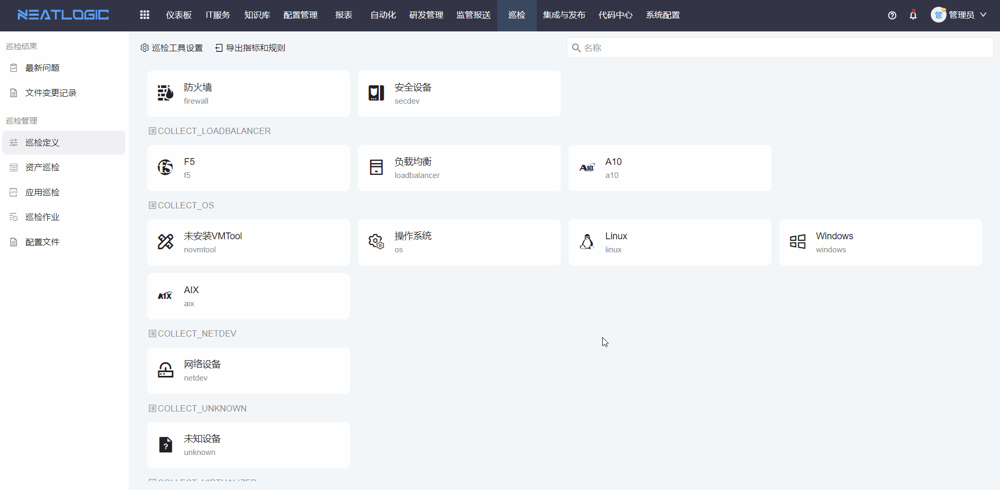

# 巡检定义

巡检定义用于配置巡检判断规则，并为资产模型关联巡检工具。

巡检执行时，系统会按数据集合采集指标数据，再根据巡检定义中的指标规则判断巡检结果。资产模型关联巡检工具后，模型下的资产才可以作为巡检作业的执行目标。

## 阅读路径

可根据当前要解决的问题选择阅读入口。

- 如果需要配置巡检指标的判断条件，阅读“指标规则”。
- 如果需要让某类资产支持巡检，阅读“定义模型巡检工具”。
- 如果资产发起巡检时提示未关联巡检工具，优先检查“定义模型巡检工具”。
- 如果需要确认可执行的操作范围，阅读“权限”。

## 权限

**操作权限**
- 配置：系统配置-[用户管理](../../100.系统配置/1.用户和权限/用户管理.md)-授权-巡检管理员权限
- 包含操作：配置指标规则、定义模型巡检工具
- 配置人员：系统超级管理员或巡检管理员

## 指标规则

指标规则用于定义巡检结果的判断条件。巡检执行时，每个数据集合会采集对应的指标数据，系统再根据指标规则判断该指标是否正常。

例如，Linux 数据集合中可能包含 CPU、内存、磁盘空间等指标。可以为 CPU 指标配置判断规则，用于识别 CPU 使用率是否超过预期范围。

配置指标规则时，需要先确认数据集合和指标含义，再根据实际运维标准设置判断条件。规则配置完成后，会作为巡检报告中指标状态判断的重要依据。

## 定义模型巡检工具

定义模型巡检工具用于将资产模型与巡检工具关联起来。系统的巡检能力通过自动化脚本实现，因此需要为目标模型指定可执行的巡检组合工具。

配置完成后，发起巡检作业时，该模型下的资产会作为巡检作业的执行目标。若资产所属模型没有关联巡检工具，资产巡检页面会提示先完成工具关联。

巡检工具通常需要提前在自动化模块中准备。配置时，应选择适用于该资产模型的[组合工具](../../5.自动化/工具/组合工具.md)，避免工具与资产类型不匹配导致巡检执行失败。
