# 应用巡检
应用巡检支持对应用下的资产对象进行巡检。每个应用模块下的最新问题和资产清单仅显示巡检状态存在异常的资产。

**访问权限**：巡检基础权限

## 应用与模块管理
应用巡检页面支持添加、删除和编辑应用或模块操作。需要拥有应用系统和应用模块模型相应权限，详情参考[模型管理](../../3.配置管理/系统管理/模型管理.md)。

### 添加
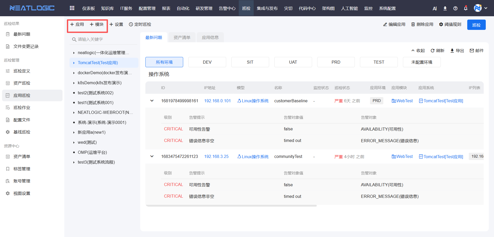

### 编辑
选择需要编辑的应用或模块进行修改。
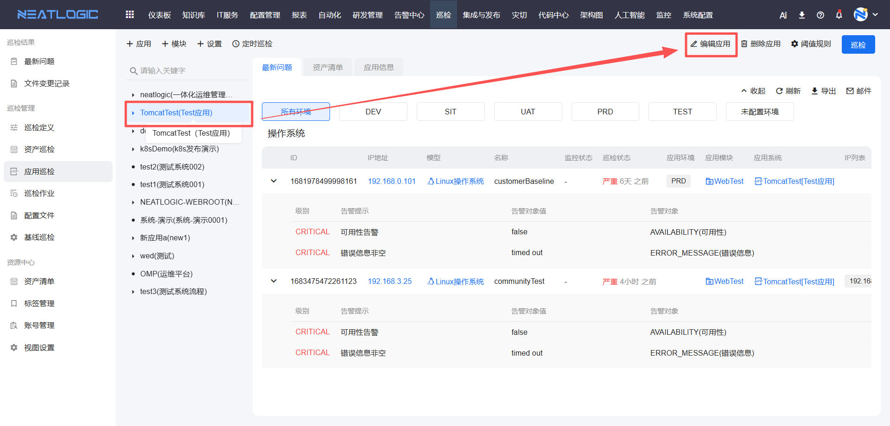

### 删除
选择需要删除的应用或模块进行删除。
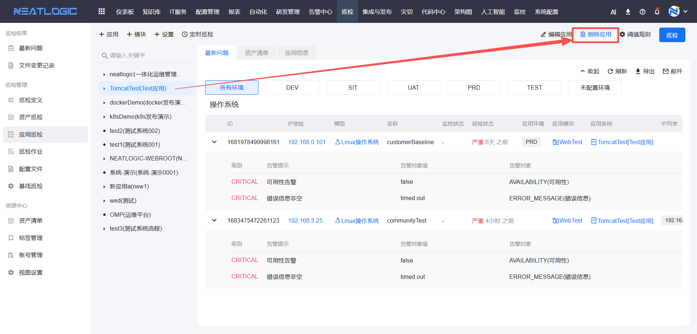

## 设置
应用巡检页面支持设置功能，包括资产清单设置和纳管应用设置。相关权限为巡检管理员权限。

### 资产清单设置
资产清单设置用于配置资产清单的数据配置，每个数据配置会在资产清单Tab中生成一个独立的表格。支持添加多个数据配置，以满足不同场景的资产展示需求。

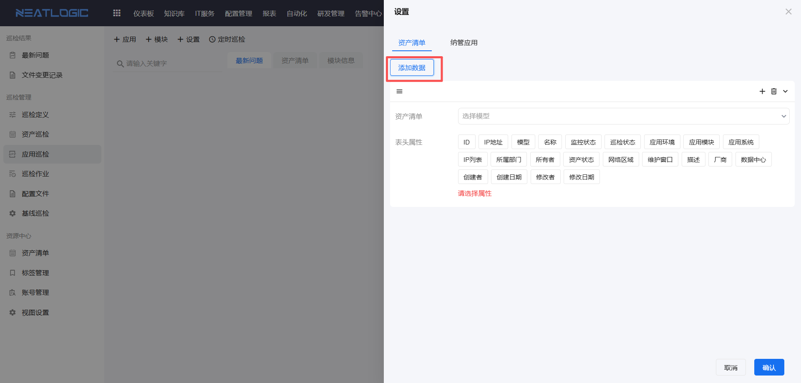

#### 数据配置
每个数据配置包含以下内容：

- **资产清单**：选择模板类型为"应用清单资产详情"的自定义视图。视图需提前在[视图设置](../资源中心/视图设置.md)中创建。
- **表头属性**：选择需要在表格中显示的属性列，如IP地址、名称、状态、环境等。
- **属性排序**：支持对已选择的表头属性进行拖动排序，调整列的显示顺序。

#### 操作说明

**添加数据配置：**
1. 点击"添加数据"按钮，创建新的数据配置。
2. 在资产清单下拉框中选择视图。
3. 在表头属性列表中，勾选需要显示的属性。
4. 通过拖动调整属性的显示顺序。
5. 点击保存完成配置。

**编辑数据配置：**
选择需要修改的数据配置，编辑资产清单或表头属性，保存后生效。

**删除数据配置：**
选择需要删除的数据配置，点击删除按钮，确认后保存设置。删除后，资产清单Tab中对应的表格将不再显示。

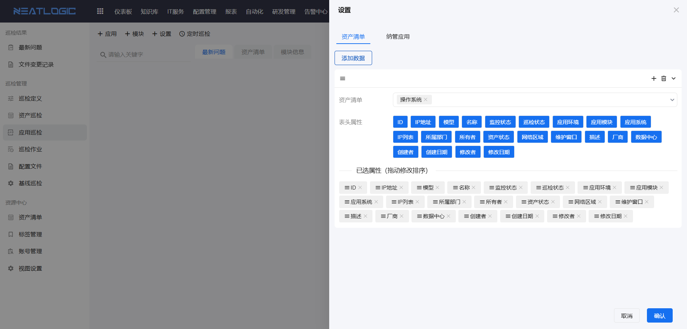

### 纳管应用设置
纳管应用设置用于选择需要在应用巡检中显示的应用。支持以下配置方式：

- **全部应用**：选择"全部应用"选项，应用巡检将显示所有应用。
- **指定应用**：手动选择需要纳管的应用，仅选中的应用会在应用巡检中显示。
- **清空选择**：若未选择任何应用，则应用清单为空。

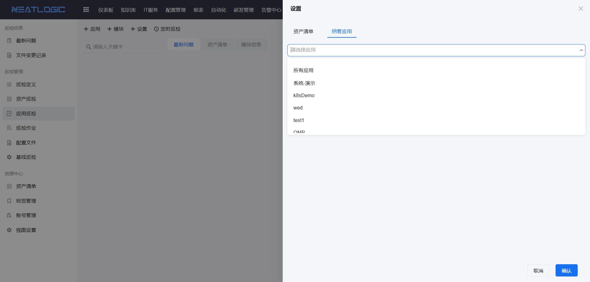

**操作步骤：**
1. 点击页面左上方的"设置"按钮，打开设置对话框。
2. 在"纳管应用"标签页中，选择需要纳管的应用。
3. 点击确认保存设置，应用巡检页面将根据配置显示相应的应用列表。

## 巡检操作
选择需要执行巡检的应用或模块，点击巡检按钮，选择需要巡检的模块及环境并确认，即可对包含的所有资产对象进行巡检。相关权限为巡检单个执行或批量执行权限。

### 应用资产批量巡检
选择应用，点击巡检按钮，选择环境的所属模块，对包含的所有资产发起巡检。

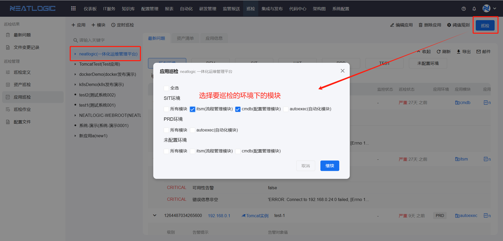

### 单个资产巡检
选择目标应用或模块，查看资产清单，找到目标资产，点击资产上的巡检按钮，选择执行即可。

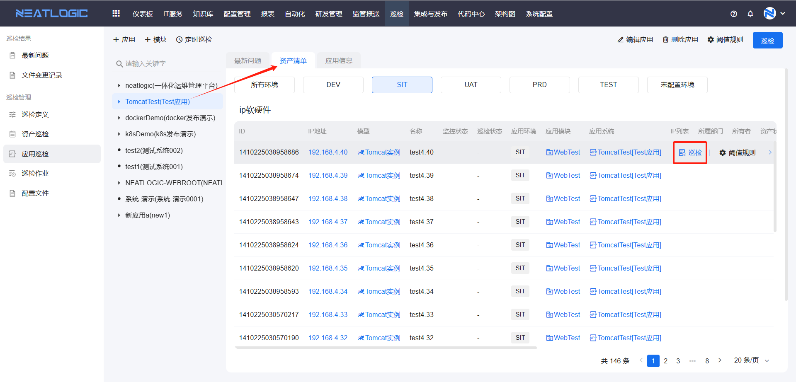

## 定时巡检
如需对应用中的资产进行定时巡检，可按以下步骤操作。相关权限为巡检定时执行权限。

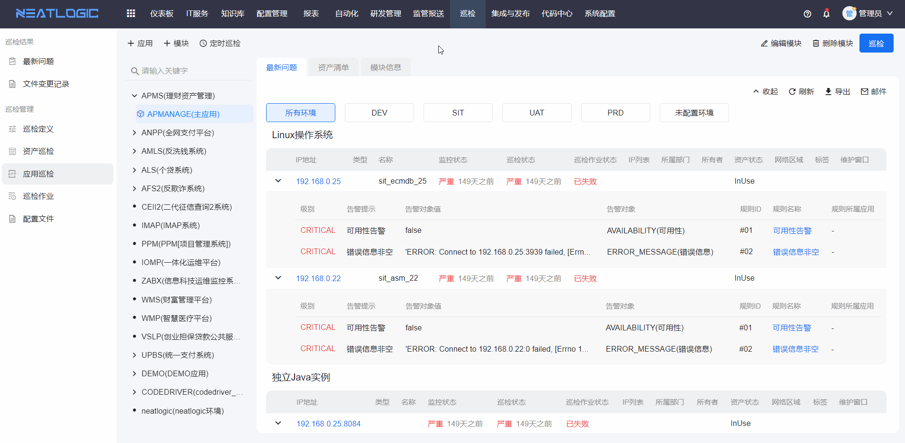

## 阈值规则
应用巡检页面的阈值规则支持直接设置应用阈值规则，也可通过资产设置全局或应用阈值规则。

### 应用阈值规则
直接设置应用层的阈值规则。选择应用，点击右上方的阈值规则按钮，即可设置应用层的阈值规则。

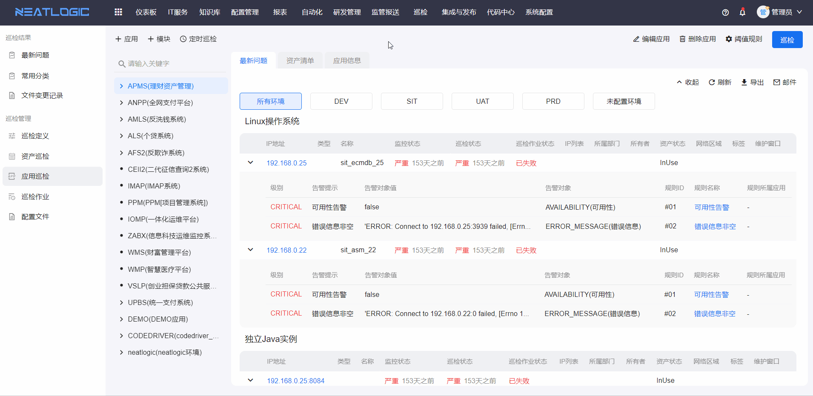

### 资产阈值规则
设置资产所属的全局阈值规则或所在应用的阈值规则。执行应用巡检时，优先遵循当前应用的阈值规则。

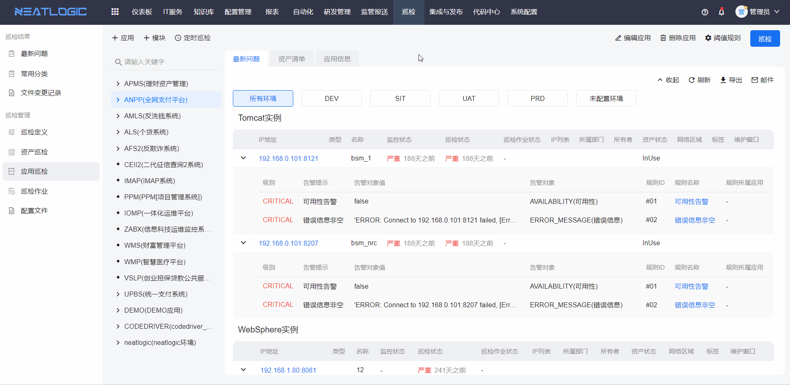

## 巡检报告
点击资产IP，可查看相应资产的巡检报告。巡检报告页面支持导出和查看历史报告。

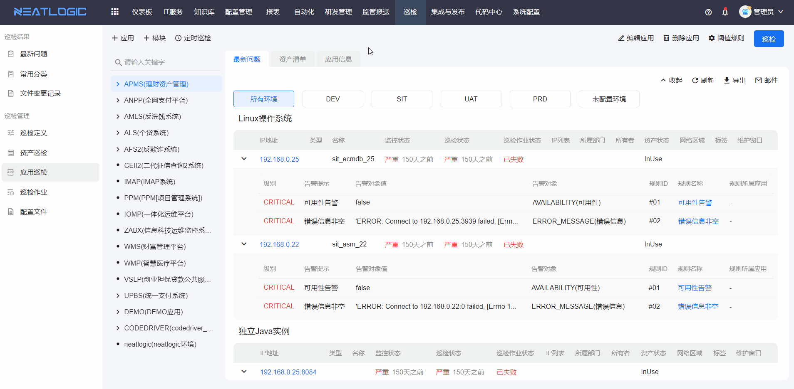
