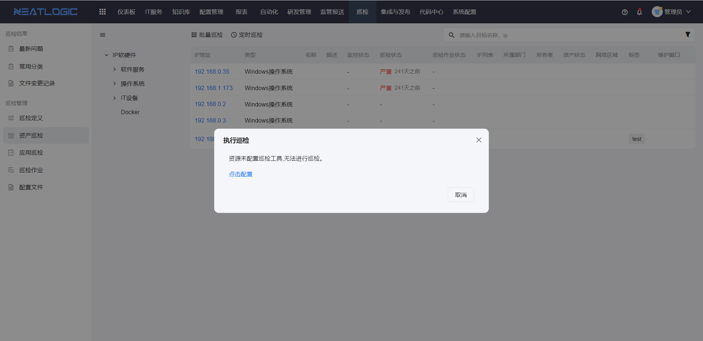
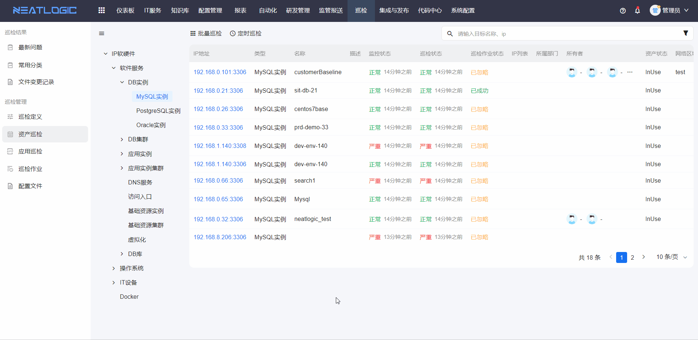
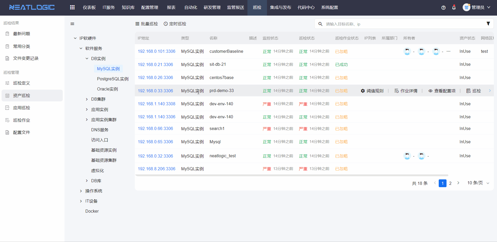
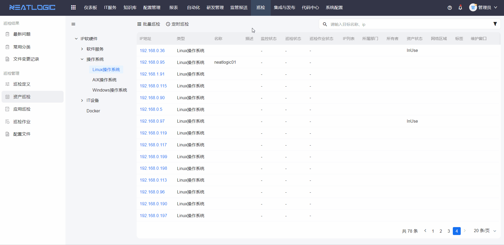
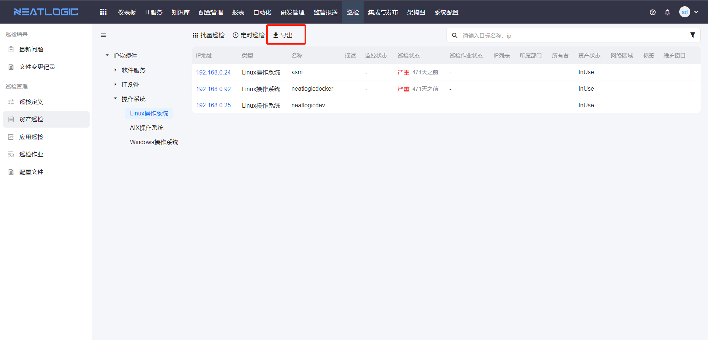
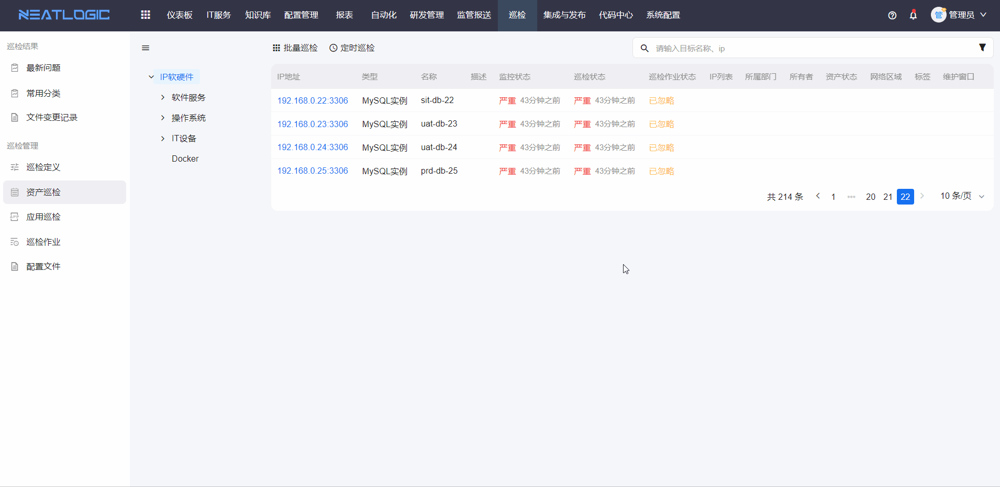
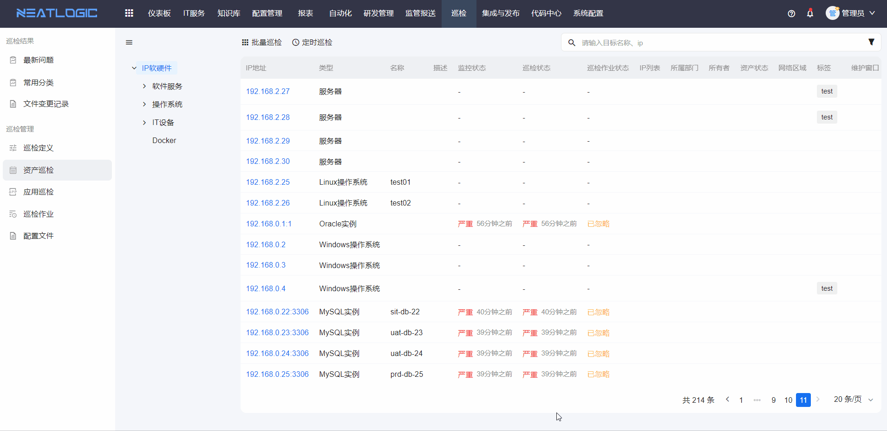
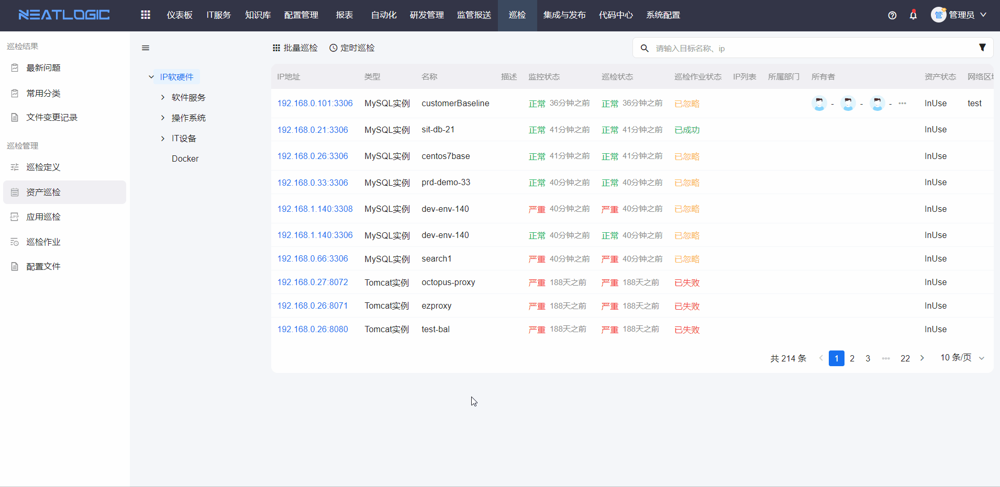

# 资产巡检
资产巡检功能支持对资产进行巡检操作，包括单个资产巡检、批量资产巡检和定时巡检。同时支持快速查看巡检作业、资产详情，以及跳转至应用巡检的阈值规则设置。

## 巡检操作

### 单个资产巡检
点击资产的巡检按钮，确认执行巡检作业即可。若资产未关联巡检工具，请按提示完成关联操作。

### 批量巡检

## 定时巡检
点击定时巡检按钮，打开定时巡检编辑弹窗，选择模型名称完成定时巡检设置。

## 阈值规则
阈值规则即数据集合的指标规则。资产的阈值规则设置分为全局阈值规则和应用阈值规则两个维度，优先继承应用层的阈值规则。

## 导出
资产巡检支持将当前搜索结果中所有资产的巡检结果导出。

## 查看巡检作业
如需了解资产最近一次巡检的详细信息，可点击资产上的"查看巡检作业"按钮，跳转至巡检作业详情页面。

## 查看配置项
如需查看资产详细信息，可点击资产的"查看配置项"按钮，跳转至资产配置项详情页面。

## 巡检报告
点击资产IP，可查看相应资产的巡检报告。巡检报告页面支持导出和查看历史报告。

## 权限说明
相关权限包括巡检基础权限、巡检单个执行或批量执行权限、巡检定时执行权限。

| 权限类型 | 权限说明 |
|----------|----------|
| 巡检基础权限 | 访问资产巡检页面 |
| 巡检单个执行或批量执行权限 | 发起批量巡检作业和单个巡检作业 |
| 巡检定时执行权限 | 发起定时巡检作业 |
