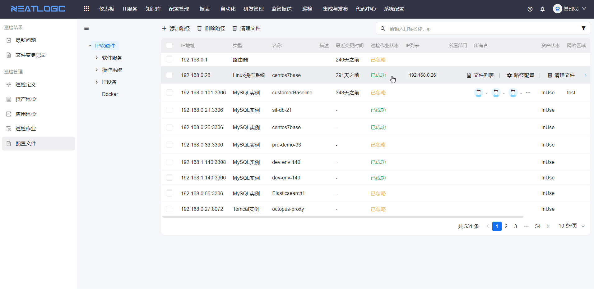
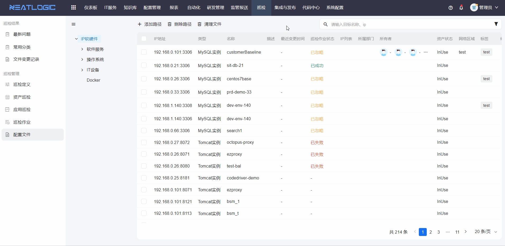
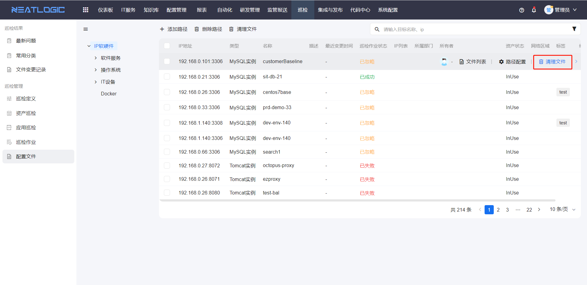
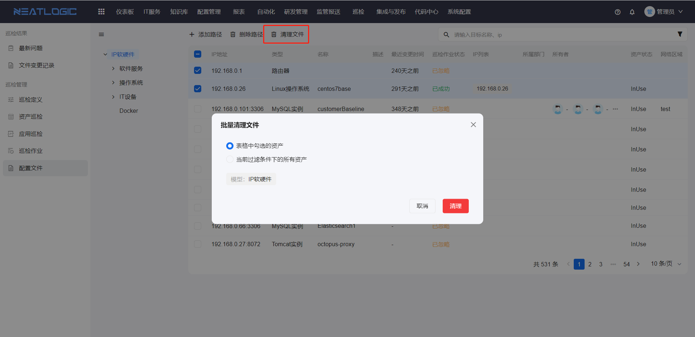
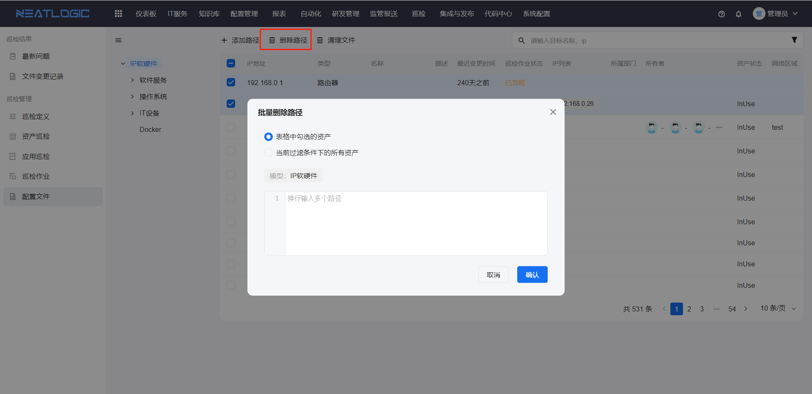
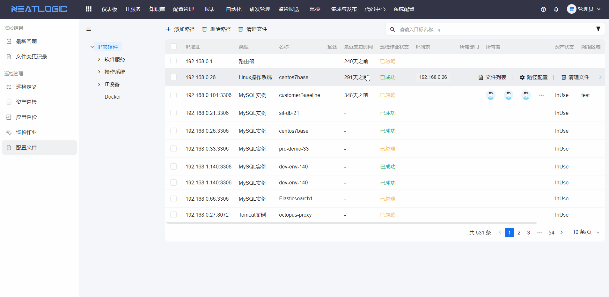

# 配置文件
配置文件页面用于查看和管理资产关联的配置文件。相关权限包括巡检基础权限和巡检管理员权限。仅拥有巡检基础权限的用户只能查看资产关联的配置文件。

## 配置文件路径

### 单个添加
单个文件路径添加，每个文件路径占一行。

### 批量添加
批量添加文件路径，每个文件路径占一行。批量操作时，可选择指定资产，也可选择当前过滤条件下的所有资产。

## 清理文件

### 清理单个资产文件

### 批量清理资产文件

## 批量删除文件路径
在多个目标资产中，同时删除指定的文件路径。

## 查看文件
资产关联配置文件后，支持查看配置文件内容。

