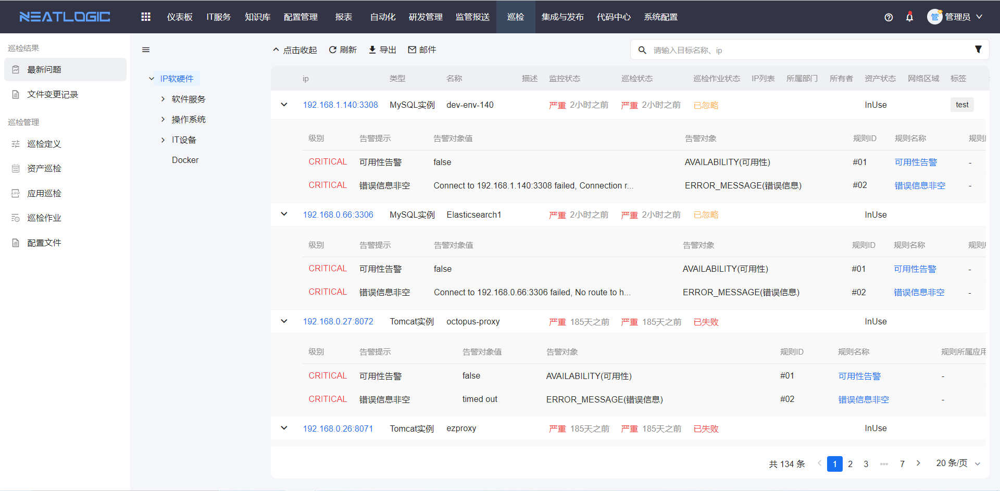
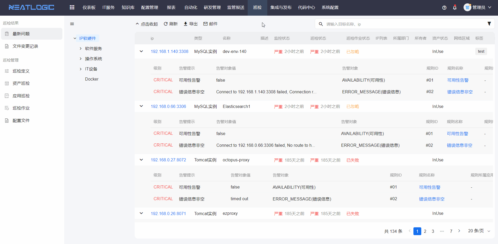
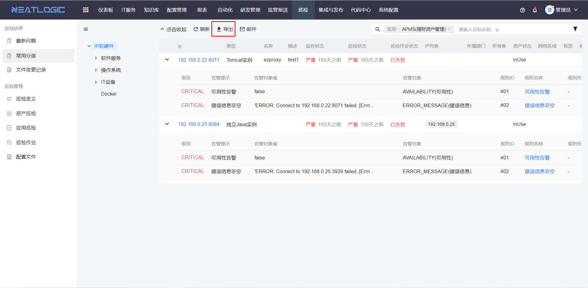
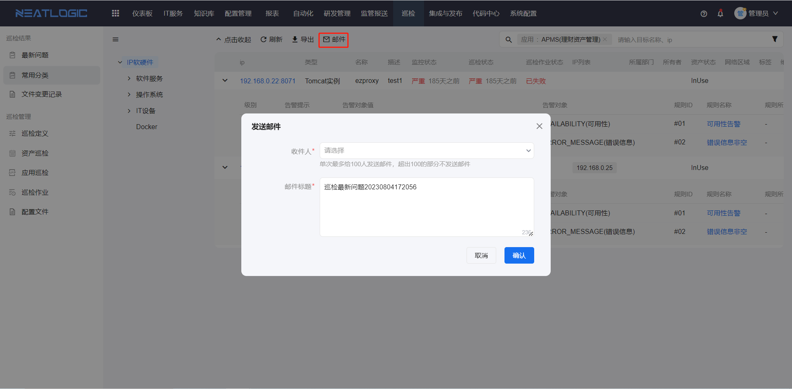

# 最新问题

最新问题用于汇总所有资产最近一次巡检发现的问题。

在最新问题页面，可以按应用、模块、巡检状态、作业状态等条件过滤问题，也可以保存常用搜索条件、导出当前搜索结果，或将问题汇总通过邮件发送给指定用户。该页面适合用于集中查看当前资产异常，并快速进入后续排查。

## 阅读路径

可根据当前要解决的问题选择阅读入口。

- 如果需要筛选当前资产异常，阅读“过滤搜索”。
- 如果需要复用常用筛选条件，阅读“过滤搜索”中的保存分类说明。
- 如果需要留存或外部分析问题清单，阅读“导出”。
- 如果需要将问题汇总发送给相关人员，阅读“邮件通知”。
- 如果需要确认可访问的操作范围，阅读“权限”。

## 权限

**操作权限**
- 配置：系统配置-[用户管理](../../100.系统配置/1.用户和权限/用户管理.md)-授权-巡检基础权限
- 包含操作：访问最新问题页面、过滤搜索、保存个人分类、导出当前搜索结果和发送邮件通知
- 配置人员：系统超级管理员

## 过滤搜索

过滤搜索用于缩小最新问题的查看范围。

最新问题列表支持按应用、模块、巡检状态、作业状态等条件过滤巡检问题。筛选后，可以优先处理当前范围内的异常资产，避免在全部问题中反复查找。

页面支持将常用搜索条件保存为个人分类。保存后，后续可直接选择分类快速恢复筛选条件，适合日常巡检、专项排查或固定应用范围的持续跟踪。

## 导出

导出用于将当前搜索结果中的问题导出并保存到本地。

导出前建议先确认筛选条件，确保导出的内容与当前排查范围一致。导出的文件可用于问题留存、离线分析或转交相关人员处理。

## 邮件通知

邮件通知用于将当前搜索结果中的问题汇总发送给指定用户。

发送前需要确认收件人在用户基础信息中已配置邮箱地址。若用户未维护邮箱，可能无法正常接收邮件。

