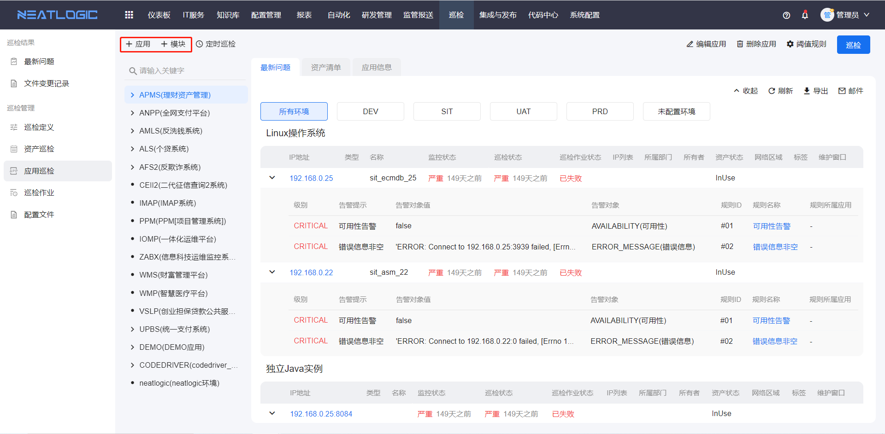
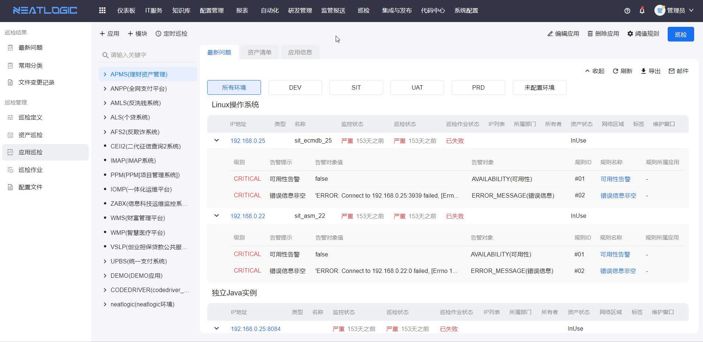
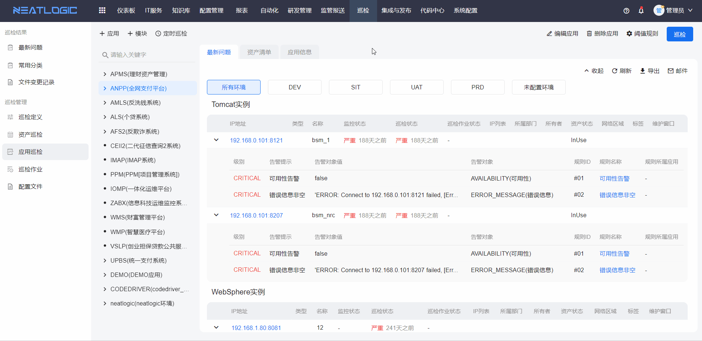
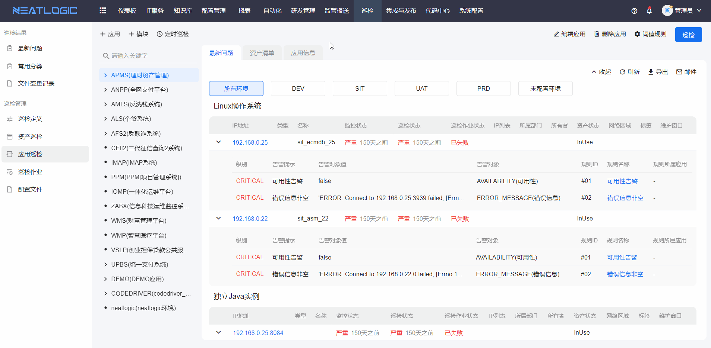

# 应用巡检
应用巡检是按应用为标的，对应用下包含的所有资产对象进行巡检，一个应用包含的资产对象可能属于不同的的模型类型，所以发起应用巡检时，可能发起多个巡检作业。相关的权限有巡检基础权限，有次权限才能访问应用巡检页面。

## 应用、模块管理
应用巡检页面支持添加、删除和编辑应用或模块的操作，需要拥有应用系统和应用模块模型相应权限，具体参考[模型管理](../3.配置管理/配置模型管理/配置模型.md)。
- 添加
  
- 编辑，选择要编辑的应用或模块
  
- 删除，选择要删除的应用或模块
  

## 巡检
选择需要执行巡检的应用或模块，点击巡检按钮，选择需要巡检的模块及环境并确认，可对包含的所有资产对象进行巡检。相关的权限有巡检单个执行或批量执行权限。

## 定时巡检
需要对应用中的资产进行定时巡检，可按下图操作完成。相关的权限有巡检定时执行权限。

## 阈值规则
应用巡检页面的阈值规则可直接设置应用阈值规则，也可通过资产设置全局或应用阈值规则。
- 应用阈值规则：直接设置应用层的阈值规则，选择应用，点击右上方的阈值规则可设置应用层的阈值规则。
  
- 资产阈值规则：设置资产所属的全局阈值规则或所在的应用阈值规则。执行应用巡检时，优先遵循当前应用的阈值规则。
  

## 巡检报告
点击资产ip，可查看相应资产的巡检报告。巡检报告页面支持导出和查看历史报告。
