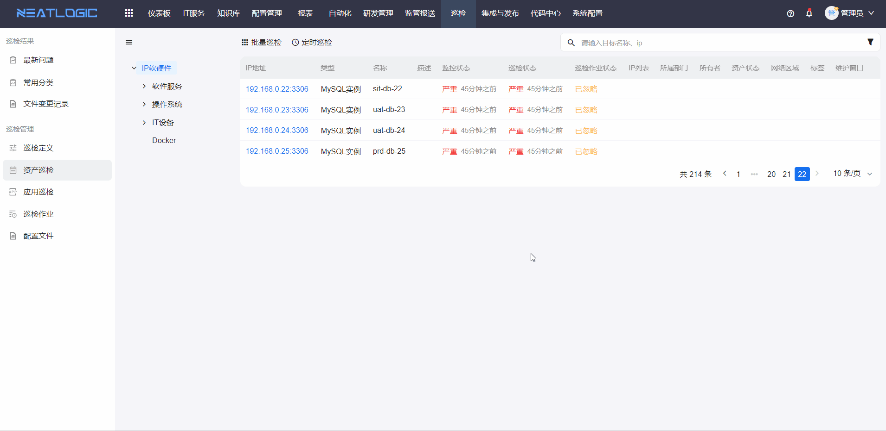
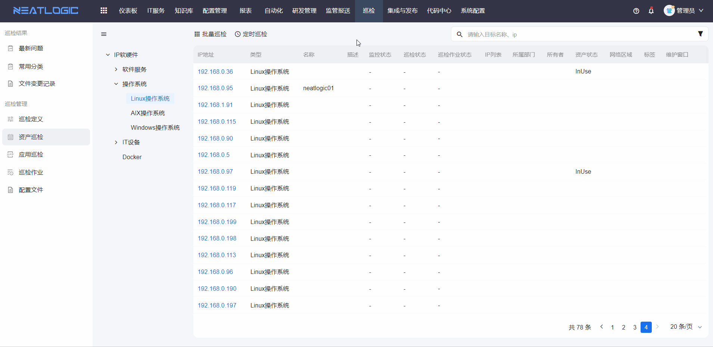
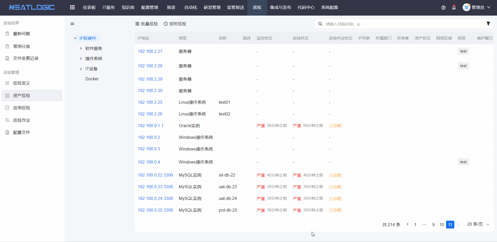

# 资产巡检
资产巡检即对资产进行巡检，支持单个资产巡检、批量资产巡检和定时巡检，还可以从资产打开跳转到应用巡检的阈值规则。另外还允许快速查看巡检作业和资产详情。

## 巡检和批量巡检
- 单个资产巡检：点击资产的巡检按钮，确认执行巡检作业即可，若未关联巡检工具，按提示完成关联操作。

- 批量巡检：

## 定时巡检
点击定时巡检按钮，打开定时巡检编辑弹窗，点击模型名称完成定时巡检设置即可。

## 阈值规则
阈值规则即数据集合的指标规则，资产的阈值规则设置有全局阈值规则和应用阈值规则两个维度，优先继承应用的阈值规则。

## 查看巡检作业
若想了解资产最近一次巡检的巡检作业详细信息，可点击资产上的查看巡检作业按钮，跳转到巡检作业的详情页面。

## 查看配置项
若想查看资产详细信息，点击资产的查看配置项按钮，跳转到资产的配置项详情页面。

## 巡检报告
点击资产ip，可查看相应资产的巡检报告。巡检报告页面支持导出和查看历史报告。

## 相关权限
相关权限有巡检基础权限、巡检单个执行或批量执行权限和巡检定时执行权限。

- 巡检基础权限：有此权限即可访问资产巡检页面
- 巡检单个执行或批量执行权限：发起批量巡检作业和单个巡检作业
- 巡检定时执行权限：发起定时巡检作业