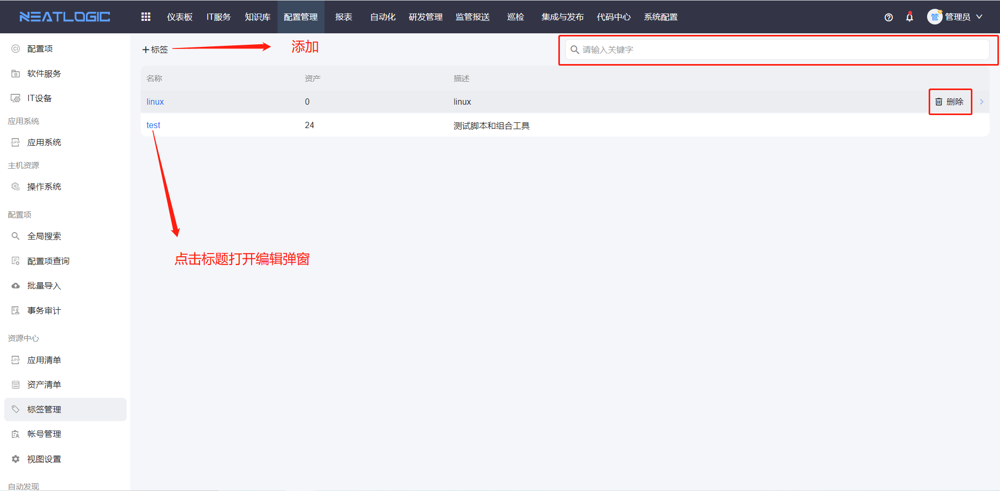

# 标签管理

标签管理用于维护资产标签，支持标签的添加、编辑、删除和搜索。

资产标签可用于资产分组、资产筛选和基线巡检等场景。被资产或其他配置引用的标签不可删除，避免影响已有资产分类和巡检范围。

## 阅读路径

可根据当前要解决的问题选择阅读入口。

- 如果需要新增或调整资产标签，阅读“标签维护”。
- 如果需要查找已有标签，阅读“搜索”。
- 如果标签无法删除，阅读“删除限制”。
- 如果需要确认可执行的操作范围，阅读“权限”。

## 权限

**操作权限**
- 配置：系统配置-[用户管理](../../100.系统配置/1.用户和权限/用户管理.md)-授权-资源中心_标签管理权限
- 包含操作：访问标签管理页面、添加标签、编辑标签、删除标签和搜索标签
- 配置人员：系统超级管理员

## 标签维护

标签维护用于新增、修改和删除资产标签。

新增标签后，可以在资产清单中为资产绑定标签，也可以在基线巡检等场景中按标签组织巡检范围。编辑标签会影响标签在相关页面中的显示名称。

## 搜索

搜索用于快速查找已有标签。

当标签数量较多时，可以通过关键字缩小列表范围，便于确认标签是否已存在，避免重复创建含义相近的标签。

## 删除限制

已被引用的标签不可删除。

如果需要删除标签，需要先解除资产或其他配置中的引用关系，再回到标签管理页面执行删除操作。
