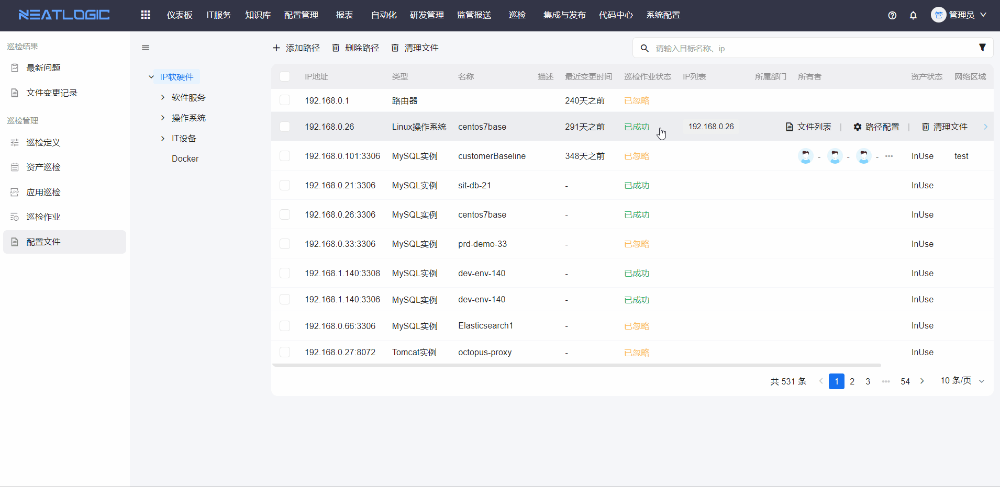
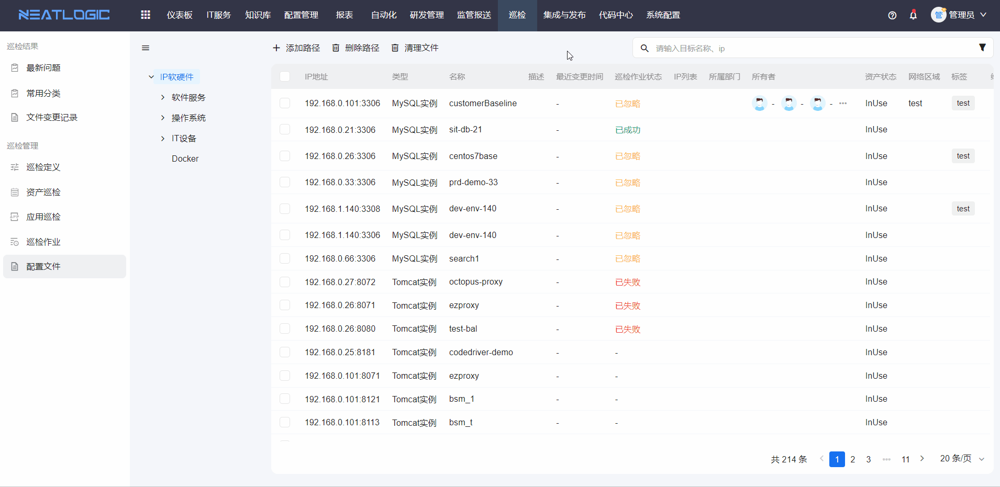
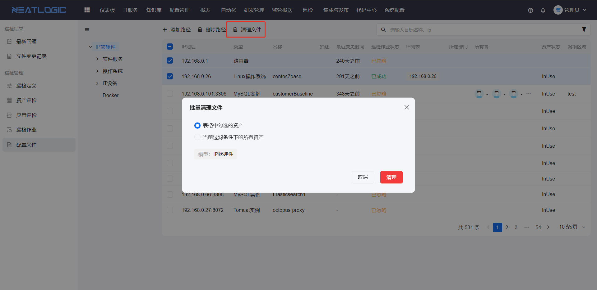

# 配置文件
配置文件页面是查看和管理资产关联配置文件的页面。相关的权限有巡检基础权限和巡检管理员权限，用户只有巡检基础权限时，只能查看资产关联的配置文件。

## 配置文件路径
单个文件路劲，一个文件的路径占一行。

批量添加文件路劲，一个文件的路径占一行。批量操作时，可对选择的资产，也支持对当前过滤的所有资产。

## 清理文件
清理单个资产的所有文件

批量清理资产的所有文件

## 批量删除文件路劲
在多个目标资产中，同时删除填写的文件路劲。

## 查看文件
资产关联配置文件后，支持查看配置文件内容，操作如图所示。

