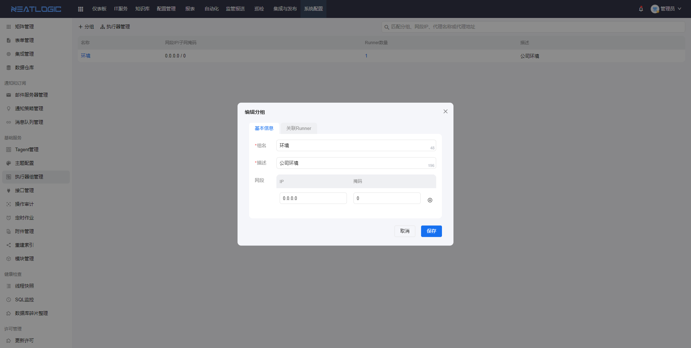
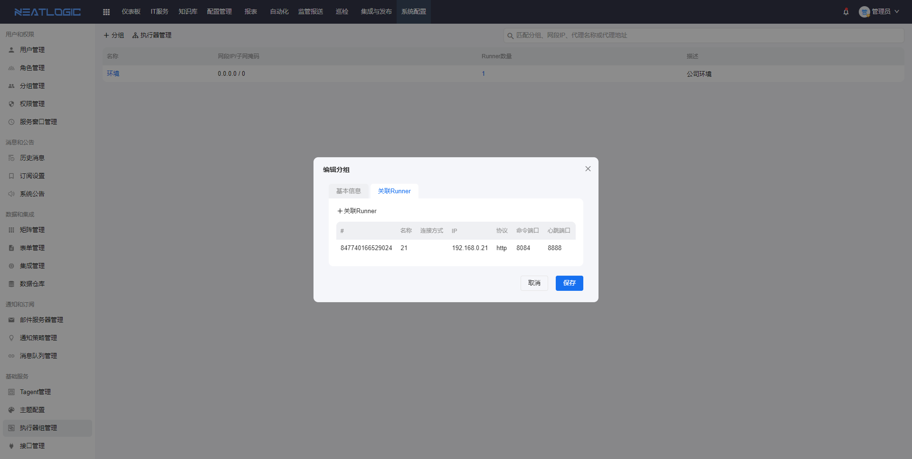
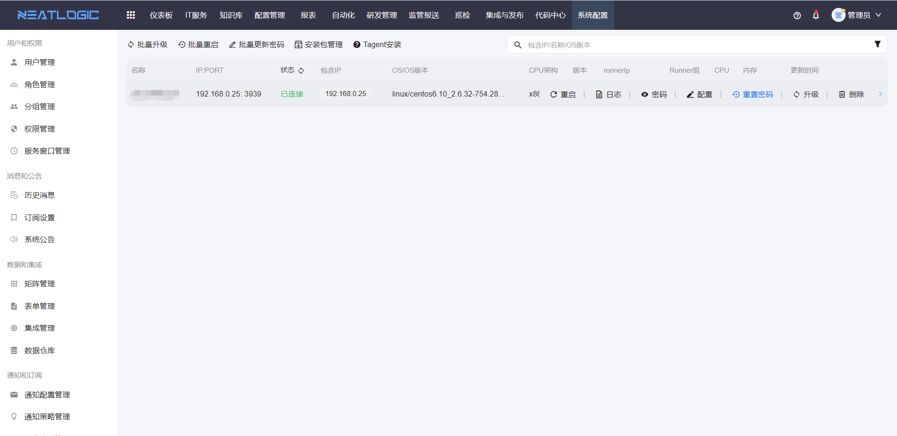
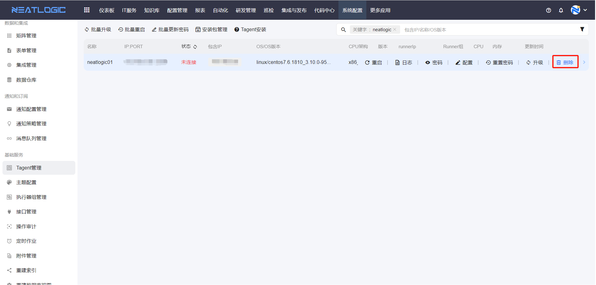

# Tagent服务

Tagent 服务用于部署在受管目标操作系统上，是自动化模块连接和执行目标主机的一种可选方式。它可以在部分场景下替代传统主机连接协议，降低账号维护和远程执行的复杂度。

## Tagent 特点

Tagent 具备以下特点：

1. 采用 Perl 语言开发，运行环境依赖要求极低。
2. 支持常见的 Windows、Linux、SUSE、AIX 等操作系统。
3. 对操作系统资源占用极少，资源消耗范围为：CPU ≤ 2%，内存 ≤ 200MB。
4. 同一受管机器支持多用户安装。
5. 与 neatlogic-runner 建立心跳连接，定期探测目标环境和服务可用性。
6. 支持从 neatlogic-runner 注册、管理以及自动匹配管理网段下发执行。
7. 支持在 neatlogic-web 上查看日志、重启、修改配置、升级等操作。

## 阅读路径

可根据当前要解决的问题选择阅读入口。

- 如果需要判断是否适合使用 Tagent，阅读“适用场景”。
- 如果需要准备安装环境，阅读“安装前准备”和“开通网络策略”。
- 如果需要获取安装包，阅读“获取安装包”。
- 如果需要在 Linux、SUSE、AIX 或 Unix 类系统上安装，阅读“Unix 类系统安装”。
- 如果需要在 Windows 系统上安装，阅读“Windows 类系统安装”。
- 如果需要调整 Tagent 运行参数，阅读“Tagent 配置”。
- 如果需要让 Tagent 重新注册到平台，阅读“Tagent 重新注册”。
- 如果需要清理 Tagent 服务，阅读“Tagent 卸载”。
- 如果需要启动或停止 Tagent，阅读“Tagent 服务相关命令”。

## 权限

Tagent 服务安装涉及平台配置和目标主机操作。平台侧通常需要维护执行器组和查看 Tagent 注册状态；目标主机侧需要具备安装、启停和删除服务的操作权限。

**操作权限**
- 配置：系统配置-[用户管理](../../100.系统配置/1.用户和权限/用户管理.md)-授权-自动化执行器管理权限
- 包含操作：新增、编辑、删除和查询执行器组、执行器，维护执行器组网段范围
- 配置人员：系统超级管理员

**操作权限**
- 配置：系统配置-[用户管理](../../100.系统配置/1.用户和权限/用户管理.md)-授权-Tagent基础权限
- 包含操作：查看 Tagent 状态、配置、日志和密码，执行编辑配置、重启、重置密码、升级、删除和导出等操作
- 配置人员：系统超级管理员

**主机权限**
- Unix 类系统：建议使用 `root` 用户安装。使用 `root` 安装时，Tagent 会注册为系统服务。
- Windows 系统：需要使用管理员权限打开 `cmd` 窗口后执行安装或卸载脚本。

## 适用场景

Tagent 服务适用于以下场景：

1. Windows 类机器。
2. 机器账号密码经常变更。
3. 机器上存在多账号，不想在平台上维护不同用户密码。
4. 深度使用自动化运维，例如资源安装交付。

## Tagent 安装

### 安装前准备

安装 Tagent 前，需要先在系统配置中准备执行器组。执行器组的网段范围必须包含 Tagent 所在目标主机的 IP 地址，否则 Tagent 注册后可能无法被正确匹配和管理。

可在系统配置-[执行器组管理](../../100.系统配置/5.Agent 和 Runner/执行器组管理.md)页面添加 Runner 组。

> 注意：`0.0.0.0/0` 表示匹配所有 IP。





### 安装步骤

Tagent 安装通常包含以下步骤：

1. 开通网络策略。
2. 获取安装包。
3. 在目标受管机器上安装 Tagent。
4. 安装完成后，在系统配置-[Tagent管理](../../100.系统配置/5.Agent 和 Runner/Tagent管理.md)页面检查注册状态。

### 开通网络策略

安装前需要确认 Tagent 主机与 Runner 主机之间的网络连通性。

| 源 IP | 目的 IP | 目的端口 | 协议 | 备注 |
|------|--------|----------|------|------|
| neatlogic-tagent-client 主机 | neatlogic-runner 主机 | 8084/8888 | TCP | 8084 为注册端口，8888 为心跳端口 |
| neatlogic-runner 主机 | neatlogic-tagent-client 主机 | 3939 | TCP | 命令下发端口 |

### 获取安装包

Tagent 提供两种获取安装包的方式。

**方式一：基于源码打包**

可基于 [neatlogic-tagent-client](https://gitee.com/neat-logic/neatlogic-tagent-client) 工程打包。源代码和资源都在该项目中，需要自行编译。

> 社区版暂不提供编译教程，如需自行编译，可根据项目源码和构建方式进一步研究。

```text
说明：Windows 安装包内嵌了 Perl 运行时依赖环境和 7z 工具。
```

**方式二：获取现成安装包**

可从 [neatlogic-tagent-client](https://gitee.com/neat-logic/neatlogic-tagent-client) 获取现成安装包，具体以项目 README 说明为准。

```text
##### 安装包说明 ############
# neatlogic-runner 自带 3 个安装包
# Unix 类：tagent.tar
# Windows 32 位：tagent_windows_x32.zip
# Windows 64 位：tagent_windows_x64.zip
```

### 配置下载路径

为了便于目标服务器通过 Runner 下载 Tagent 安装包，获取安装包后，可将安装包放到 Runner 配置文件 `application.properties` 中 `tagent.download.path` 声明的路径下。

以下以 Runner IP 为 `192.168.0.21` 为例：

```bash
# 获取 Unix 安装包
# 格式: http://neatlogic-runner机器IP:8084/autoexecrunner/tagent/download/tagent.tar
# 示例
curl tagent.tar http://192.168.0.21:8084/autoexecrunner/tagent/download/tagent.tar

# 获取 Windows 64 位安装包
# 示例
curl tagent_windows_x64.zip http://192.168.0.21:8084/autoexecrunner/tagent/download/tagent_windows_x64.zip
```

### Unix 类系统安装

Unix 类系统包括 Linux、SUSE、AIX 等系统。建议使用 `root` 用户安装，`root` 用户安装的 Tagent 会注册为系统服务。

```bash
# 登录目标受管机器，下载安装包，建议统一存放到 /opt 目录
cd /opt
curl tagent.tar http://192.168.0.21:8084/autoexecrunner/tagent/download/tagent.tar

# 解压安装包
tar -xvf tagent.tar

# 查看 shell 类型
echo $0  # AIX 操作系统需注意，大多数默认是 ksh

# 执行安装
# 参数说明：
# --serveraddr neatlogic-runner 的访问地址
# --tenant 租户名称

# shell 类型为 bash，以下以 Runner IP 为 192.168.0.21、租户为 demo 为例：
sh tagent/bin/setup.sh --action install --serveraddr http://192.168.0.21:8084 --tenant demo

# shell 类型为 ksh，以下以 Runner IP 为 192.168.0.21、租户为 demo 为例：
sh tagent/bin/setup.ksh --action install --serveraddr http://192.168.0.21:8084 --tenant demo

# 安装完成后检查进程，正常情况下会有 3 个 tagent 相关进程
ps -ef | grep tagent

# 查看日志
less tagent/run/root/logs/tagent.log

# 查看配置
less tagent/run/root/conf/tagent.conf

# 启停服务
service tagent start/stop
```

### Windows 类系统安装

Windows 系统需要根据操作系统位数选择对应安装包，并以管理员权限执行安装脚本。

1. 查看 Windows 操作系统位数，选择对应安装包。
2. 登录目标受管机器，下载安装包并拷贝到 C 盘，建议统一存放在 C 盘根目录。
3. 以管理员权限打开 `cmd` 窗口，并切换到 C 盘目录。
4. 进入 `tagent_windows_x64` 目录，执行 `service-install.bat`。

示例：

```cmd
cd c:\tagent_windows_x64
service-install.bat
```

受管机器上的 Tagent 安装完成后，可先查看日志。若日志提示注册成功，再到系统配置-[Tagent管理](../../100.系统配置/5.Agent 和 Runner/Tagent管理.md)页面检查 Tagent 状态。



## 其它补充

## Tagent 配置

Tagent 的配置文件位于 `/opt/tagent/run/root/conf/tagent.conf`。修改配置后，需要重启 Tagent 服务才会生效。

关键参数说明如下：

| 参数 | 备注 | 是否必填 |
|------|------|----------|
| credential | 加密后的密码串 | 是 |
| listen.port | Tagent 的端口 | 是 |
| proxy.group | Runner 组 IP:端口 | 否 |
| proxy.group.id | Runner 组 ID | 否 |
| proxy.registeraddress | Tagent 在 Runner 的注册地址，需带上租户的 UUID | 是 |
| tagent.id | Tagent ID | 否 |
| tenant | 租户 UUID | 是 |

以下以安装在 `192.168.0.25` 的 Tagent、`192.168.0.21` 的 Runner（服务端口为 `8084`，心跳端口为 `8888`）、租户为 `demo` 为例：

```properties
credential={ENCRYPTED}19chdeh34c738cb575fef816607
exec.timeout=900
listen.addr=0.0.0.0
listen.backlog=16
listen.port=3939
proxy.group=
proxy.group.id=
proxy.registeraddress=http://192.168.0.21:8084/autoexecrunner/public/api/rest/tagent/register?tenant=demo
read.timeout=5
tagent.id=
tenant=demo
```

## Tagent 重新注册

Tagent 重新注册适用于注册信息异常、平台侧 Tagent 记录需要重建等场景。

操作步骤如下：

1. 停止 Tagent 服务。
2. 在系统配置-[Tagent管理](../../100.系统配置/5.Agent 和 Runner/Tagent管理.md)页面删除对应 Tagent。
3. 还原 `tagent.conf` 文件。
4. 重启 Tagent 服务。



## Tagent 卸载

### Unix 类系统卸载

```bash
cd /opt

# 查看 shell 类型
echo $0

# shell 类型为 bash
sh tagent/bin/setup.sh --action uninstall

# shell 类型为 ksh
sh tagent/bin/setup.ksh --action uninstall

# 删除安装目录
rm -rf tagent
```

### Windows 类系统卸载

```cmd
# 以管理员权限打开 cmd 窗口，切换到 Tagent 安装目录
cd c:\tagent_windows_x64

# 执行卸载
service-uninstall.bat

# 删除安装目录
rd /s /q c:\tagent_windows_x64
```

## Tagent 服务相关命令

### 启动 Tagent 服务

```bash
service tagent start
# 或者
/bin/systemctl start tagent.service
```

### 停止 Tagent 服务

```bash
service tagent stop
# 或者
/bin/systemctl stop tagent.service
```
