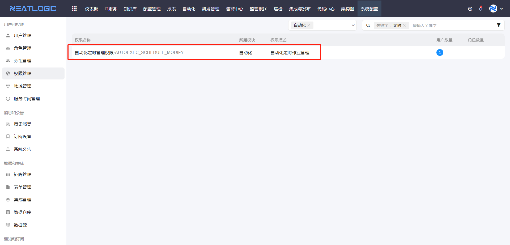
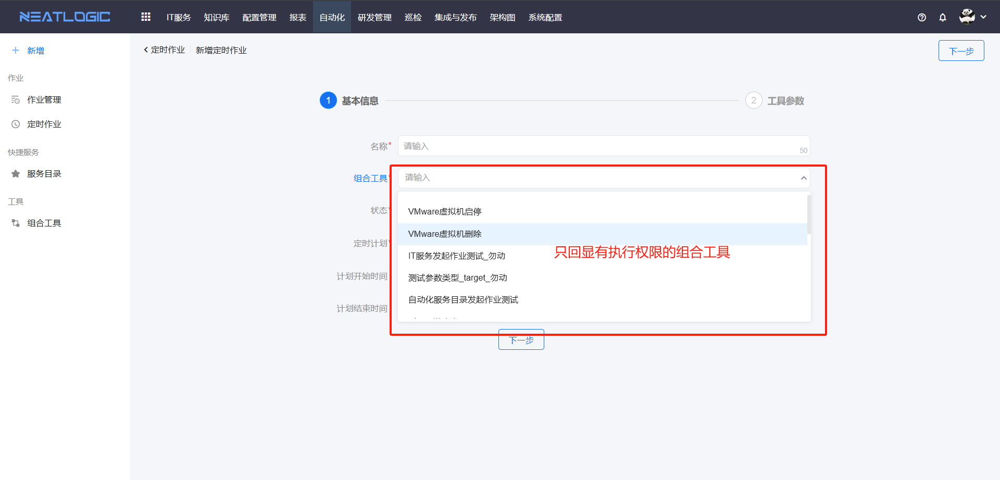
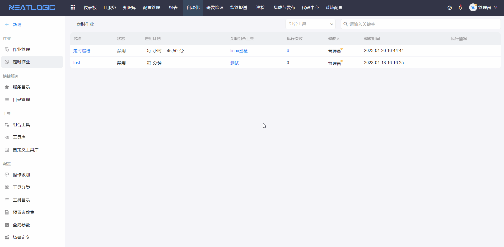
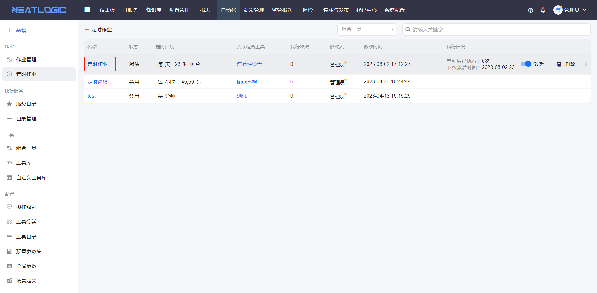
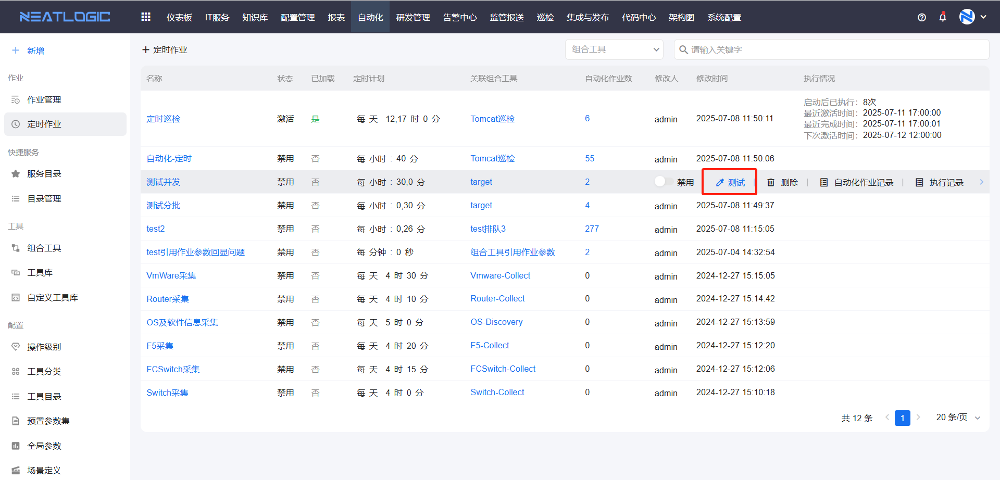
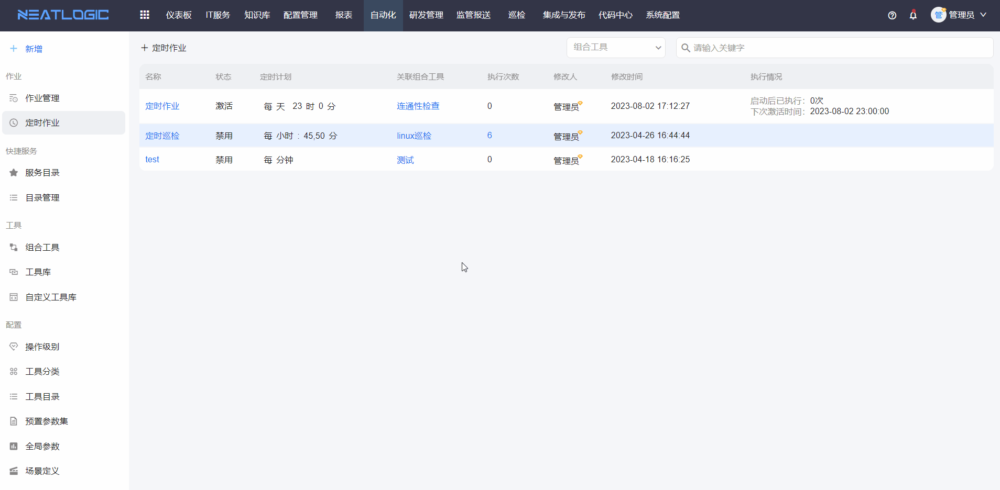
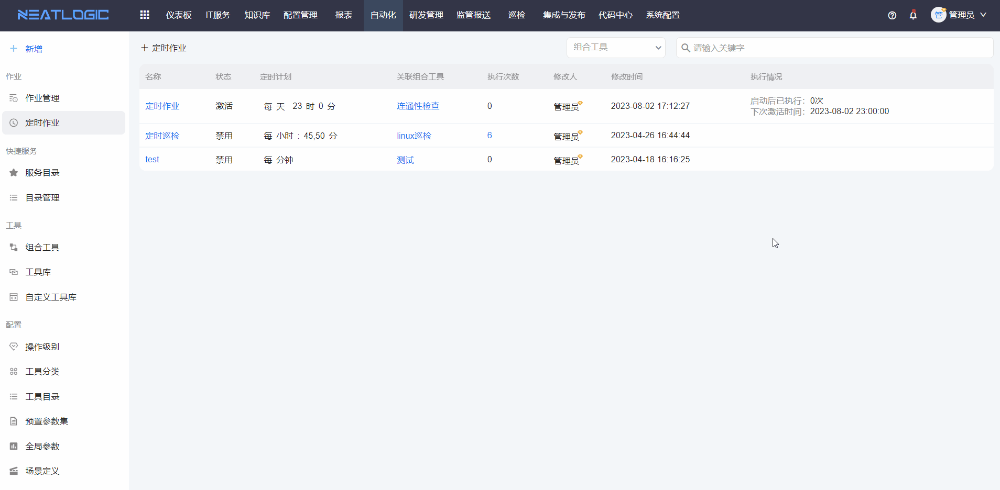

# 定时作业

定时作业用于按计划自动发起组合工具作业。管理员可以关联组合工具和定时器，并预设作业参数、执行目标、执行账号等配置。保存并激活后，系统会按照定时器规则定时发起作业。

## 阅读路径

可根据当前要解决的问题选择阅读入口。

- 如果需要了解访问定时作业菜单需要哪些权限，阅读“权限”。
- 如果需要创建定时作业，阅读“添加定时作业”。
- 如果需要调整已有定时作业，阅读“编辑定时作业”。
- 如果需要验证定时作业能否正常发起，阅读“测试”。
- 如果需要查看作业发起记录或失败原因，阅读“执行记录与执行日志”。

## 权限

**操作权限**
- 配置：系统配置-[用户管理](../../100.系统配置/1.用户和权限/用户管理.md)-授权-自动化定时管理权限
- 包含操作：访问定时作业菜单，新增、编辑、删除和维护定时作业
- 配置人员：系统超级管理员

拥有自动化定时管理权限的用户访问自动化模块时，才能看到定时作业菜单。

**组合工具执行权限**
- 配置：[组合工具](../工具/组合工具.md)-执行权限
- 生效方式：定时作业需要关联组合工具，组合工具下拉框仅显示当前用户可执行的组合工具。
- 影响范围：定时作业列表中提供测试按钮，只有拥有关联组合工具执行权限的定时作业，当前用户才能执行测试操作。

## 添加定时作业

添加定时作业时，需要选择组合工具和定时器，并配置作业参数、执行目标和执行账号等信息。

配置完成后，可先保持未激活状态进行测试；确认可以正常发起作业后，再激活定时作业。

## 编辑定时作业

点击定时作业标题，可进入编辑页面。修改配置并保存后，新配置会用于后续定时触发的作业。

## 测试

定时作业保存后，在未激活状态下，可以通过测试操作验证是否能够正常发起作业。

测试适合在正式启用前检查组合工具、参数、执行目标和执行账号是否配置正确。

## 执行记录与执行日志

**执行记录**：记录定时作业已发起的作业数据。点击作业标题，可查看对应作业详情。

**执行日志**：记录定时作业每次触发的执行结果。执行异常时，可查看错误日志辅助排查。

