# 自动化作业
自动化作业支持手动发起作业和定时发起作业两种方法。

手动发起作业的来源类型主要分成[组合工具](../组合工具/组合工具.md)发起作业、工具测试、人工巡检、发起发布作业、IT服务触发、自动发现触发，本文只介绍组合工具发起作业，工具测试作业请参考[工具库](../工具库/工具库.md)和[自定义工具库](../自定义工具库/自定义工具库.md)。

定时作业包括定时巡检、定时发布、组合工具定时作业。本文只介绍组合工具的定时作业，定时巡检和定时发布参考巡检和发布模块。

## 手动发起作业
组合工具发起作业的入口有两个，一个是快速发起入口，一个是组合工具的发起入口。

### 快速发起入口
自动化模块左上方有添加作业的快速入口，点击新增并选择发起作业的组合工具，完成发起作业操作即可。
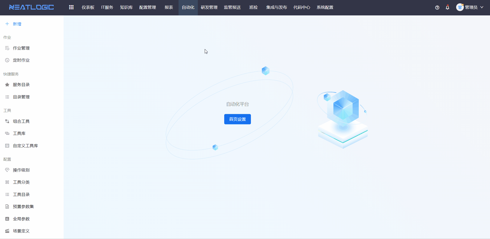

### 组合工具发起作业入口
组合工具发起作业的入口：
* 1、组合工具管理页-组合工具上的添加作业操作。
* 2、组合工具详情页的添加作业操作。

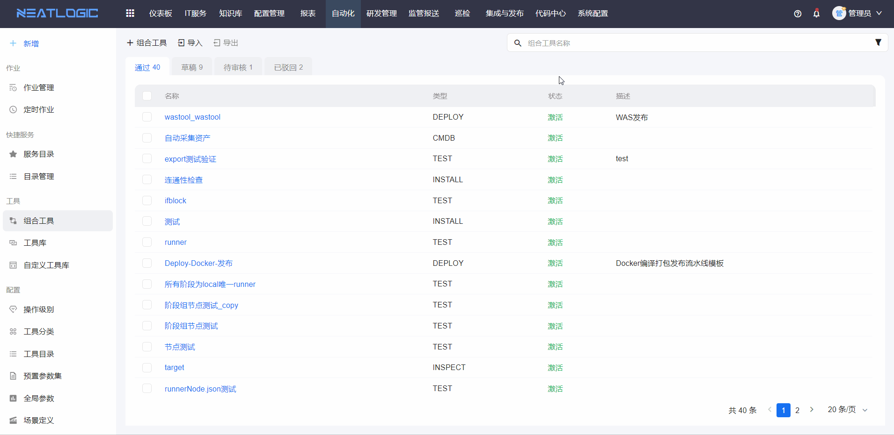

## 定时作业
定时作业页面是通过关联组合工具和定时器，并预设好作业的参数、执行目标、执行账号等配置，然后系统自动按照定时器规则定时发起作业。

### 添加定时作业
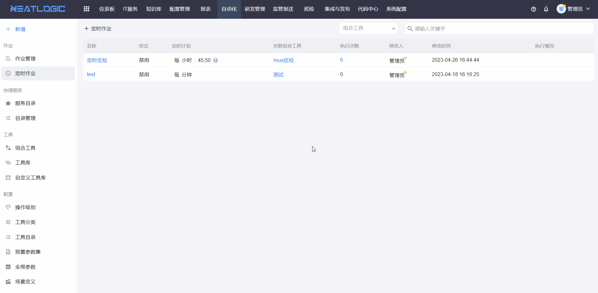

### 编辑定时作业
点击定时作业标题，跳转到编辑页面，修改并保存即可。
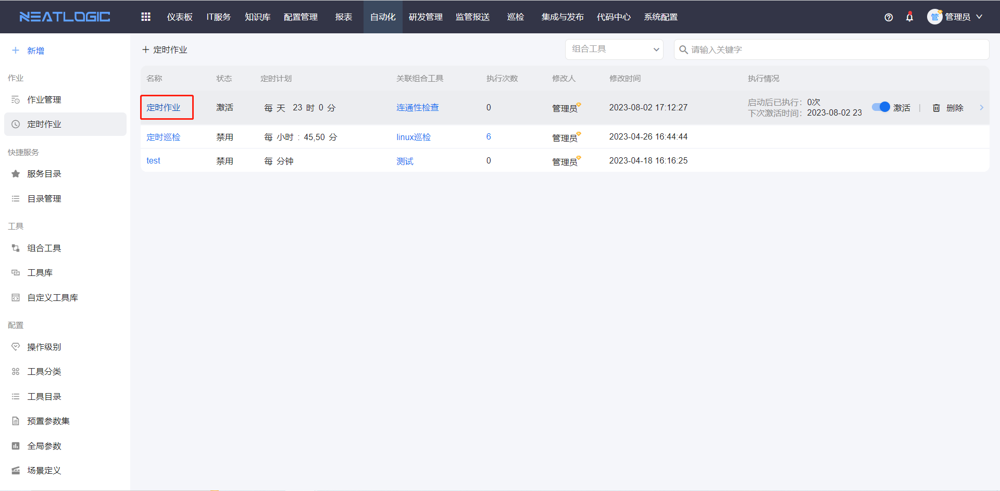

### 执行记录、执行日志
执行记录：记录所有执行作业数据，点击作业标题可查看作业详情。
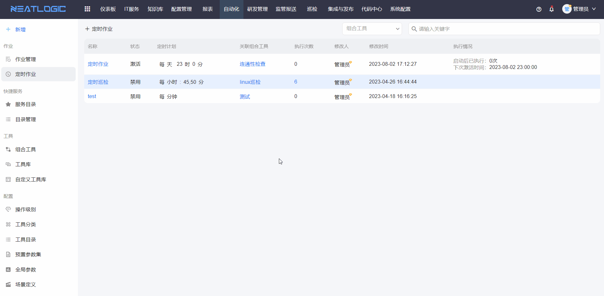
执行日志：记录所有执行次数的执行结果，可查看错误日志。
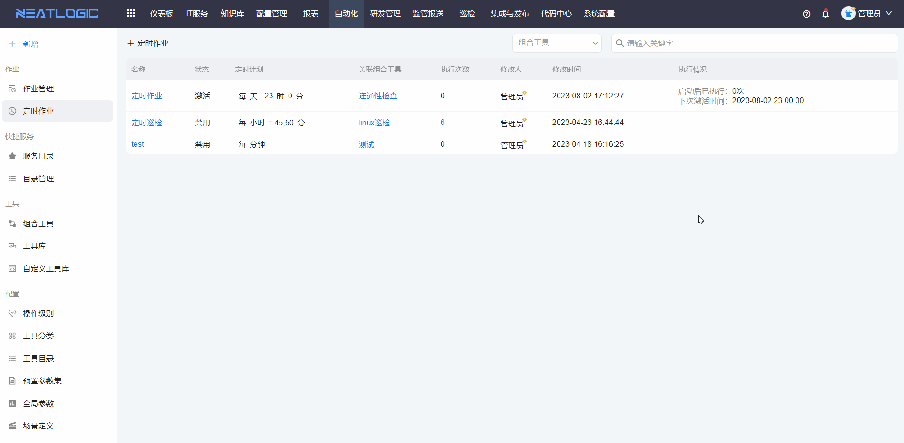

## 作业管理
作业管理页面汇总了所有的途径发起的自动化作业。

### 管理页
作业管理页可按需搜索作业，支持编辑作业计划时间和执行方式，执行、撤销和删除作业等操作。

* 搜索
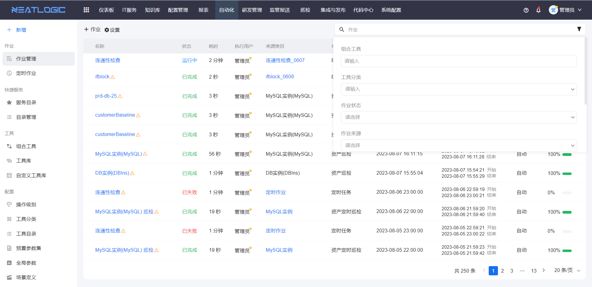
* 编辑计划时间和执行方式，仅未开始执行的作业可修改。

* 撤销，未开始的作业可操作
  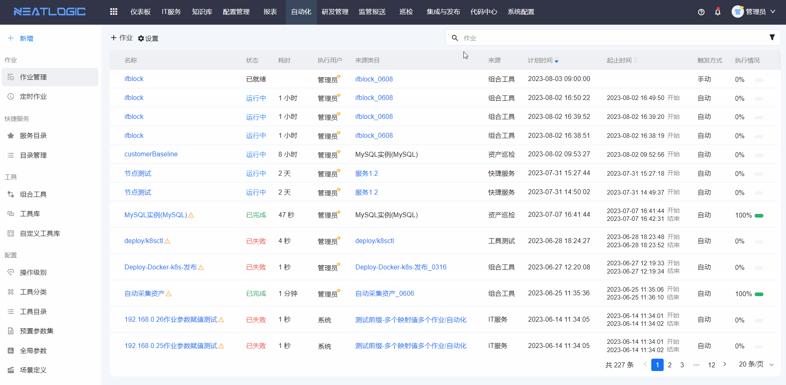
* 执行，未开始的作业可操作
  
* 删除，删除作业
  
### 详情页
在作业管理页，点击作业标题，跳转到到作业详情页面，如图。
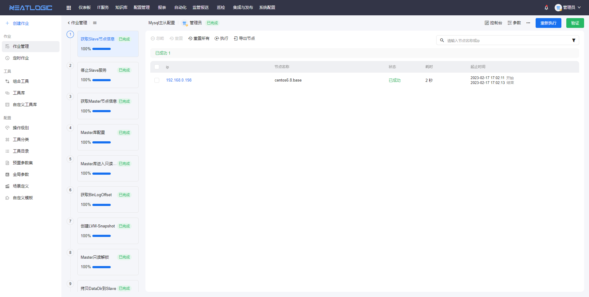
在作业层面，支持执行、撤销、接管、暂停、中止、验证和重新执行作业，作业全过程支持查看控制台、执行器和作业参数。
* 作业状态为未开始、已就绪，可进行执行和撤销操作。
  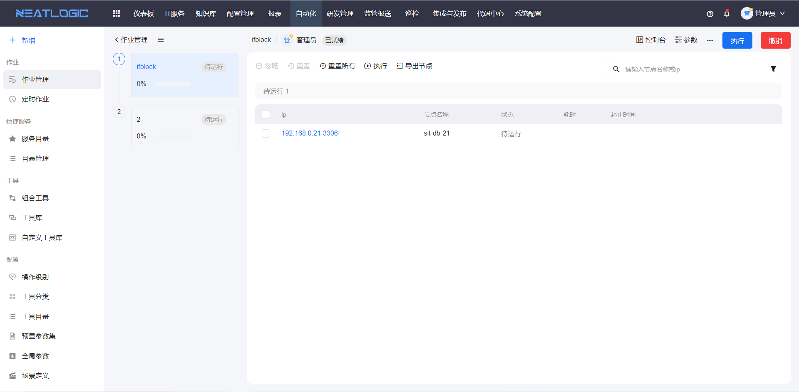
* 作业状态为进行中，可进行暂停、中止操作。
  
* 作业状态为已完成，可进行重新执行作业、验证操作。
  
* 已失败、已中止、已暂停的作业，执行人都可重新执行作业。
* 接管：当前登录人不是作业的执行人，但是有作业执行权限，可接管作业，接管后，才能对作业进行操作。

在阶段层面，分远程执行和本地执行两张情况。
* 远程执行：阶段的节点支持重置、执行和忽略等操作。 
  重置，将节点状态重置为“待运行”，重新执行作业或阶段时，可重新执行重置的节点。 
  忽略，将节点状态标为“已忽略”，重新执行作业或阶段时，会忽略该节点。
  
  点击节点ip,可查看节点执行情况，包括脚本运行日志、输入参数、输出参数和运行记录。
  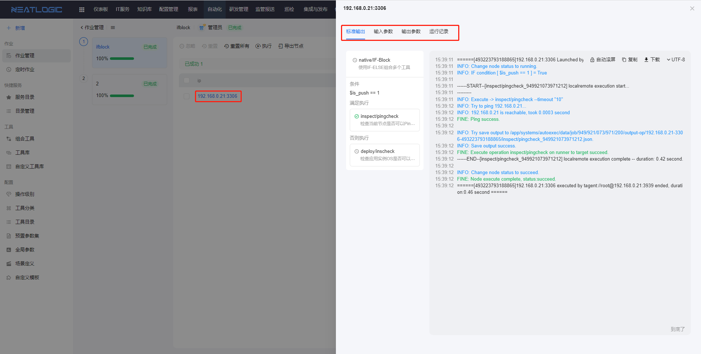
* 本地执行：脚本支持忽略、执行等操作，可查看整个阶段的输入参数、输出参数和运行记录。
  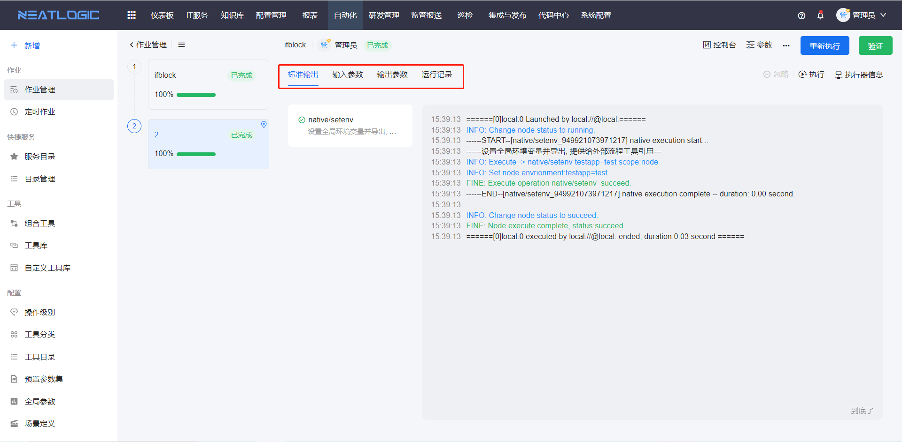
