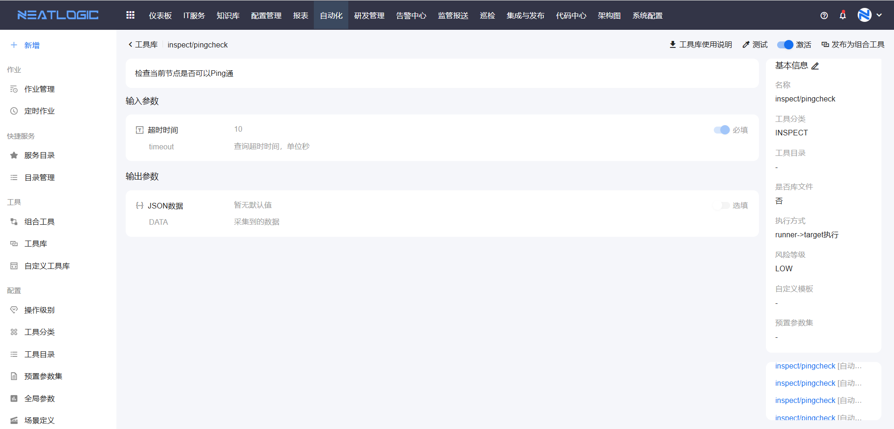
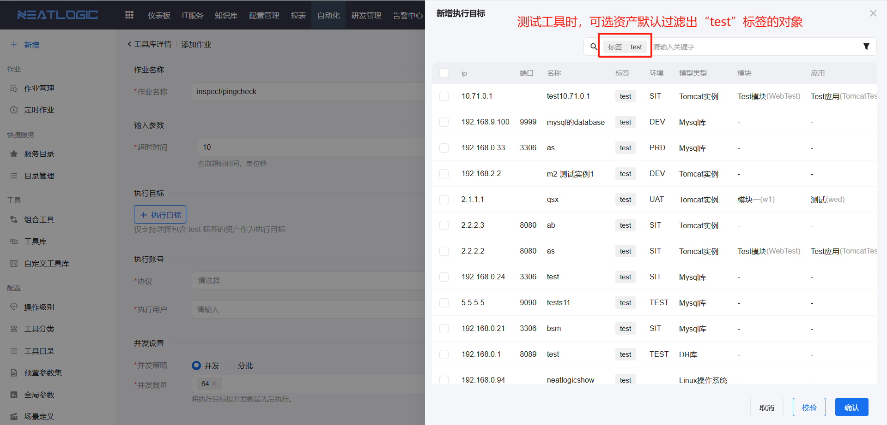
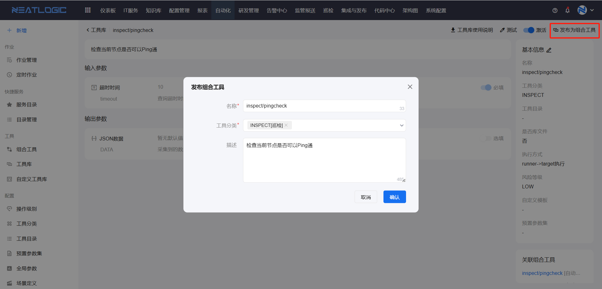

# 工具库

工具库用于查看系统内置工具。该页面不支持新增、编辑和删除工具，主要提供工具详情查看、工具测试和发布为组合工具等能力。

系统内置工具适合用于常见自动化场景。若单个工具已经能满足执行需求，可以直接测试工具；若需要将工具开放给用户发起作业，可以发布为组合工具。

## 阅读路径

可根据当前要解决的问题选择阅读入口。

- 如果需要了解工具库可执行哪些操作，阅读“权限”。
- 如果需要查看工具用途、参数和关联情况，阅读“工具详情”。
- 如果需要验证工具脚本是否可正常执行，阅读“测试工具”。
- 如果需要把单个工具提供为可发起的作业入口，阅读“发布为组合工具”。

## 权限

**操作权限**
- 配置：系统配置-[用户管理](../../100.系统配置/1.用户和权限/用户管理.md)-授权-工具、自定义工具查看权限
- 包含操作：访问工具库菜单，查看工具详情
- 配置人员：系统超级管理员

**操作权限**
- 配置：系统配置-[用户管理](../../100.系统配置/1.用户和权限/用户管理.md)-授权-工具、自定义工具维护权限
- 包含操作：查看、编辑、复制和测试工具
- 配置人员：系统超级管理员

**操作权限**
- 配置：系统配置-[用户管理](../../100.系统配置/1.用户和权限/用户管理.md)-授权-工具、自定义工具管理权限
- 包含操作：执行工具库相关的全部管理操作
- 配置人员：系统超级管理员

> 用户拥有上述任意一个权限时，自动化模块中会显示“工具库”入口。具体可操作按钮以当前用户权限和页面实际配置为准。

## 工具详情

点击工具卡片，可进入工具详情页面。

工具详情用于查看工具描述、输入参数、输出参数、工具基本信息和关联组合工具。查看详情时，建议重点确认工具用途、执行方式和参数含义，避免测试或发布时选择错误的执行目标。

## 测试工具

测试工具用于通过测试作业验证工具脚本是否可以正常执行。

点击工具上的测试按钮后，可发起测试作业。若测试工具需要远程执行，执行目标范围为带有 `test` 标签的资产对象。资产标签的配置方式可参考[资产清单](../资源中心/资产清单.md)。

## 发布为组合工具

当一个脚本工具已经可以独立完成操作时，可以将该工具一键发布为组合工具。

通过工具库发布生成的组合工具不能编辑，只允许发起作业。该方式适合快速把单个内置工具开放为可执行入口；如果需要编排多个工具、阶段、参数或执行策略，建议在[组合工具](组合工具.md)中单独配置。

