# 组合工具

多个阶段组按顺序组合成一个组合工具。组合工具是自动化流程的最小发布单元，原子工具必须添加到阶段中才能执行。组合工具内的阶段组按照配置顺序依次执行。

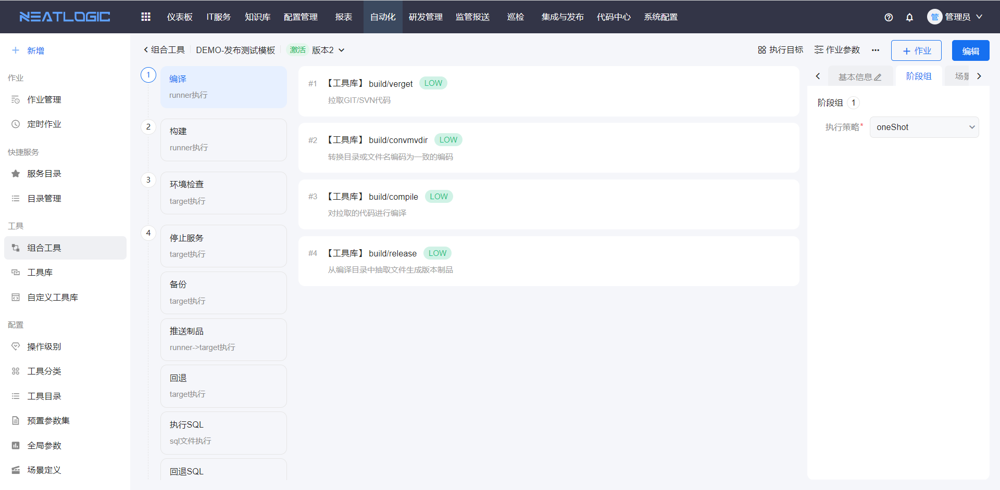

## 阅读路径

可根据当前要完成的操作选择阅读入口。

- 如果需要了解组合工具的访问和操作权限，阅读“权限”。
- 如果需要创建、编辑或管理组合工具，阅读“管理页”。
- 如果需要配置阶段、工具和参数，阅读“组合工具详情”。
- 如果需要配置执行目标、执行器组和并发策略，阅读“执行目标”。
- 如果需要配置失败通知或资产操作范围，阅读“失败通知”和“操作类型”。

## 权限

组合工具的权限分为系统层权限、组合工具数据权限和审核权限。

系统层权限在系统配置-[用户管理](../../100.系统配置/1.用户和权限/用户管理.md)-授权中配置。组合工具数据权限在组合工具基本信息的权限设置中配置。

### 系统层权限

| 权限 | 可执行操作 |
|:--|:--|
| 组合工具查看权限 | 查看组合工具菜单 |
| 组合工具新建权限 | 查看组合工具菜单，新增、复制、导入和导出组合工具 |

### 组合工具数据权限

数据权限控制单个组合工具的可见范围和可执行操作。

| 权限 | 可执行操作 |
|:--|:--|
| 维护人权限 | 查看、编辑和执行组合工具 |
| 查看权限 | 查看组合工具。缺少某个组合工具的查看权限时，该组合工具不会显示在列表中 |
| 编辑权限 | 查看组合工具详情时显示编辑按钮 |
| 执行权限 | 在管理页和详情页使用执行按钮 |

### 审核权限

审核权限用于审批组合工具。

组合工具的审核权限由其引用的[工具分类](../配置/自动化配置.md)决定。工具分类可以设置审核授权对象，被授权的用户才能审批引用该工具分类的组合工具。

## 管理页

组合工具管理页支持添加、编辑、复制、导入、导出组合工具，查看引用列表，添加作业和查看执行记录。

复制组合工具时，系统只复制当前组合工具的已通过版本。

组合工具根据审核状态分为已通过、草稿、待审核和已驳回：

- **草稿**：已保存但尚未提交审核的组合工具，可以重新编辑并提交审核。
- **待审核**：已提交审核但尚未完成审核的组合工具，只有拥有审核权限的用户可以审批。
- **已通过**：审核通过的组合工具，可以正常使用。
- **已驳回**：审核未通过的组合工具，可以重新编辑并提交审核。

- **草稿**

- **待审核**

- **已驳回**

## 组合工具详情

组合工具由多个阶段组串联组成。每个阶段组包含多个阶段，阶段中可以添加一个或多个工具。组合工具是自动化流程的最小发布单元，脚本工具必须添加到阶段中才能执行。

组合工具详情页支持只读模式和编辑模式。

打开组合工具详情页时，默认进入只读模式。点击“编辑”后可以修改组合工具配置；在编辑模式下点击“取消”，可以放弃本次修改并返回只读模式。

### 作业参数

组合工具的作业参数可以被阶段中的工具引用。配置执行目标时，也可以引用“节点信息”类型的作业参数。

- **工具参数引用作业参数**

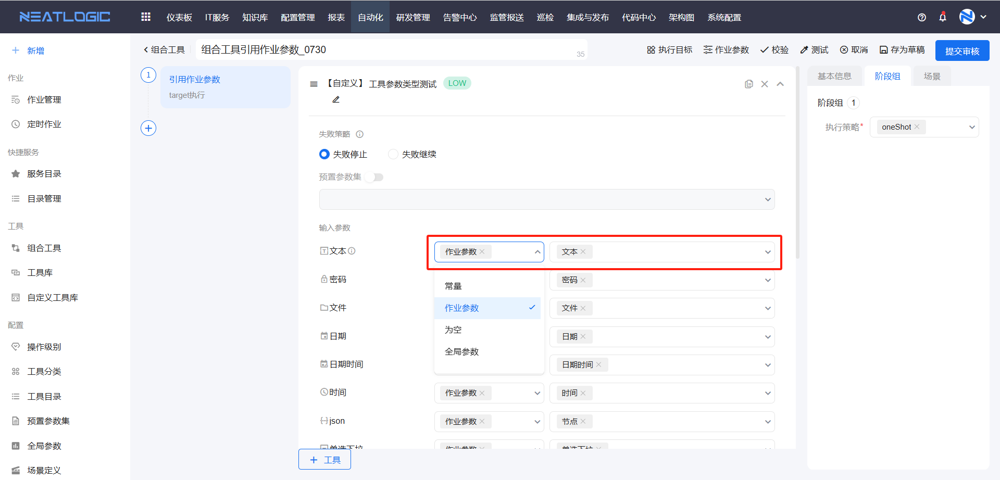

- **执行目标引用工具参数**

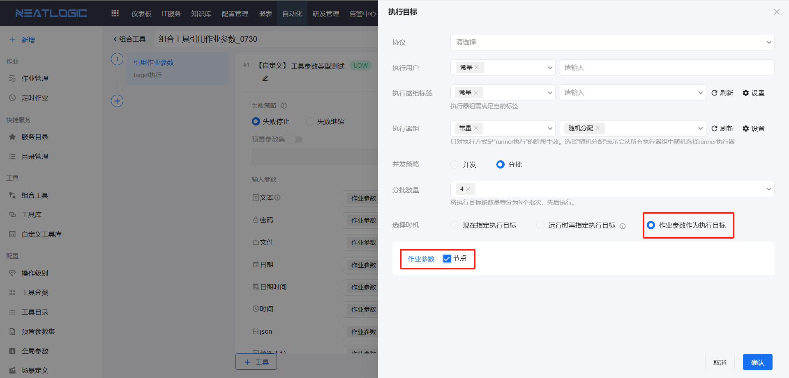

- **执行用户、执行器组和执行器组标签引用工具参数**

执行用户只支持文本类型的参数，执行器组和执行器组标签只支持对应类型的参数。

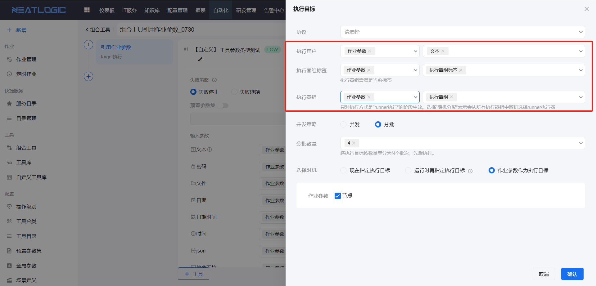

### 阶段组和阶段
阶段组由多个阶段并联组成。阶段组内的阶段可以并行执行，也可以根据执行目标节点分批执行。

并行执行方式为 `oneShot`。分批执行方式为 `grayScale`：系统将执行目标节点分成多批，每批节点依次执行阶段组内的阶段；当前批次执行完成后，再启动下一批节点。

点击阶段上的“添加”按钮，可以新增与当前阶段处于同一阶段组的阶段。同一序号下的阶段属于同一个阶段组，阶段组内的阶段支持拖动排序。

阶段由多个工具串联组成。同一阶段内的工具按照配置顺序依次执行。

如果一个阶段配置了多个执行目标节点，系统可以将这些节点分批执行。同一个节点上的工具按照配置顺序执行。

阶段支持添加、编辑和删除。阶段配置包括名称、执行方式和预设执行目标。

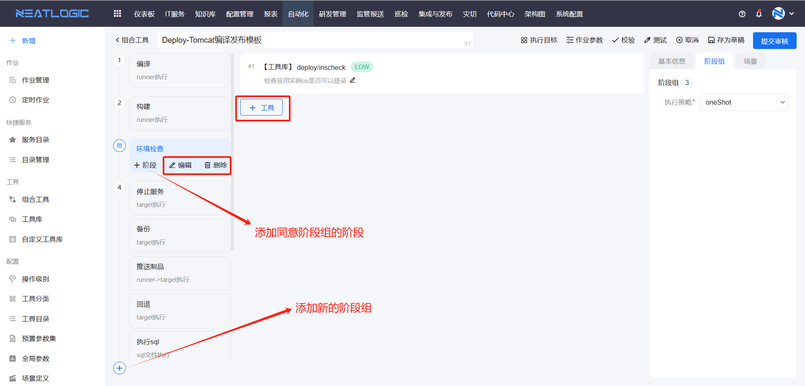

### 工具

工具按照开发方式分为内置工具和自定义工具，分别来自[工具库](工具库.md)和[自定义工具库](自定义工具库.md)。

**内置工具**：随自动化调度工具版本一起发布，主要用于提供相对固定的基础能力，例如参数聚合、参数抽取、环境变量设置、条件分流、文件拷贝、文件处理和简单自定义脚本执行等。

**自定义工具**：由自定义工具库统一管理，可以是自定义脚本、库或软件包，主要用于完成具有特定业务需求的非标准化任务。自定义工具支持导入和导出，可以配合 Git 或 SVN 管理相关脚本。

工具和自定义工具支持配置输入参数、输出参数和自由参数。

#### 输入参数

工具中定义的输入参数支持以下 7 种映射方式：常量、作业参数、上游节点输出参数值、上游节点输入参数名、为空、预置参数集和全局参数。

- **常量**：由管理员直接填写参数值，发起作业时不能修改。
- **作业参数**：引用作业参数的值，发起作业时可以填写参数值。
- **上游节点输出参数值**：当前工具所在阶段存在上游阶段或前置工具时，可以引用上游节点工具的输出参数。引用的参数类型必须一致。
- **上游节点输出参数名**：当前工具所在阶段存在上游阶段或前置工具时，可以引用上游节点工具的输出参数。该方式不限制参数类型。
- **为空**：参数值为空，仅非必填参数支持使用该映射方式。
- **预置参数集**：启用关联[预置参数集](../配置/自动化配置.md)的工具参数后，可以引用预置参数集中的参数。
- **全局参数**：引用全局参数的值作为当前参数值。

#### 输出参数

工具中定义的输出参数会在组合工具编辑页面中回显，但不能在组合工具中修改。

#### 自由参数

自由参数用于在脚本执行过程中传入参数值。自由参数的参数名必须与脚本中定义的参数名一致。

### 执行方式

根据执行位置和连接方式，工具分为以下 4 类：runner 节点执行、target 节点执行、runner_target 执行和 SQL 执行。

| 执行方式 | 唯一名 | 插件特点 | 概要描述 |
|:--|:--|:--|:--|
| runner 节点执行 | `runner` | 需要安装第三方介质，或依赖较重的操作系统环境，例如网段扫描、编译和构建等 | 在 Neatlogic-runner 节点上执行，也称为本地执行 |
| runner 到远端目标执行 | `runner_target` | 需要安装第三方介质，或需要在执行节点上安装较重的操作系统依赖；插件还需要动态获取目标节点的 IP、端口、账号和密码等参数 | 在 Neatlogic-runner 节点上执行，并连接远端目标节点 |
| 远端目标节点执行 | `target` | 依赖较少或依赖简单，例如操作系统采集 | 在目标节点上执行 |
| SQL 执行 | SQL 执行 | 用于执行数据库脚本 | 在 runner 节点上执行 |

### 执行目标

执行目标配置包括连接协议、执行用户、执行器规则、并发策略、选择时机和筛选方式。

#### 连接协议

连接协议可以在阶段或组合工具的执行目标中预设，也可以在发起作业时指定。

系统支持常见连接协议，包括 SSH、HTTP、数据库、[Tagent](../Tagent服务/Tagent服务.md)、SNMP 和 IPMI 等。连接协议的数据来源于资源中心的[账号管理](../资源中心/账号管理.md)。

#### 执行用户

执行用户是作业通过连接协议访问目标机器时使用的用户名。该用户名必须与资源配置中账号的用户名一致。

执行用户支持填写常量，也支持引用作业参数。

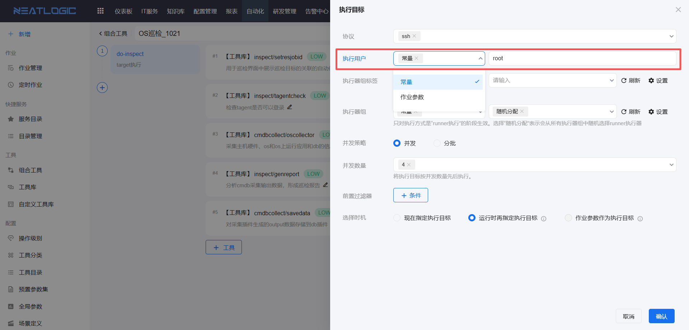

#### 执行器规则配置

执行器规则配置用于为 runner 执行类型的阶段分配执行器。配置内容包括执行器组标签和执行器组，数据来源于[执行器组管理](../../100.系统配置/5.Agent 和 Runner/执行器组管理.md)。

- **执行器组标签**：执行器组的标签。发起作业时，系统会根据选择的标签匹配执行器组。如果选择的执行器组不包含预设标签，作业将无法保存。
- **执行器组和执行器组标签**：支持选择常量组，也支持引用作业参数。

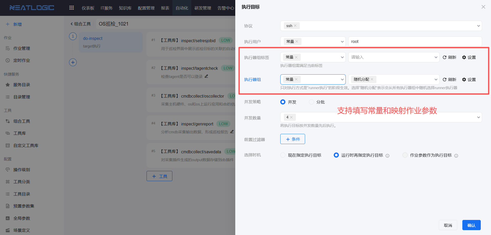

runner 执行的阶段和执行目标都可以配置执行器规则。阶段配置优先级更高；如果阶段未配置，则使用组合工具执行目标中的配置。

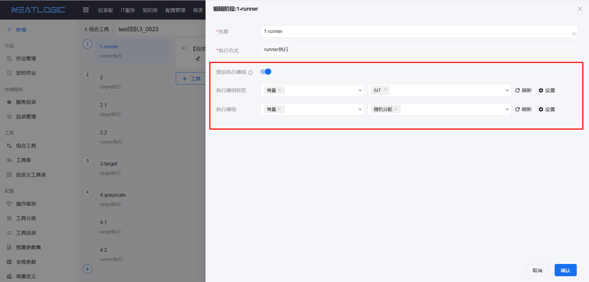

#### 并发策略

远程执行阶段时，系统会按照并发策略分批执行目标节点。并发策略包括并发和分批两种。

- **并发**：设置并发节点数量。系统根据目标节点总数和并发数计算执行批次。如果选择并发策略但未设置并发数，默认并发数为 32。

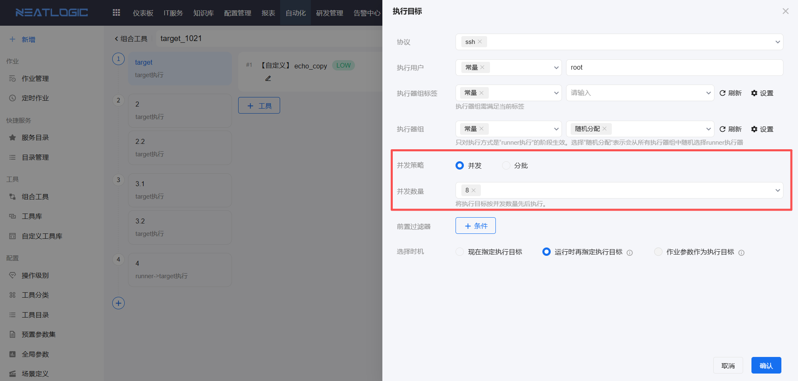

- **分批**：设置执行批次。系统根据目标节点总数和批次数计算每批的并发数。如果选择分批策略但未设置批次数，默认批次数为 64。

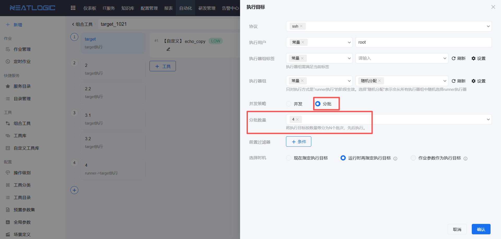

#### 前置过滤器

前置过滤器用于预设执行目标的过滤条件，只有满足条件的执行节点才会参与作业。

全局执行目标和阶段都支持配置前置过滤器。阶段未配置前置过滤器时，继承全局执行目标的条件；阶段的筛选方式可以不填写。

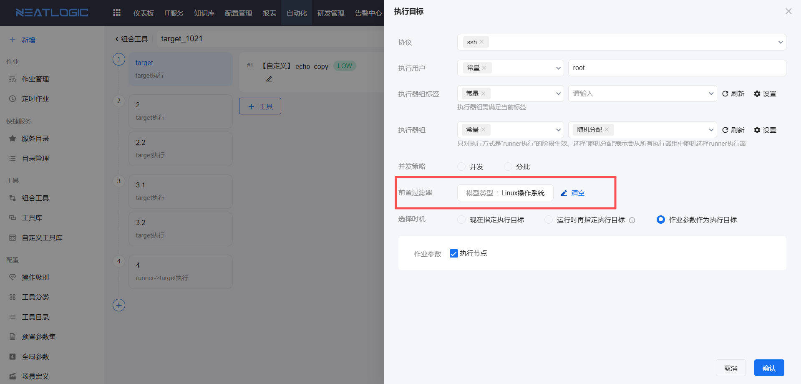

如果阶段配置了前置过滤器，则优先使用阶段的过滤条件，并且必须填写筛选方式。筛选方式支持过滤器、节点、输入文本、作业参数和上游参数。上游参数不适用于第一个阶段。

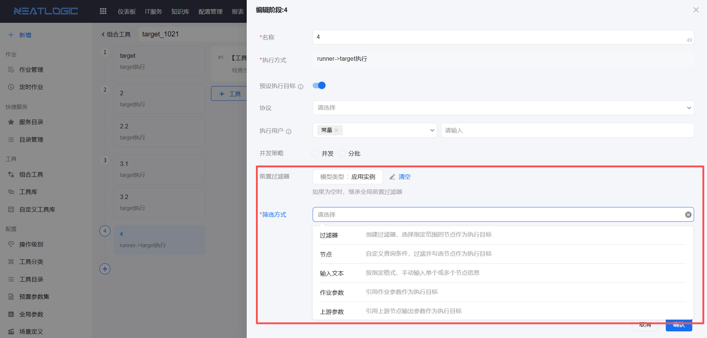

#### 选择时机

全局执行目标支持以下 3 种选择时机：

- **现在指定执行目标**：在组合工具配置中直接指定执行目标。
- **运行时再指定**：发起作业时再指定执行目标。
- **作业参数作为执行目标**：引用“节点信息”类型作业参数的值作为执行目标。

组合工具预设执行目标的优先级为：阶段组 > 组合工具公共执行目标。

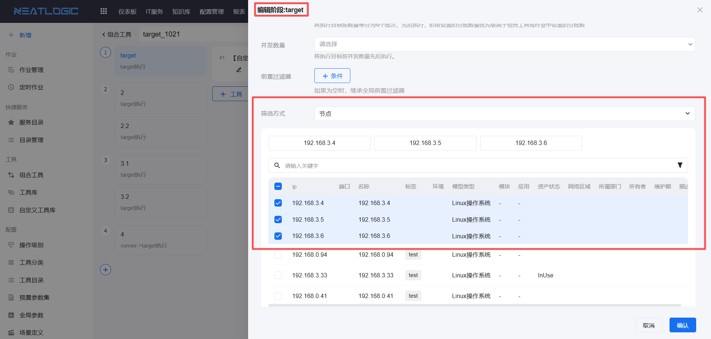

阶段组未预设执行目标时，继承全局执行目标。

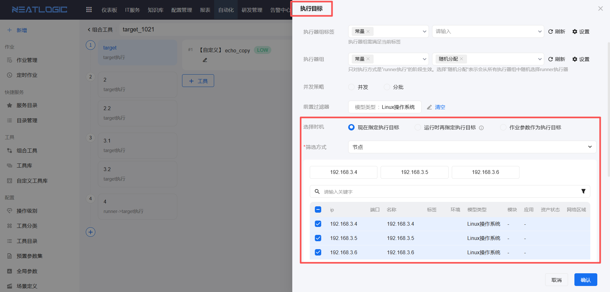

#### 筛选方式

阶段预设执行目标时，可以同时设置前置过滤条件和筛选条件。

筛选条件包括过滤器、节点、输入文本、作业参数和上游参数。筛选条件对应的执行目标必须满足前置过滤器条件。

- **过滤器**：选择搜索条件，过滤结果全部作为执行节点。

- **节点**：直接在资产列表中勾选目标对象作为执行节点。资产数据来自[资产清单](../资源中心/资产清单.md)。

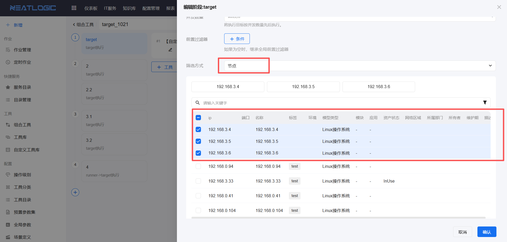

- **输入文本**：在输入框中填写目标 IP，每行填写一个 IP。只有能够在资产列表中匹配到的 IP 才能添加为执行目标。

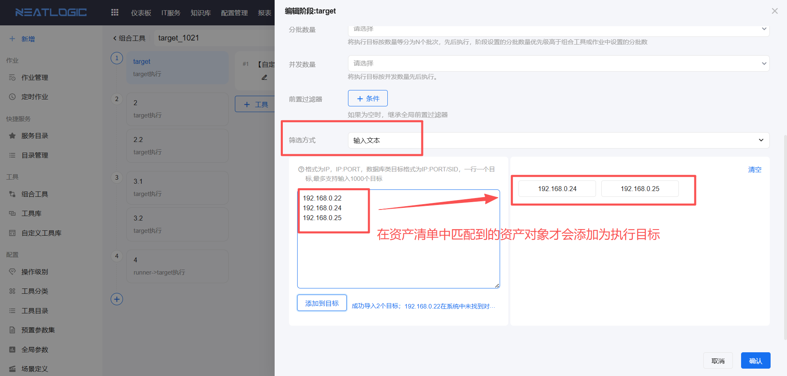

- **作业参数**：引用“节点信息”类型的作业参数。该筛选方式仅支持在阶段和阶段组中配置。

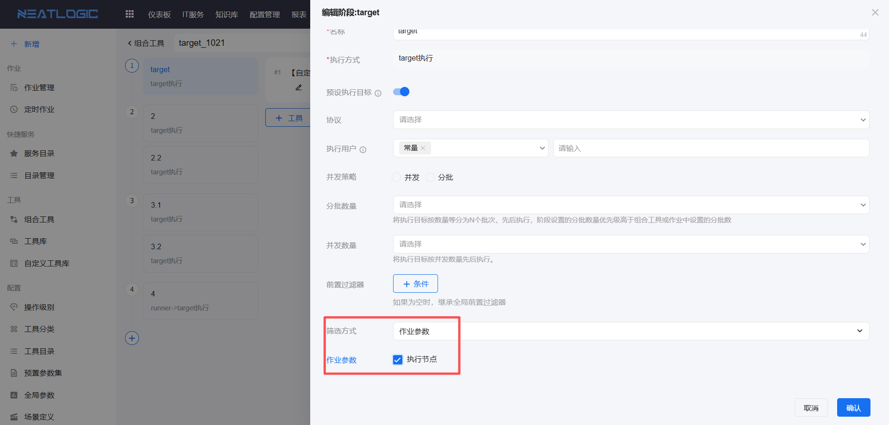

- **上游参数**：引用上游阶段工具的“节点信息”类型输出参数值作为执行目标。

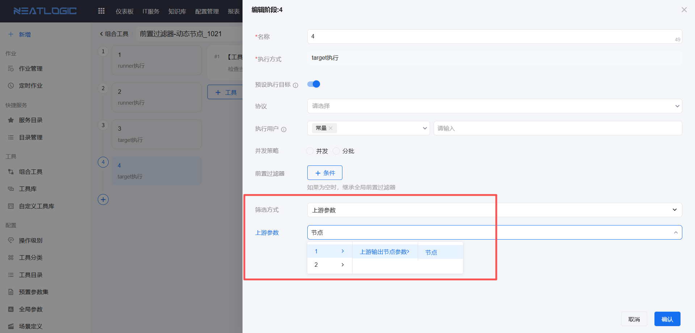

### 失败通知

组合工具基本信息支持配置通知策略。目前仅支持配置作业执行失败通知。

通知策略模板在[通知策略管理](../../100.系统配置/4.通知和订阅/通知策略管理.md)中配置。

### 操作类型

操作类型用于控制用户可以选择的执行目标范围。该功能与系统配置-[系统参数](../../100.系统配置/6.基础服务/系统参数.md)中的 `is.resourcecenter.auth` 变量结合使用。

当变量值为 `1` 时，启用操作类型功能；当变量值为 `0` 时，隐藏操作类型配置，开放全部资产。

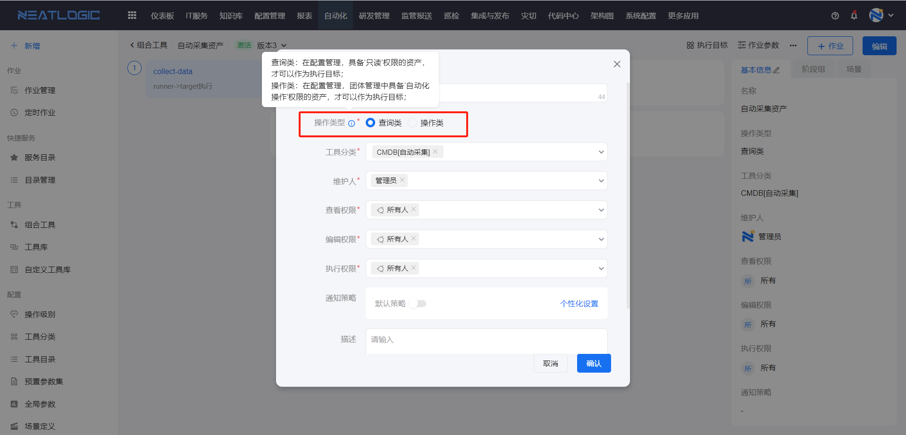

操作类型分为查询类和操作类，具体类型取决于用户在[团体](../../3.配置管理/系统管理/团体管理.md)中拥有的资产权限：

- **查询类**：用户在团体中拥有只读权限的资产，可以作为执行目标。授权模型必须包含构成资产清单的模型。
- **操作类**：用户在团体中拥有自动化操作权限的资产，可以作为执行目标。
