# 自定义工具库
自定义工具库是自定义工具的管理页面，支持自定义添加、编辑、删除、导入、导出等操作。

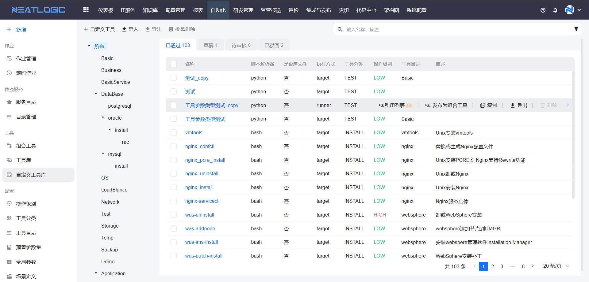

自定义工具库页面根据工具的版本状态分为已通过、草稿、待审核和已驳回：

- **草稿**：已保存但未提交审核的自定义工具，提交审核后状态转为待审核
- **待审核**：已提交审批但未审批的自定义工具，审批后状态转为已通过或已驳回，撤回待审批工具后，打回成草稿
- **已通过**：已经审批通过的自定义工具，生成新版本
- **已驳回**：审批被驳回的自定义工具，不生成新版本，可以重新编辑并提交审核

## 权限说明
自定义工具库的权限分为菜单访问和具体操作控制。

**操作权限**
- 配置：系统配置-[用户管理](../../100.系统配置/1.用户和权限/用户管理.md)-授权-工具、自定义工具查看权限/维护权限/管理权限
- 拥有上述任一权限，可访问自定义工具库菜单。

| 权限 | 可执行操作 |
|:--|:--|
| 工具、自定义工具管理权限 | 添加、编辑、删除、复制、测试、导入、导出、查看自定义工具 |
| 工具、自定义工具维护权限 | 编辑、复制、测试、查看自定义工具 |
| 工具、自定义工具查看权限 | 查看自定义工具详情 |

## 添加自定义工具
添加工具的步骤：发起添加 → 填写工具基本信息 → 创建版本 → 提交审核

**操作权限**
- 配置：系统配置-[用户管理](../../100.系统配置/1.用户和权限/用户管理.md)-授权-工具、自定义工具管理权限
- 包含操作：添加自定义工具、创建版本、提交审核

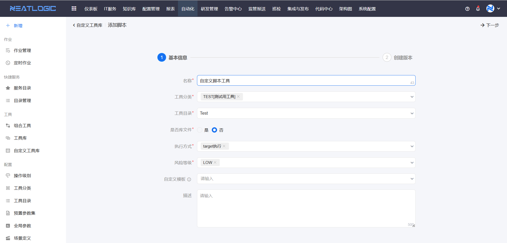
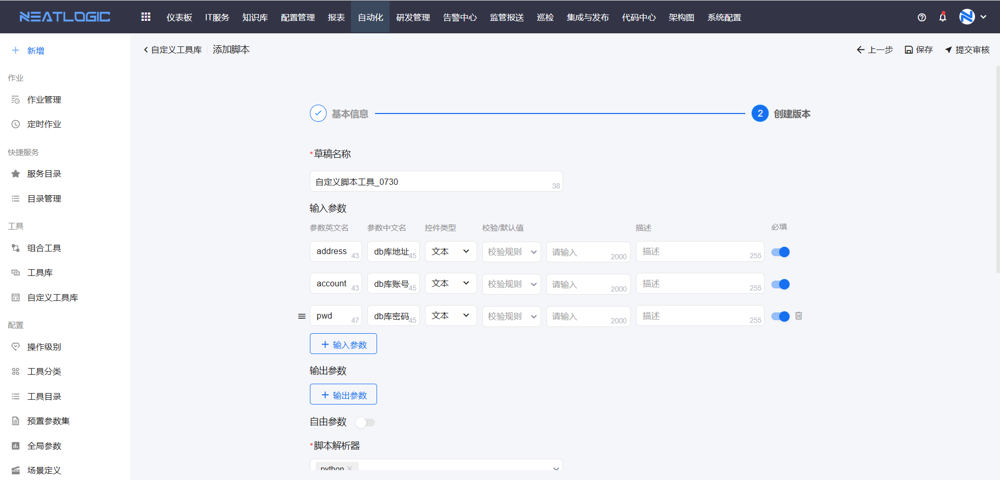

**审批人审核**

**操作权限**
- 配置：[自动化配置](../配置/自动化配置.md)-工具分类-审核授权
- 包含操作：审批待审核的自定义工具版本

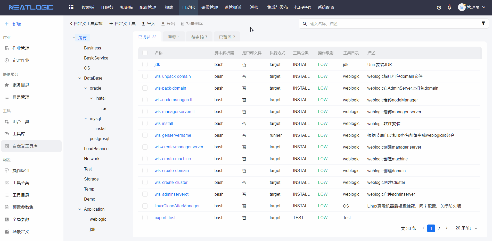

**是否库文件**：当工具被启用为库文件，即可作为别的脚本的依赖工具，且库文件不能单独执行。

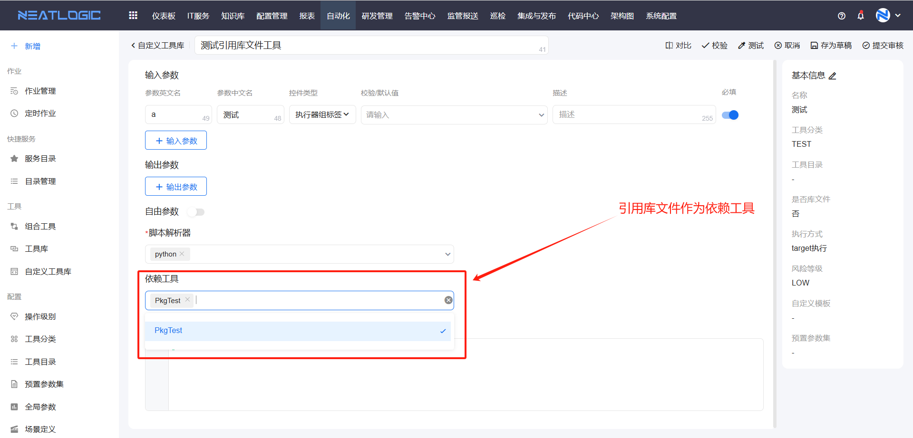

## 编辑工具
编辑工具步骤：查看自定义工具 → 打开编辑模式 → 修改工具设置 → 提交审核

**操作权限**
- 配置：系统配置-[用户管理](../../100.系统配置/1.用户和权限/用户管理.md)-授权-工具、自定义工具维护权限或工具、自定义工具管理权限
- 包含操作：编辑工具、保存草稿、提交审核

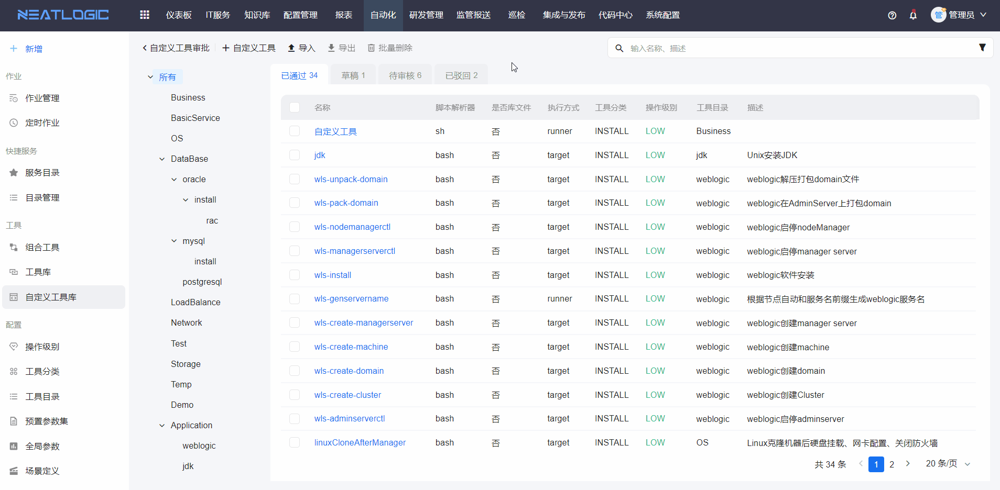

编辑工具后，若不提交，可以点击保存为草稿。

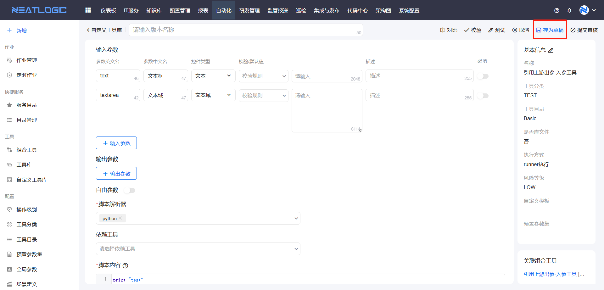

保存成功的草稿可在管理页-草稿列表或在详情页的版本列表中查看。

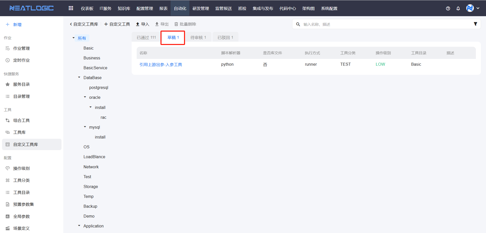
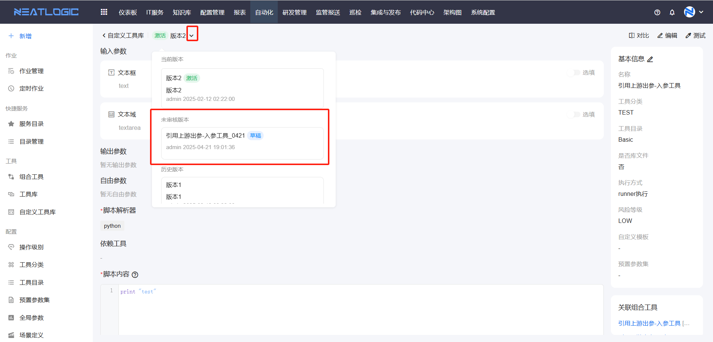

## 查看版本
自定义工具每次审批通过会生成一个新版本，自定义工具详情页面支持查看历史版本，并进行版本对比，可以回退到历史版本。

**操作权限**
- 查看版本：工具、自定义工具查看权限/维护权限/管理权限
- 回退或删除版本：工具、自定义工具管理权限

**查看版本**

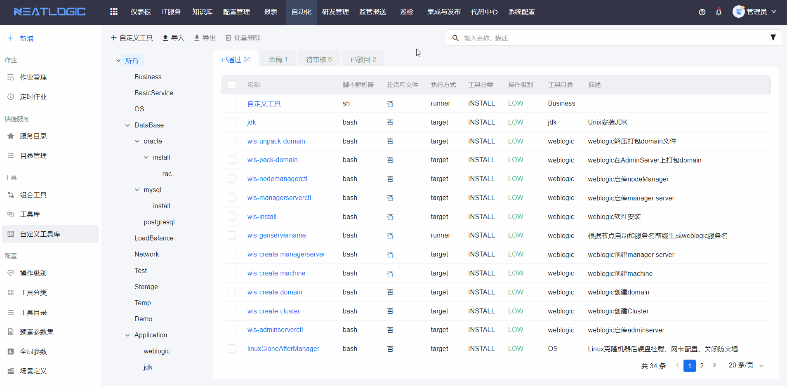

**回退、删除版本**：历史版本才支持回退和删除

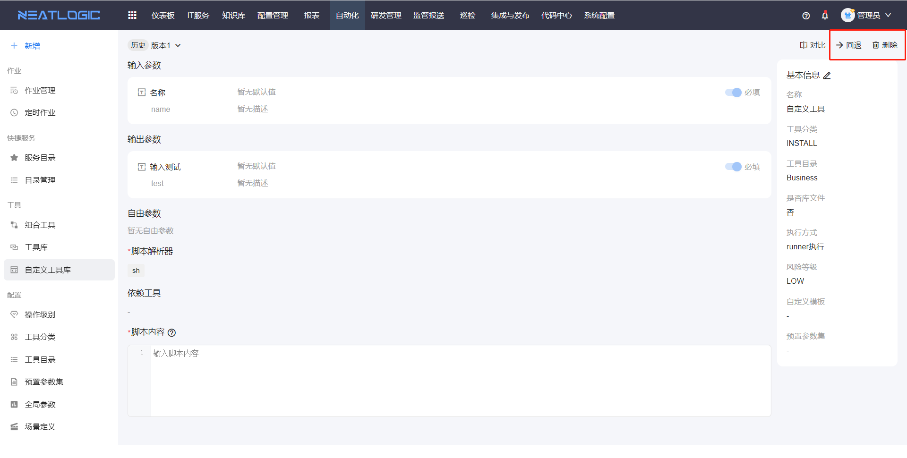

## 测试工具
自定义工具支持通过发起测试作业，验证工具可用性。如果测试的是远程执行的工具，执行目标资产必须是有"test"标签的资产，可在[资产清单](../资源中心/资产清单.md)中为资产打标签。

**操作权限**
- 配置：系统配置-[用户管理](../../100.系统配置/1.用户和权限/用户管理.md)-授权-工具、自定义工具维护权限或工具、自定义工具管理权限
- 包含操作：测试激活版本、测试草稿

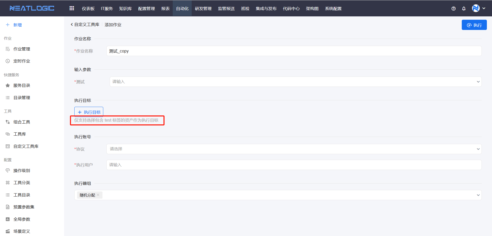

**测试激活版本入口**

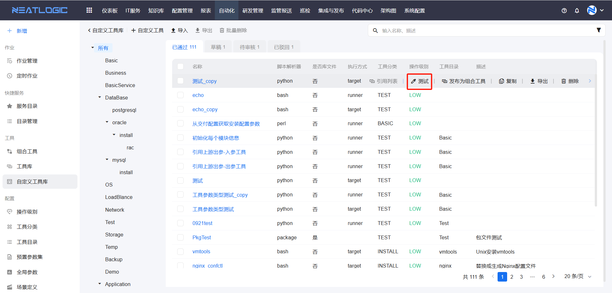
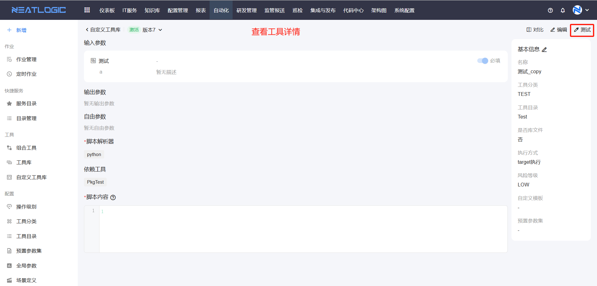

**测试草稿**

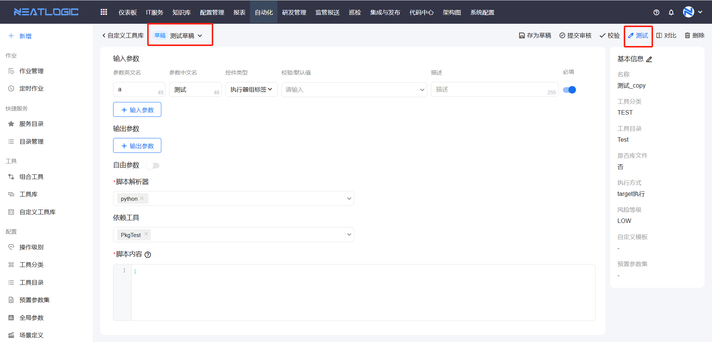

## 发布为组合工具
[组合工具](组合工具.md)只需要用到一个自定义工具时，自定义工具支持一键发布为组合工具，组合工具不能修改。

**操作权限**
- 配置：系统配置-[用户管理](../../100.系统配置/1.用户和权限/用户管理.md)-授权-工具、自定义工具管理权限
- 包含操作：发布自定义工具为组合工具

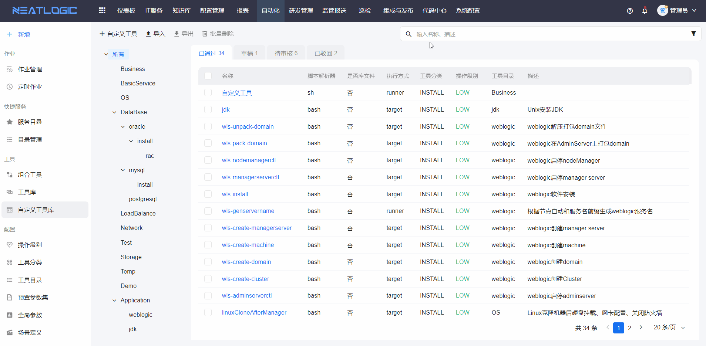

## 复制自定义工具
自定义工具支持一键复制功能，复制工具时，可修改基本信息，脚本无法修改且只复制激活版本。

**操作权限**
- 配置：系统配置-[用户管理](../../100.系统配置/1.用户和权限/用户管理.md)-授权-工具、自定义工具维护权限或工具、自定义工具管理权限
- 包含操作：复制自定义工具

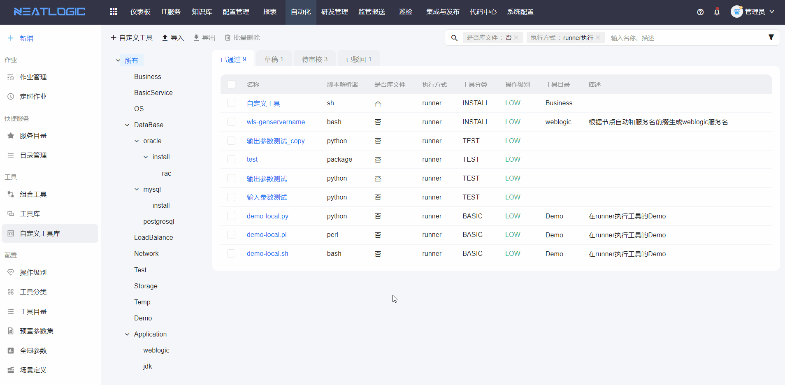

## 删除自定义工具
删除自定义工具的方法包括删除单个工具和批量删除。

**操作权限**
- 配置：系统配置-[用户管理](../../100.系统配置/1.用户和权限/用户管理.md)-授权-工具、自定义工具管理权限
- 包含操作：删除单个工具、批量删除工具

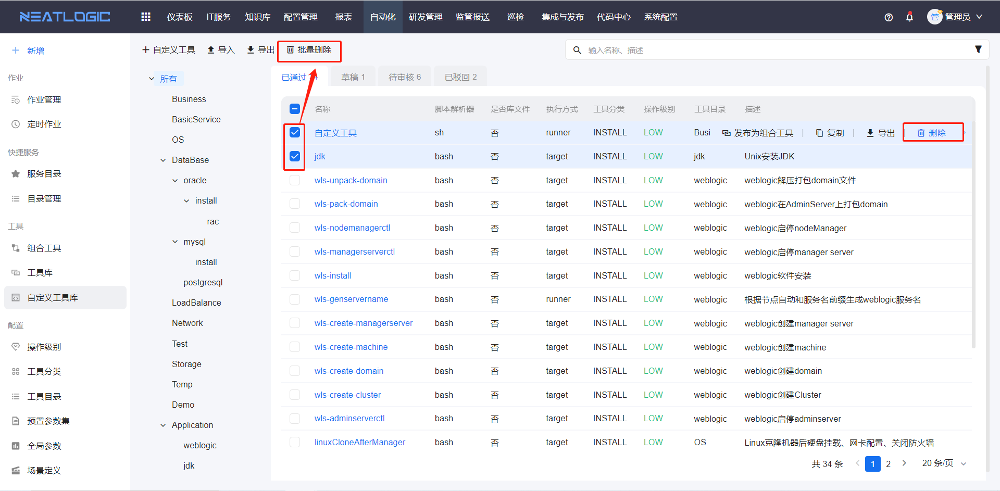

## 搜索
自定义工具支持复合搜索，搜索条件包括关键字、执行方式、工具分类操作级别等。

**操作权限**
- 配置：系统配置-[用户管理](../../100.系统配置/1.用户和权限/用户管理.md)-授权-工具、自定义工具查看权限/维护权限/管理权限

## 导出和导入
导出自定义工具有单个导出和批量导出两种方式。

**操作权限**
- 配置：系统配置-[用户管理](../../100.系统配置/1.用户和权限/用户管理.md)-授权-工具、自定义工具管理权限
- 包含操作：导出单个工具、批量导出工具、导入工具

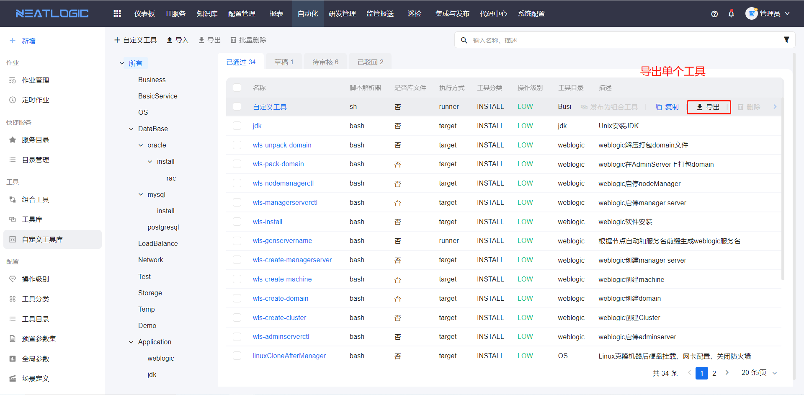
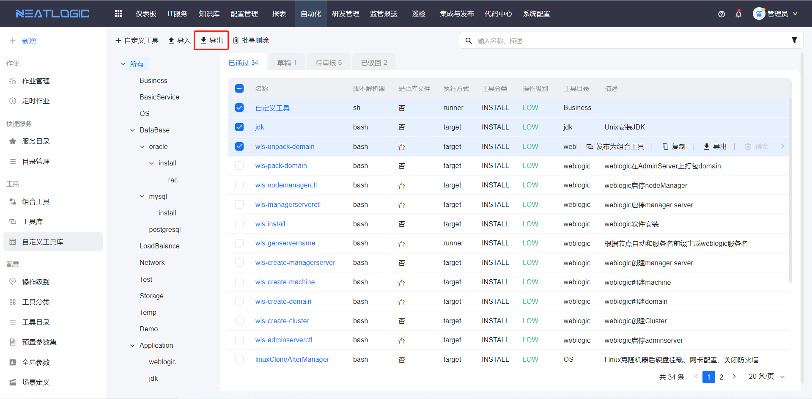

导入工具，上传导入文件并提交导入，工具提交到待审批，再由管理员审批通过即可。

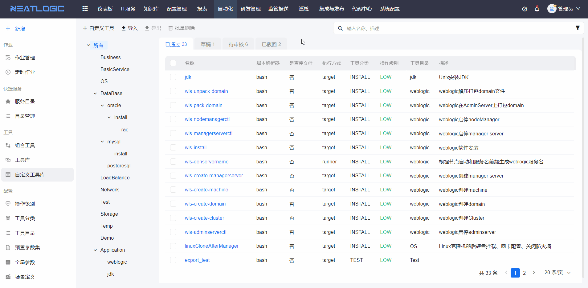

导入的工具的目录是全路径匹配，如果匹配不到，则在"所有"目录下。

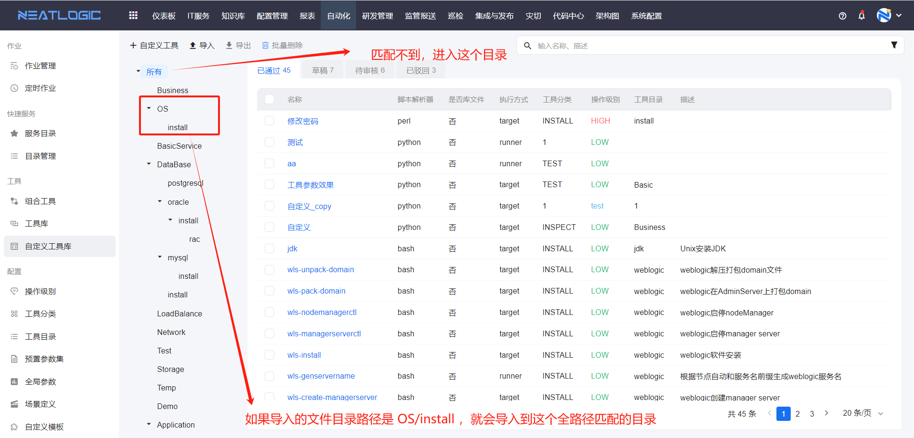
