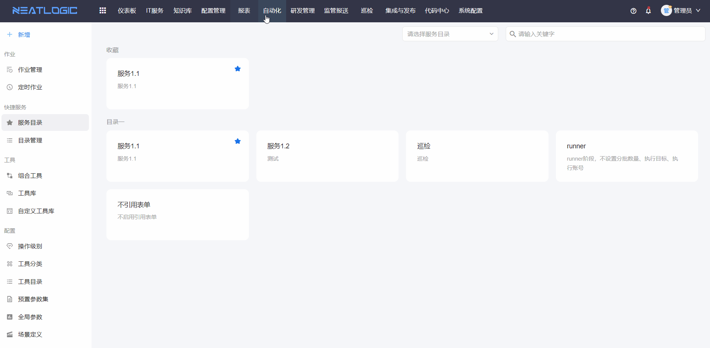
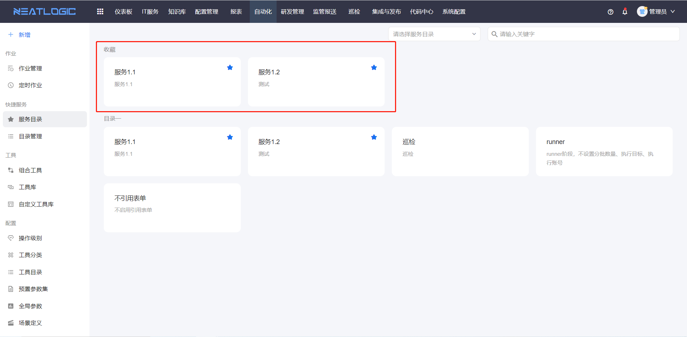
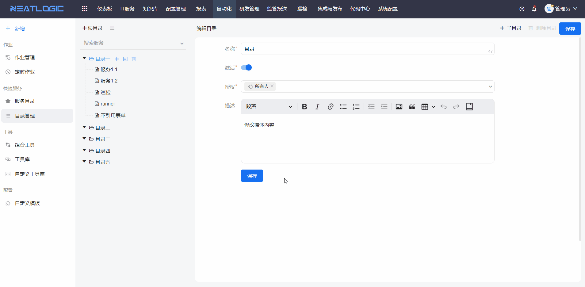

# 快捷服务
快捷服务支持快速发起作业，若存在某个作业场景，每次发起作业的参数或执行目标一样，可以将参数或执行目标值保存到服务配置，通过服务快速发起作业，不需要重新填写参数值。

## 服务目录
快速发起作业的操作步骤：打开服务目录页面，点击发起作业的服务，跳转到添加作业页面，保存作业即可

用户可收藏常用的服务，收藏的服务展示在页面最上方

## 目录管理
目录管理是管理服务的目录列表和服务配置的页面。

相关系统权限包括：自动化-服务目录管理权限、自动化管理员权限。
- 自动化管理权限，可执行有自动化所有模块所有操作的权限。
- 自动化-服务目录管理权限，有服务目录管理页面的所有操作权限。
### 目录列表
目录列表完全由用户自定义，根据需求管理目录分类和层级。

* 添加
  
  目录授权对象才能在服务目录页面查看该目录及其下级目录和服务
  
* 编辑

* 删除

* 搜索

### 服务
添加服务步骤：添加-填写基本信息-完成分批设置、执行目标、执行账号、表单

关于服务的权限，用户同时有服务及其所在级联目录的权限，才能在服务目录页面查看相应的服务。