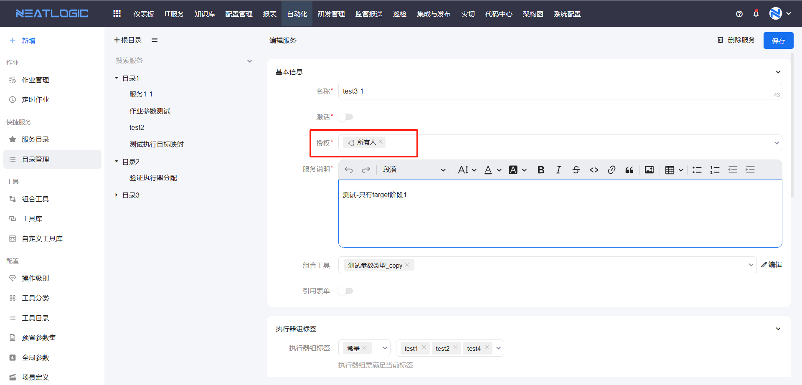
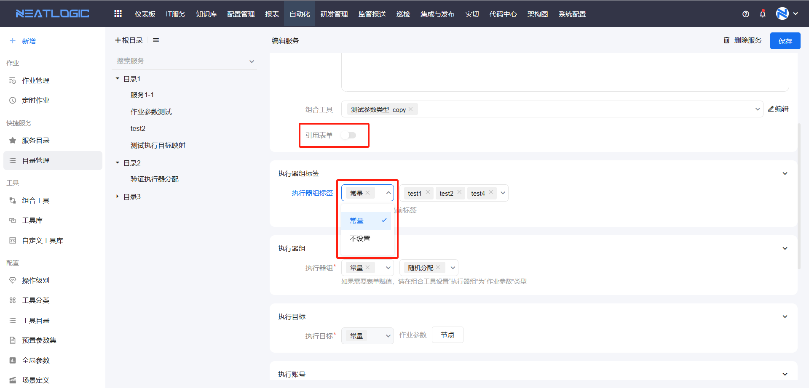
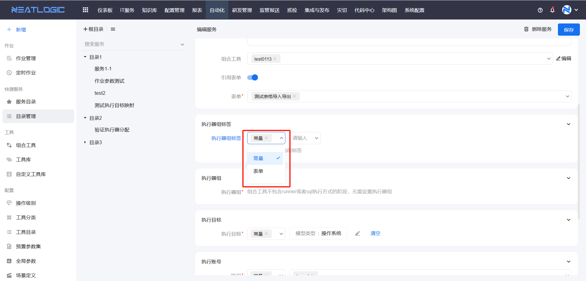
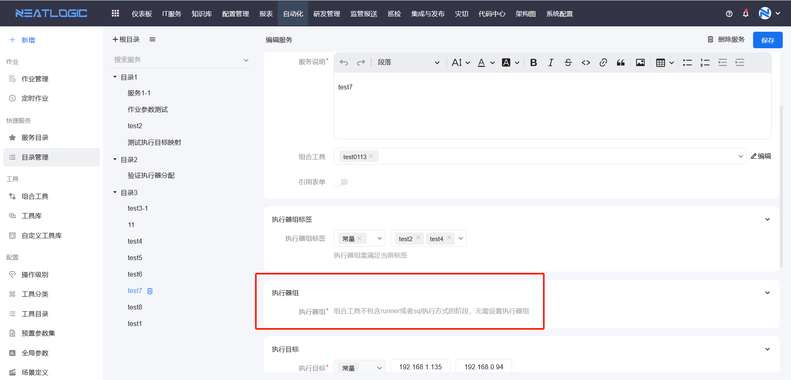
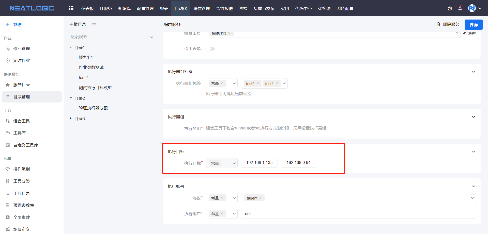
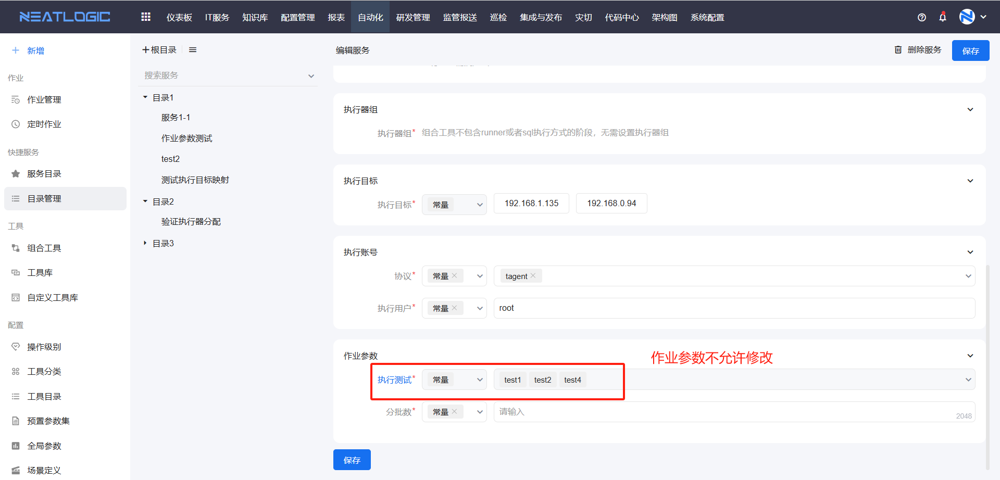
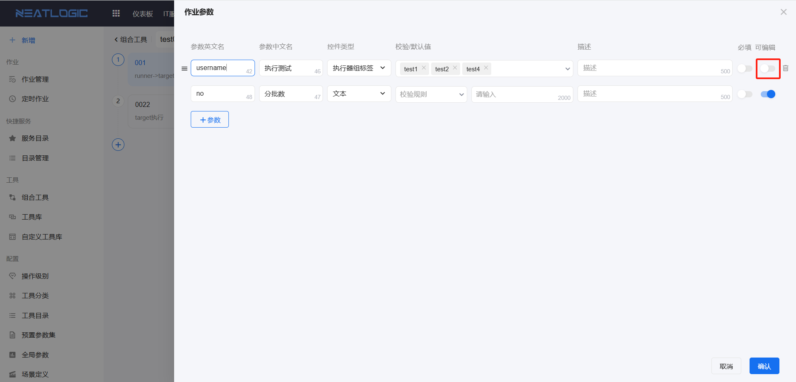

# 快捷服务

快捷服务用于快速发起作业。

对于参数和执行目标相对固定的作业场景，可以将这些值预先保存为服务配置。后续通过服务入口发起作业时，无需重复填写相同的参数和执行目标。

## 阅读路径

可根据当前要完成的操作选择阅读入口。

- 如果需要了解访问服务目录和目录管理所需权限，阅读“权限”。
- 如果需要通过已配置的服务快速发起作业，阅读“服务目录”。
- 如果需要维护服务目录、创建服务或配置服务参数，阅读“目录管理”。

## 权限

**操作权限**

- 配置：系统配置-[用户管理](../../100.系统配置/1.用户和权限/用户管理.md)-授权-自动化基础权限
- 包含操作：访问服务目录页面，发起作业
- 配置人员：系统超级管理员

> 自动化的其他管理权限已包含自动化基础权限。

**操作权限**

- 配置：系统配置-[用户管理](../../100.系统配置/1.用户和权限/用户管理.md)-授权-服务目录管理权限
- 包含操作：访问服务目录和目录管理页面
- 配置人员：系统超级管理员

**数据权限**

- 配置：快捷服务-目录管理-目录授权、服务授权
- 包含操作：查看服务
- 配置人员：拥有服务目录管理权限的用户

用户同时拥有服务权限，以及该服务所在层级目录的权限后，才能在服务目录中查看该服务。

## 服务目录

通过服务目录发起作业的流程为：打开服务目录，选择需要执行的服务，进入添加作业页面并保存作业。

可以收藏常用服务。收藏后的服务会显示在服务目录页面顶部，便于快速访问。

## 目录管理

目录管理用于维护服务目录和服务配置。

### 目录列表

目录列表支持按实际业务场景自定义目录分类和层级。

- **添加**：配置目录授权对象后，被授权用户可以在服务目录中查看该目录、下级目录和目录中的服务。

- **编辑**

- **删除**

- **搜索**

### 服务

添加服务的流程为：添加服务、填写基本信息、完成服务配置。

服务可以关联[组合工具](../工具/组合工具.md)，并预设执行目标、作业参数和其他作业配置。

服务执行目标、作业参数等配置支持引用表单。

#### 不引用表单

未启用“引用表单”时，参数映射方式包括“常量”“为空”和“不设置”。

选择“不设置”后，用户通过服务发起作业时需要填写对应的参数值。

#### 引用表单

启用“引用表单”后，参数映射方式包括“常量”和“表单”。

#### 参数映射说明

- 如果组合工具已预设执行器组、执行目标、执行账号或作业参数，服务配置页面会直接回显对应的预设值。
- 如果组合工具中不存在 runner 或 SQL 执行阶段，则无需配置执行器组。

- 如果组合工具已预设执行目标节点，服务配置页面会直接回显这些节点，且不能在服务中修改。需要调整执行目标时，请在组合工具中修改。

- 如果作业参数无法编辑，通常是因为组合工具中对应的作业参数未启用编辑。

