# 组合工具
多个阶段组（Phase Group）串联组合成为一个组合工具，组合工具（编排）是最小的自动化发布单元，原子工具需要放入组合工具才可以被执行。组合工具中的多个阶段组顺序串联执行。

## 权限说明
有两个维度的相关权限，系统层和组合工具层面，系统层权限在[权限管理](../../100.系统配置/1.用户和权限/用户和权限.md)页面设置，组合工具层面的权限在组合工具基本信息中设置。

系统层：组合工具查看权限、组合工具新建权限
- 组合工具查看权限：用户有这个权限，可查看组合工具菜单。
- 组合工具新建权限：用户有这个权限，可查看组合工具菜单，并且进行新增、复制、导入和导出组合工具操作。

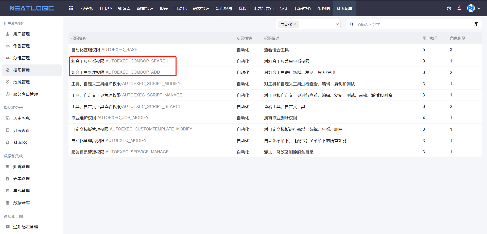
  
组合工具维度：数据权限，权限控制的是单个组合工具，维护人权限、查看权限、编辑权限、执行权限。

- 维护人权限：组合工具的维护人拥有组合工具的查看、编辑和执行权限。
- 查看权限：如果是一个普通的用户，缺少某个组合工具查看权限，组合工具列表会过滤掉该组合工具。
- 编辑权限：用户查看组合工具详情时，有编辑权限，页面才显示编辑按钮。
- 执行权限：用户有组合工具的执行权限时，管理页中组合工具的执行按钮才能使用，组合工具详情页面也会显示执行按钮。

审核权限：审批组合工具的权限。这个权限是由组合工具引用的[工具分类](../配置/自动化配置.md)决定的，工具分类可以设置审核授权对象，被授权的用户才能审批这个引用该工具分类的组合工具。

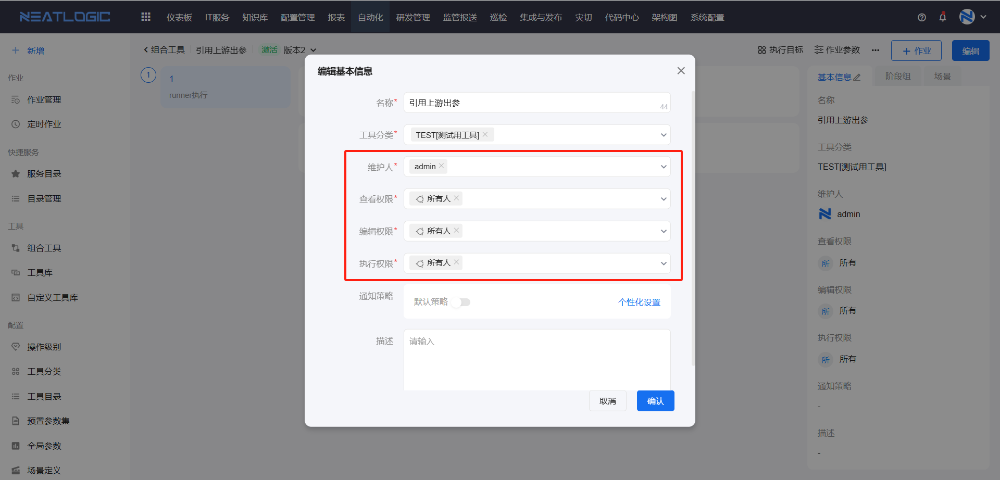

## 管理页
组合工具管理页支持添加、编辑、复制、导入、导出组合工具和查看引用列表，以及添加作业和查看执行记录等功能。
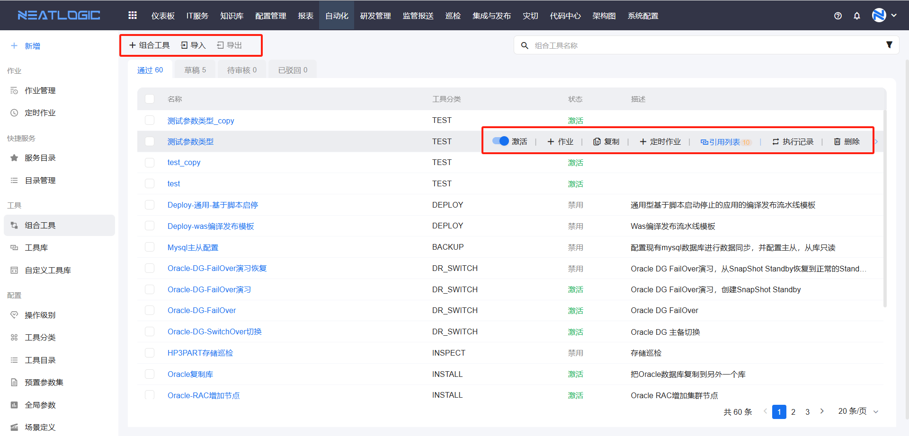
按照组合工具审批的状态分成了通过、草稿、待审核和已驳回。
草稿和已驳回的组合工具支持重新编辑并提交审核。待审核的组合工具只有有审批权限的用户可审批。
- 草稿
  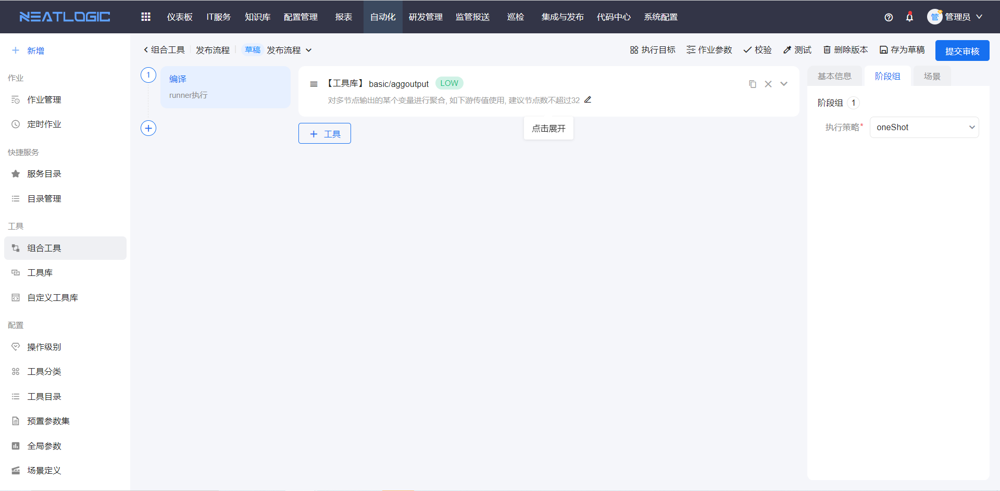
- 待审批
  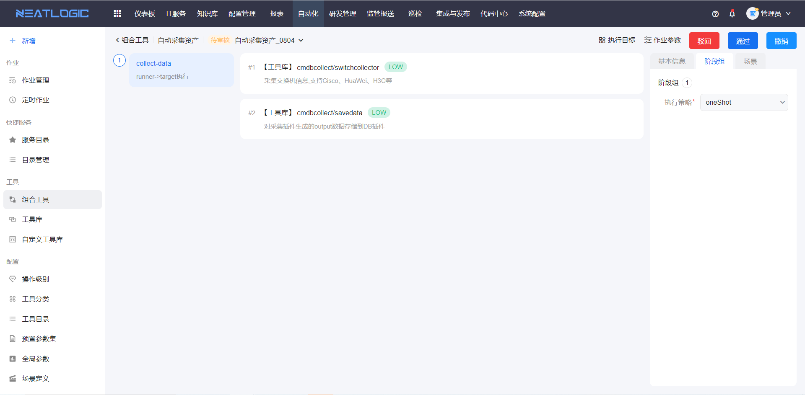
- 已驳回
  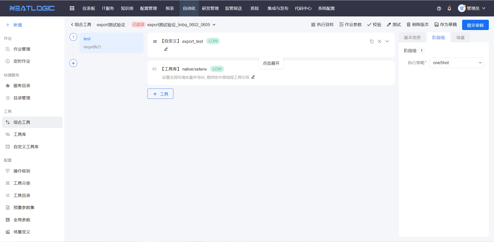

## 组合工具详情
组合工具由多个阶段（组）串联组合而成，组合工具是最小的自动化发布单元，脚本工具要放到阶段（组）才可以被执行。组合工具详情页有只读模式和编辑模式。 
查看组合工具时，默认为只读模式，点击编辑按钮可切换到编辑模式。在编辑模式下，点击取消按钮，放弃修改并切换到只读模式。
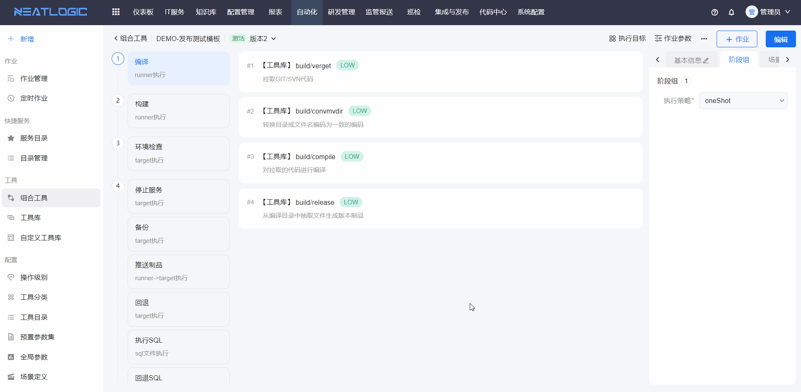

### 作业参数 
组合工具的作业参数可被阶段的参数引用，定义执行目标时，也可以引用节点信息类型的参数。

工具参数引用作业参数
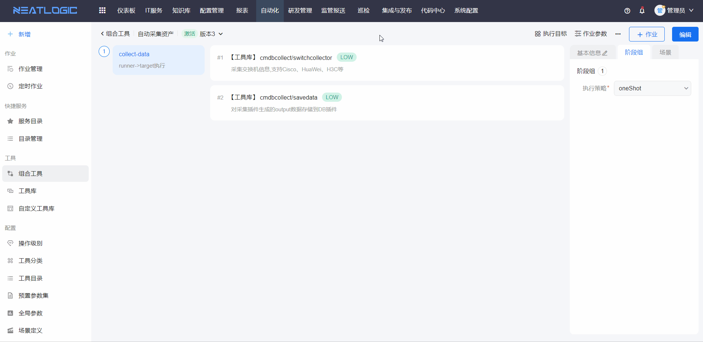
执行目标引用工具参数
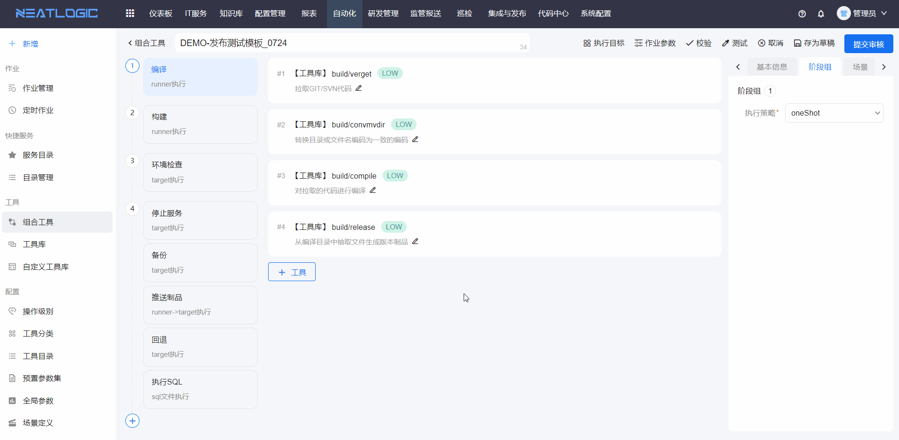
执行用户引用工具参数
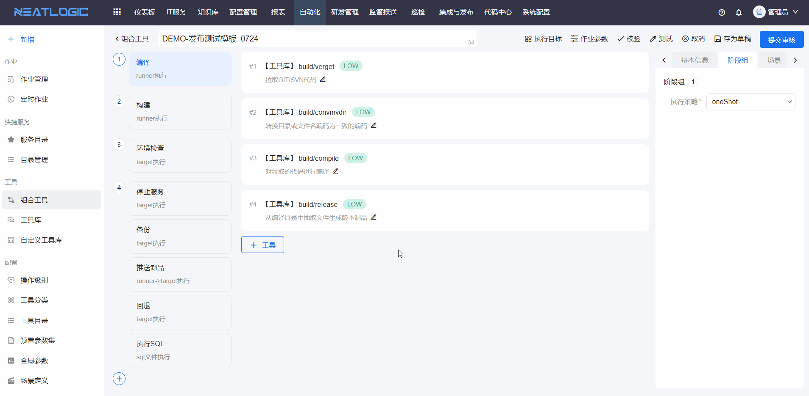

### 阶段组和阶段
阶段组由多个阶段并联组合而成，一个阶段组包含多个阶段，这多个阶段可以并行执行（oneShot），也可以多个[执行目标节点](#执行目标)分批依次执行（grayScale），每批节点依次执行完阶段组内的阶段后再启动另外一批节点继续依次执行阶段组内的各个阶段。
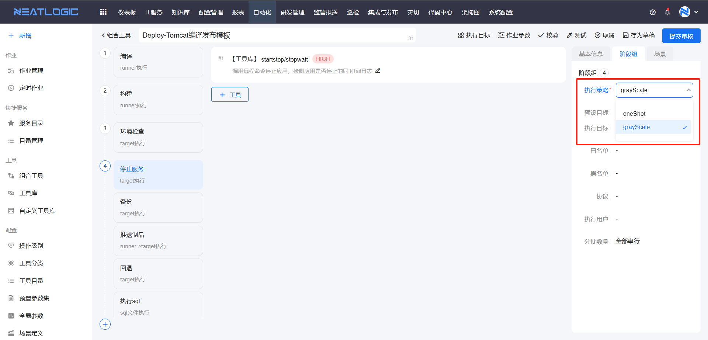
通过阶段上的添加按钮新增的阶段，与当前阶段在同一个阶段组，即同一序号下所有的阶段。阶段组内的接阶段允许拖动排序。
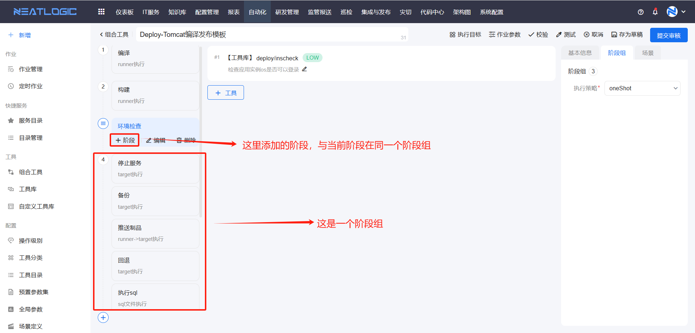

阶段是由多个工具串联组合成，同一阶段的多个工具按照顺序执行。如果一个阶段设置多个[执行目标节点](#执行目标)，多个目标节点支持分多批执行。工具在同一个节点按顺序执行。
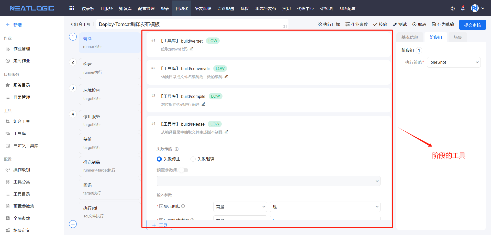
阶段的操作有添加、编辑、删除，阶段的配置包括名称、执行方式和预设执行目标。

### 工具
按开发方式分类，分为内置工具和自定义工具，来源分别是[工具库](../工具库/工具库.md)和[自定义工具库](../自定义工具库/自定义工具库.md)。
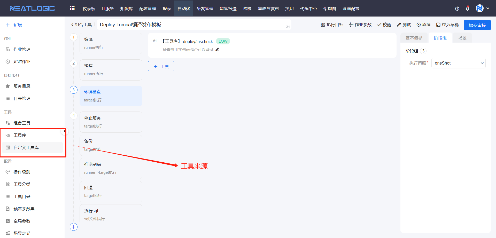

内置工具：跟随自动化调度工具版本一起发布，主要包括相对固定的基础功能，譬如：参数聚合、参数抽取、环境变量设置、条件分流、文件拷贝、文件处理、简单自定义脚本执行等标准化的工具。

自定义工具：可以使用自定义工具管理界面管理的自定义脚本、库或者包。用于完成非标准化的具有一定用户特点的任务。同时提供导入导出工具，完成自定义工具到svn或git的导入导出；完全可以使用git或者svn进行相关脚本的管理。

工具或自定义工具的配置有输入参数、输出参数和自由参数。

#### 输入参数
工具中定义的输入参数，输入参数的映射方式总共有六种，包括常量、作业参数、上游节点输出参数值、上游节点输入参数名、为空、预置参数集。
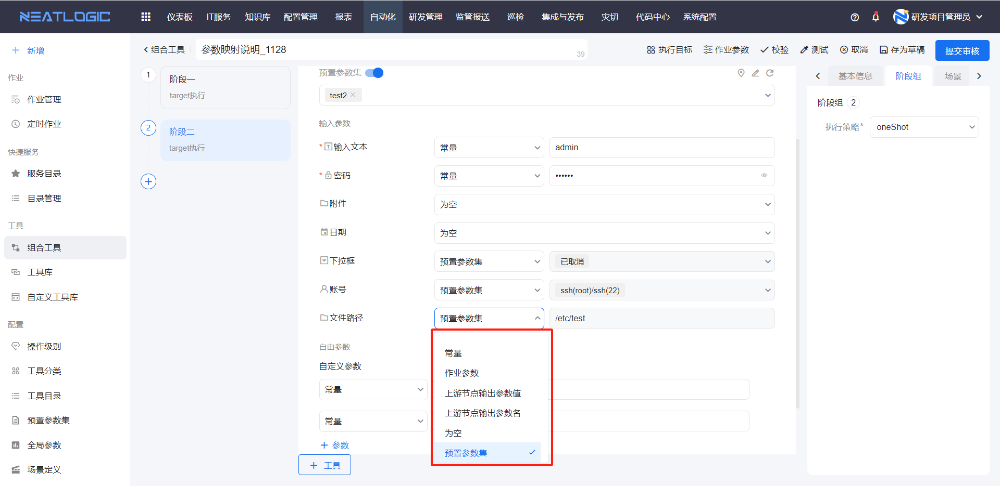
- 常量：这种方式就是管理员直接写入参数值，发起作业时不能修改。
- 作业参数：引用作业参数的参数值，支持在发起作业时才填写作业参数的值。
- 上游节点输出参数值：当前工具所在阶段有上游的阶段，或者有前置工具时，可选择引用上游节点工具的输出参数，但是可选对象有限制，只能选择类型相同的参数。
- 上游节点输出参数名：当前工具所在阶段有上游的阶段，或者有前置工具时，可选择引用上游节点工具的输出参数，没有参数类型限制。
- 为空：参数值为空，只有非必填的参数映射方式有为空。
- 预置参数集：启用关联[预置参数集](../配置/自动化配置.md)的工具参数可引用预置参数集的参数。

#### 输出参数
工具中定义的输出参数，在组合工具编辑页面，只回显输出参数，不能做任何修改。
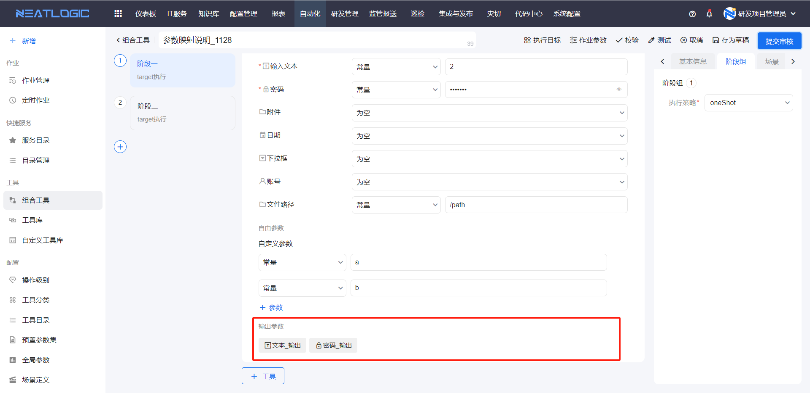

#### 自由参数
自由参数主要是实现在脚本执行过程中输入参数值的场景。
自由参数的参数名要和脚本中需要输入的参数一致。
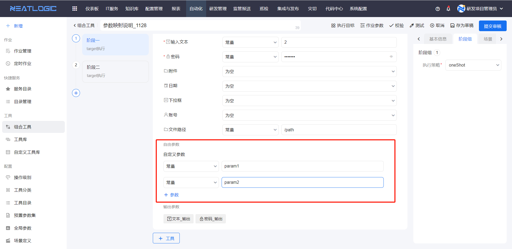

### 执行方式
工具根据执行方式的区别，分为四类：runner执行（本地）、target执行（远程）、runner_target执行（本地连接远程）、sql执行（本地数据库）。
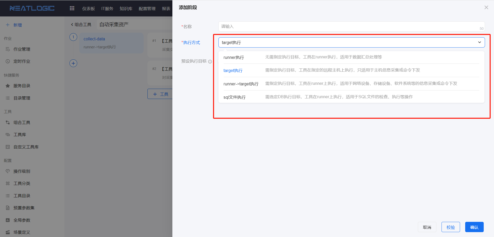

<table style="width:100%">
<thead>
    <tr>
        <td>执行方式</td>
        <td>唯一名</td>
        <td>插件特点</td>
        <td>概要描述</td>
    </tr>
</thead>
<tbody>
    <tr>
        <td>runner节点执行</td>
        <td>runner</td>
        <td>1、需安装第三方介质，如：网段扫描 
            2、对操作系统的依赖包比较重，如；发布的编译、构建等。
        </td>
        <td>Neatlogic-runner节点上执行，也可以简称本地执行。</td>
    </tr>
    <tr>
        <td>runner到远端目标执行</td>
        <td>runner_target</td>
        <td>1、需安装第三方介质，如：网络设备采集、存储采集。 
            2、对操作系统的依赖包比较重，如；虚拟机采集。
            3、插件需要动态获取执行节点的必要参数，如：IP、端口、账号、密码等。
        </td>
        <td>Neatlogic-runner节点上执行，也可以简称本地连远端目标节点执行。</td>
    </tr>
    <tr>
        <td>远端目标节点执行</td>
        <td>target</td>
        <td>依赖比较少或简单的依赖，如：操作系统采集。</td>
        <td>目标节点上执行。</td>
    </tr>
    <tr>
        <td>SQL执行</td>
        <td>SQL执行</td>
        <td>数据库脚本执行。</td>
        <td>runner节点上执行。</td>
    </tr>
</tbody>
</table>

### 执行目标
执行目标配置包括协议、执行用户、runner执行组、分批数量、选择时机和筛选方式。

#### 连接协议
连接协议可在阶段、组合工具的执行目标中预设，也支持发起作业时再指定。系统支持常见的连接协议，包括ssh、http、database、[tagent](../Tagent服务/Tagent服务.md)、snmp、ipmi等。连接协议数据来源于资源中心的[账号管理](../../3.配置管理/资源中心/账号管理.md)。

#### 执行用户
执行用户是指作业通过协议连接机器时使用的用户名，这里的用户名要与连接的机器的配置项数据中添加的账号的用户名一致。执行用户支持输入常量或者引用作业参数。
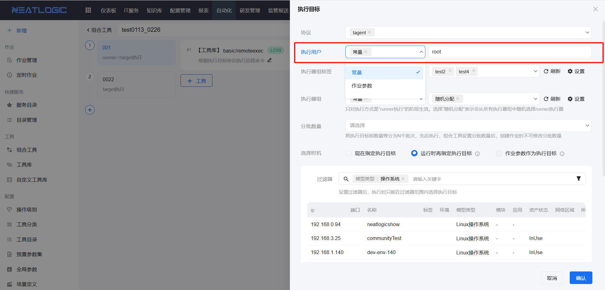

#### 执行器规则配置
执行器规则配置是定义runner执行类型的阶段分配执行器规则的，包括执行器组标签和执行器组配置，数据来源于[执行器组管理](../../100.系统配置/5.基础服务/执行器组管理.md)。 
执行器组标签：执行器组的标签。发起作业时，要根据选择的执行器标签匹配执行器组，若预设的执行器组都不包含预设的执行器组标签，无法保存作业。
执行器组标签和执行组支持选择常量组或者引用作业参数。
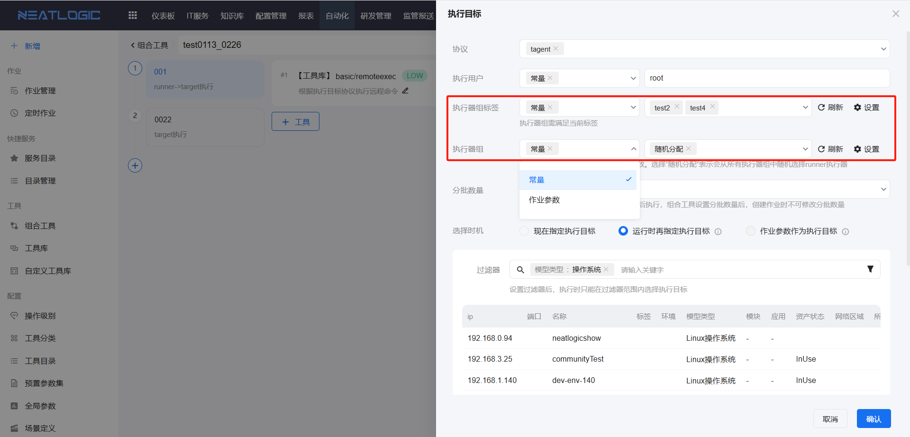
runner执行的阶段和执行目标中都可以定义执行器规则配置，优先使用阶段的配置，若阶段配置为空则使用组合工具执行目标的配置。

#### 分批数量
远程执行的阶段执行时，会按照设置的分批数量来分批执行。比如分批数量为“4”时，阶段每个批次同时在4个执行目标上执行脚本，4个目标都执行完后再执行下一个批次。

#### 选择时机
组合工具的执行节点设置支持预设、运行时再指定（发起作业时）、引用作业参数三个选择时机。
 
组合工具预设了执行目标节点，优先级顺序：阶段（组）>组合工具公共

未预设执行目标的阶段（组），沿用组合工具执行目标中预设的执行节点。
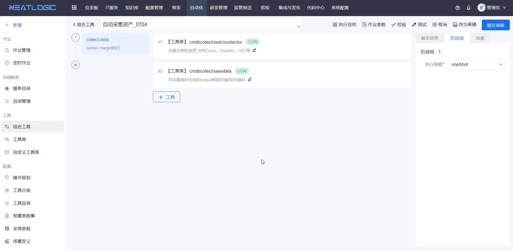

#### 筛选方式

执行目标的筛选方式有四种，分别为过滤器、节点、输入文本和作业参数

- 过滤器：选择搜索条件，所有过滤的结果均作为执行节点。
  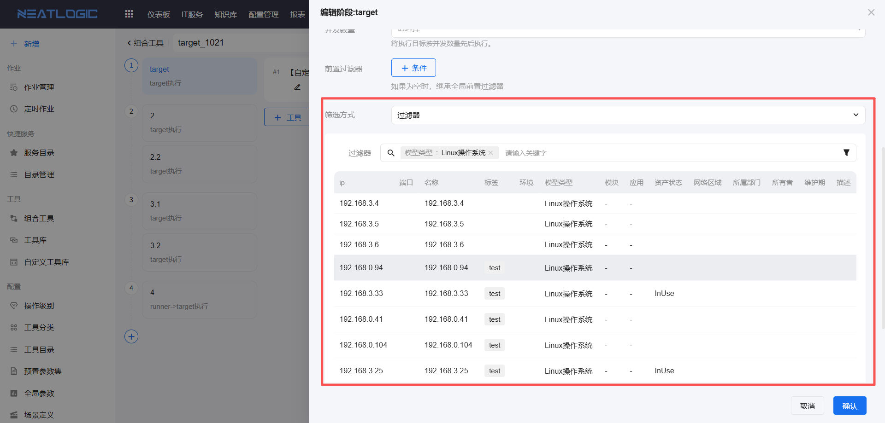
- 节点：直接在资产列表勾选目标对象作为执行节点，资产数据来自[资产清单](../../3.配置管理/资源中心/资产清单.md)。
  
- 输入文本：在输入框中填写目标ip，一行一个ip，可在资产列表匹配到的IP才能添加为目标。
  
- 作业参数：引用节点信息类型的作业参数，这种筛选方式只有阶段和阶段组可设置。
  

### 失败通知
组合工具基本信息中支持配置通知策略，目前仅支持作业执行失败的通知，通知策略模板在[通知策略管理](../../100.系统配置/4.通知和订阅/通知策略管理.md)页面中配置。
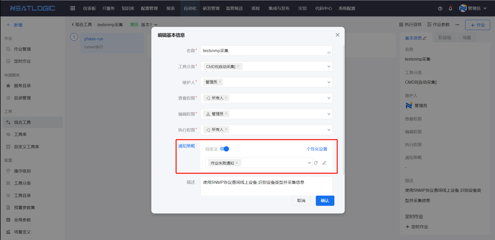

### 操作类型
操作类型主要是控制编辑的用户可选择的执行目标范围。操作类型是和系统配置-[配置信息管理](../../100.系统配置/5.基础服务/基础服务.md)中的“is.resourcecenter.auth”变量结合使用。
当变量的值为1时，启用操作类型功能；若变量值为0时，操作类型配置隐藏，所有资产开放。

操作类型包括查询类和操作类，这两个类型取决于用户在[团体](../../3.配置管理/系统管理/团体管理.md)中，拥有资产的只读权限还是自动化操作权限。
- 查询类：当前用户被授予了只读权限的团体中的资产（授权的模型要包括构成资产清单的模型），可以作为执行目标。
- 操作类：当前用户被授予了自动化操作权限的团体中的资产，可以作为执行目标。