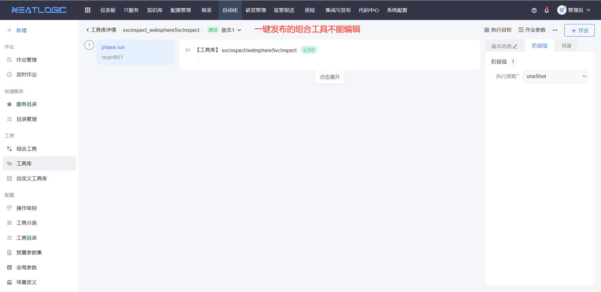
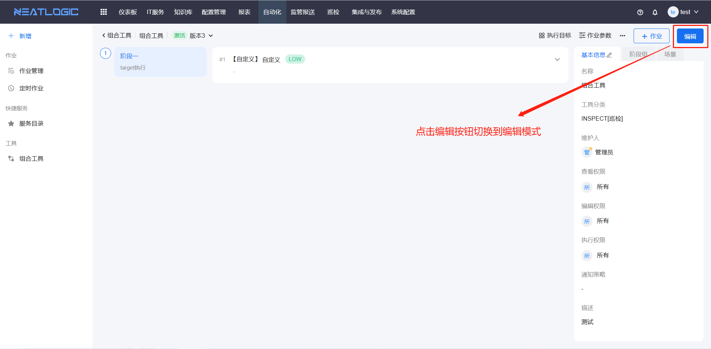
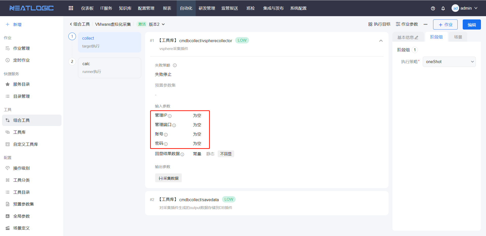

### 1、作业的执行目标和组合工具预置的执行目标不一样？
作业的阶段执行方式是target或者runner->target时，优先匹配阶段（组）中预设的执行目标，若阶段（组）未预设执行目标才会匹配组合工具中预设的执行目标。详情参考[组合工具](/组合工具/组合工具.md)。

### 2、为什么组合工具编辑不了？
1. 判断当前用户是否有组合工具编辑权限。 
   检查用户是否有权限管理-自动化-自动化管理员权限，其次检查是否有组合工具编辑权限。两个权限都没有的情况下，用户无法编辑组合工具。
   
2. 用户有编辑权限，检查当前组合工具是否由工具或自定义工具一键发布为组合工具的，由工具一键发布成的组合工具不能编辑。
   
   
3. 用户有编辑权限，且组合工具不是由工具一键发布的，检查当前是否再编辑模式下，组合工具详情页面显示编辑按钮，说明是只读模式，点击编辑按钮可切换到编辑模式。
   

### 3、自动化作业执行失败。
1. 查看作业是否分配到执行器，若没有分配到执行器，需检查执行器组配置，详情参考[Tagent服务](/Tagent服务/Tagent服务.md)的执行器组配置。
   
2. 如果是远程连接，执行器组正常，需判断执行目标是否连接成功，打开配置管理-资产清单，测试账号连接情况，详情参考[资产清单](../3.配置管理/资源中心/资产清单.md)。
3. 然后检查组合工具的参数映射值是否填写完整。如图，采集脚本中必填的参数为空，导致采集脚本执行失败，这种情况请根据本人需求修改工具参数映射。
   
4. 排除以上问题再考虑其他情况。