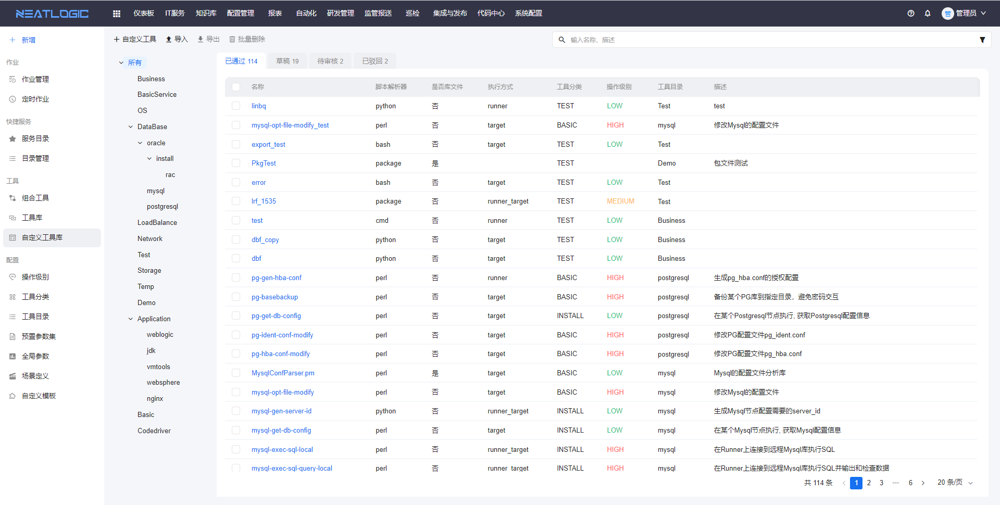
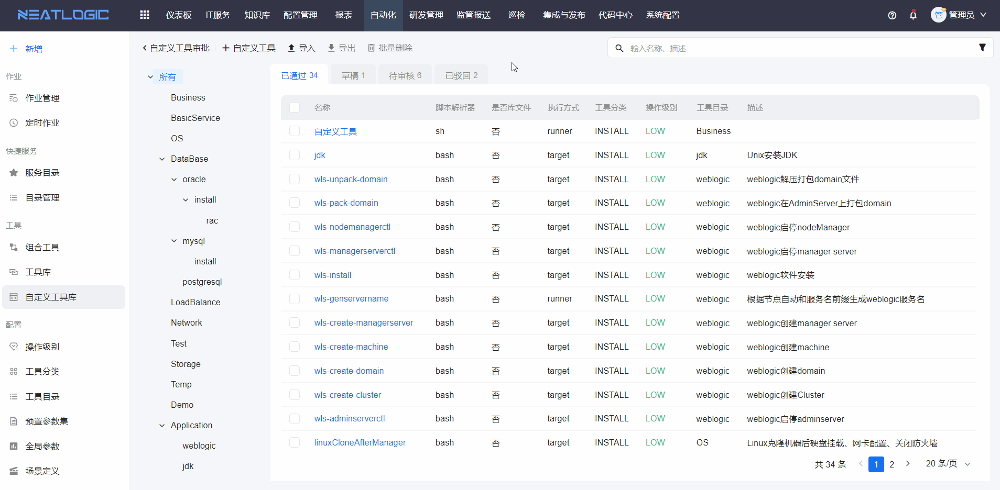
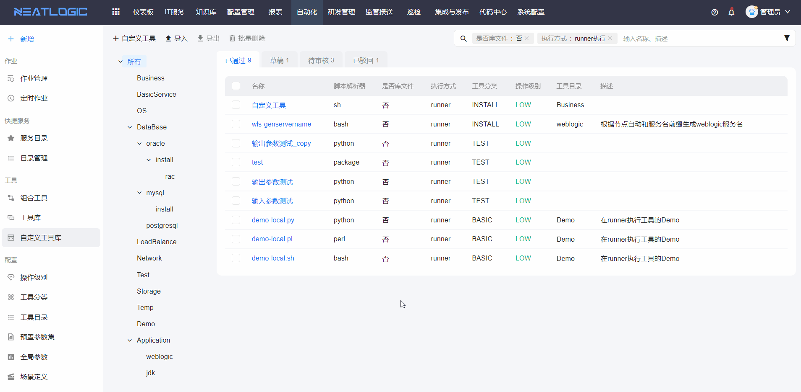
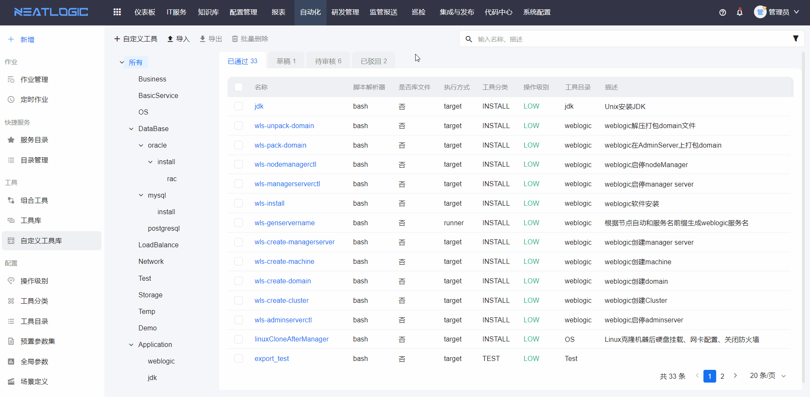

# 自定义工具库
自定义工具库是用户自定义的工具的管理页面，支持自定义添加、编辑、删除、导入、导出等。

自定义工具库页面根据工具的版本状态分为已通过、草稿、待审核和已驳回。 
* 草稿：已保存，但未提交审核的自定义工具，提交审核后状态转为待审核。
* 待审核：已提交审批，但未审批的自定义工具，审批的后状态转为已通过或已驳回，撤回待审批工具后，打回成草稿。
* 已通过：已经审批通过的自定义工具，生成新版本。
* 已驳回：审批被驳回的自定义工具，不生成新版本，可以重新编辑并提交审核。

### 权限说明
自定义工具相关的权限包括“工具、自定义工具维护权限”、“工具、自定义工具管理权限”和“工具、自定义工具查看权限”。
* 当用户拥有“工具、自定义工具维护权限”时，可查看、编辑、复制和测试工具。
* 当用户仅有“工具、自定义工具管理权限”时，可进行自定义工具的所有操作。
* 当用户仅有“工具、自定义工具查看权限”时，可查看自定义工具详情。

### 添加自定义工具
添加工具的步骤：发起添加-填写工具基本信息-创建版本-提交审核

审批人审核

package类型脚本解析器说明待补充。

### 编辑工具
编辑工具步骤：查看自定义工具-打开编辑模式-修改工具设置-提交审核

### 查看版本
自定义工具每次审批通过会生成一个新版本，自定义工具详情页面支持查看历史版本，并进行版本对比，可以回退到历史版本

查看版本

回退、删除版本，历史版本才支持回退和删除

### 发布为组合工具
组合工具只需要用到一个自定义工具时，自定义工具支持一键发布为组合工具，组合工具不能修改。

### 复制自定义工具
自定义工具支持一键复制的功能，复制工具时，可修改基本信息，脚本无法修改。

### 删除自定义工具
删除自定义工具的方法包括删除单个工具和批量删除。

### 搜索
自定义工具支持复合搜索，搜素条件包括关键字、执行方式、工具分类操作级别等。

### 导出和导入
导出自定义工具有单个导出和批量导出两种方式。

导入工具，上传导入文件并提交导入，工具提交到待审批，再由管理员审批通过即可。
