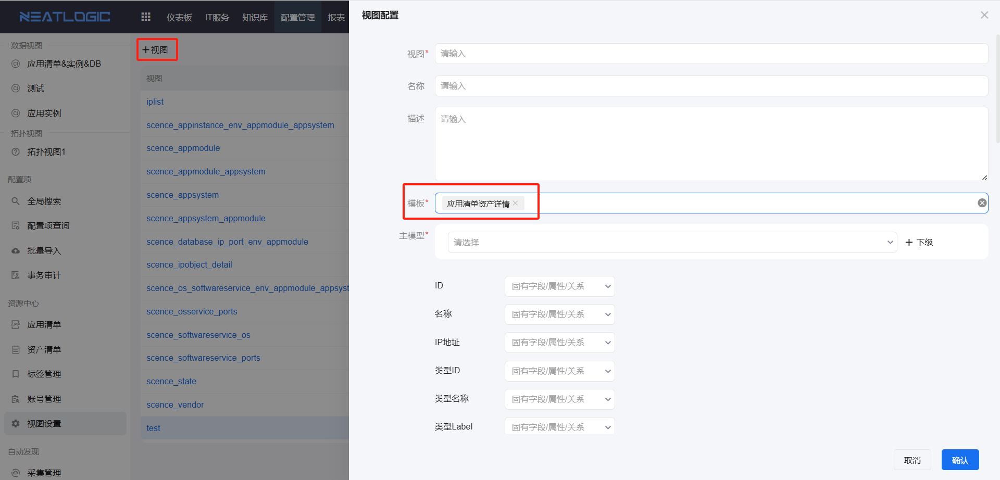
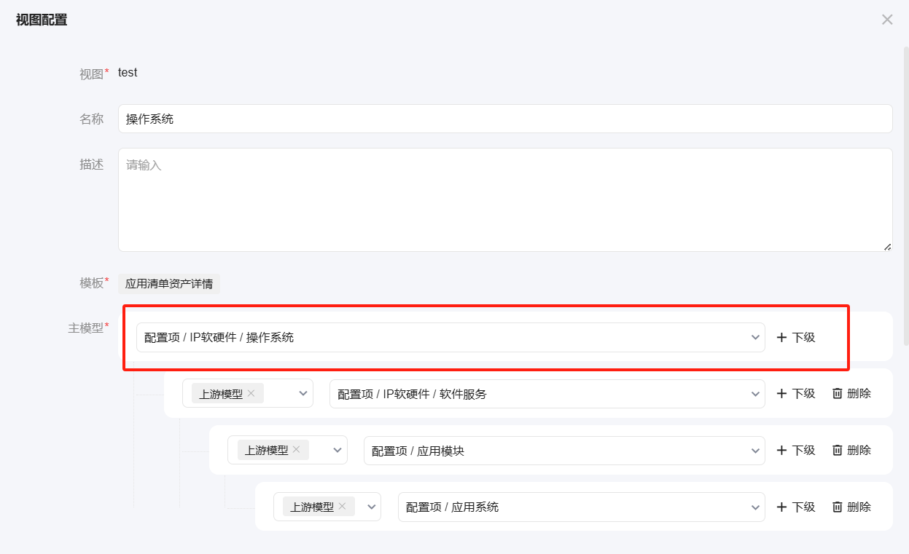
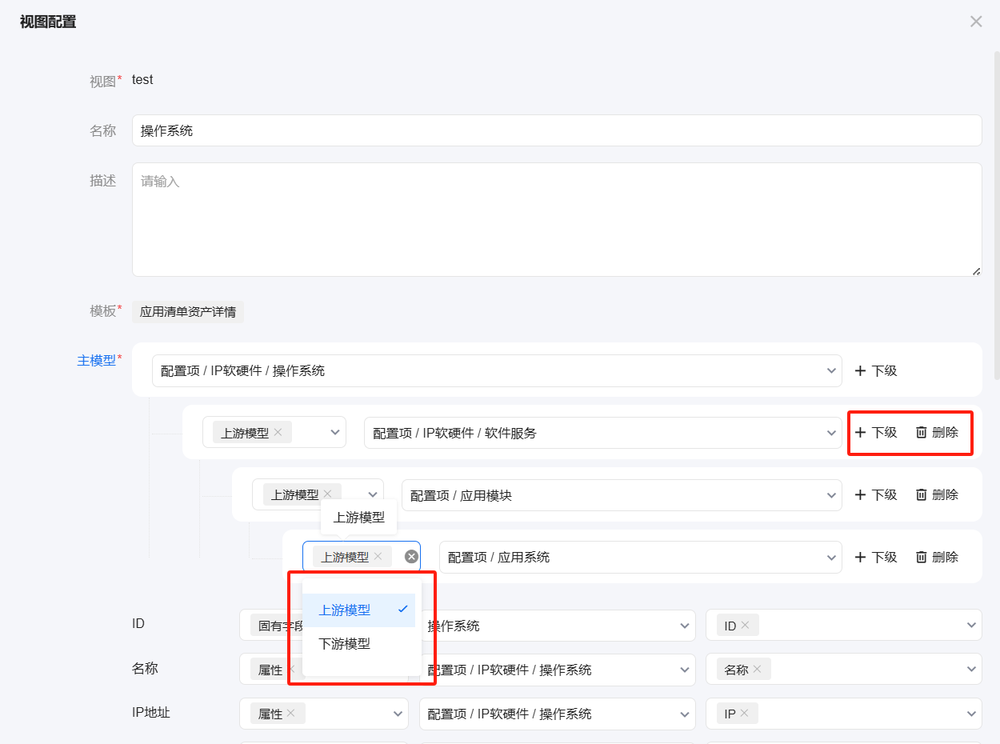
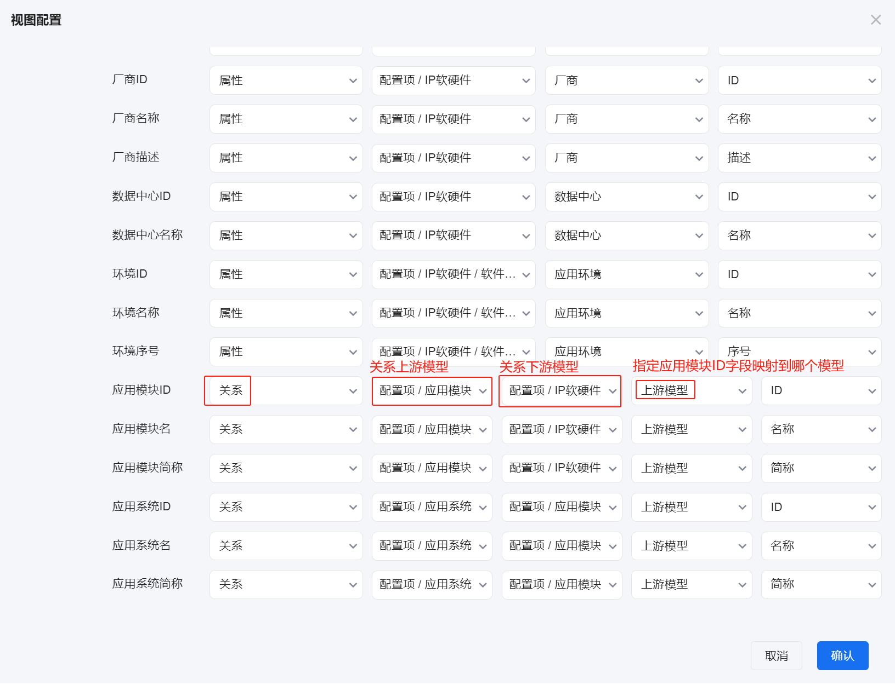
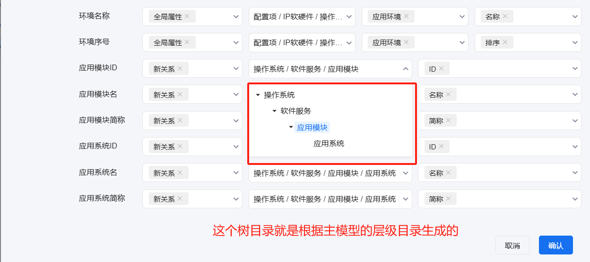
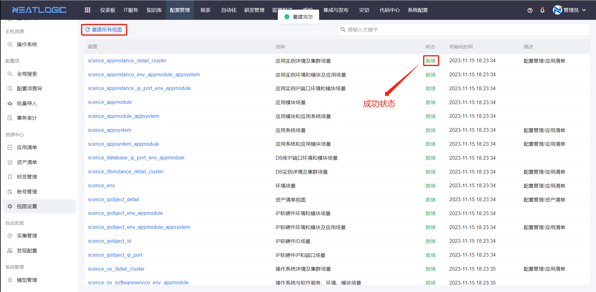

# 视图设置

视图设置用于定义配置模型与业务视图之间的字段映射关系。

资产清单和应用清单等页面会基于视图读取数据。视图映射调整后，需要通过重建视图更新视图数据，页面展示才会按新的映射结果生效。

## 阅读路径

可根据当前要解决的问题选择阅读入口。

- 如果需要新增应用清单使用的自定义视图，阅读“自定义视图”。
- 如果需要配置视图字段来源，阅读“视图配置”。
- 如果需要理解字段映射方式，阅读“字段映射模式”。
- 如果视图数据没有按配置更新，阅读“重建所有视图”。
- 如果需要确认可执行的操作范围，阅读“权限”。

## 权限

**操作权限**

- 配置：系统配置-[用户管理](../../100.系统配置/1.用户和权限/用户管理.md)-授权-资源中心管理权限
- 包含操作：访问视图设置页面、新增自定义视图、配置视图映射和重建视图
- 配置人员：系统超级管理员

## 自定义视图

自定义视图用于生成业务页面可引用的数据视图。

当前自定义视图数据主要应用于应用清单页面。新增自定义视图时，需要先关联模板，系统会根据所选模板生成需要映射的字段列表。

## 视图配置

视图配置用于建立业务视图字段与配置模型字段之间的映射关系。

下图以应用清单中的应用系统数据视图为例，将应用清单中的应用系统属性映射到应用系统模型的自定义属性或固有属性。

### 主模型

主模型必填且唯一，是固有字段的来源模型。

### 上下游模型

主模型可以手动添加上下游模型，并支持多层级关系。

选择上下游模型时，需要选择与当前模型真实存在上下游关系的模型。若模型关系不正确，“新关系”字段可能无法匹配到数据。

### 字段列表

视图字段列表由系统预置，所有字段都需要配置映射。

如果某个字段没有配置映射，依赖该字段展示或搜索的页面可能无法正常显示对应数据。

### 字段映射模式

字段映射模式包括：固有字段、属性、关系、[全局属性](../../3.配置管理/系统管理/全局属性管理.md)、新关系和为空。

**固有字段**是每个模型都有的隐藏属性，包括 ID、UUID、名称、创建者、创建日期、修改者、修改日期、巡检状态、巡检时间、监控状态、监控时间、类型 ID、类型名称和类型 Label。

**属性**表示字段值来源于主模型或其后代模型的某个属性。如果选择的是下拉框类型属性，还需要进一步指定映射该属性模型的哪个属性。

**关系**表示字段值来源于模型之间已有关系中的相关信息。

**新关系**表示字段要映射到主模型或其下级模型的属性。

**为空**表示该字段不映射任何数据。若业务页面依赖该字段展示或搜索，选择为空后对应能力可能不可用。

## 重建所有视图

重建所有视图用于基于当前视图配置重新生成视图数据。

重建成功的视图状态为就绪。重建失败时，可以将光标聚焦到失败状态查看失败原因。

重建视图的操作入口在系统配置-[重建数据库视图](../../100.系统配置/6.基础服务/重建数据库视图.md)页面。
