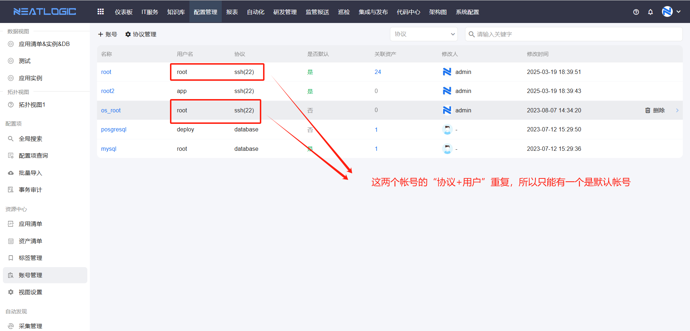
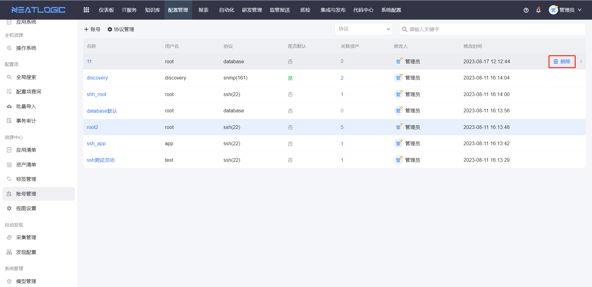
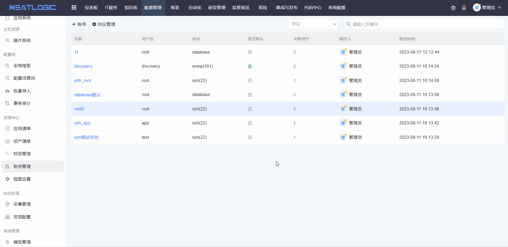

# 账号管理

账号管理用于维护资产连接所需的协议和账号。

自动化工具需要连接远程资产时，会使用这里配置的协议、账号和密码。添加账号前，需要先维护连接协议；账号保存时必须关联协议。

## 阅读路径

可根据当前要解决的问题选择阅读入口。

- 如果需要新增连接协议，阅读“协议管理”。
- 如果需要维护资产连接账号，阅读“账号”。
- 如果需要设置默认账号，阅读“默认账号规则”。
- 如果需要确认账号被哪些资产使用，阅读“查看关联资产”。
- 如果需要确认可执行的操作范围，阅读“权限”。

## 权限

**操作权限**

- 配置：系统配置-[用户管理](../../100.系统配置/1.用户和权限/用户管理.md)-授权-资源中心_账号管理权限
- 包含操作：访问账号管理页面、添加协议、编辑协议、删除协议、添加账号、编辑账号、删除账号和查看关联资产
- 配置人员：系统超级管理员

## 协议管理

协议管理用于维护资产连接协议。

协议需要填写协议名和默认端口号，支持添加、编辑和删除。协议配置完成后，才能在账号中选择并关联使用。

## 账号

账号用于资产连接配置，供自动化工具执行时使用。

添加账号时，连接协议、账号名和密码为必填信息。保存时，系统会校验账号名是否重复，避免同类账号配置混乱。

## 默认账号规则

默认账号需要满足“协议 + 用户”唯一。

如果新增账号时启用为默认账号，但同一协议和用户下已经存在默认账号，系统会将新账号保存为默认账号，并自动取消原默认账号。

## 编辑账号

编辑账号用于调整已有账号的协议、账号名、密码或默认账号状态。

## 删除账号

删除账号用于移除不再使用的连接账号。删除前建议先查看账号是否仍被资产引用，避免影响自动化执行。

## 查看关联资产

查看关联资产用于确认账号当前被哪些资产使用。

当账号需要下线、修改密码或排查连接失败时，可以先查看关联资产范围，再决定是否编辑或删除账号。

