# 资产清单

资产清单用于汇总 IP 资产，展示资产配置信息和巡检状态。

资产清单页面支持查看、搜索、编辑和删除资产，也支持维护资产关联账号和资产标签。巡检、自动化和配置管理三个模块共用同一套资产清单，任意一处改动都会同步到其他两个模块。

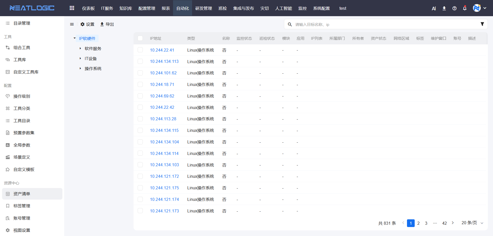

## 阅读路径

可根据当前要解决的问题选择阅读入口。

- 如果需要配置资产清单树目录或表格字段来源，阅读“资产清单数据源配置”。
- 如果需要调整个人列表字段显示，阅读“表头管理”。
- 如果需要控制资产清单是否受模型权限和团体权限影响，阅读“资产过滤配置”。
- 如果需要快速查找资产，阅读“搜索”。
- 如果需要查看资产配置项详情，阅读“查看资产详情”。
- 如果需要维护资产、账号或标签，阅读“编辑、删除资产”“账号管理”和“标签管理”。
- 如果需要批量处理资产、账号或标签，阅读“批量操作”。
- 如果需要确认可执行的操作范围，阅读“权限”。

## 权限

**操作权限**

- 配置：系统配置-[用户管理](../../100.系统配置/1.用户和权限/用户管理.md)-授权-自动化基础权限
- 包含操作：访问资产清单页面、搜索资产、查看资产详情、管理资产账号、管理资产标签和批量操作
- 配置人员：系统超级管理员

**关联权限**

- 编辑、删除资产需要拥有对应配置模型的管理权限。
- 查看资产配置项详情需要拥有对应配置模型的查看权限。
- 资产清单是否按模型权限和团体权限过滤，可通过系统参数控制。

## 资产清单数据源配置

资产清单的数据源配置决定左侧树目录和表格字段的展示内容。

资产清单的树目录可在“设置”中修改。“设置”中选择的配置项模型及其下级模型，会回显为资产清单的树目录。

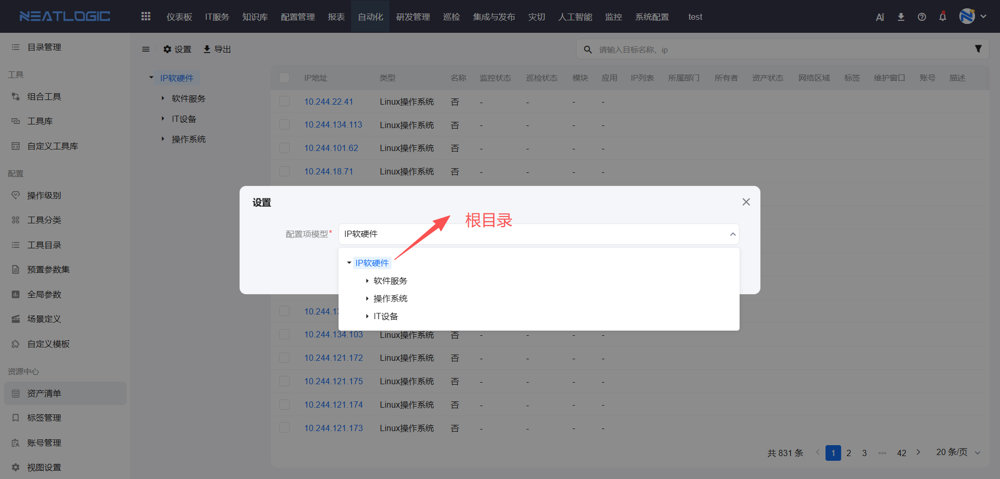

配置项模型数据源的根目录由[视图设置](视图设置.md)中 `scence_ipobject_detail` 视图的主模型控制。

资产清单表格数据来自 `scence_ipobject_detail` 视图。表格表头字段与该视图字段对应，通过配置 `scence_ipobject_detail` 视图字段映射，可以控制资产清单表格显示内容。

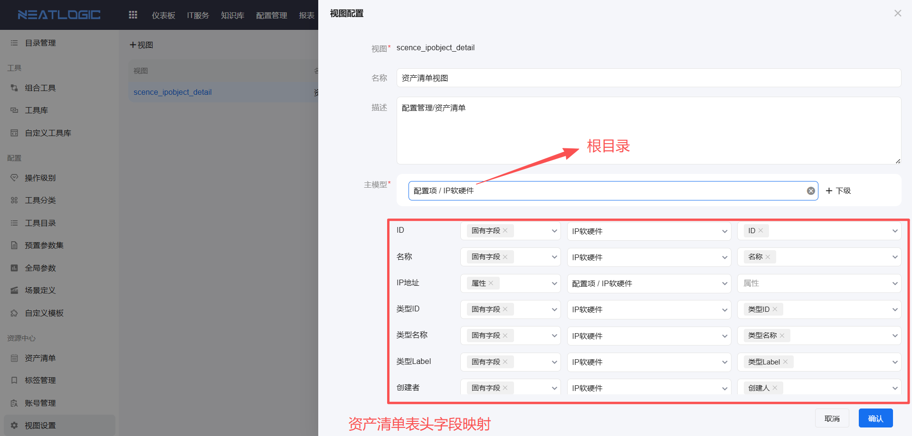

> 注意：如果视图字段映射为空，资产清单列表不会展示对应字段；如果该字段同时是搜索组件的搜索条件，也无法通过该字段搜索。

## 表头管理

表头管理用于自定义资产清单表格字段的显示和排序。

每个用户的表头设置相互独立。用户调整字段显示或排序后，只影响自己的资产清单页面，不会影响其他用户。

### 表头字段选择

表头字段选择用于控制哪些字段显示在资产清单表格中。

勾选需要显示的字段后，该字段会出现在表格中；取消勾选后，该字段不会在表格中显示。

**操作步骤**

1. 点击表格右上角的“表头设置”按钮。
2. 在表头设置窗口中，勾选需要显示的字段。
3. 取消勾选不需要显示的字段。
4. 点击“确定”保存设置。

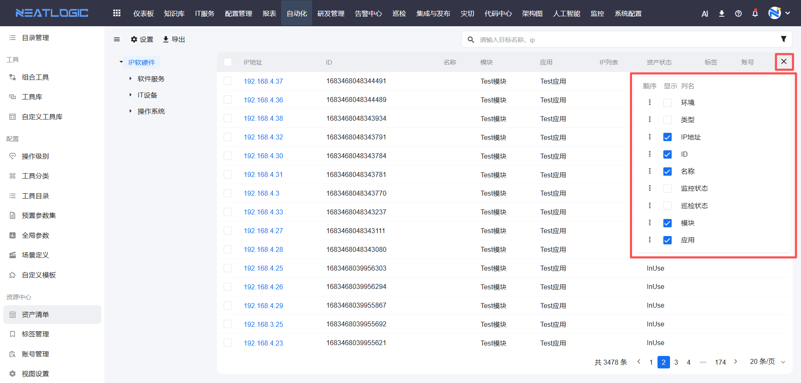

> 提示：表头字段选择状态会保存到用户配置中，下次访问资产清单时会自动应用。

### 表头字段排序

表头字段排序用于调整表格列的显示顺序。

用户可以把常用字段或关键字段调整到更靠前的位置，提高查看效率。

**操作步骤**

1. 点击表格右上角的“表头设置”按钮。
2. 在表头设置窗口中，拖动字段项调整顺序。
3. 将字段拖动到目标位置后松开鼠标。
4. 点击“确定”保存设置。

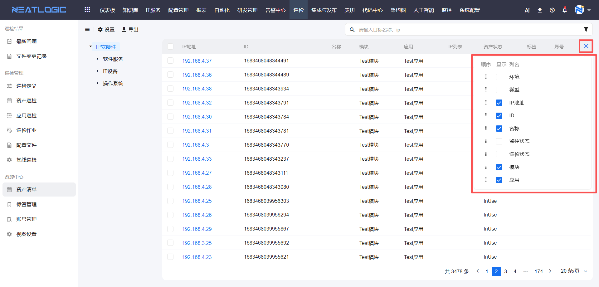

> 提示：表头字段排序会同步应用到表格列顺序中。每个用户的排序设置相互独立，不会影响其他用户。

## 资产过滤配置

资产清单默认回显资产清单视图中的所有数据，不受模型权限和团体权限控制，包括查看权限和管理权限。

可以通过系统参数控制资产清单数据是否受模型权限和团体权限影响。配置入口为系统配置-[系统参数](../../100.系统配置/6.基础服务/系统参数.md)。

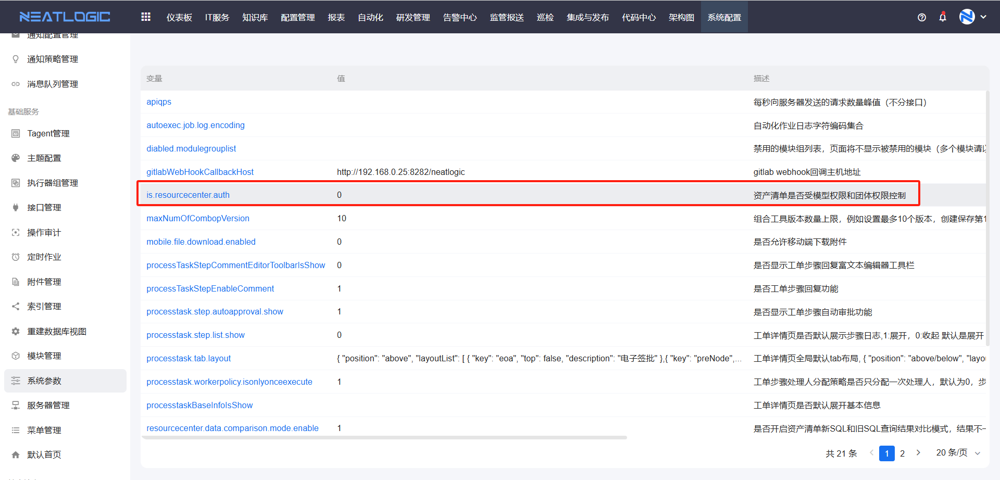

参数 `is.resourcecenter.auth` 为 `0` 时，表示不启用权限过滤；参数值为 `1` 时，表示启用权限过滤。

## 搜索

资产清单支持通过连接协议、资产状态、巡检状态、环境、系统、模块、状态和标签过滤 IP 资产。

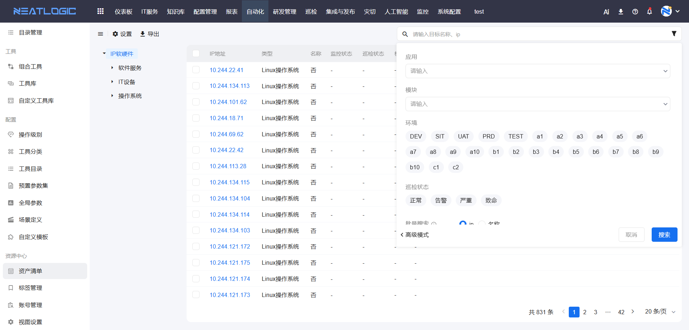

## 查看资产详情

在资产清单列表中，点击 IP 地址可跳转到对应资产的配置项详情页面。

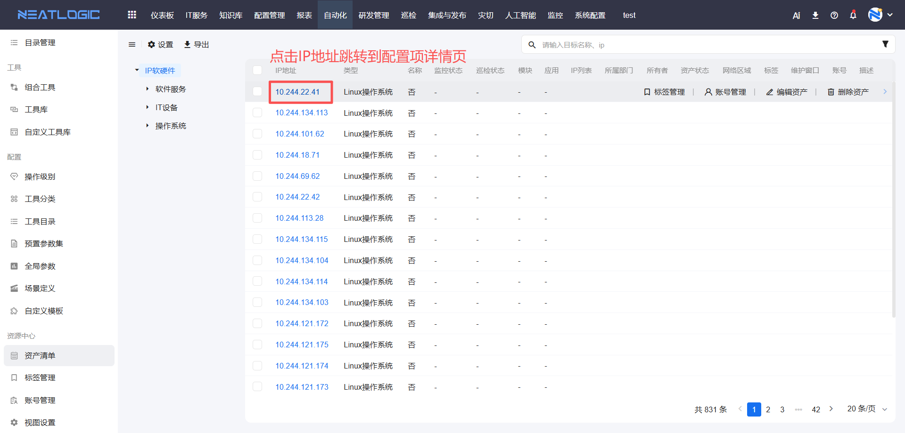

> 补充说明：如果用户只有父模型配置项的查看权限，没有子模型权限，查看子模型配置项详情时，会提示缺少模型查看权限。

## 编辑、删除资产

在配置模型列表中选中目标模型后，页面上方会显示添加资产操作。将光标聚焦到资产上时，页面会显示编辑和删除按钮。

编辑或删除资产需要拥有对应配置模型的管理权限。

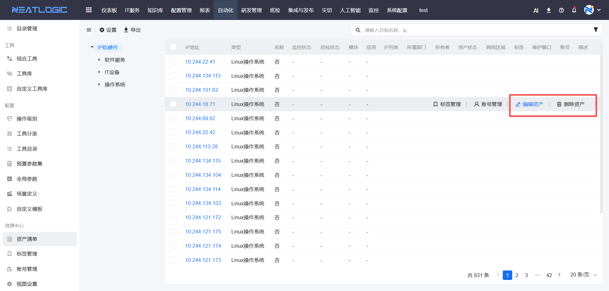

## 账号管理

账号管理用于维护资产关联的公共账号或私有账号。

点击资产上的账号管理按钮，打开账号管理弹窗，编辑关联公共账号或私有账号并保存即可。公共账号来源于[账号管理](账号管理.md)。

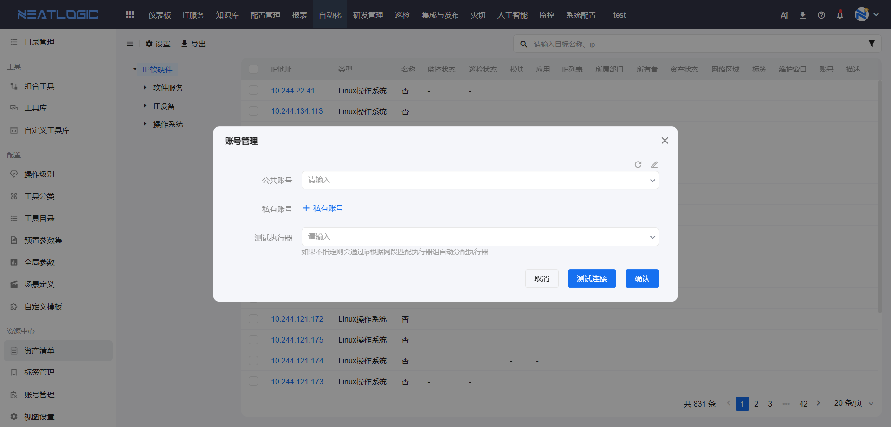

除在资产清单页面快速维护资产账号外，也可以在配置项查询页面找到目标模型，在模型的配置项列表中新增、编辑或删除资产对象。

以下示例是在 Windows 操作系统模型下添加新的资源。

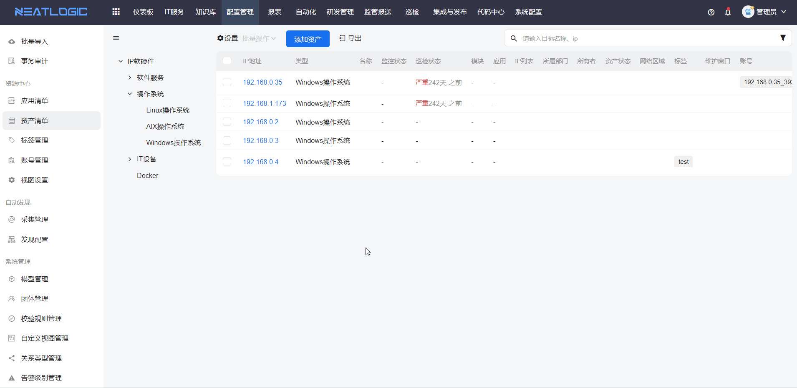

## 标签管理

标签管理用于维护资产所属标签。

点击资产上的标签管理按钮，打开标签管理弹窗，编辑标签并保存即可。标签数据来源于[标签管理](标签管理.md)。

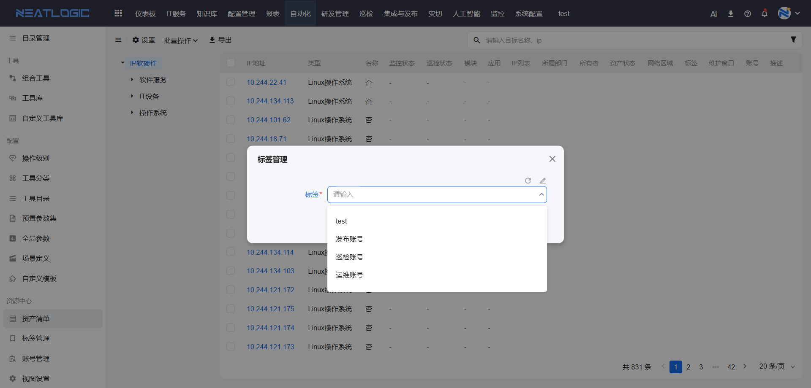

## 批量操作

批量操作用于同时处理多个资产对象。

在资产清单页面勾选多个资产后，可展开批量操作，根据场景批量增加标签或账号，也可以批量删除标签、账号或资产。

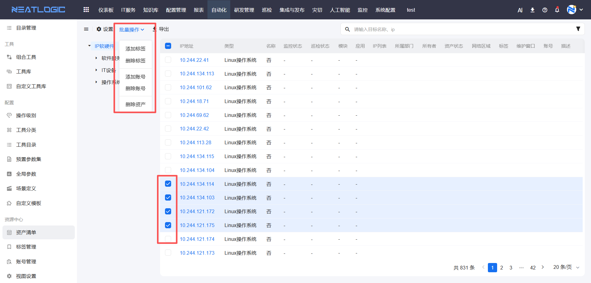
