# 自动化配置

自动化配置用于维护自动化模块的基础规则和通用参数，包括操作级别、工具分类、工具目录、预置参数集、全局参数、场景定义和自定义模板。

这些配置会被工具、组合工具和作业编排引用。建议先完成基础配置，再维护自定义工具和组合工具。

## 阅读路径

可根据当前要完成的配置选择阅读入口。

- 如果需要维护工具和组合工具的操作级别，阅读“操作级别”。
- 如果需要限制工具使用范围或配置审核人，阅读“工具分类”。
- 如果需要整理自定义工具目录，阅读“工具目录”。
- 如果需要复用常用工具参数，阅读“预置参数集”和“全局参数”。
- 如果需要配置组合工具、流水线可选场景，阅读“场景定义”。
- 如果需要复用工具执行时的模板内容，阅读“自定义模板”。

## 权限

**操作权限**

- 配置：系统配置-[用户管理](../../100.系统配置/1.用户和权限/用户管理.md)-授权-自动化管理权限
- 包含操作：访问自动化配置页面，维护操作级别、工具分类、工具目录、预置参数集、全局参数、场景定义和自定义模板
- 配置人员：系统超级管理员

## 操作级别

操作级别用于标识工具和组合工具的操作等级，并在工具和组合工具的基本信息中引用。

操作级别支持添加、编辑、删除、搜索和排序。维护操作级别时，应根据实际业务风险和操作范围统一定义，便于后续筛选和管理工具。

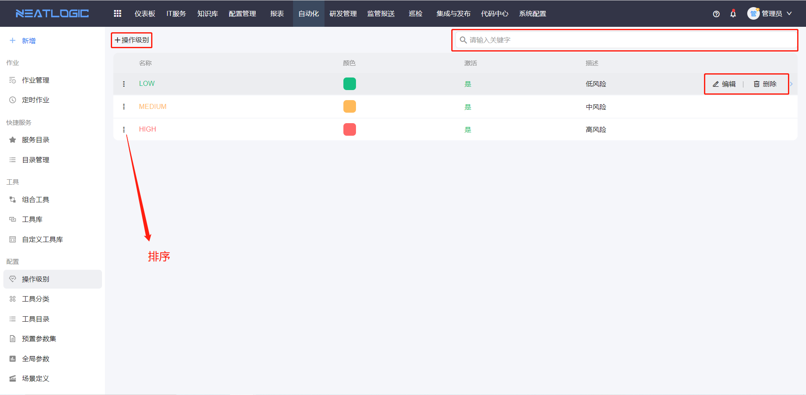

## 工具分类

工具分类用于组织工具，并在工具基本信息中引用。

工具分类支持添加、编辑、删除、搜索和查看引用。工具分类配置包括名称、描述、授权和审核授权。

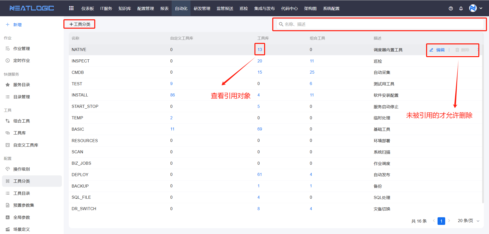

### 授权

被授权用户可以在组合工具中添加该工具分类下的自定义工具或工具库工具。

### 审核授权

被授权用户可以在组合工具中审核引用该工具分类的工具版本。

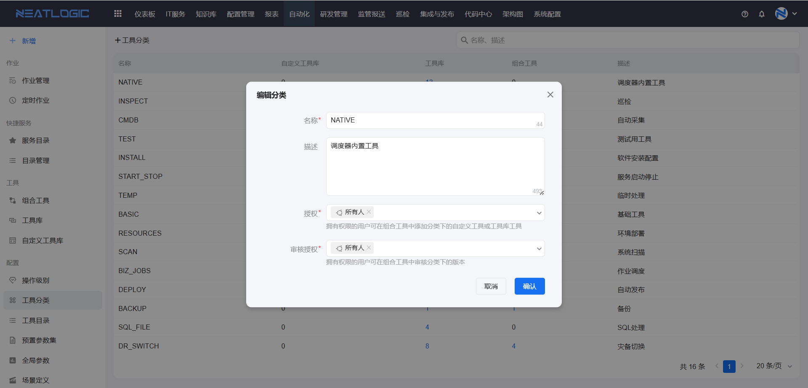

## 工具目录

工具目录用于管理自定义工具的目录分类和层级。

工具目录支持添加、重命名、删除、查看关联工具、搜索、调整排序和层级。删除目录前，需要先确认目录未被工具引用；已被引用的目录不能删除。

### 添加目录

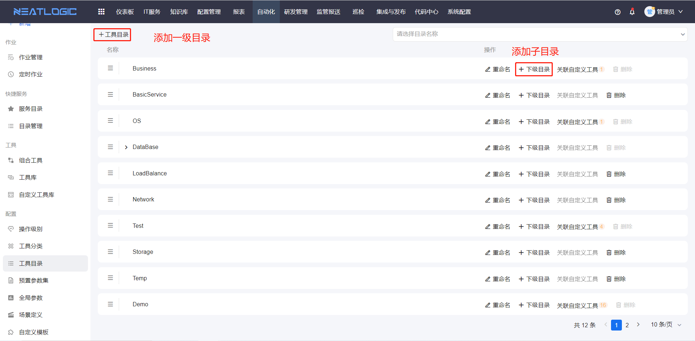

### 重命名

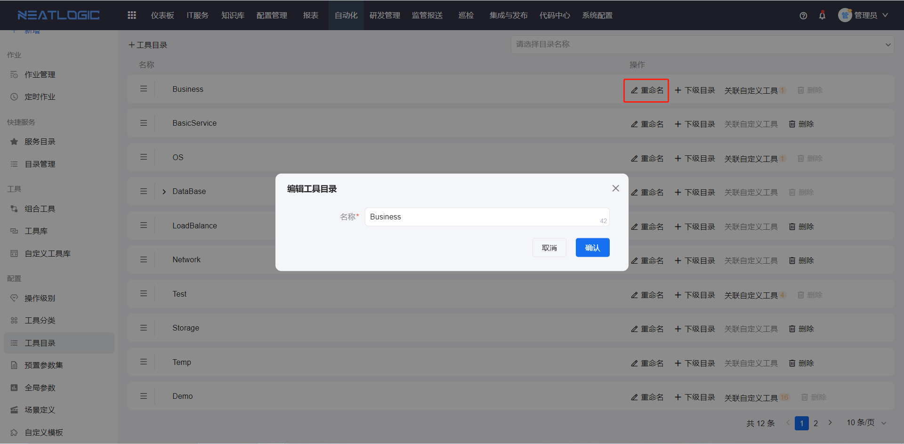

### 删除目录

仅未被引用的目录可以删除。

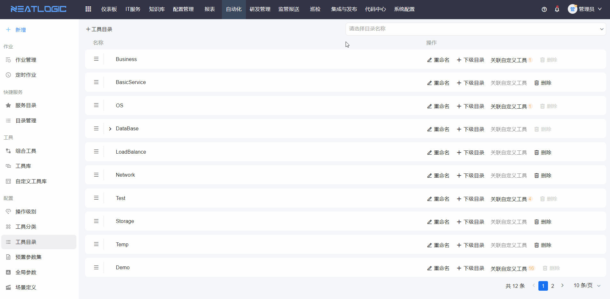

### 调整排序和层级

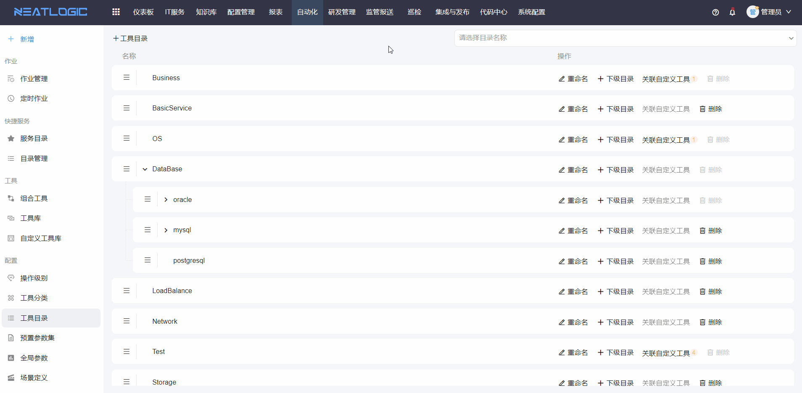

## 预置参数集

预置参数集用于将一个或多个工具脚本的常用参数值保存为参数集合。

在组合工具的阶段中添加工具后，可以启用关联预置参数集，并将预置参数集中的值作为工具参数映射对象。该方式适合复用稳定的参数组合，减少重复配置。

### 添加

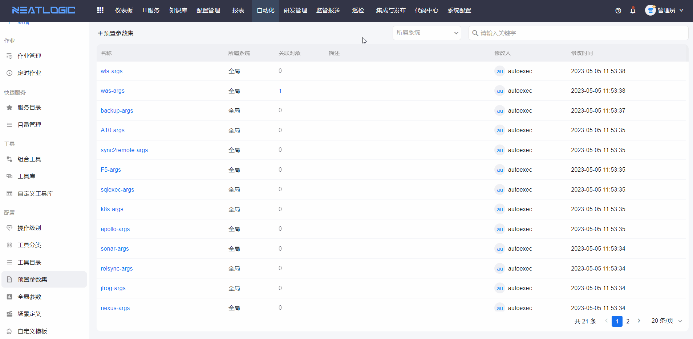

### 编辑

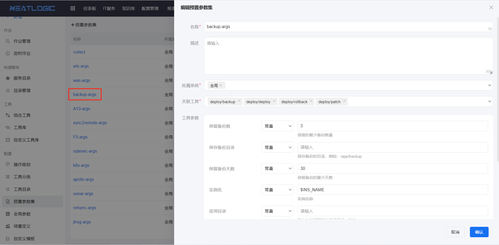

### 复制

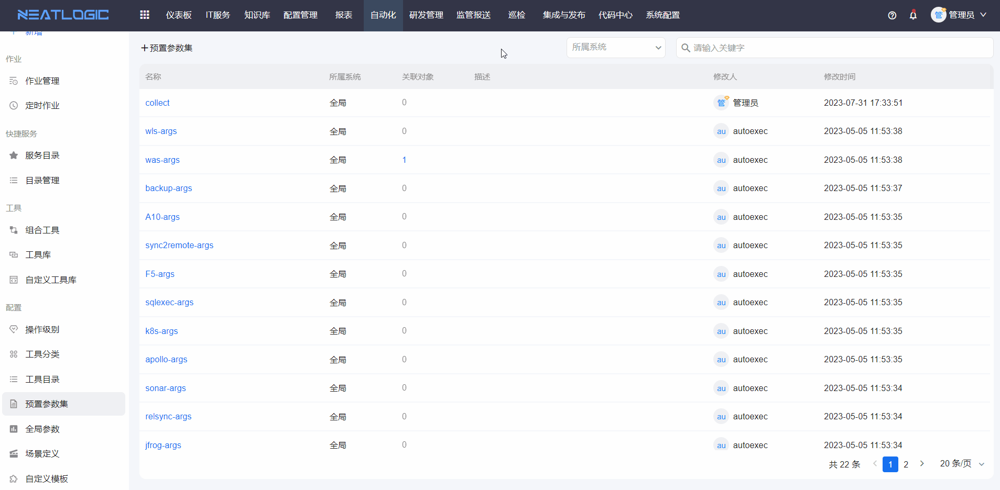

### 查看引用

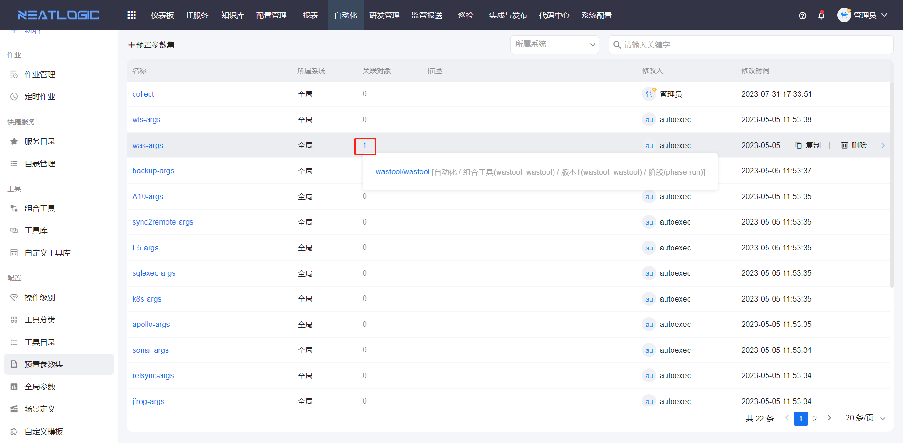

## 全局参数

全局参数用于为组合工具中的工具参数提供统一的映射值。

当多个组合工具或多个阶段需要使用相同参数值时，可以通过全局参数集中维护，减少重复配置。

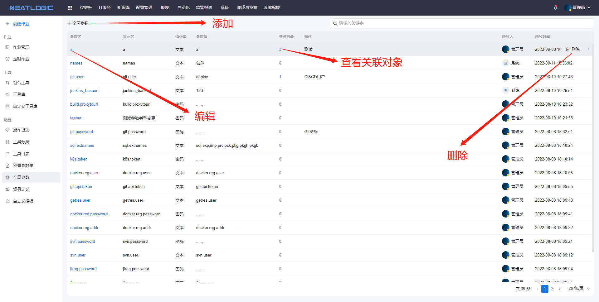

## 场景定义

场景定义用于维护可被自动化和发布流程引用的场景。

场景可应用于自动化组合工具场景，以及集成和发布模块中应用配置的流水线场景。

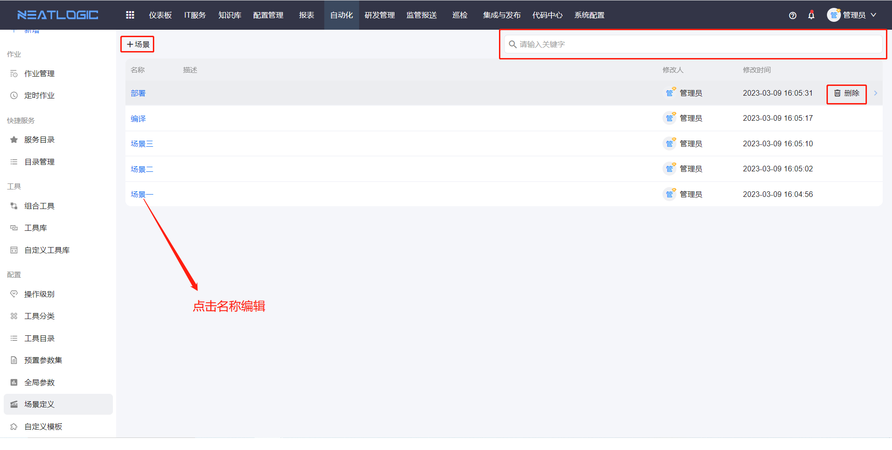

## 自定义模板

自定义模板用于维护工具和自定义工具可复用的模板内容。

工具或自定义工具可以引用自定义模板。执行作业时，系统会按模板配置回显模板内容，便于统一维护重复使用的脚本片段或配置内容。

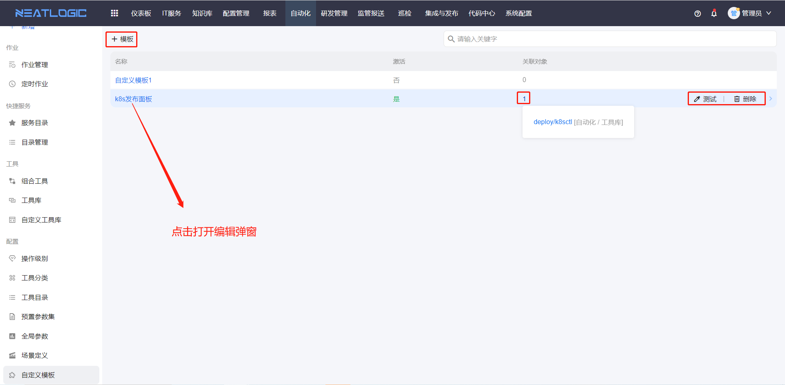
