# 一键发布
一键发布页面是发起发布作业的页面，发起作业的方式支持发起单个作业和批量作业两种。

## 发起单个作业
发起单个作业时，用户首先选择能发起作业应用或模块，否则添加作业的入口禁用。

以下情况选择应用或模块后不支持发起作业
- 选择应用，应用未关联模块
  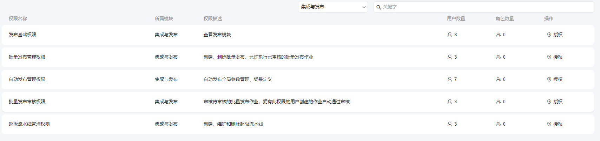
- 选择应用，应用配置了模块，但是所有模块都未关联任何环境
  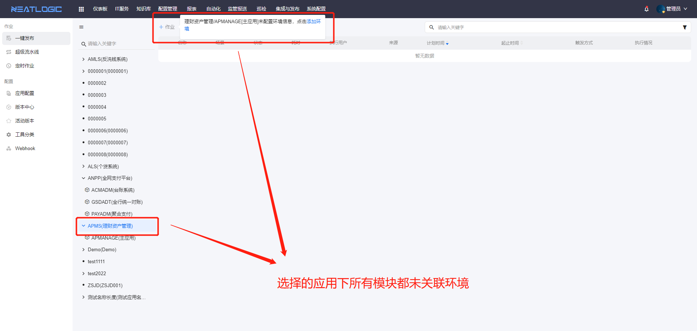
- 选择模块，模块未关联环境
  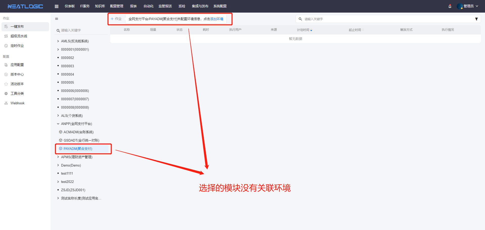

发起发布作业操作流程
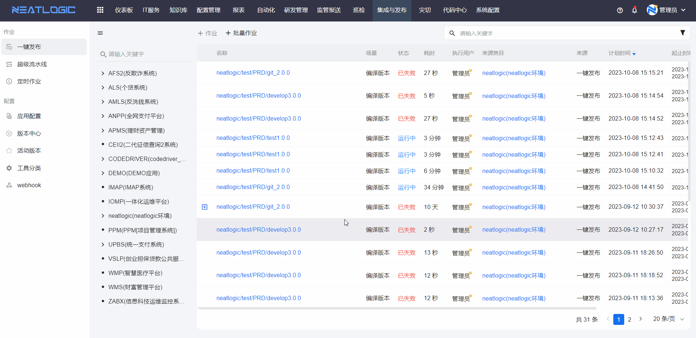
应用模块未配置执行器时，显示快捷添加执行器操作入口。
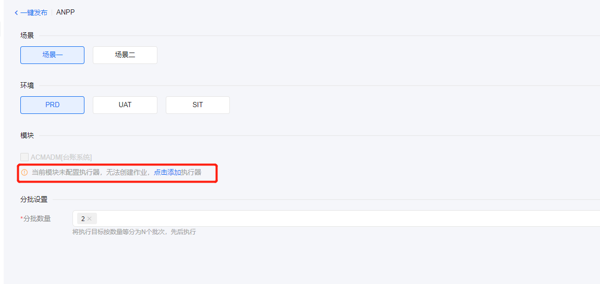
当前已选的场景中包含build或deploy类型的工具，已选的模块需要选择构建版本（Buildno），版本来源于[版本中心](../6.集成与发布/版本中心.md)。
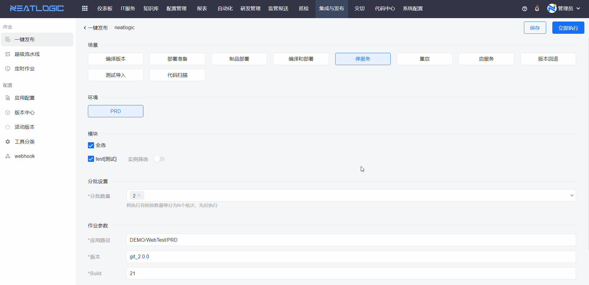

## 批量作业
批量作业是添加一个作业集合，作业集合中包含两个及以上的作业，支持直接手动创建和通过超级流水线创建两种方式。批量作业的特点：批量执行、批量验证。

权限说明：用户有 系统配置-权限管理-发布基础权限 即可访问一键发布页面，可以添加批量作业操作。

### 直接创建
直接创建的方式，通过添加批量通道，选择已保存的发布作业作为子作业。 
相关权限：系统配置-权限管理-批量发布管理权限
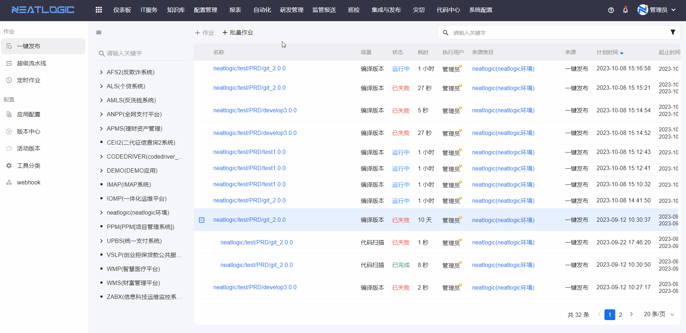
操作说明：
1. 执行策略：一个子作业执行完成后，是否自动执行下一子作业，执行按钮为灰色表示自动执行，按钮为蓝色表示要人工手动执行
  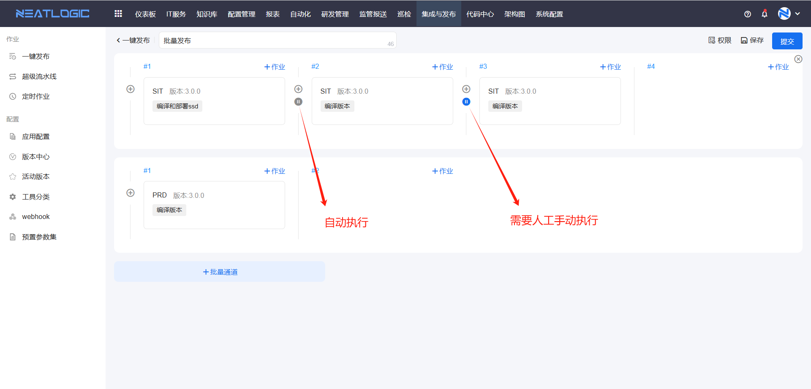

1. 权限：执行权限授权，除了拥有“批量发布管理权限”的用户外，被授权批量作业的用户可以执行和中止批量作业。
  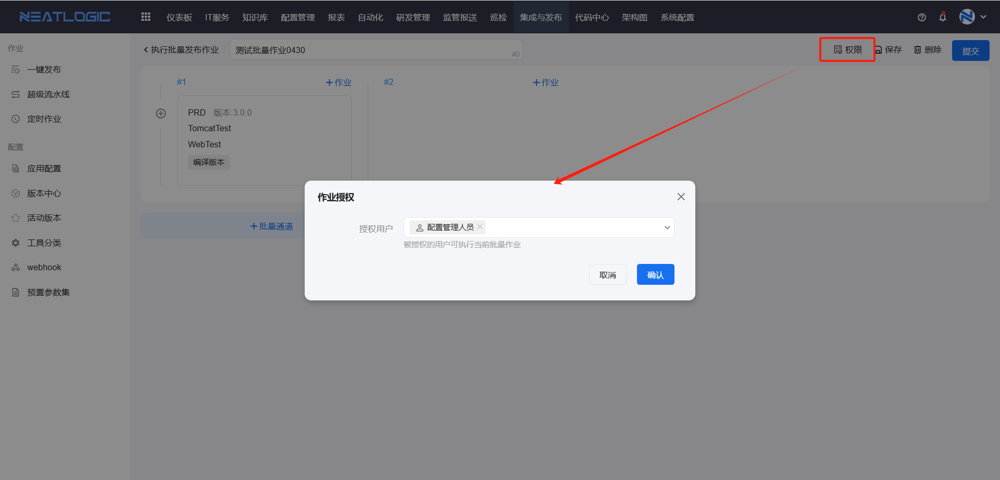

1. 执行：开始执行批量作业，按照执行策略开始执行子作业，批量作业状态变成处理中。
  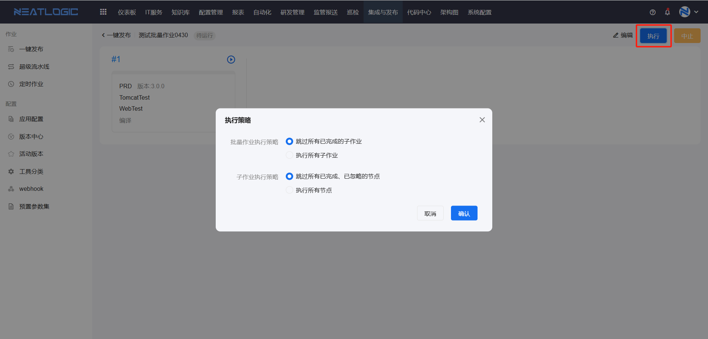

1. 中止：中止批量作业，批量作业状态变成已中止。
  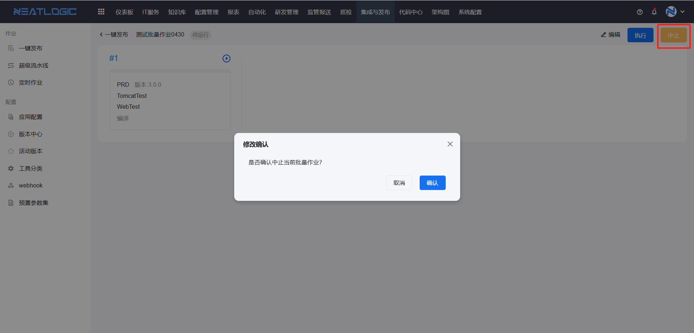

### 超级流水线创建
通过超级流水线模板创建批量作业。 
相关权限：编辑超级流水线-权限
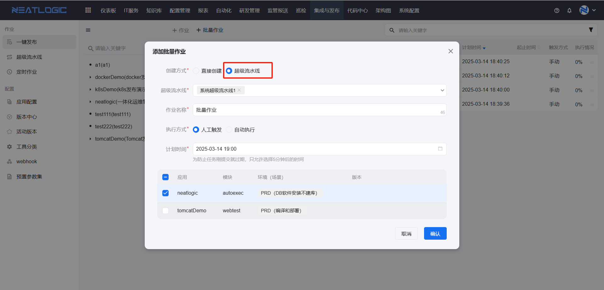

## 查看作业
点击作业名称，跳转到作业详情页面
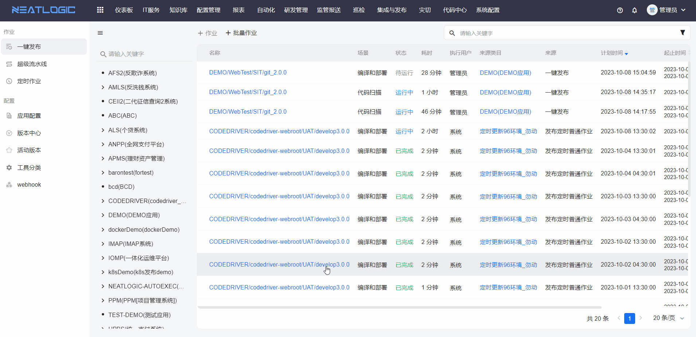

## 相关权限说明
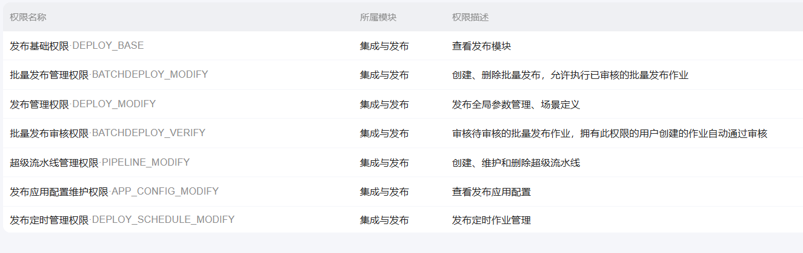
1. 用户有自动发布管理权限时，拥有执行集成和发布模块所有页面的资源和操作权限。
2. 用户无自动发布管理权限时，有发布基础权限，才能查看一键发布页面。
3. 用户有发布基础权限同时被授予应用的执行权限，才能通过该应用发起作业。
   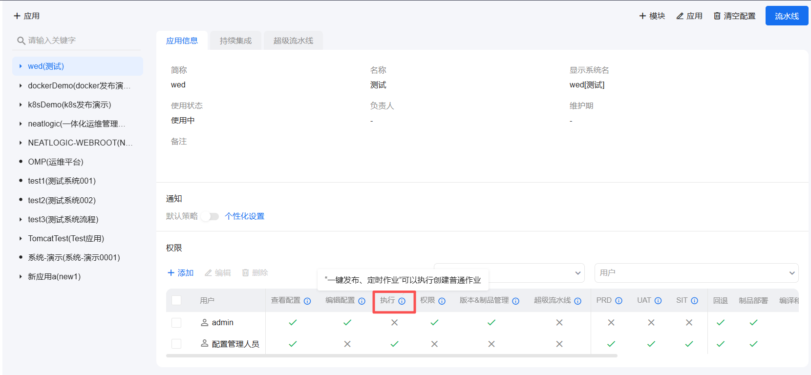
4. 用户有批量发布审核权限或批量发布管理权限时，可直接创建和删除批量发布作业。
5. 用户有批量发布审核权限时，才能审核批量发布作业
6. 用户有批量发布管理权限，或者被授权了批量作业的执行权限，可以执行批量发布作业。
   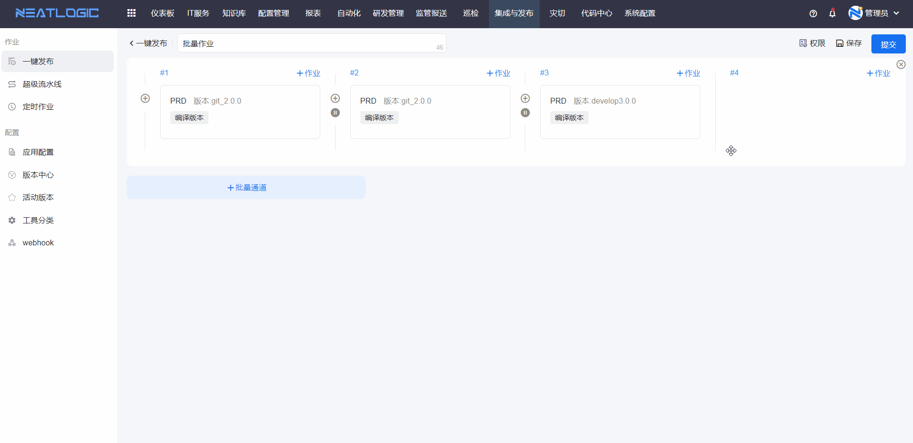