# 一键发布

一键发布用于发起发布作业。您可以按应用或模块创建单个作业，也可以将多个作业组合为批量作业统一执行。

## 权限

**操作权限**

- 配置：系统配置-[用户管理](../../100.系统配置/1.用户和权限/用户管理.md)-授权-发布基础权限
- 包含操作：访问一键发布页面、创建批量作业
- 配置人员：系统超级管理员

- 配置：系统配置-[用户管理](../../100.系统配置/1.用户和权限/用户管理.md)-授权-自动发布管理权限
- 包含操作：管理集成与发布模块中的全部作业和资源，不受应用数据范围限制
- 配置人员：系统超级管理员

- 配置：系统配置-[用户管理](../../100.系统配置/1.用户和权限/用户管理.md)-授权-批量发布审核权限
- 包含操作：创建、删除和审核批量作业
- 配置人员：系统超级管理员

- 配置：系统配置-[用户管理](../../100.系统配置/1.用户和权限/用户管理.md)-授权-批量发布管理权限
- 包含操作：创建、删除和执行批量作业
- 配置人员：系统超级管理员

**数据权限**

- 配置：应用配置-应用层-授权
- 包含操作：发起对应应用的发布作业
- 配置人员：拥有对应应用“执行”权限的用户

拥有发布基础权限，同时拥有应用“执行”权限的用户，才可以为该应用发起作业。

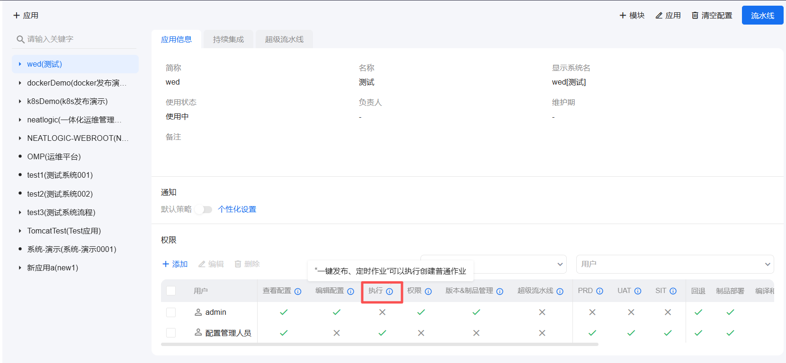

- 配置：批量作业-授权
- 包含操作：执行或中止已授权的批量作业
- 配置人员：拥有批量作业管理权限的用户

拥有批量发布管理权限的用户可以直接执行批量作业；其他用户需要获得对应批量作业的执行授权后，才可以执行或中止该作业。

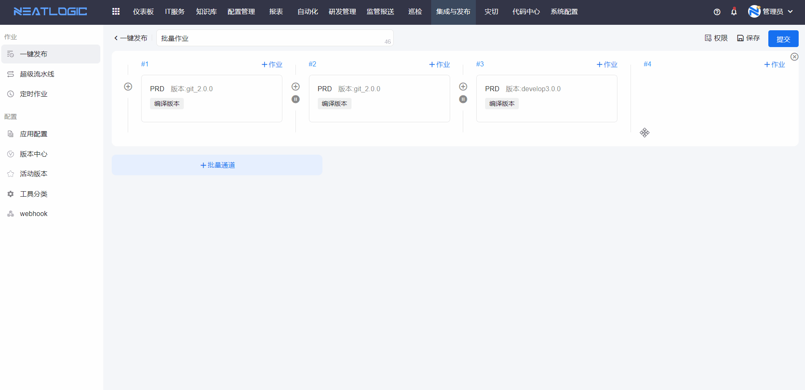

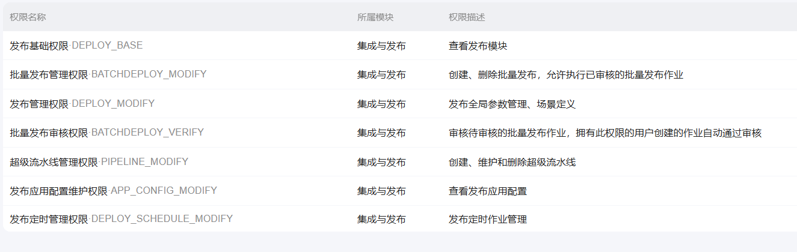

## 阅读路径

可根据当前要解决的问题选择阅读入口。

- 如果需要为某个应用或模块发起发布作业，请阅读“发起单个作业”。
- 如果需要按顺序或并行执行多个发布作业，请阅读“批量作业”。
- 如果需要查看作业执行过程和执行结果，请阅读“查看作业”。

## 发起单个作业

发起作业前，需要先选择应用或模块。未选择应用或模块时，“添加作业”入口不可用。

选择应用或模块后，出现以下情况时仍无法发起作业：

- 所选应用未关联模块。

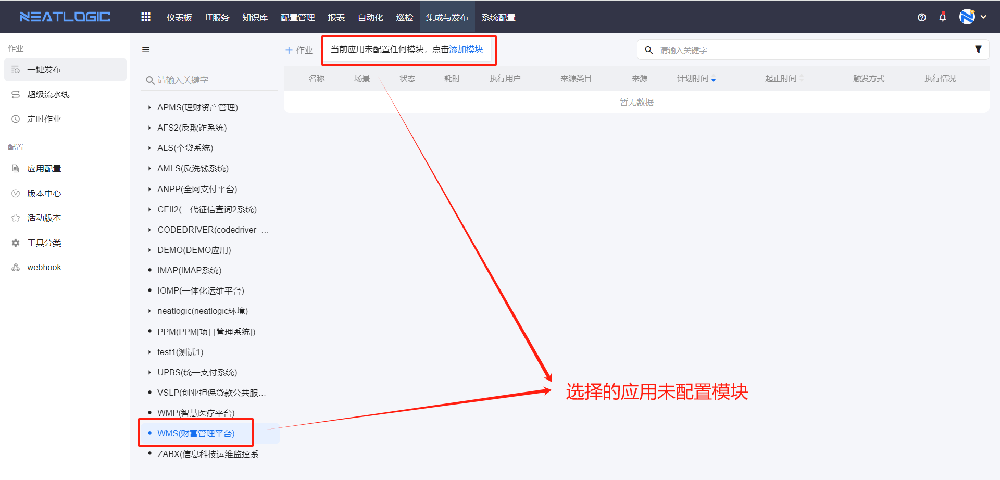

- 所选应用已关联模块，但所有模块均未关联环境。

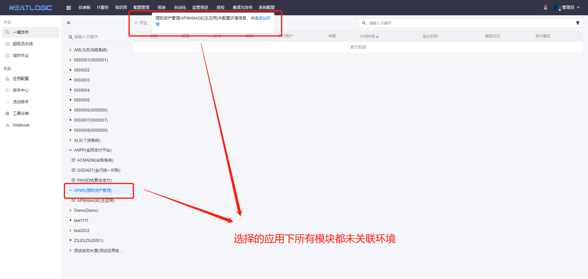

- 所选模块未关联环境。

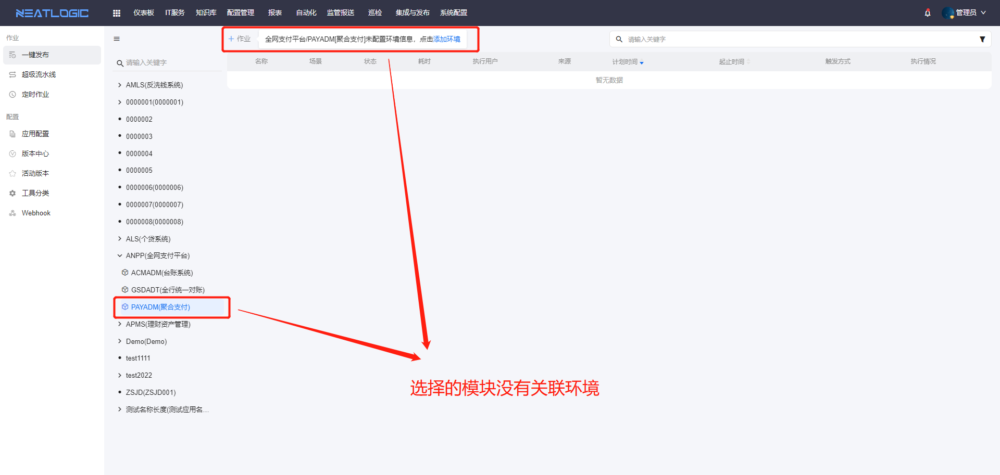

**发起发布作业操作流程**

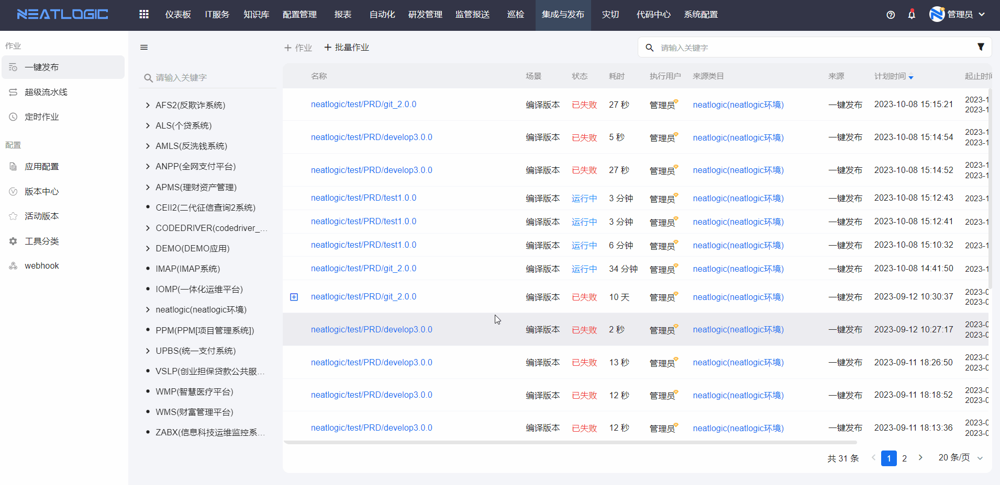

如果应用模块未配置执行器，可在添加作业时通过快捷入口关联执行器。

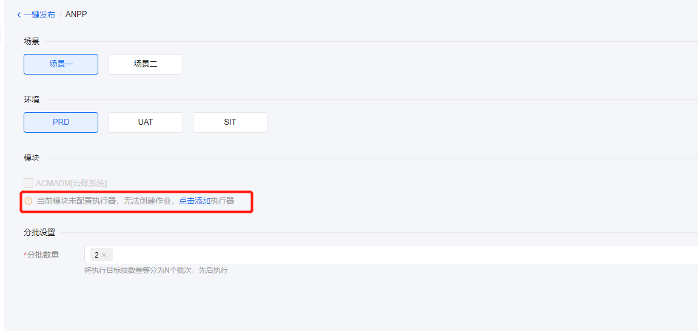

当所选场景包含 build 或 deploy 类型的工具时，需要为所选模块指定构建版本（BuildNo）。构建版本可在[版本中心](../配置/版本中心.md)中维护。

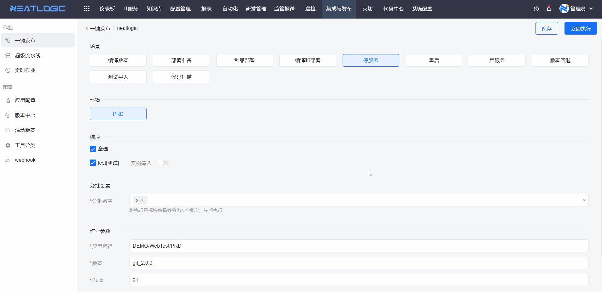

## 批量作业

批量作业由两个或以上的发布作业组成，可用于统一编排多个作业的执行顺序和执行策略。批量作业支持直接创建，也支持基于超级流水线创建。

### 直接创建

直接创建批量作业时，需要添加批量发布通道，并从已保存的发布作业中选择子作业。

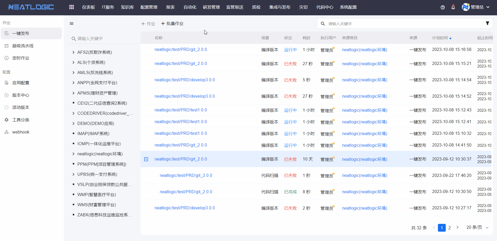

批量作业支持以下操作：

1. **设置执行策略**

   可为子作业设置执行策略。前一子作业完成后，系统可自动执行下一子作业，也可以等待人工确认后继续执行。

   执行按钮为灰色表示自动执行，蓝色表示需要人工执行。

   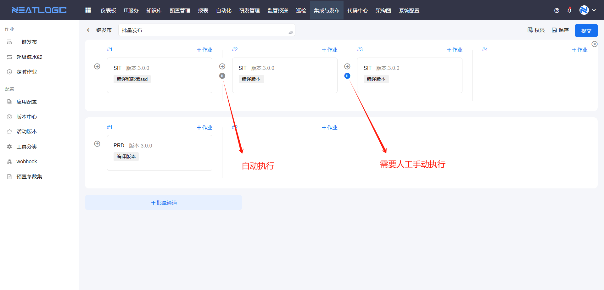

2. **设置作业授权**

   除拥有批量发布管理权限的用户外，还可以为批量作业单独授权。被授权用户可执行或中止该批量作业。

   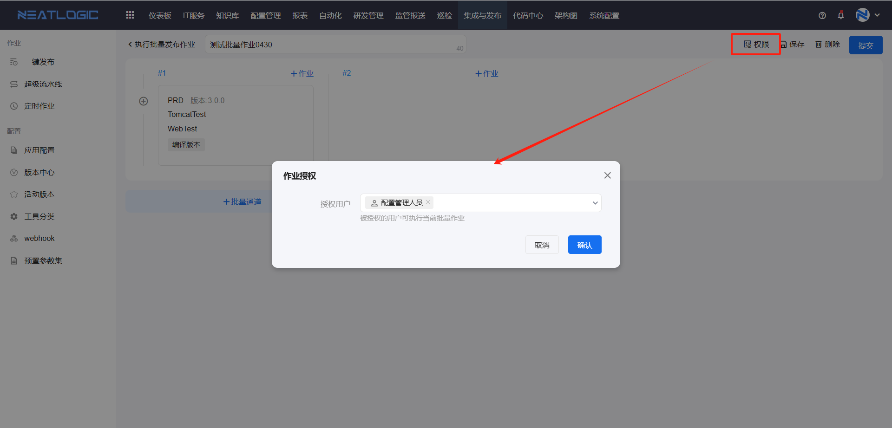

3. **执行批量作业**

   启动批量作业后，系统会按照配置的执行策略依次处理各子作业，批量作业状态变为“处理中”。

   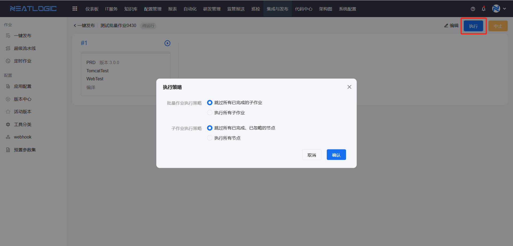

4. **中止批量作业**

   作业执行过程中可中止批量作业。中止后，批量作业状态变为“已中止”。

   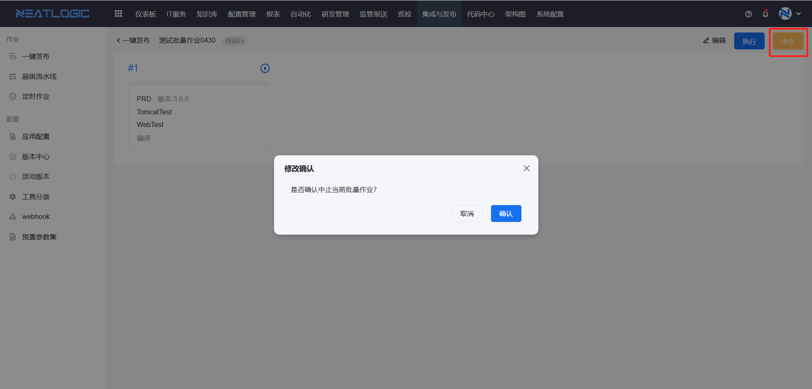

### 超级流水线创建

可基于超级流水线模板创建批量作业。超级流水线分为应用流水线和全局流水线。

使用应用流水线创建批量作业时，可在当前应用范围内选择流水线模板。

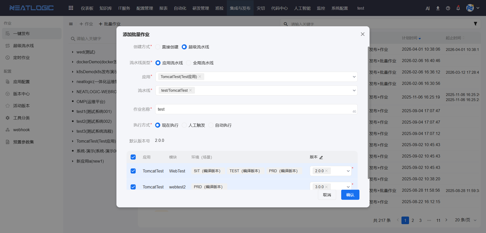

使用全局流水线创建批量作业时，可选择已授权的全局流水线模板。

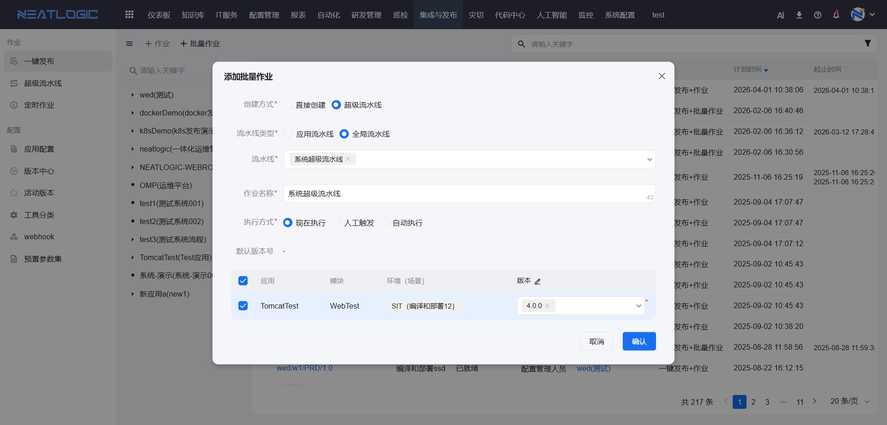

## 查看作业

在一键发布列表中单击作业名称，可进入作业详情页，查看作业的执行状态、执行记录和处理结果。

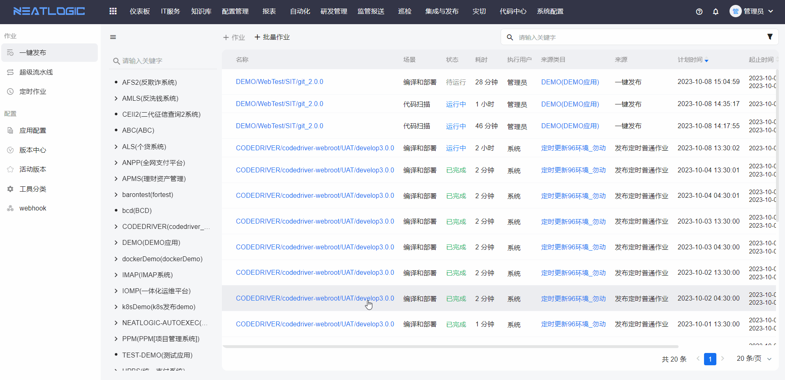
