# 定时作业

定时作业用于按照预设时间自动发起发布任务。您可以创建普通定时作业，也可以基于超级流水线创建定时批量作业。

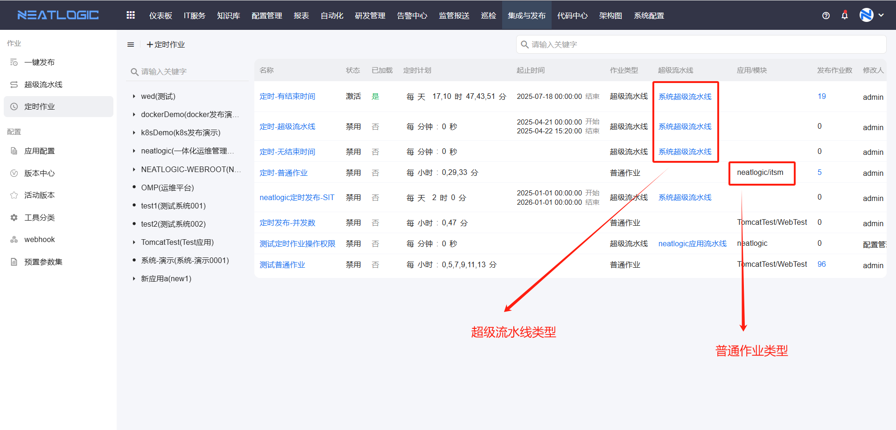

## 权限

**操作权限**

- 配置：系统配置-[用户管理](../../100.系统配置/1.用户和权限/用户管理.md)-授权-发布定时管理权限
- 包含操作：访问定时作业菜单
- 配置人员：系统超级管理员

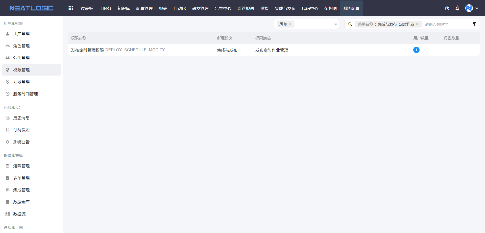

**数据权限**

- 配置：应用配置-应用层-授权
- 包含操作：在定时作业中查看应用；创建普通作业和应用超级流水线定时作业
- 配置人员：拥有对应应用“查看配置”“编辑配置”“权限”或“执行”权限的用户

应用列表仅展示当前用户有“查看配置”“编辑配置”“权限”或“执行”权限的应用。创建普通作业或应用超级流水线定时作业时，还需要拥有对应应用的“执行”权限。

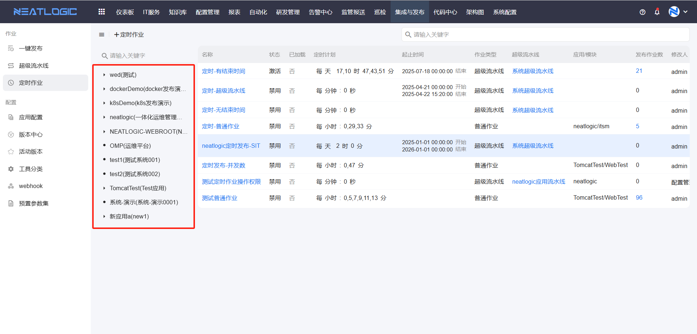

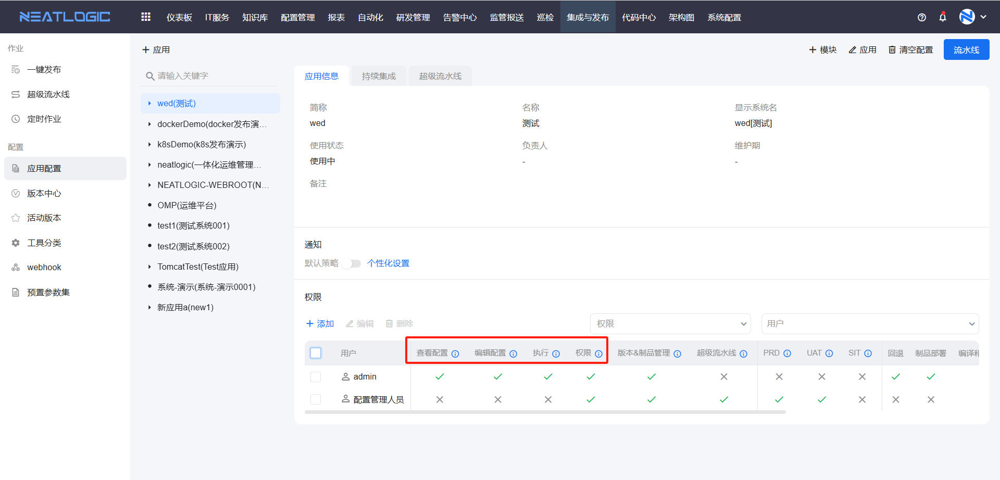

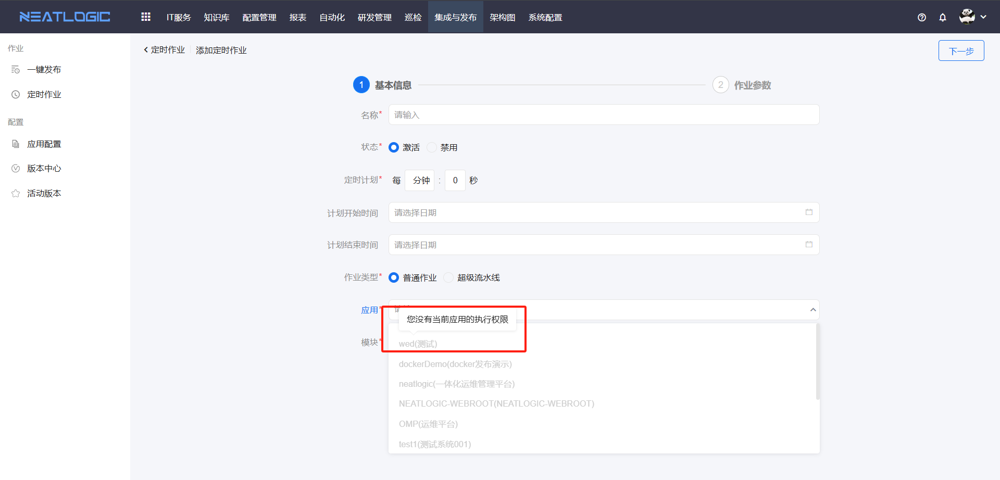

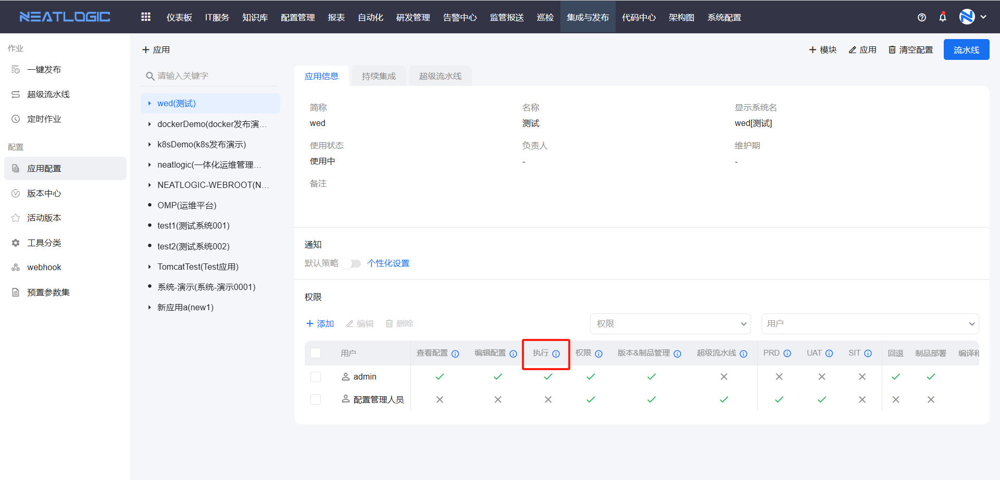

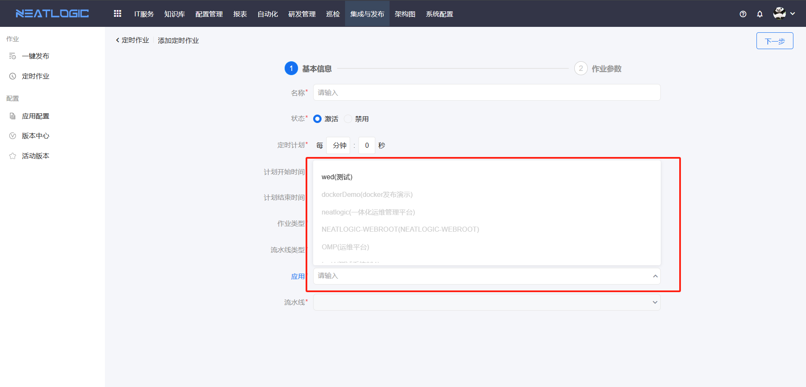

- 配置：超级流水线-授权
- 包含操作：在定时作业中选择和执行全局超级流水线
- 配置人员：拥有对应全局超级流水线“执行”权限的用户

创建全局流水线定时作业时，系统仅展示当前用户有执行权限的全局流水线。

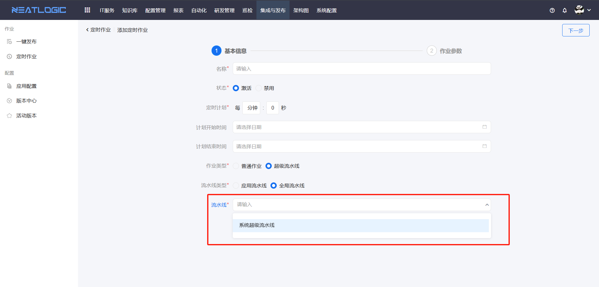

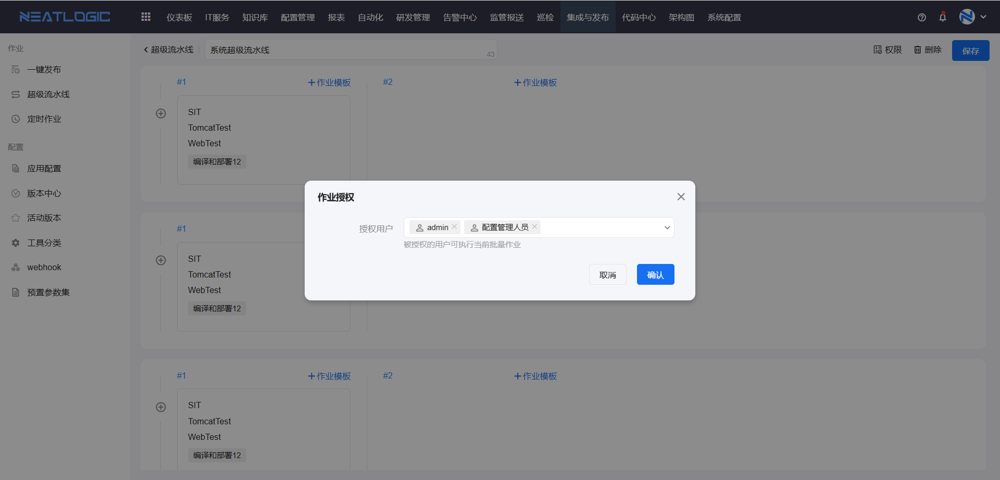

## 阅读路径

可根据当前要解决的问题选择阅读入口。

- 如果需要定时发起单个应用的发布作业，请阅读“添加定时作业-普通作业”。
- 如果需要按超级流水线定时执行多个作业，请阅读“添加定时作业-超级流水线”。
- 如果需要确认定时作业是否会按计划执行，请阅读“定时作业执行”。

## 添加定时作业

在定时作业页面单击“添加”，进入定时作业配置页面。

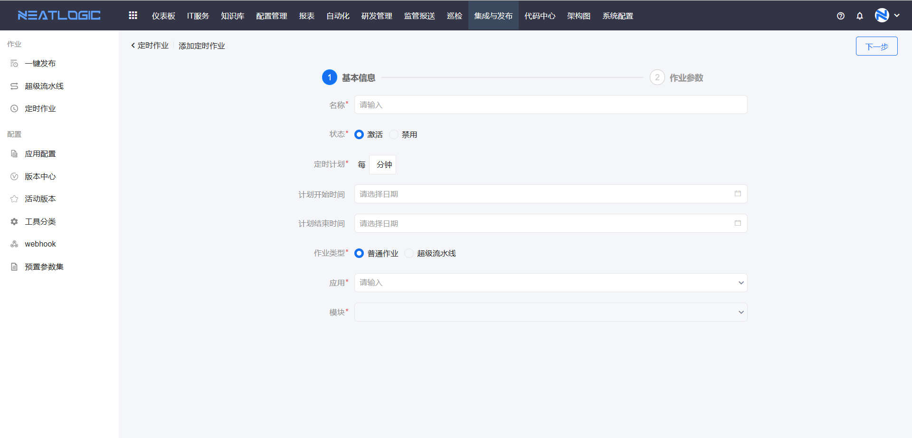

### 普通作业

普通作业适用于定时执行单个发布任务。例如，每天凌晨 2:00 对测试环境执行一次发布。

选择“普通作业”类型后，需要配置应用和模块。应用下拉列表仅展示当前用户有执行权限的应用；被禁用的应用表示其[应用配置](../配置/应用配置.md)尚未完成。

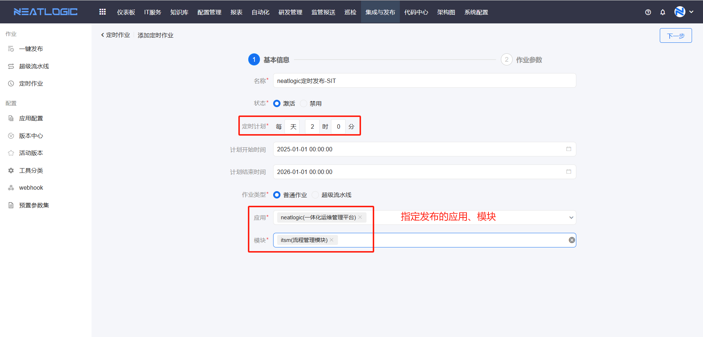

完成基础信息配置后，单击“下一步”，根据所选场景补充作业参数并保存。

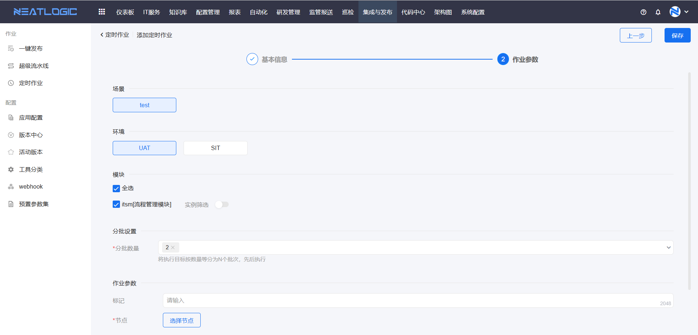

### 超级流水线

超级流水线定时作业适用于按[超级流水线](超级流水线.md)模板定时发起批量作业。创建时可预设子作业的发布版本。

选择“超级流水线”类型后，需要配置定时计划、计划时间段、流水线类型和流水线。

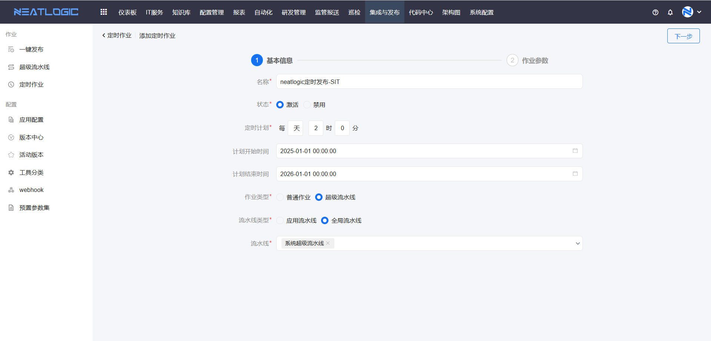

完成基础信息配置后，单击“下一步”，勾选需要发布的作业，选择版本并保存。

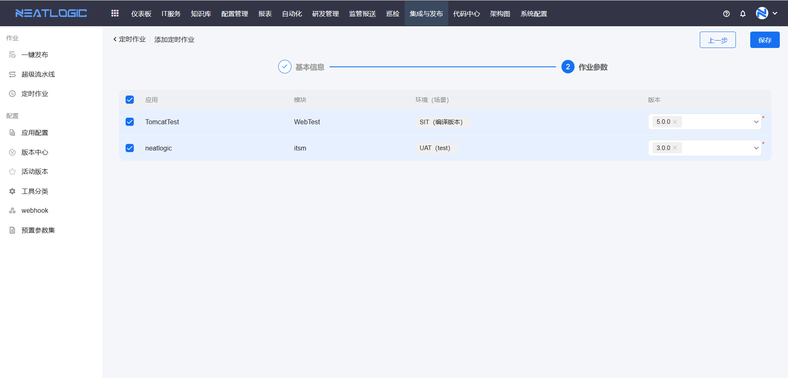

## 定时作业执行

当前时间到达计划执行时间时，定时作业还需要同时满足以下条件才会执行：

1. 定时作业状态为“激活”。

   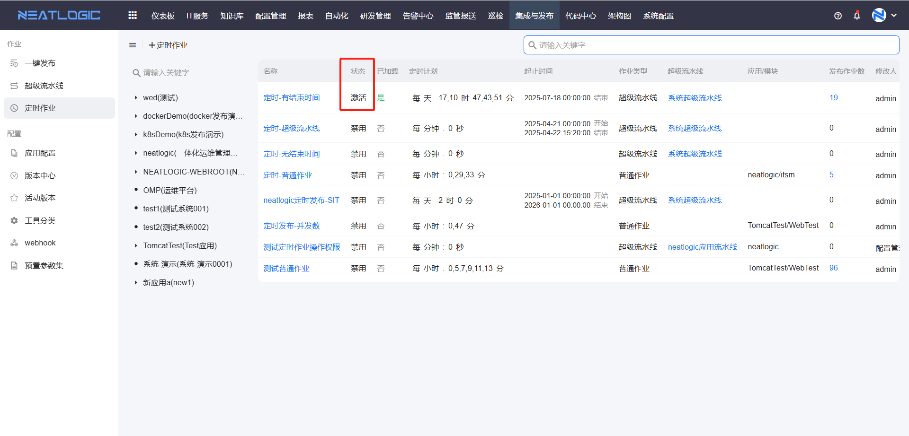

2. 定时作业已加载，即下一次执行时间处于定时作业的起止时间范围内。

   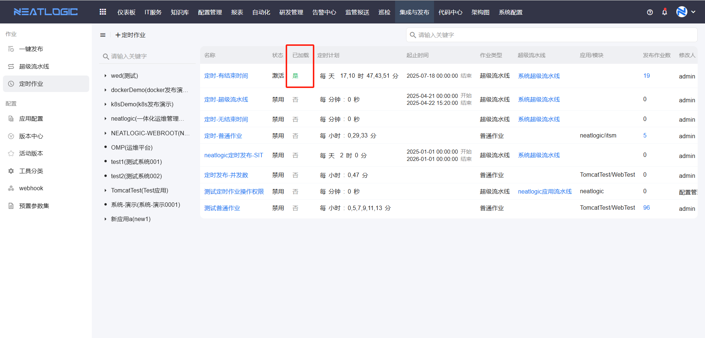

定时作业支持查看执行记录。单击执行记录中的数字，可查看该定时作业已发起的作业列表。
