# 超级流水线

超级流水线是用于发起批量作业的流水线模板，用于预先定义多个发布作业的组合方式、执行顺序和默认版本。超级流水线分为应用流水线和全局流水线；应用流水线在应用配置的应用层维护，当前页面用于管理全局流水线。

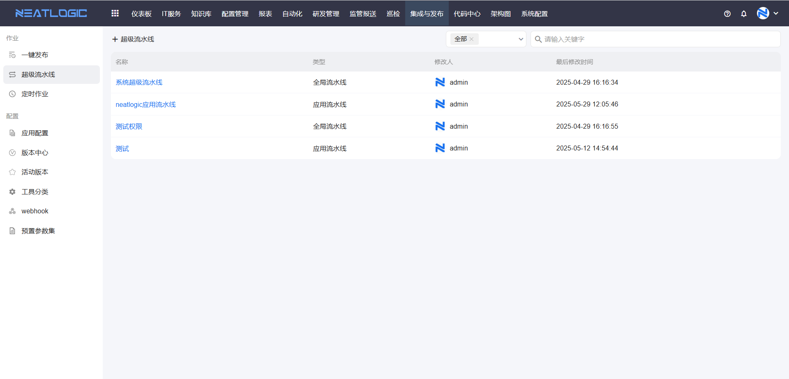

## 权限

**操作权限**

- 配置：系统配置-[用户管理](../../100.系统配置/1.用户和权限/用户管理.md)-授权-超级流水线管理权限
- 包含操作：创建、编辑、删除和发起全局超级流水线
- 配置人员：系统超级管理员

- 配置：系统配置-[用户管理](../../100.系统配置/1.用户和权限/用户管理.md)-授权-批量发布管理权限
- 包含操作：基于超级流水线创建、执行和管理批量作业
- 配置人员：系统超级管理员

**数据权限**

- 配置：应用配置-应用层-授权
- 包含操作：在超级流水线中选择应用，并配置该应用的发布作业
- 配置人员：拥有对应应用“执行”或“编辑配置”权限的用户

- 配置：超级流水线-授权
- 包含操作：查看和执行已授权的全局超级流水线
- 配置人员：拥有对应超级流水线权限的用户

## 阅读路径

可根据当前要解决的问题选择阅读入口。

- 如果需要创建全局超级流水线模板，请阅读“添加超级流水线”。
- 如果需要了解超级流水线可从哪些入口发起批量作业，请阅读“超级流水线应用场景”。
- 如果需要查看基于超级流水线创建的批量作业，请阅读“查看作业列表”。

## 添加超级流水线

在超级流水线管理页面单击“添加”，进入编辑页面。

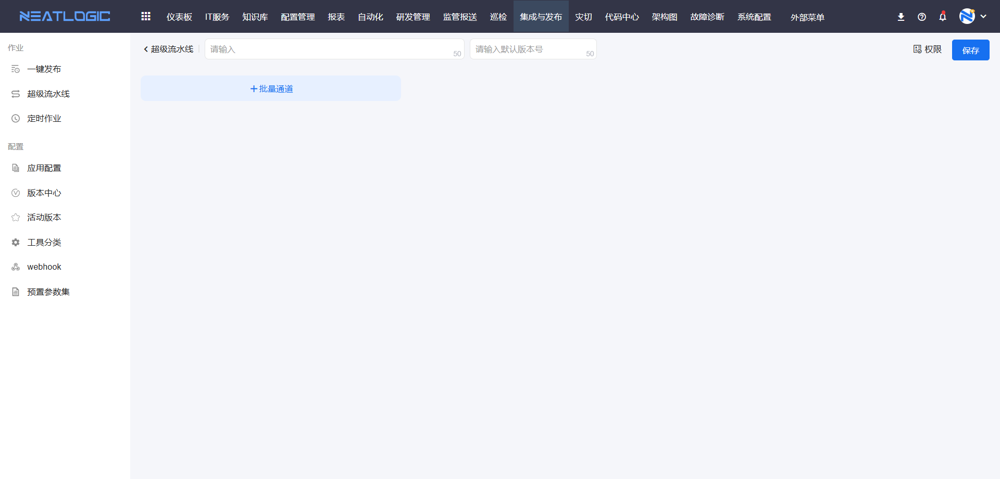

在批量通道中添加作业模板。同一通道中的作业按顺序执行；不同通道中的作业可同时开始执行。

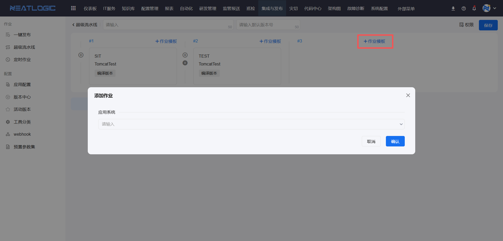

添加作业模板时，需要先选择应用。应用下拉列表仅展示当前用户拥有“执行”或“编辑配置”权限的应用。

选择应用后，完成场景、环境、模块和分批设置的配置，才可以保存。

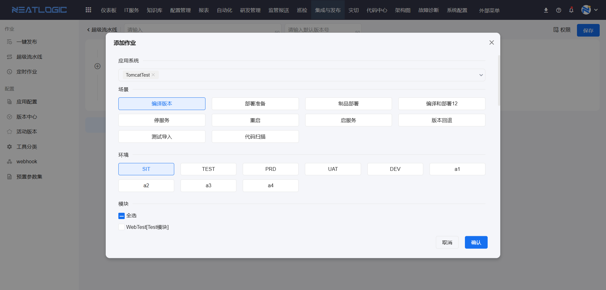

超级流水线支持设置默认版本号。基于该流水线创建批量作业时，系统会自动填充默认版本号。

使用默认版本功能前，需要在系统参数中启用相关配置：`is.pipeline.need.default.version`。

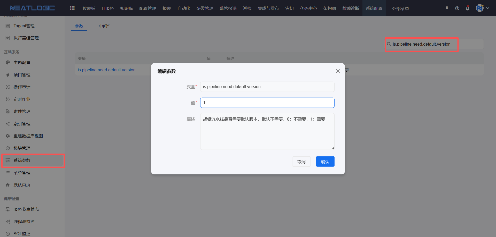

## 超级流水线应用场景

超级流水线支持通过以下三种方式发起批量作业：在超级流水线管理页面发起、在一键发布页面发起，以及通过定时作业发起。

### 超级流水线管理页发起

在超级流水线管理页面发起批量作业时，需要拥有超级流水线管理权限和批量发布管理权限。

单击“添加批量作业”，开始创建批量作业。

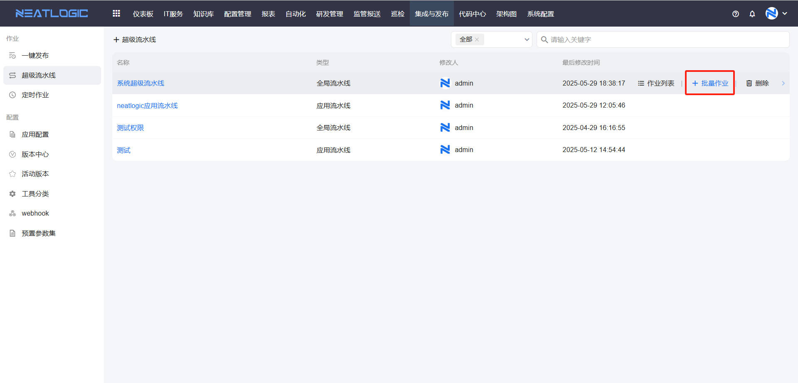

在弹出窗口中勾选子作业，选择版本号后单击“确认”，即可保存批量作业。

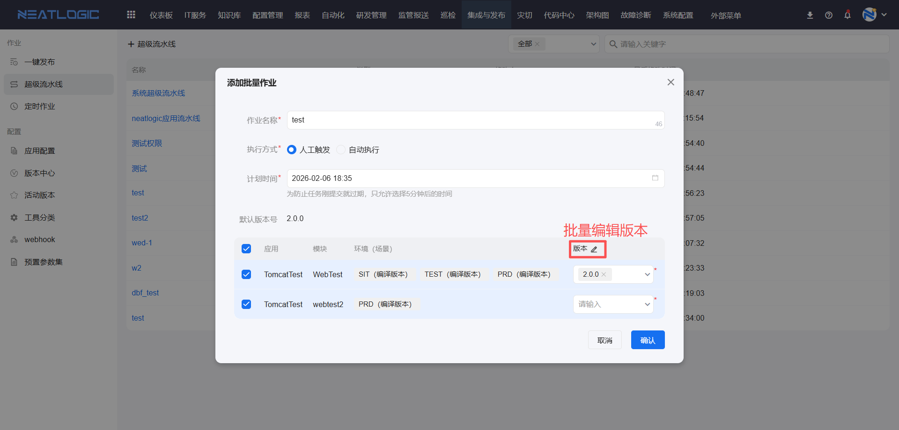

### 一键发布页面发起

在一键发布页面发起批量作业时，需要拥有批量发布管理权限。

打开一键发布页面，单击“添加批量作业”，并选择“超级流水线创建”方式。

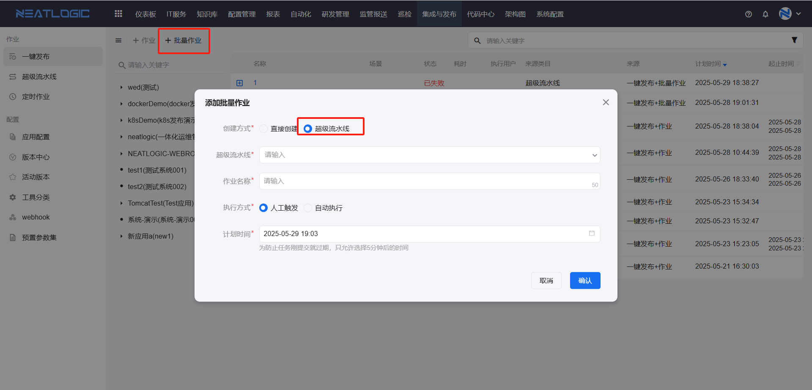

选择目标超级流水线、子作业和版本后，单击“确认”即可创建批量作业。

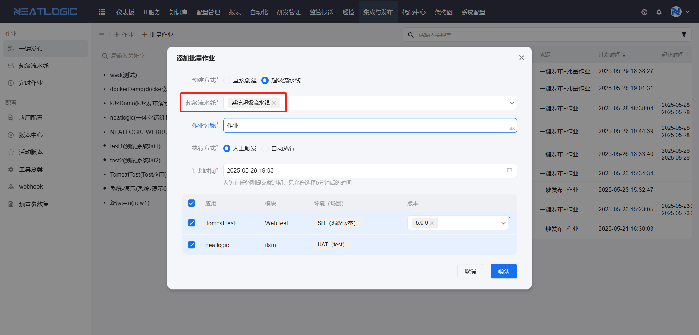

创建后支持批量编辑作业版本。

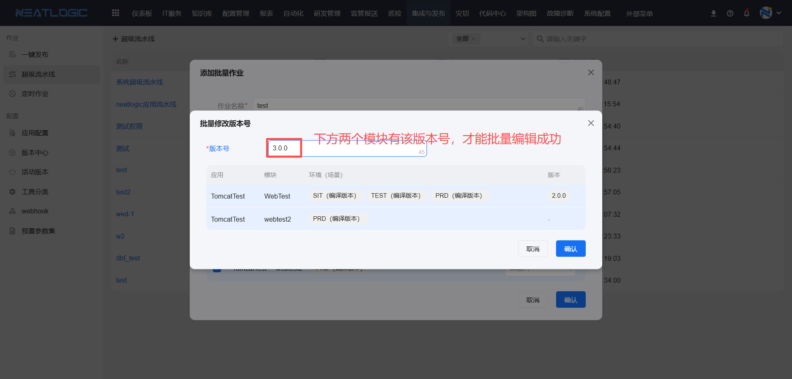

### 定时作业发起

在定时作业中发起批量作业时，需要拥有批量发布管理权限。

添加定时作业时，选择“超级流水线”作业类型，完成相关配置后保存即可。

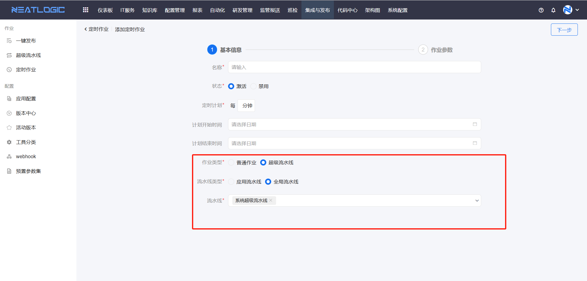

## 查看作业列表

超级流水线支持查看通过该流水线发起的全部批量作业，并了解作业的执行状态和执行结果。

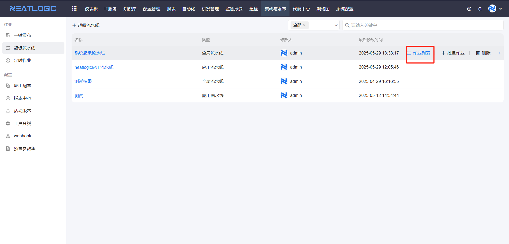

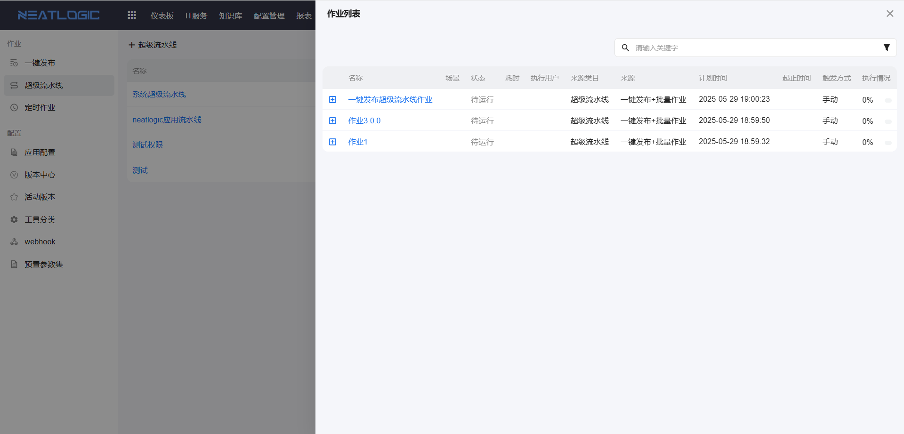
