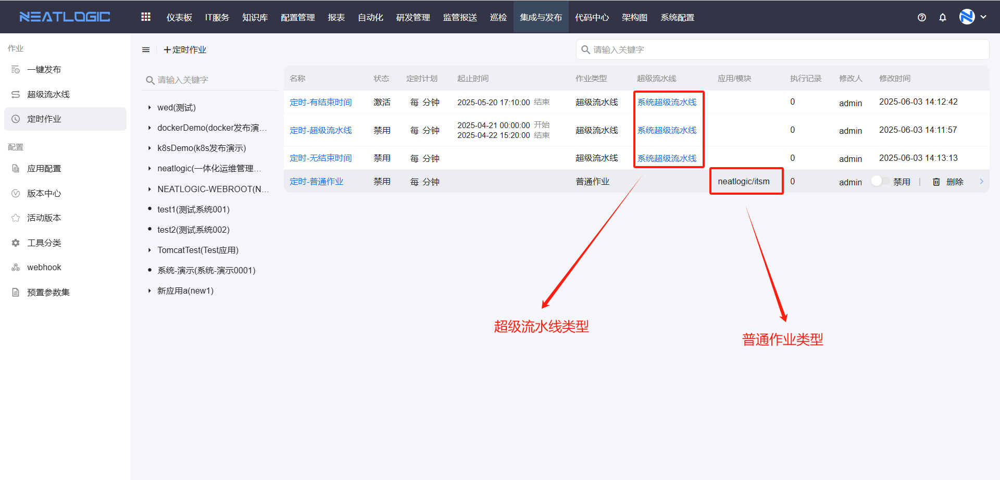
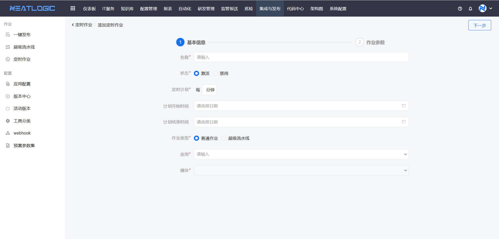
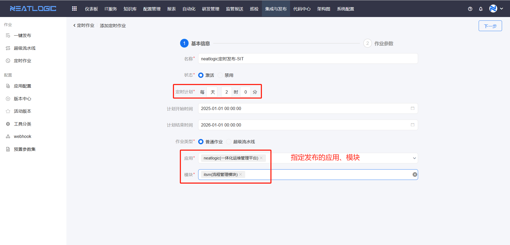
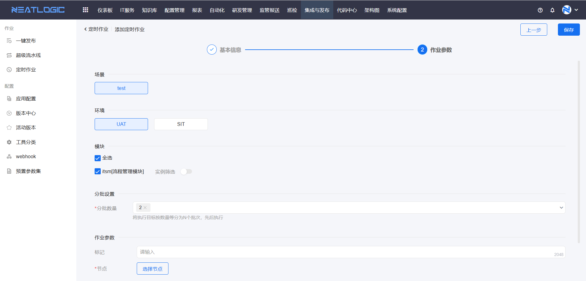
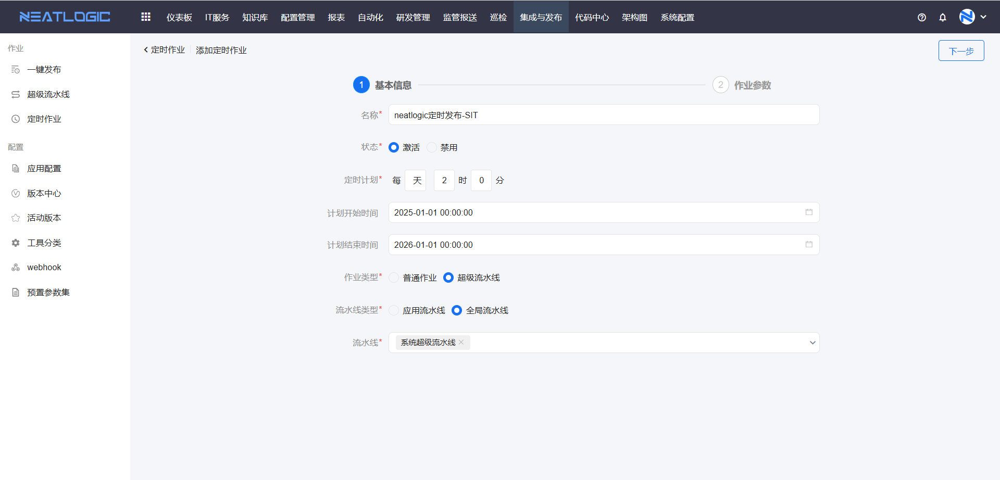
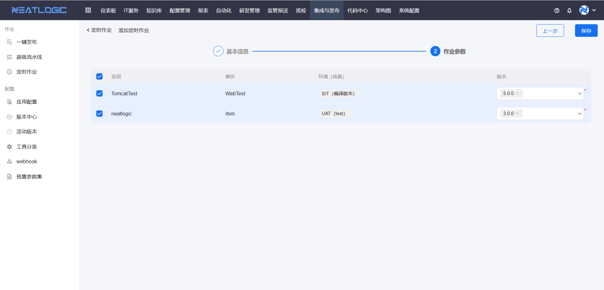
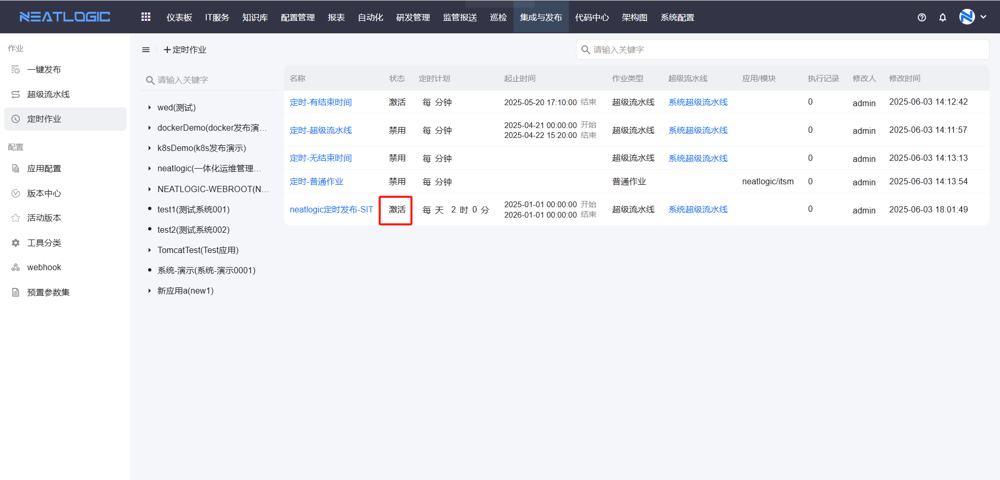
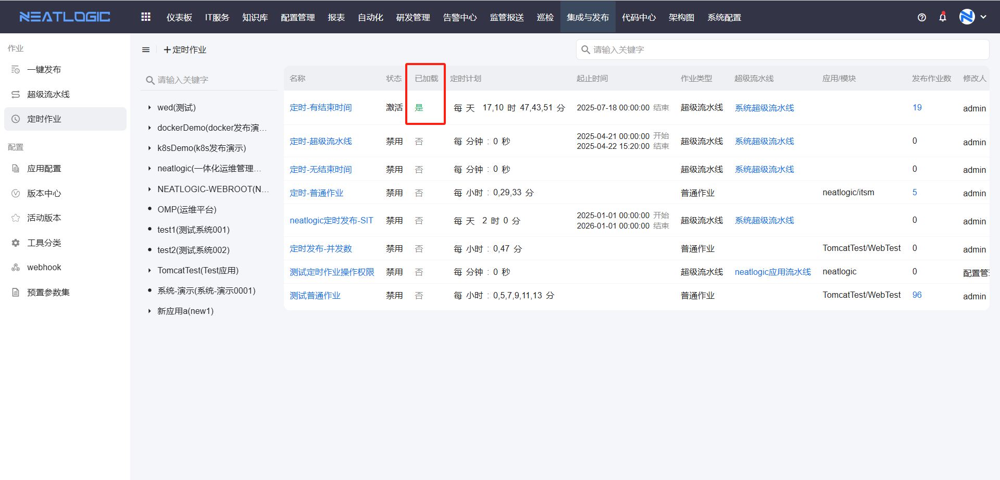

# 定时作业
发布模块的定时作业，通过定时器按照预设发布作业的模板，定时发起发布作业。定时作业的作业有两种类型，包括普通作业和超级流水线批量作业。

## 添加定时作业
点击添加定时作业，跳转到添加页面

### 普通作业
若用户只需要定时发起一个固定配置的发布作业时，可以通过配置普通作业类型的定时作业实现，比如每天凌晨2:00对测试环境进行发布。

在添加定时作业页面，选择“普通作业”类型，配置应用和模块，应用下拉框会过滤出当前用户有执行权限的应用，禁用的选项是[应用配置](应用配置.md)不完整的应用。

完成上述配置后，点击下一步，根据场景完成作业参数配置并保存即可。

### 超级流水线
定时作业还支持定时发起批量作业，以[超级流水线](超级流水线.md)为模板，预设子作业发布版本即可。

在添加定时作业页面，选择“超级流水线”类型，配置定时计划、计划时间段、流水线类型和流水线等。

完成基本信息配置，点击下一步，勾选要发布的作业，选择版本，保存即可。

## 定时作业执行
当前时间到达定时计划时间时，定时作业执行还需要同时满足两个条件：

1. 状态是“激活”
   
2. 无起止时间或当前时间在起止时间范围内
   

定时作业还支持查看执行作业，点击执行记录的数字，出现执行作业列表，如图所示。

## 相关权限
菜单权限：有发布基础权限的用户，才能看到定时作业菜单。
批量发布管理权限：
应用超级流水线-执行权限：