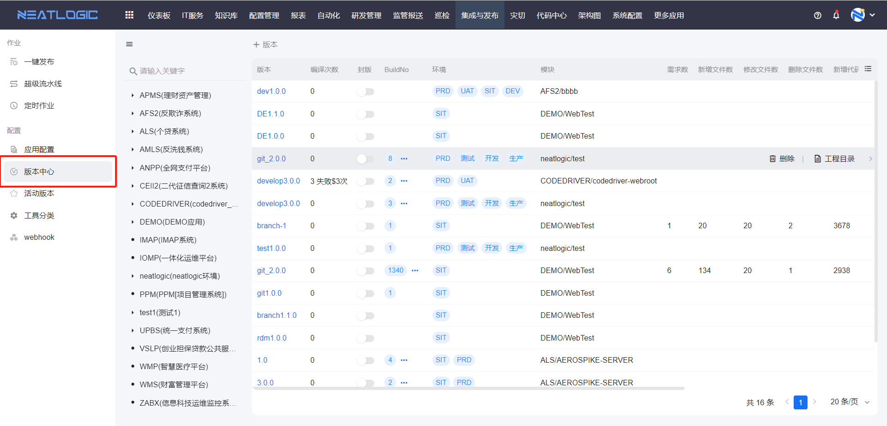
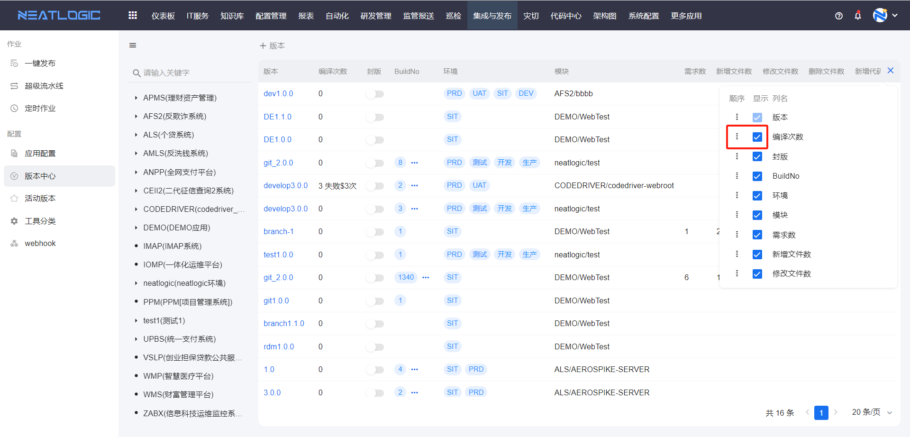
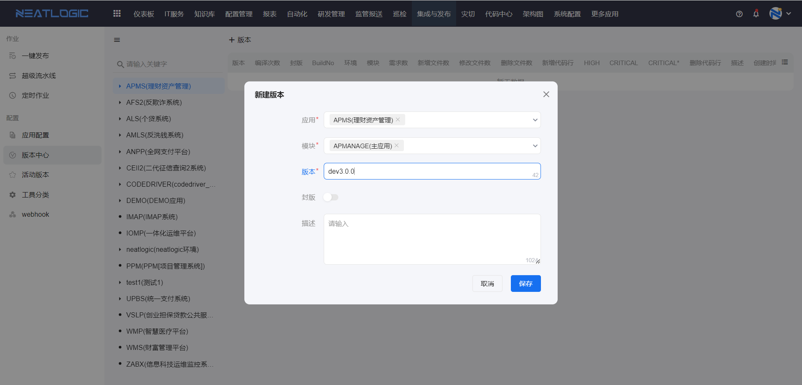
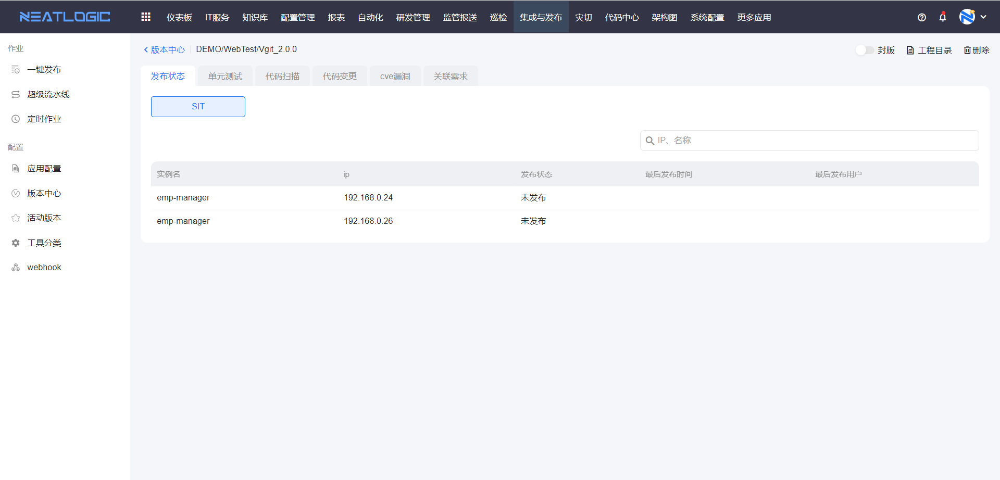
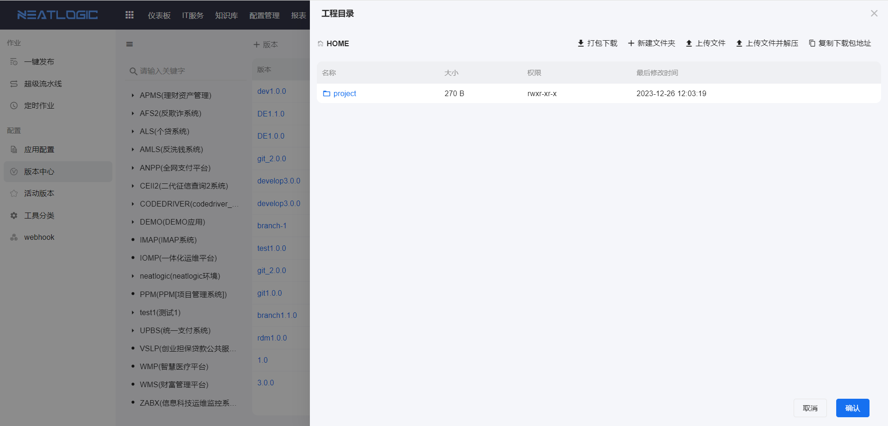
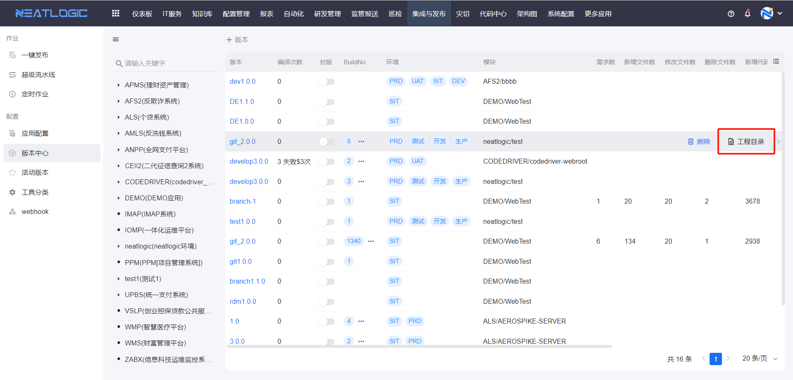
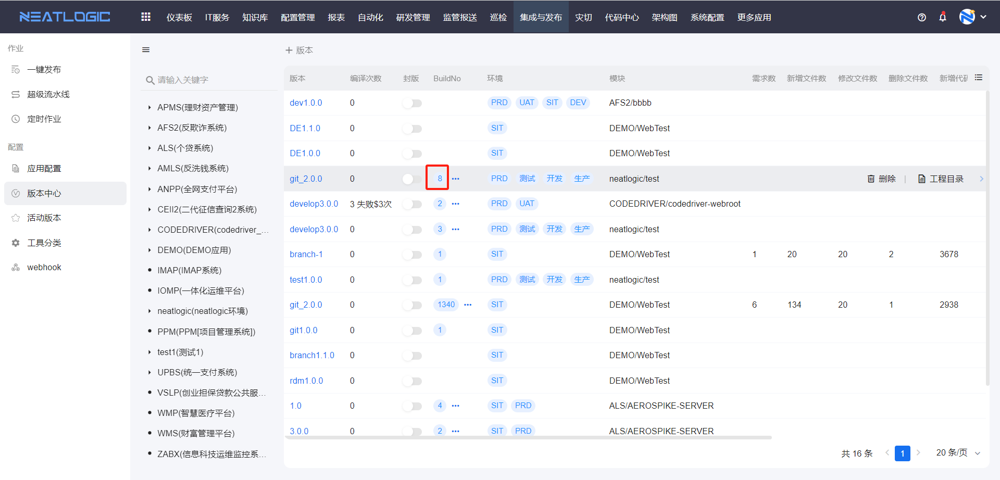
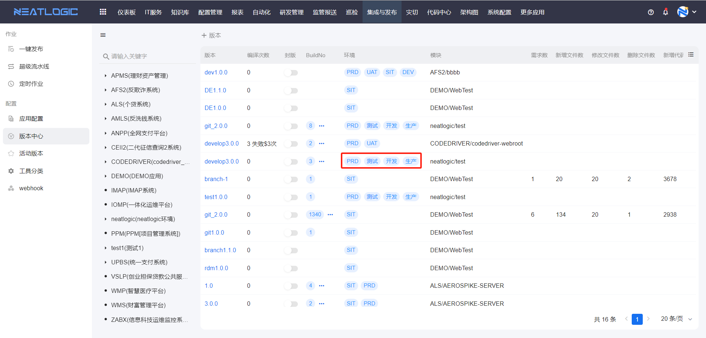

# 版本中心
版本中心是管理应用模块的发布版本的页面，版本即代码管理平台中的版本名。发起发布作业时，发布作业中有Build类型的脚本，需要选择发布的版本号，只支持未封板的版本。

版本列表中版本名称、编译次数、封板、BuildNo、环境、模块等字段，版本列表字段支持排序和显示设置。支持查看版本、添加版本、删除版本、封板和管理版本工程目录等操作。

### 表格字段设置
表格的字段顺序和字段显示支持自定义。

### 添加版本
选择应用或模块后才能添加版本。

### 查看版本
版本详情页面发布状态、单元测试、代码扫描、代码变更、关联需求等内容，执行过发布作业后，且作业执行了相应脚本，才会回显数据。

### 工程目录
执行了编译的脚本后，版本会有生成工程目录保存编译后的制品，工程目录支持打包下载、新建文件夹、上传文件、上传文件并解压、复制下载包地址操作。

1. 版本的工程目录
   
   点击版本上的工程目录按钮，即可查看。这个是指当前版本最近一次编译后生成的制品库。
   

2. BuildNo的工程目录
   
   点击BuildNo字段的标签，即可查看。这个是指版本的对应BuildNo编译后生产的制品库。
   

3. 环境的工程目录
   
   点击环境字段的标签，即可查看。这个是指版本中对应环境最近一次编译后生产的制品库。
   