# 超级流水线
超级流水线是用于发起批量作业的流水线模板，包括应用流水线和全局流水线，应用流水线数据是在应用配置的应用层维护，当前页面只维护全局流水线数据。
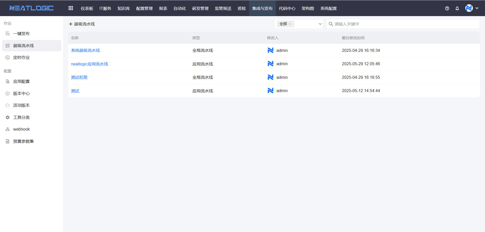

## 添加超级流水线
点击添加超级流水线，跳转到编辑页面
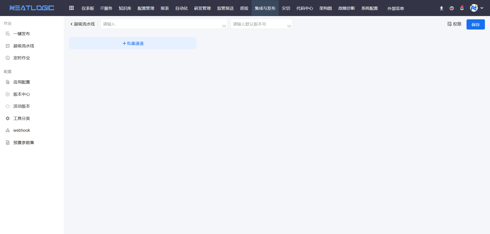
在批量通道中添加作业模板，同一个通道中得作业按顺序执行，不同得通道同时开始执行。
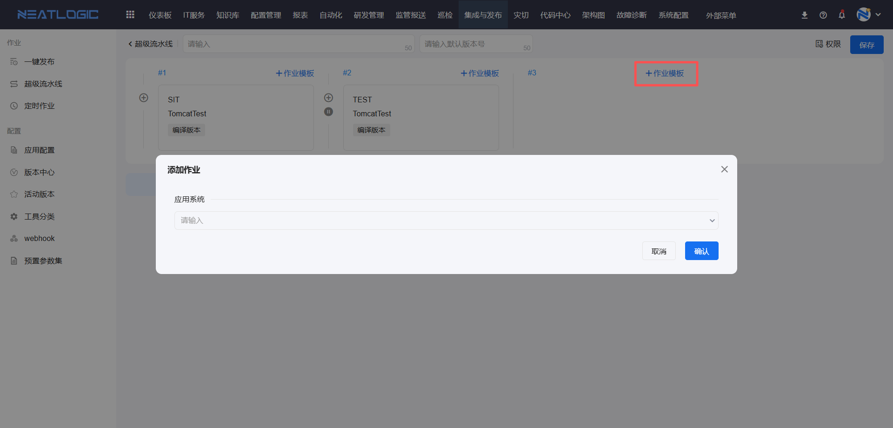
添加作业模板时，要先选择应用系统，下拉框会过滤出当前用户有执行或者编辑权限的应用。选择应用后，完成场景、环境、模块、分批设置的配置才能保存。
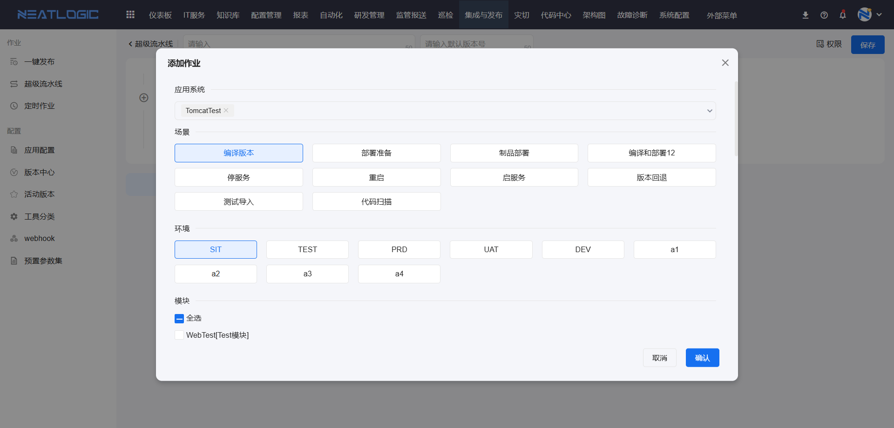
默认版本号，超级流水线可以设置默认版本号，添加批量作业时会自动填充默认版本号，要在 系统参数 中启用配置，才能使用默认版本功能。

相关参数“is.pipeline.need.default.version”
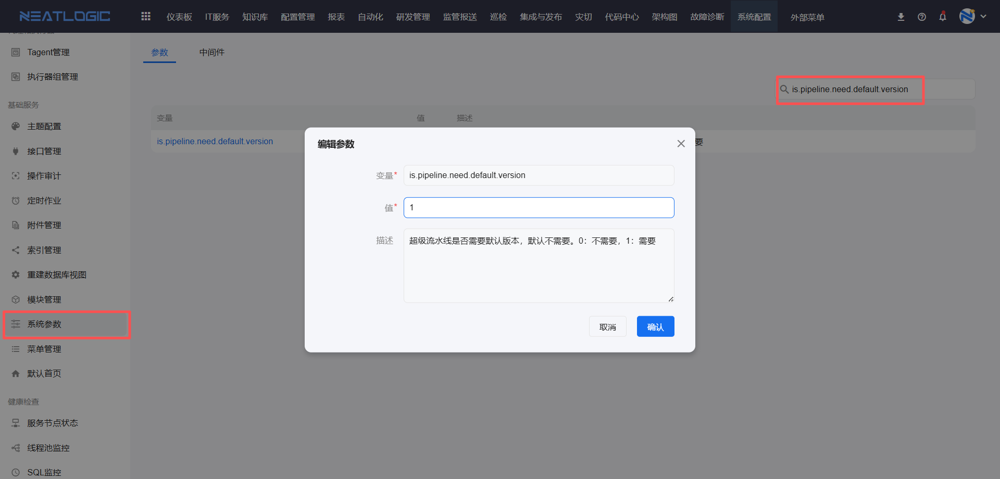

## 超级流水线应用场景
超级流水线发起作业有三个场景，分别是在超级流水线管理页面发起作业、一键发布页面发起作业和通过定时作业发起作业。

### 超级流水线管理页发起
1. 相关权限：[系统管理-权限管理](../100.系统配置/1.用户和权限/用户和权限.md)-超级流水线管理权限和批量发布管理权限

2. 发起作业操作：

    点击添加批量作业按钮
    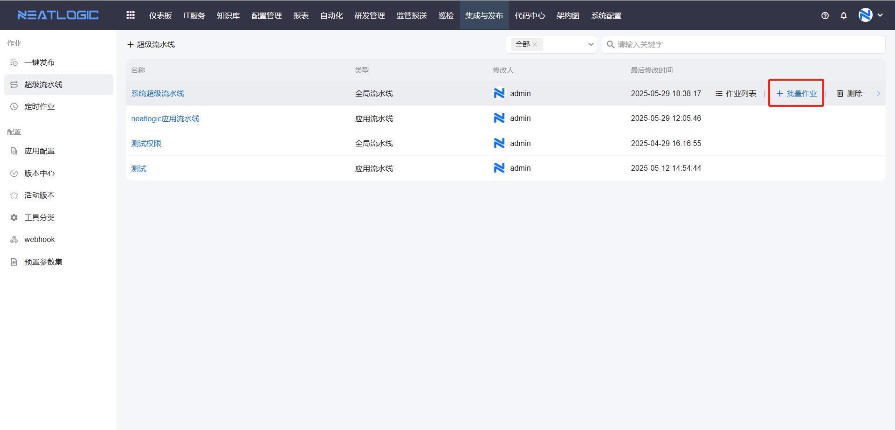
    在弹出中勾选子作业，并选择版本号，点击确认即可。
    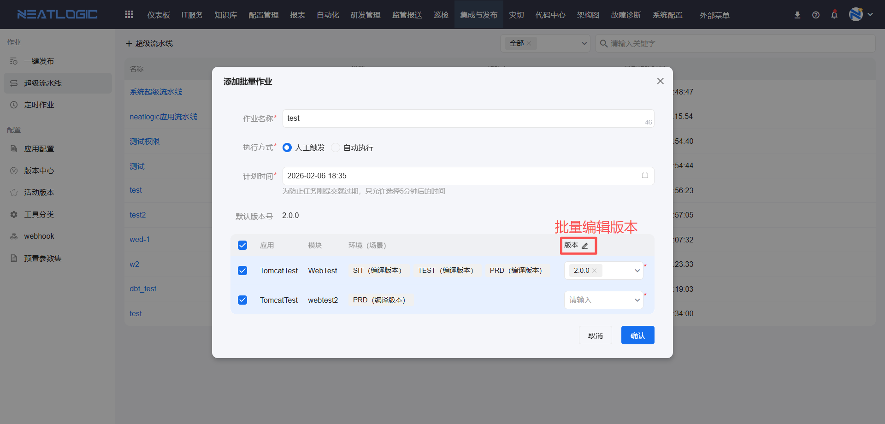

### 一键发布页面发起
1. 相关权限：[系统管理-权限管理](../100.系统配置/1.用户和权限/用户和权限.md)-批量发布管理权限

2. 发起作业操作：

    打开一键发布页面，点击添加批量作业，选择超级流水线创建方式
    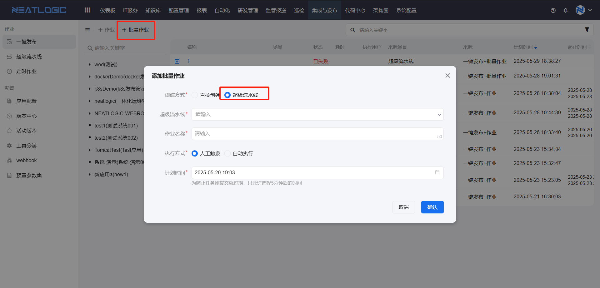
    选择目标超级流水线，选择子作业和版本并点击确认即可
    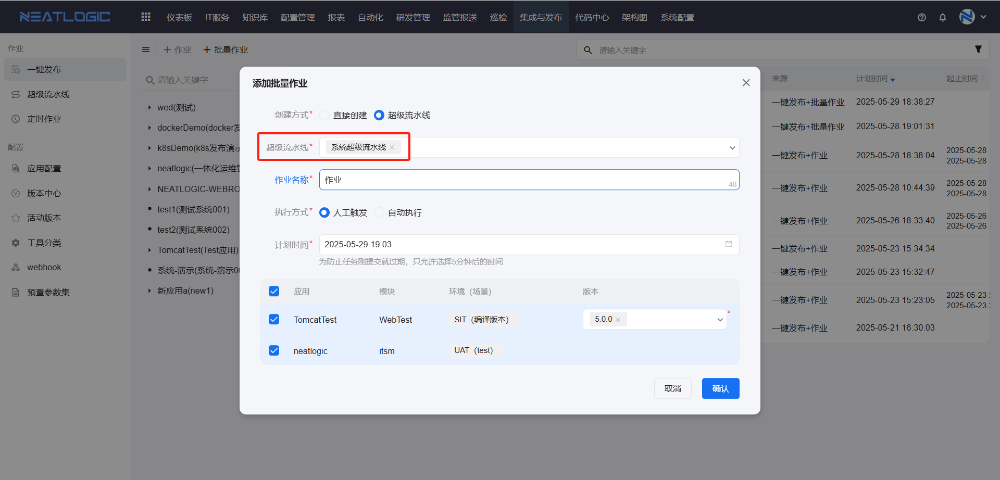
    版本支持批量编辑
    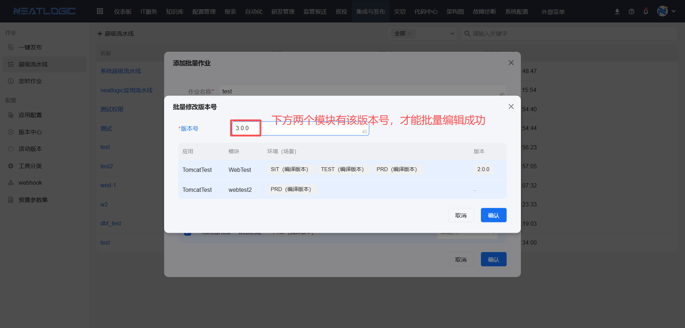

### 定时作业发起
1. 相关权限：[系统管理-权限管理](../100.系统配置/1.用户和权限/用户和权限.md)-批量发布管理权限

2. 发起作业操作：
   
   添加定时作业时，选择超级流水线作业类型，并完成配置保存即可。
    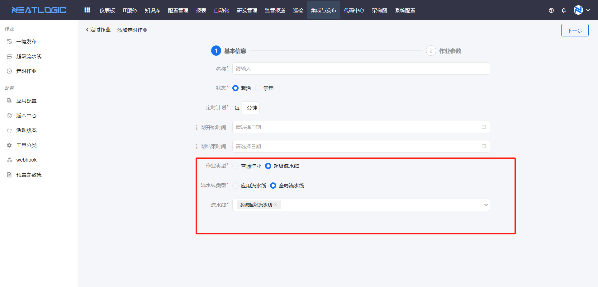

## 查看作业列表
超级流水线支持查看通过其发起的所有批量作业。
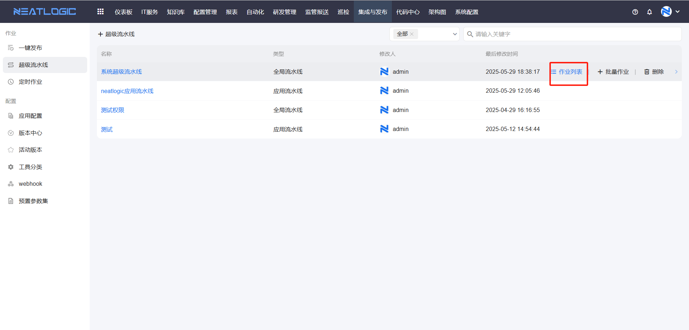
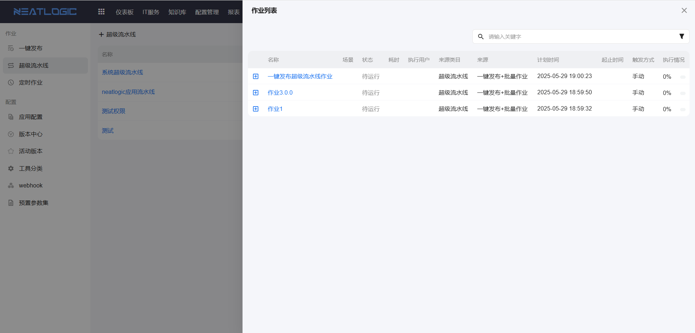