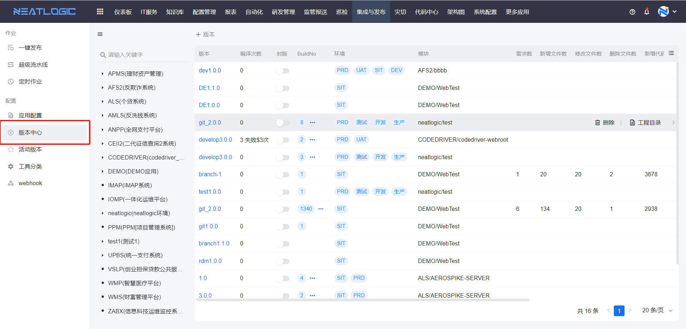
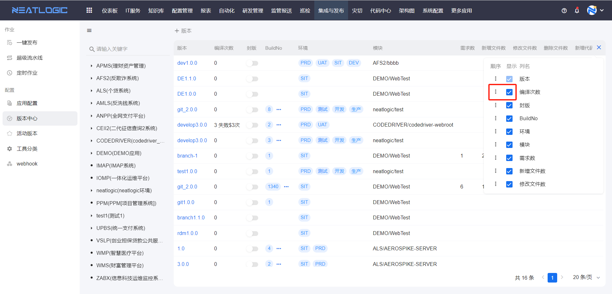
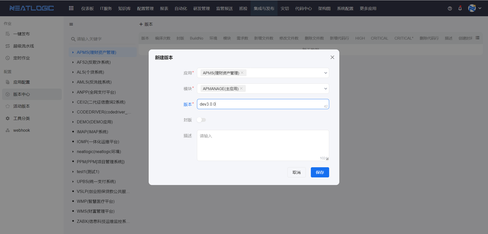
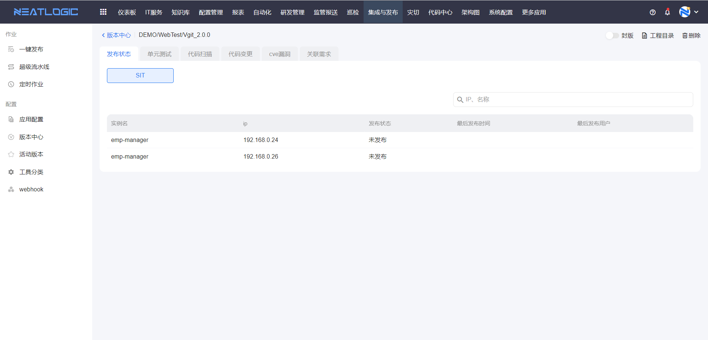
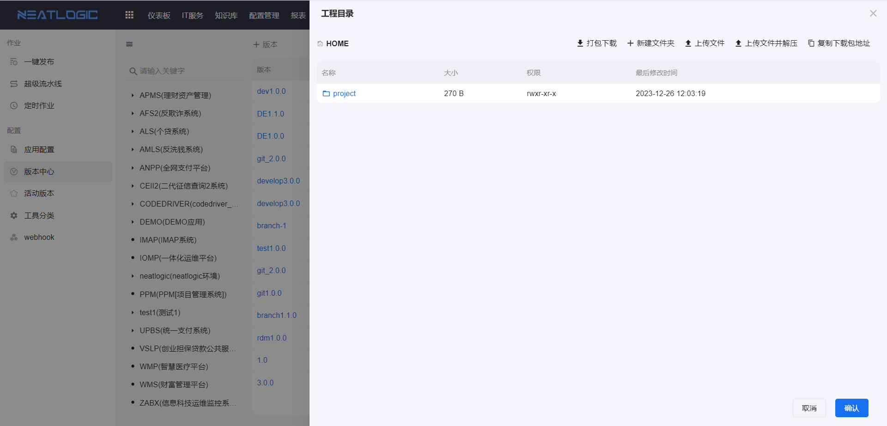
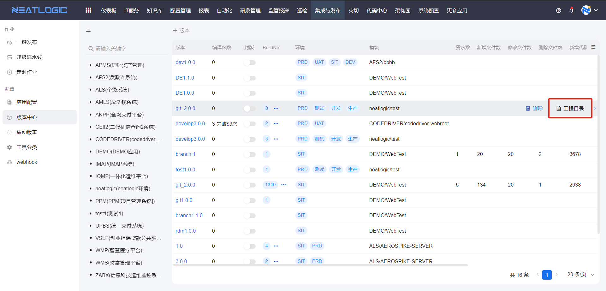
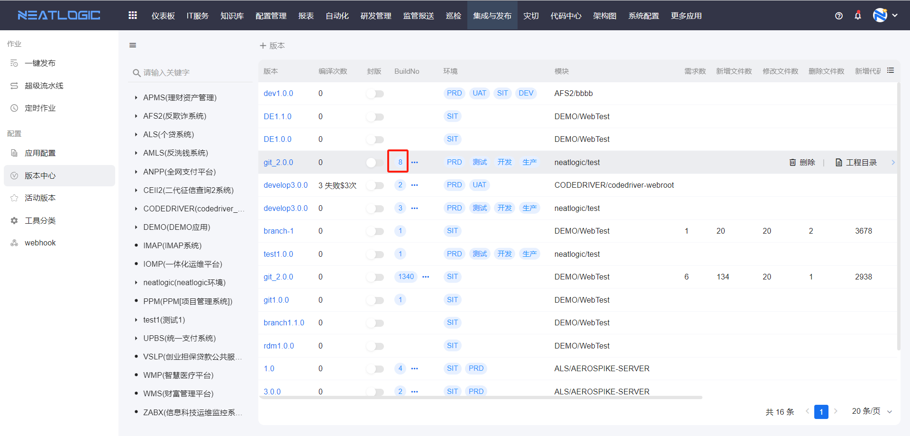
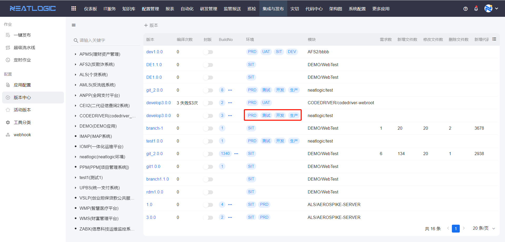

# 版本中心

版本中心用于管理应用模块的发布版本。

版本通常对应代码管理平台中的版本名称。发起发布作业时，如果流水线中包含构建类型脚本，需要选择发布版本；只有未封板的版本可以被选择和使用。

版本列表展示版本名称、编译次数、封板状态、BuildNo、环境和模块等信息。列表支持调整字段显示和排序，也支持查看版本、添加版本、删除版本、封板和管理版本工程目录。

## 阅读路径

可根据当前要完成的操作选择阅读入口。

- 如果需要调整版本列表的字段显示或顺序，阅读“表格字段设置”。
- 如果需要为应用或模块创建发布版本，阅读“添加版本”。
- 如果需要查看发布状态、单元测试、代码扫描或关联需求，阅读“查看版本”。
- 如果需要下载、上传或管理编译制品，阅读“工程目录”。

## 权限

**操作权限**

- 配置：系统配置-[用户管理](../../100.系统配置/1.用户和权限/用户管理.md)-授权-自动发布管理权限
- 包含操作：管理集成与发布模块中的版本和制品，不受应用数据范围限制
- 配置人员：系统超级管理员

**数据权限**

- 配置：应用配置-应用层-授权
- 包含操作：查看应用配置，以及在版本中心查看、添加、删除、封板版本和管理工程目录制品
- 配置人员：拥有当前应用“权限”权限的用户

> 常规用户需要拥有应用的查看配置权限和版本、制品管理权限，才能查看并管理对应应用的版本和制品。

## 表格字段设置

表格字段设置用于调整版本列表的字段显示和排序。

可以根据日常查看习惯显示版本名称、编译次数、封板状态、BuildNo、环境和模块等字段，并调整字段顺序。

## 添加版本

添加版本前，需要先选择应用或模块。

创建版本后，可以在发布作业中选择该版本。若版本已封板，则不能再作为构建类型脚本的发布版本使用。

## 查看版本

版本详情用于查看当前版本的发布状态、单元测试、代码扫描、代码变更和关联需求等信息。

这些信息需要在发布作业执行对应脚本后才会回显。例如，执行单元测试脚本后才会显示单元测试结果，执行代码扫描脚本后才会显示代码扫描结果。

## 工程目录

执行编译脚本后，系统会为版本生成工程目录，用于保存编译后的制品。

工程目录支持打包下载、新建文件夹、上传文件、上传文件并解压，以及复制下载包地址等操作。

### 版本工程目录

点击版本上的工程目录按钮，可以查看当前版本最近一次编译生成的制品库。

### BuildNo 工程目录

点击 BuildNo 字段中的标签，可以查看该版本对应 BuildNo 编译生成的制品库。

### 环境工程目录

点击环境字段中的标签，可以查看该版本在对应环境最近一次编译生成的制品库。

